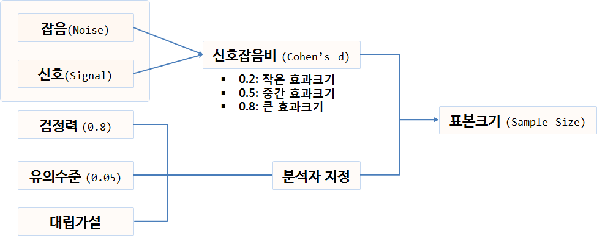

``` {r, include=FALSE}
source("tools/chunk-options.R")
knitr::opts_chunk$set(echo = TRUE, warning=FALSE, message=FALSE)

library(tidyverse)
library(ggplot2) 
library(ggthemes)
library(pwr)
library(extrafont)
library(prevalence) # https://gist.github.com/casallas/8411082
loadfonts()

options(scipen = 999)
options(dplyr.width = 120)
options(dplyr.print_max = 1e9)
```


> ## 학습 목표 {.objectives}
>
> * A/B 검정을 통해 사용자 선호도를 통계검정을 통해 수행한다.
> * 단일 표본 비율 검정을 이해한다.
> * 단일 표본 수준이 3개 이상인 경우 비율 검정을 수행한다.


## 1. A/B 검정 통계량 {#theory}

A/B 검정에 많이 사용되는 검정 통계량은 다양하다. 이유는 실무에서 풀고자하는 문제가 달라 
활용되는 사례가 다르기 때문이다. [^wiki-ab-testing]

[^wiki-ab-testing]: [A/B testing](https://en.wikipedia.org/wiki/A/B_testing)

|  가정한 분포 |       활용 사례            |  검정 통계량    | 추가 검토 검정 통계량 |
|--------------|----------------------------|-----------------|-----------------------|
| 정규분포     | 과금 유져당 평균 과금액    | 웰치 $t-$검정   | 스튜던트 $t-$검정 |
| 이항분포     | CTR(클릭율)                | 피셔 정확검정   | Barnard 검정      |
| 포아송분포   | 과금유저당 평균 거래횟수   | E-검정          | C-검정            |
| 다항분포     | 각 제품별 구매횟수         | $\chi^2$ 검정    | ---               |
| 분포가정 없음|  --                        | 맨휘트니 U 검정 | 깁스 표집         |


## 2. 웹사이트 A,B 선호도 분석 [^ab-testing-website] [^ab-testing-from-scratch] [^power-and-sample-size]

[^ab-testing-website]: [A/B Tests in Marketing – Sample Size and Significance using R](http://www.marketingdistillery.com/2014/08/03/ab-tests-in-marketing-sample-size-and-significance-using-r/)

[^ab-testing-from-scratch]: [A/B Testing, from scratch](http://www.alfredo.motta.name/ab-testing-from-scratch/)

[^power-and-sample-size]: [3Rs- Reduction.co.uk, Power and Sample Size](http://www.3rs-reduction.co.uk/html/6__power_and_sample_size.html)

웹사이트 두개를 개발해 두고, 사용자에게 A 웹사이트와 B 웹사이트에 대한 선호도를 조사한다.
통상 A 웹사이트는 기존 웹사이트가 되고, B 웹사이트는 예를 들어 새로운 UI, 기능이 추가된 웹사이트다.

첫번째 문제는 현재 웹사이트 A를 방문할 때 전환율이 천명이 들어와서 15명으로 1.5% (0.015)다. 
만약 1% (0.001) 더 높이고자 하는데 필요한 표본크기는 얼마나 될까?

이런 문제에 답을 하기 위해서 필요한 정보는 다음과 같다. 



신호와 잡음비가 큰 경우 적은 표본이 필요하고, 신호와 잡음비가 작은 경우 더 많은 표본이 필요하다.
0.2는 작은 효과크기, 0.5는 중간 효과크기, 0.8은 큰 효과크기로 통상 정의한다.
그리고 1종, 2종에 대한 오류에 대해 $\alpha$ 유의수준과 검정력을 정의하고 대립가설 방향에 대해 지정하면 
`pwr` 팩키지 표본크기 함수룰 통해 최소 필요한 표본크기를 추출할 수 있다.

### 2.1. 웹사이트 개선 전후 효과를 탐지하는 표본크기

웹사이트 개선 전후 효과를 탐지하는데 필요한 표본크기 정보를 파악해야 된다.
즉, 현재 웹사이트 전환율은 1.5% 인데, 새로운 웹사이트를 적용할 경우 웹사이트 개편에 대한 효과크기를 탐지하는데 필요한 최소한의 표본은 얼마나 될까?

``` {r ab-testing-detect-effect-size}
# 0. 환경설정 ----------------------------------
# library(tidyverse)
# library(ggplot2) 
# library(ggthemes)
# library(extrafont)
# library(pwr)
# library(prevalence) # https://gist.github.com/casallas/8411082
# loadfonts()

# 1. 표본크기 ----------------------------------
## 1.1. 현재 웹사이트 전환율(Conversion Rate)
web_a <- 15
web_n_a <- 1000
(web_p_a <- web_a / web_n_a)

## 1.2. 효과크기를 탐지하는데 필요한 표본크기
pwr.2p2n.test(h=0.2, n1=1000, sig.level=0.05, power=0.8, alternative="two.sided")
```

`pwr.2p2n.test(h=0.2, n1=1000, sig.level=0.05, power=0.8)` 명령어를 통해 유의수준 5%, 검정력 80%, n1 표본 1,000개인 경우 효과크기를 0.2로 설정하여 
양측검정을 하게 되면 244.1239 즉, 245명의 방문자가 최소 필요한 것이 확인된다.


### 2.2. 웹사이트 반응률 1% 높이는 효과를 파악하는데 필요한 표본크기 

전화율 1%를 높이는데 필요한 표본크기는 얼마나 될까? 이것도 흥미있는 질문이다. 

``` {r ab-testing-sample-size}
## 1.3. 1% 전환율을 높이는데 필요한 표본크기(알파=0.05, 검정력=0.8)
power.prop.test(p1=web_p_a, p2=web_p_a+0.01, sig.level=0.05, power=0.8)
```

유의수준 5%, 검정력 80%, 현 웹사이트 전환율과 신규 웹사이트 전환율을 입력하여 필요한 유효표본수를 검출한다.
3075.582, 즉 3,076 방문자가 필요하다.


### 2.3. 캠페인 효과

웹사이트 A가 현재 붉은 색으로 개발되어 있는데, 고객설문조사결과 파란색으로 디자인을 바꿔 개발할 경우 더 좋은 효과가 예상된다고 한다.
그래서 개발팀에서 1달간의 크런치 모드를 진행하여 초단기 웹사이트 B를 개발했다. 그런데 이러한 웹사이트 변경이 정말 효과가 있는 것인지,
아니면 우연에 의한 것이지 확인하고자 한다.

이런 경우 사용하는 함수가 `prop.test`가 된다. 
기존 웹사이트 A는 방문자가 1,000 명당 32명의 전환율을 보인 반면, 새로 개발한 웹사이트 B는 1,000명당 54명 전환율을 보인다.
`prop.test`결과 p-값이 `0.02062`으로 나와 0.05 보다 작기 때문에 웹사이트 A나 웹사이트 B나 동일하다는 귀무가설을 기각하게 되어 효과가 있는 것으로 
결정한다. 

신뢰구간도 다음 공식에 기초하여 계산하면 되지만, `prevalence` 팩키지에 신뢰구간을 구하는 다양한 방법이 구현되어 있어 이를 활용한다.

$$\hat p \pm z \sqrt{\frac{1}{n}\hat p \left(1 - \hat p \right)}$$

마지막으로 웹사이트 A,B에 대한 전환율을 시각적으로 확인한다.

``` {r ab-testing-campaing-effect}
# 2. 실제효과 검정 ----------------------------------
web_a <- 32
web_n_a <- 1000
(web_p_a <- web_a / web_n_a)

web_b <- 54
web_n_b <- 1000
(web_p_b <- web_b / web_n_b)

prop.test(c(web_a, web_b), c(web_n_a,web_n_b))

## 2.1. 신뢰구간 ----------------------------------

prevalence::propCI(x=web_a, n=web_n_a, level = 0.95)
prevalence::propCI(x=web_b, n=web_n_b, level = 0.95)

## 2.3. 신뢰구간 시각화  ----------------------------------

x_a  <- seq(from=0.01, to=0.07, by=0.00001)
y_a  <- dnorm(x_a, mean = web_p_a, sd = sqrt((web_p_a * (1-web_p_a))/web_n_a))

x_b  <- seq(from=0.01, to=0.07, by=0.00001)
y_b  <- dnorm(x_b, mean = web_p_b, sd = sqrt((web_p_b * (1-web_p_b))/web_n_b))

ab_df  <- tibble(web_x_a=x_a, web_y_a=y_a, web_x_b=x_b, web_y_b=y_b)

options(repr.plot.width=7, repr.plot.height=3)

website_cols  <- c("WebSite A"="red","WebSite B"="blue")

ggplot(data = ab_df) +
  labs(title="웹사이트 A/B 검정",
        x="전환율", y="확률밀도함수") +
  theme_tufte(base_family = "NanumGothic") +
  scale_x_continuous(labels = scales::percent) +
  geom_point(aes(x=x_a, y=y_a, colour="WebSite A")) +
  geom_point(aes(x=x_b, y=y_b, colour="WebSite B")) +
  scale_colour_manual(name="웹사이트", values=website_cols) +
  geom_vline(aes(xintercept=0.032), colour = "red", size=1.1) +
  geom_vline(aes(xintercept=0.054), colour = "blue", size=1.1) +
  theme(legend.position = "top")
```


## 3. 웹사이트 선호도 고객만족도 조사 

데이터는 [Practical Statistics for HCI](http://depts.washington.edu/aimgroup/proj/ps4hci/) 사이트에 공개된 SPSS 파일을 R로 불러와서 실험 검증에 사용한다.

~~~ {r}
##==============================================================================
## 01. 데이터 가져오기
##==============================================================================
library(haven)
spss.dat <- file.choose()
pref.df <- read_spss(spss.dat)

head(pref.df)
~~~

~~~ {.output}
Source: local data frame [6 x 2]

  Subject Preference
    (dbl)     (lbll)
1       1          1
2       2          2
3       3          2
4       4          1
5       5          1
6       6          1
~~~

웹선호도에 대한 코딩이 `1`, `2`로 되어 있다. 이를 `A`, `B` 로 코딩을 바꾼다.

~~~ {r}
##==============================================================================
## 02. 데이터 전처리 및 정제
##==============================================================================
library(dplyr)
library(plyr)

pref.df$Subject <- sapply(pref.df$Subject, as.factor)
pref.df$Preference <- sapply(pref.df$Preference, as.factor)

pref.df <- pref.df %>% mutate(Preference = revalue(Preference, c('1'='A', '2'='B')))
~~~

~~~ {r}
##==============================================================================
## 03. 실험설계 통계분석
##==============================================================================
# 3.1. 기초 통계 및 시각화
summary(pref.df)
plot(pref.df$Preference)
~~~

~~~ {.output}
    Subject   Preference
 1      : 1   A:21      
 2      : 1   B: 9      
 3      : 1             
 4      : 1             
 5      : 1             
 6      : 1             
 (Other):24      
~~~

~~~ {r}
#-------------------------------------------------------------------------------
# 3.2 실험설계 단일표본 비율검정: One-Sample Proportion Test
#-------------------------------------------------------------------------------
# 근사 카이스퀘어 검정
prefs <- xtabs( ~ Preference, data=pref.df)
prefs
chisq.test(prefs)
~~~

$p-$값 0.05를 기준으로 본다면, 웹사이트 A와 B 선호도에 유의성이 있다는 결론에 도달하게 된다.

~~~ {.output}
    Chi-squared test for given probabilities

data:  prefs
X-squared = 4.8, df = 1, p-value = 0.02846
~~~

~~~ {r}
# 정확 이항 검정 (Exact Binomial Test)
binom.test(prefs)
~~~

$\chi^2$ 검정은 표본수가 많아지게 되면 정확도가 높아지는 근사검정이지만 정확 이항 검정(Exact Binomial Test)은 컴퓨팅 계산에 부담이 되지만, 근사 검정이 아니고 정확 검정이다. 귀무가설 웹사이트 A와 B의 선호도가 같다는 95% 신뢰구간에 0.5가 포함되지 않고 있다. 

~~~ {.output}
    Exact binomial test

data:  prefs
number of successes = 21, number of trials = 30, p-value = 0.04277
alternative hypothesis: true probability of success is not equal to 0.5
95 percent confidence interval:
 0.5060410 0.8526548
sample estimates:
probability of success 
                   0.7 
~~~


#### 1.2. 단일 표본 비율검정 -- 웹사이트 A,B,C 선호도 분석

웹사이트가 A,B 두가지 아니고 3개 이상인 경우 A,B,C 웹사이트 간에 선호도 차이가 있는지 검정한다.

~~~ {r}
##==============================================================================
## 01. 데이터 가져오기
##==============================================================================
library(haven)
spss.dat <- file.choose() # prefs3.sav
pref.df <- read_spss(spss.dat)

head(pref.df)
~~~

~~~ {.output}
Source: local data frame [6 x 2]

  Subject Preference
    (dbl)     (lbll)
1       1          3
2       2          3
3       3          3
4       4          1
5       5          1
6       6          3
~~~

웹선호도에 대한 코딩이 `1`, `2`, `3`으로 되어 있다. 이를 `A`, `B`, `C`로 코딩을 바꾼다.

~~~ {r}
##==============================================================================
## 02. 데이터 전처리 및 정제
##==============================================================================
library(dplyr)
library(plyr)

pref.df$Subject <- sapply(pref.df$Subject, as.factor)
pref.df$Preference <- sapply(pref.df$Preference, as.factor)

pref.df <- pref.df %>% mutate(Preference = revalue(Preference, c('1'='A', '2'='B', '3'='C')))
~~~

~~~ {r}
##==============================================================================
## 03. 실험설계 통계분석
##==============================================================================
# 3.1. 기초 통계 및 시각화
summary(pref.df)
plot(pref.df$Preference)
~~~

~~~ {.output}
    Subject   Preference
 1      : 1   C:13      
 2      : 1   A:13      
 3      : 1   B: 4      
 4      : 1             
 5      : 1             
 6      : 1             
 (Other):24   
~~~

~~~ {r}
#-------------------------------------------------------------------------------
# 3.2 실험설계 단일표본 비율검정: One-Sample Proportion Test
#-------------------------------------------------------------------------------
# 근사 카이스퀘어 검정
prefs <- xtabs( ~ Preference, data=pref.df)
prefs
chisq.test(prefs)
~~~

$p-$값 0.05를 기준으로 본다면, 웹사이트 A, B, C 선호도에 유의성이 없다는 결론에 도달할 수 있지만, 0.05에 
가깝기 때문에 유보한다.

~~~ {.output}
    Chi-squared test for given probabilities

data:  prefs
X-squared = 5.4, df = 2, p-value = 0.06721
~~~

다항분포 검정을 통한 정확 다항검정에서는 0.05에 더욱 가까운 $p-$ 값이 검출되었다.

~~~ {r}
# 다항분포 검정
library(XNomial)
xmulti(prefs, c(1/3, 1/3, 1/3), statName = "Prob")
~~~

~~~ {.output}
P value (Prob) = 0.05117
~~~

다중비교는 세가지 웹사이트 간에 차이가 있다는 것은 이해가 되나 어느 것에서 차이가 나는지 검출할 때 사용한다.

~~~ {r}
# 다중 비교
aa <- binom.test(sum(pref.df$Preference=='A'), nrow(pref.df), p=1/3)
bb <- binom.test(sum(pref.df$Preference=='B'), nrow(pref.df), p=1/3)
cc <- binom.test(sum(pref.df$Preference=='C'), nrow(pref.df), p=1/3)
p.adjust(c(aa$p.value, bb$p.value, cc$p.value), method="holm")
~~~

웹사이트 A, C 선호도에는 차이가 없지만, B에는 유의성이 있는 것으로 보인다. 

~~~ {.output}
[1] 0.4996989 0.0583577 0.4996989
~~~
