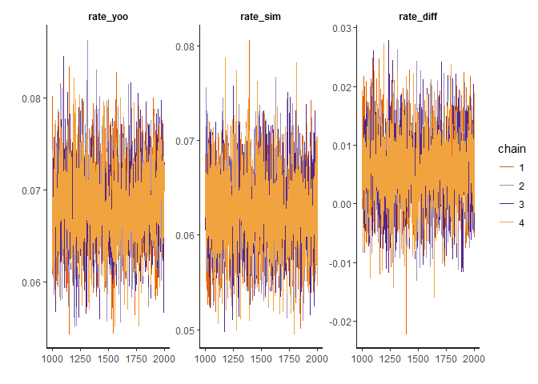

# 데이터 과학 -- 기초 통계

## 1. 제19대 대통령 선거 선거결과 검토

나무위키 웹사이트 [제19대 대통령 선거 웹사이트](https://namu.wiki/w/%EC%A0%9C19%EB%8C%80%20%EB%8C%80%ED%86%B5%EB%A0%B9%20%EC%84%A0%EA%B1%B0)에서 
대통령 선거에서 후보별 득표와 득표율 데이터을 긁어와서 이를 기준 지지율 정보를 삼는다.
데이터 분석이 가능한 형태로 전처리 작업을 해서 데이터프레임으로 완성시킨다.

`DT` 팩키지 `datatable` 함수를 통해 작업한 결과를 확인한다.

~~~{.r}
# 0. 환경설정 ----------------------------------
# library(tidyverse)
# library(stringr)
# library(XNomial)
# library(DT)
# library(rstan)

# 1. 데이터 가져오기 ----------------------------------
votes_pcnt_tbl <- read_csv("data/earned_vote_tbl.csv", col_names = FALSE, skip=3)

votes_stat_df <- votes_pcnt_tbl %>% dplyr::rename("기호" = X1,
                                           "후보" = X2,
                                           "정당" = X3,
                                           "득표수" = X4,
                                           "득표율" = X5,
                                           "순위" = X6,
                                           "당선여부" = X7) %>% 
  dplyr::filter(기호 != 11,  기호 != 13, 기호 !="선거인수", 기호 != "무효표수") %>% 
  mutate(득표수 = as.numeric(str_replace_all(득표수, ",", "")),
            득표율 = as.numeric(str_replace_all(득표율, "%", ""    ))) %>% 
  dplyr::filter(후보 %in% c("문재인", "홍준표", "안철수", "유승민", "심상정")) %>% 
  mutate(후보 = factor(후보, levels=c("문재인", "홍준표", "안철수", "유승민", "심상정"))) %>% 
  mutate(득표율 = round(득표율 / 100, 3))

datatable(votes_stat_df) %>% 
  formatPercentage(c(5), digits=1) %>% 
  formatCurrency(c(4), currency="", interval=3, mark=",", digits=0)
~~~

<!--html_preserve-->

<!--/html_preserve-->

> ### 관심있는 대선 가설 {.callout}
>
> 기호1번 문재인 후보의 낙승으로 대선은 마무리 되었지만, 기호2번과 기호3번, 그리고,
> 기호4번 기호5번의 막판 선거전도 관심을 끌었다.
> 선거결과 기호순으로 표를 얻게 되었는데, 궁금한 점은 기호2번과 기호3번 차이가 
> 실제 유의미한 차이를 가지고 있는지 아니면 단순한 잡음으로 인한 차이인지 궁금하다.
> 실제로 유권자 많은 경우 두 후보가 동일한 표를 얻을 확률은 정말 희박하다.
> 따라서, 
>
> - $H_0 :$ 기호2번 $=$ 기호3번, 
> - $H_0 :$ 기호4번 $=$ 기호5번
>
> 이 두가지 
> 가설을 데이터를 통해 검증하는 것은 나름 의미가 있다고 하겠다.

최근 컴퓨팅 기술의 발전으로 과거 불가능하다고 생각되어지던 베이지안 기법을 
개인용 노트북으로도 활용이 가능해져 빈도주의 관점으로 통계검증을 수행해보고,
베이지안 관점으로도 가설을 검증해 보자.

## 2. 빈도주의 가설 검정

### 2.1. 대한민국 10명은 누구에게 투표했나?

제18대 대통령선거는 거의 5:5로 진보와 보수가 결집한 선거였다.
제19대 대통령선거는 최순실 사태 및 대통령 탄핵으로 보수가 5에서 3으로,
진보는 5에서 7로 각각 늘었다. 아주 간략화 해서 백만명 단위로 투표율을 놓고 보면 
보수가 7, 진보가 3이라는 구도가 맞는지 데이터를 통해 검증해 보자.

~~~{.r}
# 2. 빈도주의 가설 검정 ----------------------------------
## 2.1. 대통령 선거 득표율 -------------------------------
xmulti(round(votes_stat_df$득표수/10^6,0), c(4, 2, 2, 1, 1), detail=3, histobins=TRUE)
~~~

~~~{.output}

P value  (LLR)  =  0.8368
P value (Prob)  =  0.9121
P value (Chisq) =  0.8748

Observed:  13 8 7 2 2 
Expected ratio:  4 2 2 1 1 
Total number of tables:  58905 

~~~

멘델의 유전자 실험처럼 문재인/안철수/심상정 후보가 4:2:1 로 총 7을 차지하고, 
홍준표/유승민 후보가 2:1로 총 3을 차지하는 가설을 데이터가 뒷받침하고 있다.

### 2.2. 홍준표와 안철수

`prop.test` 함수를 통해 두 후보간 득표율 비율을 검정한다.

~~~{.r}
## 2.2. 홍준표 / 안철수 득표율 -------------------------------
voters_n <- round(sum(votes_stat_df$득표수/10^4),0)

hong_voters <- votes_stat_df$득표수[2]/10^4 
(hong_prop <- hong_voters / voters_n)
~~~

~~~{.output}
[1] 0.2416261

~~~

~~~{.r}
ahn_voters <- votes_stat_df$득표수[3]/10^4 
(ahn_prop <- ahn_voters / voters_n)
~~~

~~~{.output}
[1] 0.2153336

~~~

~~~{.r}
prop.test(c(hong_voters, ahn_voters), c(voters_n,voters_n))
~~~

~~~{.output}

	2-sample test for equality of proportions with continuity
	correction

data:  c(hong_voters, ahn_voters) out of c(voters_n, voters_n)
X-squared = 6.2244, df = 1, p-value = 0.0126
alternative hypothesis: two.sided
95 percent confidence interval:
 0.005581268 0.047003778
sample estimates:
   prop 1    prop 2 
0.2416261 0.2153336 

~~~

p-값이 0.05보다 적게 나와 귀무가설 즉 홍준표 득표율과 안철수 득표율이 같다는 가설을 기각한다. 그렇다고 홍준표 후보 득표율이 안철수 후보 득표율보다 반듯이 크다는 주장으로 연결시키는데 한계가 있어 추후 베이지안 가설검정을 통해 보다 수월하게 접근할 수 있다.

### 2.3. 심상정과 유승민

유승민과 심상정 후보의 경우도 마찬가지로 `prop.test` 함수를 통해 득표비율 가설검정을 실히한다.

~~~{.r}
## 2.3. 유승민 /심상정 득표율 -------------------------------

yoo_voters <- votes_stat_df$득표수[4]/10^4 
sim_voters <- votes_stat_df$득표수[5]/10^4 

prop.test(c(yoo_voters, sim_voters), c(voters_n, voters_n))
~~~

~~~{.output}

	2-sample test for equality of proportions with continuity
	correction

data:  c(yoo_voters, sim_voters) out of c(voters_n, voters_n)
X-squared = 0.83196, df = 1, p-value = 0.3617
alternative hypothesis: two.sided
95 percent confidence interval:
 -0.006408172  0.018181279
sample estimates:
    prop 1     prop 2 
0.06796218 0.06207563 

~~~

이번에는 p-값이 0.05보다 크게 나와 귀무가설 즉 유승민 득표율과 심상정 득표율이 같다는 가설을 받아들인다.

## 3. 베이지안 가설 검정

베이지안 가설검정은 Approximate Bayesian Computation 방법론을 사용하면 직관적이지만 매우 느리다.
`rstan` 팩키지는 BUG 베이지안 언어를 이해할 수 있어 베이지안 추론모형을 설정하고 MCMC 방법론을 통해 
사후분포를 뽑아낸 후에 이를 바탕으로 각 후보별 지지율 차이를 검정한다.

### 3.1. 홍준표와 안철수

두 후보 모두 23% 언저리에 지지율이 위치하고 있기 때문에 베타분포를 사전분포로 잡아 
이를 모형 넣어 추론을 한다.

~~~{.r}
# 3. 베이지안 가설 검정 ----------------------------------
## 3.1. 홍준표 vs. 안철수 --------------------------------
### 3.1.1. 사전분포 -----------------------------------------
library(bayesAB)
plotBeta(7,25)
~~~

~~~{.r}
### 3.1.2 모형 설정
model_string <- "
# 데이터 
data {
  int tlt_hong_votes;  # 총 가능 투표수
  int tlt_ahn_votes;    # 총 가능 투표수
  int hong_votes; # 홍준표 획득 표수
  int ahn_votes;  # 안철수 획득 표수
}

# 모수
parameters {
  real<lower=0, upper=1> rate_hong;
  real<lower=0, upper=1> rate_ahn;
}

# 재생 모형
model {
  rate_hong ~ beta(7, 25);
  rate_ahn  ~ beta(7, 25);
  hong_votes ~ binomial(tlt_hong_votes, rate_hong);
  ahn_votes ~ binomial(tlt_ahn_votes, rate_ahn);
}

generated quantities {
real rate_diff;
rate_diff = rate_hong - rate_ahn;
}
"

### 3.1.3 데이터
data_list <- list(tlt_hong_votes = voters_n, tlt_ahn_votes = voters_n, 
                  hong_votes = round(votes_stat_df$득표수[2]/10^4,0) , 
                  ahn_votes = round(votes_stat_df$득표수[3]/10^4,0))

### 3.1.4 사후분포 표본 추출
stan_hong_ahn <- stan(model_code = model_string, 
                     data = data_list, verbose = FALSE, refresh = 0)
~~~

~~~{.output}
In file included from C:/Program Files/R/R-3.4.0/library/BH/include/boost/config.hpp:39:0,
                 from C:/Program Files/R/R-3.4.0/library/BH/include/boost/math/tools/config.hpp:13,
                 from C:/Program Files/R/R-3.4.0/library/StanHeaders/include/stan/math/rev/core/var.hpp:7,
                 from C:/Program Files/R/R-3.4.0/library/StanHeaders/include/stan/math/rev/core/gevv_vvv_vari.hpp:5,
                 from C:/Program Files/R/R-3.4.0/library/StanHeaders/include/stan/math/rev/core.hpp:12,
                 from C:/Program Files/R/R-3.4.0/library/StanHeaders/include/stan/math/rev/mat.hpp:4,
                 from C:/Program Files/R/R-3.4.0/library/StanHeaders/include/stan/math.hpp:4,
                 from C:/Program Files/R/R-3.4.0/library/StanHeaders/include/src/stan/model/model_header.hpp:4,
                 from file3bd42d6659d7.cpp:8:
C:/Program Files/R/R-3.4.0/library/BH/include/boost/config/compiler/gcc.hpp:186:0: warning: "BOOST_NO_CXX11_RVALUE_REFERENCES" redefined
 #  define BOOST_NO_CXX11_RVALUE_REFERENCES
 ^
<command-line>:0:0: note: this is the location of the previous definition
In file included from C:/Program Files/R/R-3.4.0/library/BH/include/boost/multi_array/base.hpp:28:0,
                 from C:/Program Files/R/R-3.4.0/library/BH/include/boost/multi_array.hpp:21,
                 from C:/Program Files/R/R-3.4.0/library/BH/include/boost/numeric/odeint/util/multi_array_adaption.hpp:29,
                 from C:/Program Files/R/R-3.4.0/library/BH/include/boost/numeric/odeint.hpp:61,
                 from C:/Program Files/R/R-3.4.0/library/StanHeaders/include/stan/math/prim/arr/functor/integrate_ode_rk45.hpp:13,
                 from C:/Program Files/R/R-3.4.0/library/StanHeaders/include/stan/math/prim/arr.hpp:39,
                 from C:/Program Files/R/R-3.4.0/library/StanHeaders/include/stan/math/prim/mat.hpp:298,
                 from C:/Program Files/R/R-3.4.0/library/StanHeaders/include/stan/math/rev/mat.hpp:11,
                 from C:/Program Files/R/R-3.4.0/library/StanHeaders/include/stan/math.hpp:4,
                 from C:/Program Files/R/R-3.4.0/library/StanHeaders/include/src/stan/model/model_header.hpp:4,
                 from file3bd42d6659d7.cpp:8:
C:/Program Files/R/R-3.4.0/library/BH/include/boost/multi_array/concept_checks.hpp: In static member function 'static void boost::multi_array_concepts::detail::idgen_helper<N>::call(Array&, const IdxGen&, Call_Type)':
C:/Program Files/R/R-3.4.0/library/BH/include/boost/multi_array/concept_checks.hpp:42:43: warning: typedef 'index_range' locally defined but not used [-Wunused-local-typedefs]
       typedef typename Array::index_range index_range;
                                           ^
C:/Program Files/R/R-3.4.0/library/BH/include/boost/multi_array/concept_checks.hpp:43:37: warning: typedef 'index' locally defined but not used [-Wunused-local-typedefs]
       typedef typename Array::index index;
                                     ^
C:/Program Files/R/R-3.4.0/library/BH/include/boost/multi_array/concept_checks.hpp: In static member function 'static void boost::multi_array_concepts::detail::idgen_helper<0ull>::call(Array&, const IdxGen&, Call_Type)':
C:/Program Files/R/R-3.4.0/library/BH/include/boost/multi_array/concept_checks.hpp:53:43: warning: typedef 'index_range' locally defined but not used [-Wunused-local-typedefs]
       typedef typename Array::index_range index_range;
                                           ^
C:/Program Files/R/R-3.4.0/library/BH/include/boost/multi_array/concept_checks.hpp:54:37: warning: typedef 'index' locally defined but not used [-Wunused-local-typedefs]
       typedef typename Array::index index;
                                     ^
In file included from C:/Program Files/R/R-3.4.0/library/StanHeaders/include/stan/math/rev/core.hpp:42:0,
                 from C:/Program Files/R/R-3.4.0/library/StanHeaders/include/stan/math/rev/mat.hpp:4,
                 from C:/Program Files/R/R-3.4.0/library/StanHeaders/include/stan/math.hpp:4,
                 from C:/Program Files/R/R-3.4.0/library/StanHeaders/include/src/stan/model/model_header.hpp:4,
                 from file3bd42d6659d7.cpp:8:
C:/Program Files/R/R-3.4.0/library/StanHeaders/include/stan/math/rev/core/set_zero_all_adjoints.hpp: At global scope:
C:/Program Files/R/R-3.4.0/library/StanHeaders/include/stan/math/rev/core/set_zero_all_adjoints.hpp:14:17: warning: 'void stan::math::set_zero_all_adjoints()' defined but not used [-Wunused-function]
     static void set_zero_all_adjoints() {
                 ^

Gradient evaluation took 0 seconds
1000 transitions using 10 leapfrog steps per transition would take 0 seconds.
Adjust your expectations accordingly!

 Elapsed Time: 0.015 seconds (Warm-up)
               0.059 seconds (Sampling)
               0.074 seconds (Total)

Gradient evaluation took 0 seconds
1000 transitions using 10 leapfrog steps per transition would take 0 seconds.
Adjust your expectations accordingly!

 Elapsed Time: 0.014 seconds (Warm-up)
               0.02 seconds (Sampling)
               0.034 seconds (Total)

Gradient evaluation took 0 seconds
1000 transitions using 10 leapfrog steps per transition would take 0 seconds.
Adjust your expectations accordingly!

 Elapsed Time: 0.014 seconds (Warm-up)
               0.012 seconds (Sampling)
               0.026 seconds (Total)

Gradient evaluation took 0 seconds
1000 transitions using 10 leapfrog steps per transition would take 0 seconds.
Adjust your expectations accordingly!

 Elapsed Time: 0.016 seconds (Warm-up)
               0.013 seconds (Sampling)
               0.029 seconds (Total)

~~~

~~~{.r}
traceplot(stan_hong_ahn)
~~~

~~~{.r}
plot(stan_hong_ahn)
~~~

~~~{.r}
posterior <- as.data.frame(stan_hong_ahn)
sum(posterior$rate_diff > 0) / length(posterior$rate_diff)
~~~

~~~{.output}
[1] 0.9955

~~~

거의 홍준표 후보가 안철수 후보를 앞서는 확률이 거의 100%에 육박하는 
99.55 % 로 나타나고 있어,
전통적인 빈도주의 의사결정과 마찬가지로 홍준표 후보가 안철수 후보를 앞선 것이라는 평가가 한층 힘을 받는다.

### 3.2. 유승민과 심상정

두 후보 모두 6% 언저리에 지지율이 위치하고 있기 때문에 베타분포를 사전분포로 잡아 
이를 모형 넣어 추론을 한다.

~~~{.r}
## 3.2. 유승민 vs. 심상정 --------------------------------
### 3.1.1. 사전분포 -----------------------------------------
library(bayesAB)
plotBeta(8,100)
~~~

~~~{.r}
### 3.1.2 모형 설정
model_yoo_sim_string <- "
# 데이터 
data {
  int tlt_yoo_votes;  # 총 가능 투표수
  int tlt_sim_votes;  # 총 가능 투표수
  int yoo_votes;      #  획득 표수
  int sim_votes;      # 안철수 획득 표수
}

# 모수
parameters {
  real<lower=0, upper=1> rate_yoo;
  real<lower=0, upper=1> rate_sim;
}

# 재생 모형
model {
  rate_yoo  ~ beta(8, 100);
  rate_sim  ~ beta(8, 100);
  yoo_votes ~ binomial(tlt_yoo_votes, rate_yoo);
  sim_votes ~ binomial(tlt_sim_votes, rate_sim);
}

generated quantities {
real rate_diff;
rate_diff = rate_yoo - rate_sim;
}
"

### 3.1.3 데이터
data_yoo_sim_list <- list(tlt_yoo_votes = voters_n, tlt_sim_votes = voters_n, 
                  yoo_votes = round(votes_stat_df$득표수[4]/10^4,0) , 
                  sim_votes = round(votes_stat_df$득표수[5]/10^4,0))

### 3.1.4 사후분포 표본 추출
stan_yoo_sim <- stan(model_code = model_yoo_sim_string, 
                      data = data_yoo_sim_list, verbose = FALSE, refresh = 0)
~~~

~~~{.output}
In file included from C:/Program Files/R/R-3.4.0/library/BH/include/boost/config.hpp:39:0,
                 from C:/Program Files/R/R-3.4.0/library/BH/include/boost/math/tools/config.hpp:13,
                 from C:/Program Files/R/R-3.4.0/library/StanHeaders/include/stan/math/rev/core/var.hpp:7,
                 from C:/Program Files/R/R-3.4.0/library/StanHeaders/include/stan/math/rev/core/gevv_vvv_vari.hpp:5,
                 from C:/Program Files/R/R-3.4.0/library/StanHeaders/include/stan/math/rev/core.hpp:12,
                 from C:/Program Files/R/R-3.4.0/library/StanHeaders/include/stan/math/rev/mat.hpp:4,
                 from C:/Program Files/R/R-3.4.0/library/StanHeaders/include/stan/math.hpp:4,
                 from C:/Program Files/R/R-3.4.0/library/StanHeaders/include/src/stan/model/model_header.hpp:4,
                 from file3bd478f8341b.cpp:8:
C:/Program Files/R/R-3.4.0/library/BH/include/boost/config/compiler/gcc.hpp:186:0: warning: "BOOST_NO_CXX11_RVALUE_REFERENCES" redefined
 #  define BOOST_NO_CXX11_RVALUE_REFERENCES
 ^
<command-line>:0:0: note: this is the location of the previous definition
In file included from C:/Program Files/R/R-3.4.0/library/BH/include/boost/multi_array/base.hpp:28:0,
                 from C:/Program Files/R/R-3.4.0/library/BH/include/boost/multi_array.hpp:21,
                 from C:/Program Files/R/R-3.4.0/library/BH/include/boost/numeric/odeint/util/multi_array_adaption.hpp:29,
                 from C:/Program Files/R/R-3.4.0/library/BH/include/boost/numeric/odeint.hpp:61,
                 from C:/Program Files/R/R-3.4.0/library/StanHeaders/include/stan/math/prim/arr/functor/integrate_ode_rk45.hpp:13,
                 from C:/Program Files/R/R-3.4.0/library/StanHeaders/include/stan/math/prim/arr.hpp:39,
                 from C:/Program Files/R/R-3.4.0/library/StanHeaders/include/stan/math/prim/mat.hpp:298,
                 from C:/Program Files/R/R-3.4.0/library/StanHeaders/include/stan/math/rev/mat.hpp:11,
                 from C:/Program Files/R/R-3.4.0/library/StanHeaders/include/stan/math.hpp:4,
                 from C:/Program Files/R/R-3.4.0/library/StanHeaders/include/src/stan/model/model_header.hpp:4,
                 from file3bd478f8341b.cpp:8:
C:/Program Files/R/R-3.4.0/library/BH/include/boost/multi_array/concept_checks.hpp: In static member function 'static void boost::multi_array_concepts::detail::idgen_helper<N>::call(Array&, const IdxGen&, Call_Type)':
C:/Program Files/R/R-3.4.0/library/BH/include/boost/multi_array/concept_checks.hpp:42:43: warning: typedef 'index_range' locally defined but not used [-Wunused-local-typedefs]
       typedef typename Array::index_range index_range;
                                           ^
C:/Program Files/R/R-3.4.0/library/BH/include/boost/multi_array/concept_checks.hpp:43:37: warning: typedef 'index' locally defined but not used [-Wunused-local-typedefs]
       typedef typename Array::index index;
                                     ^
C:/Program Files/R/R-3.4.0/library/BH/include/boost/multi_array/concept_checks.hpp: In static member function 'static void boost::multi_array_concepts::detail::idgen_helper<0ull>::call(Array&, const IdxGen&, Call_Type)':
C:/Program Files/R/R-3.4.0/library/BH/include/boost/multi_array/concept_checks.hpp:53:43: warning: typedef 'index_range' locally defined but not used [-Wunused-local-typedefs]
       typedef typename Array::index_range index_range;
                                           ^
C:/Program Files/R/R-3.4.0/library/BH/include/boost/multi_array/concept_checks.hpp:54:37: warning: typedef 'index' locally defined but not used [-Wunused-local-typedefs]
       typedef typename Array::index index;
                                     ^
In file included from C:/Program Files/R/R-3.4.0/library/StanHeaders/include/stan/math/rev/core.hpp:42:0,
                 from C:/Program Files/R/R-3.4.0/library/StanHeaders/include/stan/math/rev/mat.hpp:4,
                 from C:/Program Files/R/R-3.4.0/library/StanHeaders/include/stan/math.hpp:4,
                 from C:/Program Files/R/R-3.4.0/library/StanHeaders/include/src/stan/model/model_header.hpp:4,
                 from file3bd478f8341b.cpp:8:
C:/Program Files/R/R-3.4.0/library/StanHeaders/include/stan/math/rev/core/set_zero_all_adjoints.hpp: At global scope:
C:/Program Files/R/R-3.4.0/library/StanHeaders/include/stan/math/rev/core/set_zero_all_adjoints.hpp:14:17: warning: 'void stan::math::set_zero_all_adjoints()' defined but not used [-Wunused-function]
     static void set_zero_all_adjoints() {
                 ^

Gradient evaluation took 0 seconds
1000 transitions using 10 leapfrog steps per transition would take 0 seconds.
Adjust your expectations accordingly!

 Elapsed Time: 0.015 seconds (Warm-up)
               0.011 seconds (Sampling)
               0.026 seconds (Total)

Gradient evaluation took 0 seconds
1000 transitions using 10 leapfrog steps per transition would take 0 seconds.
Adjust your expectations accordingly!

 Elapsed Time: 0.013 seconds (Warm-up)
               0.017 seconds (Sampling)
               0.03 seconds (Total)

Gradient evaluation took 0 seconds
1000 transitions using 10 leapfrog steps per transition would take 0 seconds.
Adjust your expectations accordingly!

 Elapsed Time: 0.012 seconds (Warm-up)
               0.017 seconds (Sampling)
               0.029 seconds (Total)

Gradient evaluation took 0 seconds
1000 transitions using 10 leapfrog steps per transition would take 0 seconds.
Adjust your expectations accordingly!

 Elapsed Time: 0.012 seconds (Warm-up)
               0.013 seconds (Sampling)
               0.025 seconds (Total)

~~~

~~~{.r}
traceplot(stan_yoo_sim)
~~~

~~~{.r}
plot(stan_yoo_sim)
~~~

~~~{.r}
posteriors <- as.data.frame(stan_yoo_sim)
sum(posteriors$rate_diff > 0) / length(posteriors$rate_diff)
~~~

~~~{.output}
[1] 0.83

~~~

유승민 후보가 심상정 후보를 앞서는 확률이 80%를 넘어
83 % 로 나타나고 있어,
전통적인 빈도주의 의사결정과정에서는 두 후보간 차이가 없다라는 가설이 베이지안 가설 검증에서는 
다른 결과가 도출된다.

따라서, 홍준표 후보는 안철수 후보를, 유승민 후보는 심상정 후보를 제19대 대통령선거에서는 
앞섰다는 것이 통계적 데이터를 통해 뒷받침되고 있다. 다만, 앞서는 정도는 홍준표 후보가 안철수 후보를 
유승민 후보가 심상정 후보를 앞선 것보다 강하다는 점이다.

