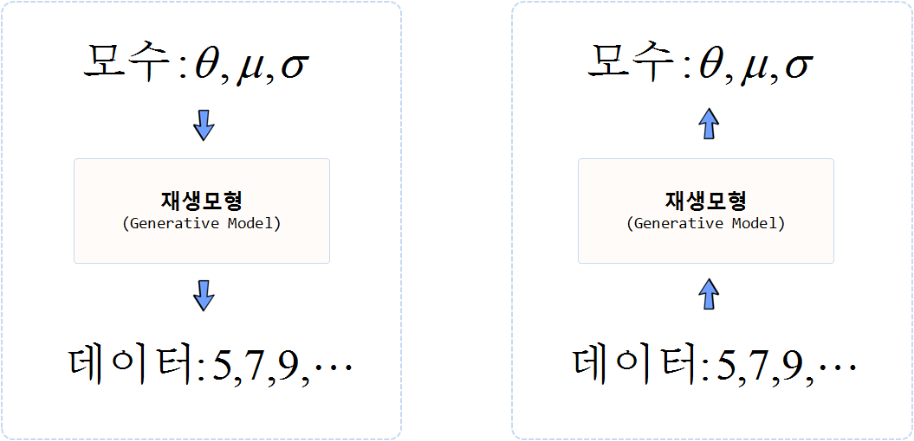
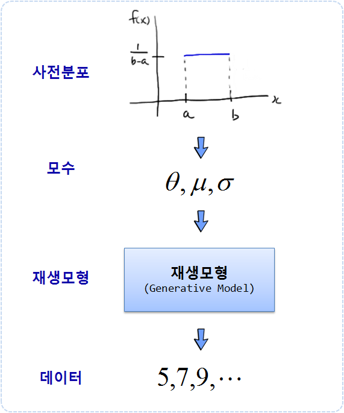
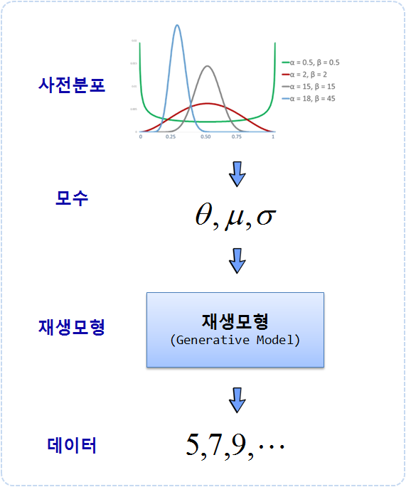

``` {r, include=FALSE}
source("tools/chunk-options.R")
knitr::opts_chunk$set(echo = TRUE, warning=FALSE, message=FALSE)

library(tidyverse)
library(ggplot2) 
library(ggthemes)
library(extrafont)
library(rstan)
# library(prevalence) # https://gist.github.com/casallas/8411082
loadfonts()

options(scipen = 999)
options(dplyr.width = 120)
options(dplyr.print_max = 1e9)

## 2.1 모형 설정
model_string <- "
# 데이터 
data {
  int nA;  # 실험 횟수
  int nB;  # 실험 횟수
  int sA;  # 성공 횟수
  int sB;  # 성공 횟수
}

# 모수
parameters {
  real<lower=0, upper=1> rateA;
  real<lower=0, upper=1> rateB;
}

# 재생 모형
model {
  rateA ~ beta(3, 25);
  rateB ~ beta(3, 25);
  sA ~ binomial(nA, rateA);
  sB ~ binomial(nB, rateB);
}

generated quantities {
  real rate_diff;
  rate_diff = rateB - rateA;
}
"

## 2.2 데이터
data_list <- list(nA = 16, nB = 16, sA = 6, sB = 10)

## 2.3 사후분포 표본 추출

stan_samples <- stan(model_code = model_string, 
                     data = data_list)
```


## 1. 마케팅 캠페인 사례 [^bayesian-part-one] [^bayesian-part-two] [^bayesian-part-three]

[^bayesian-part-one]: [Video Introduction to Bayesian Data Analysis, Part 1: What is Bayes?](http://www.sumsar.net/blog/2017/02/introduction-to-bayesian-data-analysis-part-one/)
[^bayesian-part-two]: [Video Introduction to Bayesian Data Analysis, Part 2: Why use Bayes?](http://www.sumsar.net/blog/2017/02/introduction-to-bayesian-data-analysis-part-two/)
[^bayesian-part-three]: [Video Introduction to Bayesian Data Analysis, Part 3: How to do Bayes?](http://www.sumsar.net/blog/2017/05/introduction-to-bayesian-data-analysis-part-three/)

속초에 소재한 건어물 식품회사는 서울에서 활로를 모색하고자, 신제품 오징어 건어물 신제품을 만들어서 마케팅 기획안을 만들었다.
마케팅 캠페인에 대한 다양한 질문에는 다음이 포함된다.

- 새로운 마케팅 홍보안을 시장에 출시할 경우 구매율은 얼마나 될까?
- 전문가의 경험을 반영할 경우 구매율의 95% 신뢰구간을 변화가 있나?
- A안과 비교하여 새로운 B 홍보안은 반응률에 차이가 있을까?
- 투입되는 비용과 매출을 고려한 순이익관점에 봤을 때 앞선 의사결정이 뒤바뀌게 되는가?


### 1.1. 베이지안 추론 

먼저, **베이즈 추론(Bayesian inference)**은 통계적 추론의 한 방법으로, 
추론해야 하는 대상의 사전 확률과 추가적인 관측을 통해 획득한 데이터를 기반으로 해당 대상의 사후 확률을 추론하는 방법이다. 
사전분포, 데이터, 생성모형, 모수 모두 긴밀히 연결되어 있다. 
베이지안 자료분석은 데이터와 생성모형을 알고 있을 때 베이즈 추론을 통해 모수를 찾아낸다.
반대로 모수와 생성모형을 알고 있다면 데이터를 생성시킬 수 있다.

- 사전분포(Prior)
- 모수(Parameter)
- 생성 모형(Generative Model)
- 데이터(Data)

사전분포를 제외하고 모수, 재생모형, 데이터의 관계를 보면, 모수를 알고, 재생모형을 알고 있다면 데이터를 생성시킬 수 있다.
반대로 데이터와 재생모형을 알고 있거나 재생모형을 가정하게 되면 모수를 추정할 수 있다.
베이즈 추론은 데이터를 갖고 재생모형을 통해 모수를 추론하는 방법론으로 일반화 선형회귀모형, 군집분석모형 등과 이러한 면에서 차이가 난다.



### 1.2. 베이즈 정리 및 추론 수식

베이즈 정리를 사용하면 $P(A|B)$ 가 주어졌을 때 $P(B|A)$ 확률을 계산할 수 있기 때문에 유용하다.

$P(A,B) = P(B|A) \times P(A)\\
P(A,B) = P(A|B) \times P(B)$

따라서, 

$$P(B|A) = \frac{P(A,B)}{P(A)} = \frac{P(A|B) \times P(B)}{P(A)}$$

근사 베이즈 계산(ABC, Approximate Bayesian Computation)을 위해서 데이터가 주어졌을 때 
모수를 찾아내는 것으로 다음과 같이 정리하게 된다.

$$P(\Theta|D) = \frac{P(\Theta)P(D|\Theta)} {\Sigma P(\Theta)P(D|\Theta)}$$

즉, A안과 B안의 마케팅 홍보안이 있을 때 A안이 B안보다 더 좋은 성과를 낼 확률을 다음과 같이 정의할 수 있다.
A가 B보다 나을 확률은 [Miller 해법](http://www.evanmiller.org/bayesian-ab-testing.html#binary_ab_derivation)에 따라 다음과 같이 계산할 수 있다.

$$p_A \sim \mbox{Beta}(\alpha_A, \beta_A)$$

$$p_B \sim \mbox{Beta}(\alpha_B, \beta_B)$$

$${\rm Pr}(p_B > p_A) = \sum_{i=0}^{\alpha_B-1}\frac{B(\alpha_A+i,\beta_A+\beta_B)}{(\beta_B+i) B(1+i, \beta_B) B(\alpha_A, \beta_A) }$$

여기서 $B$는 베타함수가 된다. 
A/B 검정에서 많이 사용되는 베이지안 사전분포는 베타분포고, 응답율을 이항분포를 가정할 경우, 사후분포는 베타분포가 되고 모수는 다음과 같다. 

$$ ~ Beta (\alpha + s, \beta + n - s)$$

- $\alpha:$ 베타분포 첫번째 모수
- $\beta:$ 베타분포 두번째 모수
- $n:$ 시행 횟수
- $s:$ 성공 횟수

이를 R 코드로 구현한 것은 다음과 같다. [^varianceexplained-ab-testing]

[^varianceexplained-ab-testing]: [Understanding Bayesian A/B testing (using baseball statistics)](http://varianceexplained.org/r/bayesian_ab_baseball/)

``` {r miller-ab-testing-r}
h <- function(alpha_a, beta_a,
              alpha_b, beta_b) {
  j <- seq.int(0, round(alpha_b) - 1)
  log_vals <- (lbeta(alpha_a + j, beta_a + beta_b) - log(beta_b + j) -
               lbeta(1 + j, beta_b) - lbeta(alpha_a, beta_a))
  1 - sum(exp(log_vals))
}
```


## 2. 마케팅 홍보 A안의 구매율 효과는 얼마나 될까?

가장 먼저 홍보를 전혀 하지 않는 것과 비교하여 건어물을 홍보하는 책자를 제작하여 발송하는 경우, 
실제구매율이 얼마나 되는지 파악하고자 한다. 
서울소재한 16가구에 배송하여 6명이 제품구매를 결정했다. 이 데이터를 바탕으로 
실제 구매율은 얼마나 될지 평균 구매율과 95%신뢰구간을 구해보자.



### 2.1. 순수 R 코드로 구현한 구매율

균등분포를 사전분포로 가정하고, 
재생모형(generative model)은 이항분포를 16회를 실행횟수로 놓고 모수에서 난수를 뽑는다.
`n_draws` 횟수만큼 반복하고, 데이터 성공횟수 **6**을 맞춘 사후분포만 추린다.

``` {r simple-bayesian-uniform}
## 1.1. 사전분포 정의
n_draws <- 10000

prior <- runif(n_draws, min=0, max=1)

## 1.2. 재생모형(generative model) 
generative_model <- function(parameters) {
  subscribers <- rbinom(1, 16, parameters)
  return(subscribers)
}

## 1.3. 모수 사후분포
# 사전분포와 재생모형을 통해 모의 데이터 생성
sim_data <- rep(NA, n_draws)
for(i in 1:n_draws) {
  sim_data[i] <- generative_model(prior[i])
}

# 모수 사후분포 
posterior <- prior[sim_data == 6] 
length(posterior) # 충분한 표본이 추출되었는지 검증

## 1.4. 중위수와 신뢰구간(Credible Interval)
par(mfrow=c(2,1))
hist(prior, xlim = c(0, 1), main="사전분포", xlab="구매율")
hist(posterior, xlim = c(0, 1), main="사후분포", xlab="구매율")
abline(v = median(posterior), col = "red", lwd =2)

median(posterior)
quantile(posterior, c(0.025, 0.975))
```

16회 실험하여 6회 성공이 나온 경우 즉, 16명에게 마케팅 홍보하여 6회 구매가 일어난 데이터를 기반으로 
평균 구매율(`r round(median(posterior)*100, 1)` %)과 95% 신뢰구간을 
[`r round(quantile(posterior, c(0.025, 0.975))[[1]]*100, 1)` %, `r round(quantile(posterior, c(0.025, 0.975))[[2]]*100, 1)` %]으로 
추정할 수 있다.



## 3. 전문가의 의견을 반영한 경우 홍보안은 구매율의 신뢰구간을 어떻게 될까?

가장 먼저 홍보를 전혀 하지 않는 것과 비교하여 건어물을 홍보하는 책자를 제작하여 발송하는 경우, 
서울소재한 16가구에 배송하여 6명이 제품구매를 결정한 데이터를 바탕으로,
실제 평균 구매율과 95%신뢰구간을 구했으나, 사전 분포의 내용에 전문가의 의견이 전혀 반영되지 않았다.
즉, 구매율이 0% -- 100% 사이가 되는 것은 가능한 모든 구매율이나, 전문가의 경험을 바탕으로 
과거 경험과 옆집 사례를 바탕으로 파악해 보면, 실제 구매율은 5% -- 15% 사이에 위치하게 된다는 점을 강조했다.
이런 전문가의 의견을 반영할 경우 평균 구매율과 95% 신뢰구간은 다음과 같이 계산된다.

``` {r simple-bayesian-beta-expert}
## 1.1. 사전분포 정의
n_draws <- 100000

prior <- rbeta(n_draws, shape1 = 3.5, shape2 =30)

## 1.2. 재생모형(generative model) 
generative_model <- function(parameters) {
  subscribers <- rbinom(1, 16, parameters)
  return(subscribers)
}

## 1.3. 모수 사후분포
# 사전분포와 재생모형을 통해 모의 데이터 생성
sim_data <- rep(NA, n_draws)
for(i in 1:n_draws) {
  sim_data[i] <- generative_model(prior[i])
}

# 모수 사후분포 
posterior <- prior[sim_data == 6] 
length(posterior)

## 1.4. 중위수와 신뢰구간(Credible Interval)
par(mfrow=c(2,1))
hist(prior, xlim = c(0, 0.4), main="사전분포: 베타(5~15%) 구매율 반영", xlab="구매율", n=30)
hist(posterior, xlim = c(0, 0.4), main="사후분포", xlab="구매율", n=30)
abline(v = median(posterior), col = "red", lwd =2)

median(posterior)
quantile(posterior, c(0.025, 0.975))
```

16회 실험하여 6회 성공이 나온 경우 즉, 16명에게 마케팅 홍보하여 6회 구매가 일어난 데이터를 기반으로 하고,
전문가의 경험 즉, 5 -- 15% 구매율을 반영한 평균 구매율(`r round(median(posterior)*100, 1)` %)과 95% 신뢰구간을 
[`r round(quantile(posterior, c(0.025, 0.975))[[1]]*100, 1)` %, `r round(quantile(posterior, c(0.025, 0.975))[[2]]*100, 1)` %]으로 
추정된다. 앞선 전문가 의견을 전혀 반영하지 않는 것과 비교하여 추정된 95% 신뢰구간이 훨씬 현실적으로 반영된 것이 확인된다.

### 3.1. 텔레마케팅 기법과 비교

오징어 홍보책자를 발송하는 대신에 전화상담원을 활용한
판촉활동을 수행하면 응답율이 20% 라고 알려져 있다.
홍보책자를 통한 홍보가 전화상담원을 이용한 텔레마케팅보다 더 좋은 방법인지 데이터를 통한 검정을 해보자

``` {r simple-bayesian-telemarketing}
sum(posterior > 0.2) /length(posterior)
```

전화상담을 활용한 텔레마케팅 기법과 비교하여 (`r round(sum(posterior > 0.2) /length(posterior)*100, 1)` %) 구매율이 높을 수 있다는 
결과가 도출되었다. 베이지안의 장점은 사후 확률을 구하게 되면 이러한 유형의 질문에 즉각 답을 줄 수 있다는 면에서 매력이 크다.

### 3.2. 얼마 많은 고객이 구매를 할까?

텔레마케팅 대신에 오징어에 대한 안내책자를 100명에게 발송한다면,
얼마나 많은 서울 사람들이 구매를 하게 될까?
루프와 벡터화 연산을 통해 모두 계산을 할 수 있다. 

``` {r simple-bayesian-purchasing}
signups <- rep(NA, length(posterior))

## 3.1. 루프 
for(i in 1:length(posterior)) {
  signups[i] <- rbinom(n = 1, size = 100, prob = posterior[i])
}

## 3.2. 벡터화 연산 
signups <- rbinom(n = length(posterior), size = 100, prob = posterior)
quantile(signups, c(0.025, 0.975))
```

홍보책자를 100개 제작하여 100명에게 발송했을 경우, 95% 신뢰구간을 추정하면 
[`r round(quantile(signups, c(0.025, 0.975))[[1]], 0)` 명, `r round(quantile(signups, c(0.025, 0.975))[[2]], 0)` 명]이 된다.


## 4. 홍보책자안 A와 홍보책자 + 오징어 B안

속초에 소재한 건어물 식품회사가 서울에서 활로를 모색하고자 
신제품 오징어 건어물 제품을 만들어서 판촉에 들어갔다.
앞서 안내책자만 발송한 경우 단 6명만 제품구매를 결정했지만, 
실제 시식이 가능한 오징어를 포함한 안내책자를 서울소재한 16가구에 배송한 경우 10명이 제품구매를 결정했다.

두가지 캠페인 안을 놓고 어느 방안이 좋은 계량적으로 의사결정을 해보자.


전문가의 의견을 반영한 구매율 사후분포를 각기 다른 시나리오 2개를 바탕으로 작성하고 이에 대한 홍보책자안 A와 
오징어 실물이 포함된 B안을 함께 두고 캠페인의 효과를 비교해본다.

단순히 안내책자 제작 및 배송비용은 30원, 건어물이 포함된 안내책자와
배송비용은 300원이다. 서울소재 고객이 구매하게 되면 인당 1,000원 
매출이 기대된다. 마케팅 홍보원가와 신규 구매고객당 수익을 함께 고려하여 
어느 방안이 좋은지 의사결정을 해본다.


``` {r bayesian-ab-testing}
## 1.1. 캠페인 사후분포 함수

campaign_posterior <- function(n_trial, n_success_A, n_success_B) {
  
  ## 1.1. 사전분포 정의
  n_draws <- 20000000
  
  prior <- data.frame(pA = rbeta(n_draws, shape1 = 3.5, shape2 =30),
                      pB = rbeta(n_draws, shape1 = 3.5, shape2 =30))
  
  ## 1.2. 재생모형(generative model)
  generative_model <- function(pA, pB) {
    subcribersA <- rbinom(1, n_trial, pA)
    subcribersB <- rbinom(1, n_trial, pB)
    c(subcribersA = subcribersA, subcribersB = subcribersB)
  }
  
  sim_data <- as.data.frame(t(sapply(1:n_draws, function(i) {
    generative_model(prior$pA[i], prior$pB[i])
  })))
  
  ## 1.3. 모수 사후분포: 사전분포와 재생모형을 통해 모의 데이터 생성
  posteriors <- prior[sim_data$subcribersA == n_success_A & sim_data$subcribersB == n_success_B, ]
  return(posteriors)  
}

ptm <- proc.time()
## 1.2. 캠페인 반응율 시각화
posteriors <- campaign_posterior(16,  6, 10)
proc.time() - ptm

par(mfrow=c(1,1))
hist(posteriors$pA, xlim = c(0, 0.5), col=rgb(1,0,0,0.5),
     main="A/B 캠페인 응답률 비교", xlab="응답률", ylab="")
hist(posteriors$pB, xlim = c(0, 0.5), col=rgb(0,0,1,0.5),  add=TRUE)

## 1.3. 캠페인 중위수와 신뢰구간(Credible Interval)
median(posteriors$pA)
quantile(posteriors$pA, c(0.025, 0.975))

median(posteriors$pB)
quantile(posteriors$pB, c(0.025, 0.975))

## 1.4. A안을 취할 것인가 B안을 취할 것인가?
mean(posteriors$pA - posteriors$pB)

## 1.5. 기대이익 포함

profitA <-  posteriors$pA * 1000 -30
profitB <-  posteriors$pB * 1000 -300
expected_profit_diff <- mean(profitA - profitB)

hist(profitA - profitB)
abline(v = expected_profit_diff, col = "red", lwd =2)
```

## 5. 스탠(Stan)을 활용한 베이지안 A/B 검정

아마도 상기 방식으로 돌리게 되면 상당히 속도가 떨어져서 실무에서 사용하기 쉽지않다.
베이지안 추정을 위해서 앞선 방법은 직관적이고 이해하기 쉬운 반면에 속도가 늦어 이를 보완한 도구를 사용하는 것이 일반적이다. [^three-ways-bayesian]

[^three-ways-bayesian]: [Three Ways to Run Bayesian Models in R](http://www.sumsar.net/blog/2013/06/three-ways-to-run-bayesian-models-in-r/)

- [JAGS, Just Another Gibbs Sampler](https://en.wikipedia.org/wiki/Just_another_Gibbs_sampler)
- [Stan](http://mc-stan.org/)
- [LaplacesDemon](https://github.com/ecbrown/LaplacesDemon)

`rstan` 라이브러리르 설치하게 하고 나서 Bugs 시절부터 이어온 베이지안 문법에 맞춰 모형을 설정한다. 그리고 나서 
MCMC, HMC 방법을 적용하여 사후확률을 구하게 되는데 속도가 무척 빠르다.

``` {r stan-bayesian-ab-testing, eval=FALSE}
## 2.1 모형 설정
model_string <- "
# 데이터 
data {
  int nA;  # 실험 횟수
  int nB;  # 실험 횟수
  int sA;  # 성공 횟수
  int sB;  # 성공 횟수
}

# 모수
parameters {
  real<lower=0, upper=1> rateA;
  real<lower=0, upper=1> rateB;
}

# 재생 모형
model {
  rateA ~ beta(3, 25);
  rateB ~ beta(3, 25);
  sA ~ binomial(nA, rateA);
  sB ~ binomial(nB, rateB);
}

generated quantities {
  real rate_diff;
  rate_diff = rateB - rateA;
}
"

## 2.2 데이터
data_list <- list(nA = 16, nB = 16, sA = 6, sB = 10)

## 2.3 사후분포 표본 추출

stan_samples <- stan(model_code = model_string, 
                     data = data_list)
```


``` {r bayesian-ab-testing-viz}
## 2.4. 사후분포 표본 검증 작업
stan_samples
traceplot(stan_samples)
plot(stan_samples)

## 2.5. 가설 검증
posterior <- as.data.frame(stan_samples)
sum(posterior$rate_diff > 0) / length(posterior$rate_diff)
```

B안이 A안보다 더 좋은 구매율을 보이고 있다.

# 3. Stan을 활용한 베이지안 구매율 A/B 검정

B안이 A안보다 더 좋은 구매율을 보이고 있지만, 홍보책자만 발송하는 경우 비용이 적게 들고,
실물 건오징어를 함께 동봉하여 송부하는 경우 비용이 많이 든다. 구매고객당 매출은 동일하지만,
홍보비용에서 차이가 나고, 구매율에도 차이가 난다. 이런 경우 어떤 방안이 좋을지 의사결정을 해보자.

``` {r stan-bayesian-ab-testing-comparison}
posterior <- as.data.frame(stan_samples)
profitA <- posterior$rateA * 1000 -30
profitB <- posterior$rateB * 1000 -300
# hist(profitA)
# hist(profitB)

hist(profitA, xlim=c(-300,500), ylim=c(0,500), col=rgb(1,0,0,0.5), main="A/B 캠페인 수익비교", xlab="수익", ylab="", n=30)
hist(profitB, xlim=c(-300,500), col=rgb(0,0,1,0.5),  add=TRUE, n=30)
legend("topright", legend=c("A안", "B안"), title="A/B 캠페인",
       col=c(rgb(1,0,0,0.5), rgb(0,0,1,0.5)), lty=1, cex=0.8)


hist(profitA - profitB, main="A/B 캠페인 수익차 비교", xlab="A안 - B안", ylab="", n=30)
expected_profit_diff <- mean(profitA - profitB)
abline(v = expected_profit_diff, col = "red", lwd =2)
```


