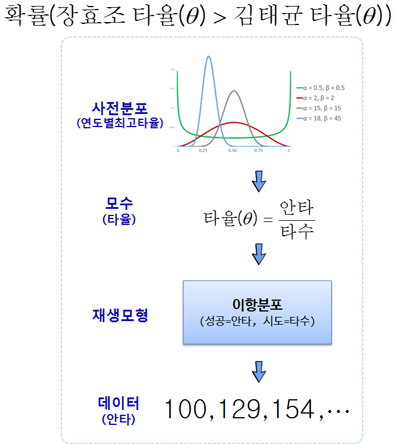

``` {r, include=FALSE}
source("tools/chunk-options.R")
knitr::opts_chunk$set(echo = TRUE, warning=FALSE, message=FALSE)

list_of_packages <- c("Lahman", "ggplot2", "tidyverse", "ggthemes", "extrafont",
                      "tibble", "rvest", "stringr", "extrafont", "broom")
new_packages <- list_of_packages[!(list_of_packages %in% installed.packages()[,"Package"])]
if(length(new_packages)) install.packages(new_packages)

sapply(list_of_packages, require, character.only = TRUE)

options(scipen = 999)
options(dplyr.width = 120)
options(dplyr.print_max = 1e9)
```

## 1. 베이지안 A/B 검정 [^bayesian-ab-testing-baseball]

[^bayesian-ab-testing-baseball]: [Understanding Bayesian A/B testing (using baseball statistics)](http://varianceexplained.org/r/bayesian_ab_baseball/)

2011년 젊은 나이에 위암투병 후 세상을 떠난 [장효조](https://ko.wikipedia.org/wiki/%EC%9E%A5%ED%9A%A8%EC%A1%B0) 선수와 일본에서 돌아와 여전히 현역으로 
수위타자를 넘보고 있는 [김태균](https://ko.wikipedia.org/wiki/%EA%B9%80%ED%83%9C%EA%B7%A0_(1982%EB%85%84)) 선수 중 누가 더 우수한 선수인가? 
이런 질문은 야구에 관심이 있거나, 사자와 호랑이가 싸우면 누가 이기나? 
마징가와 건담이 싸우면 누가 이길까? 이런 질문이 될 수도 있지만, 야구 데이터를 가지고 
최고 타자를 검증해보자.
 


결국, 장효조 선수의 타율이 김태균 선수 타율보다 높은 확률이 얼마인가를 가지고, 특정 확률값
예를 들어 70% 이상 되면 역대 최고 타자로 장효조 선수를 인정하는 것으로 정리하는 것도 한 방법이다.

사전분포는 82년부터 [연도별 최고타율](https://ko.wikipedia.org/wiki/KBO_%EB%A6%AC%EA%B7%B8_%ED%83%80%EC%9C%A8_%EA%B4%80%EB%A0%A8_%EA%B8%B0%EB%A1%9D)을 
획득한 선수의 타율을 사전분포로 두고 베타분포의 모수 $\alpha , \beta$를 
추정하고, 이를 장효조, 김태균 선수의 타율과 결합하여 사후분포를 추정하여 누가 더 타율이 좋은지 평가한다.


## 2. 단계별 베이지안 검정

### 2.1. 데이터 가져오기

베이지안 데이터 분석에 필요한 팩키지를 가져와서 설치한다.
장효조, 김태균 선수 야구기록을 위키에서 긁어와서 데이터프레임으로 준비한다.

``` {r ab-bayesian-setup}
# 0. 환경설정 -------------------------------------------
# list_of_packages <- c("ggplot2", "tidyverse", "ggthemes", "pwr", "extrafont", "shiny", "broom", 
#                       "tibble", "rvest", "stringr", "extrafont")
# new_packages <- list_of_packages[!(list_of_packages %in% installed.packages()[,"Package"])]
# if(length(new_packages)) install.packages(new_packages)
# 
# sapply(list_of_packages, require, character.only = TRUE)

# 1. 대한민국 최고 타자 데이터 --------------------------
## 1.1. 타자 장효조 -------------------------------------
Sys.setlocale("LC_ALL", "English")
chj_url <- "https://ko.wikipedia.org/wiki/%EC%9E%A5%ED%9A%A8%EC%A1%B0"
chj_xml <- read_html(chj_url)

chj_tbl <- html_nodes(chj_xml, xpath='//*[@id="mw-content-text"]/div/table[3]')
chj_tbl <- html_table(chj_tbl, fill=TRUE)[[1]]

Sys.setlocale("LC_ALL", "Korean")

DT::datatable(chj_tbl)

## 1.2. 타자 김태균 ------------------------
Sys.setlocale("LC_ALL", "English")
ktg_url <- "https://ko.wikipedia.org/wiki/%EA%B9%80%ED%83%9C%EA%B7%A0_(1982%EB%85%84)"
ktg_xml <- read_html(ktg_url)

ktg_tbl <- html_nodes(ktg_xml, xpath='//*[@id="mw-content-text"]/div/table[7]')
ktg_tbl <- html_table(ktg_tbl, fill=TRUE)[[1]]

Sys.setlocale("LC_ALL", "Korean")

DT::datatable(ktg_tbl)
```

### 2.2. 두 야구선수 기록 정리

장효조, 김태균 선수 데이터를 가져와서 타율검증에 필요한 데이터만 
발라내서 `ab_df`라는 데이터프레임으로 준비한다.

``` {r ab-bayesian-two-players}
## 1.3. 대한민국 최고 타자 데이터 비교 ------------------------------------

chj_df <- chj_tbl %>% mutate(이름 = "장효조") %>% 
  dplyr::select(이름, 타수=`타\n수`, 안타=`안\n타`, 타율=`타\n율`) %>% 
  dplyr::filter(타수 >=3000)

ktg_df <- ktg_tbl %>% mutate(이름 = "김태균") %>% 
  dplyr::select(이름, 타수=`타\n수`, 안타=`안\n타`, 타율=`타\n율`) %>% 
  dplyr::filter(타수 >=3000)

(ab_df <- bind_rows(chj_df, ktg_df))
```

### 2.3. 사전 분포

베타분포를 사전분포로 두고, 모수 $\alpha , \beta$를 
82년부터 최고타율 데이터를 활용하여 경험적 베이즈 방법론을 적용하여 추정한다.
그리고 나서, `ggplot2`를 활용하여 시각화한다. 

``` {r ab-bayesian-two-players-prior}
# 2. KBO 최고타율 사전분포 ------------------------------------
## 2.1. 최고타율 데이터 가져오기 ------------------------
Sys.setlocale("LC_ALL", "English")
hitter_url <- "https://ko.wikipedia.org/wiki/KBO_%EB%A6%AC%EA%B7%B8_%ED%83%80%EC%9C%A8_%EA%B4%80%EB%A0%A8_%EA%B8%B0%EB%A1%9D"
hitter_xml <- read_html(hitter_url)

hitter_tbl <- html_nodes(hitter_xml, xpath='//*[@id="mw-content-text"]/div/table[3]')
hitter_tbl <- html_table(hitter_tbl, fill=TRUE)[[1]]

Sys.setlocale("LC_ALL", "Korean")
DT::datatable(hitter_tbl)

## 2.2. 사전분포 최고타자 베타분포 모수추정 ------------------------
alpha_beta <- MASS::fitdistr(hitter_tbl$"타율", dbeta,
                    start = list(shape1 = 560, shape2 = 970))

alpha0 <- alpha_beta$estimate["shape1"]
beta0 <- alpha_beta$estimate["shape2"]

## 2.3. 최고타자 사전분포 시각화 ------------------------
gg_x <- seq(0.3, 0.45, .001)
beta_dens <- dbeta(gg_x, alpha0, beta0) 

beta_df <- data.frame(gg_x, beta_dens) 

beta_df %>% 
  ggplot(data = ., aes(x=gg_x, y=beta_dens)) +
    geom_line() +
    scale_x_continuous(limits=c(0.3, 0.45)) +
    theme_bw(base_family="NanumGothic") +
    theme(legend.position = "top") +
    scale_color_brewer(palette="Dark2") +
    labs(x="타율", y="밀도 (Density)") +
    geom_vline(aes(xintercept=alpha0/(alpha0+beta0)),
               color="blue", linetype="dashed", size=1)
```

### 2.4. 장효조, 김태균 타율 사후분포 

사후분포 타율을 추정하는 방식은 4가지를 제시하고 있다.

- 모의시험 시뮬레이션 (Simulation)
- 수치적분 (Numerical Integration)
- 닫힌 공식 해법 (Closed-form Solution)
- 닫힌 공식 정규분포 근사화 (Closed-form approximation)

4가지 접근방법 모두 장단점이 있다. 

#### 2.4.1. 모의시험 시뮬레이션 (Simulation)

모의시험은 수식이나 기타 다른 설명이 없이 
컴퓨터가 열심히 일을 해서 정답을 가져다 주는 것이니 그냥 가져다 쓰면된다.

``` {r ab-bayesian-two-players-simulation}
# 3. 최고 타자는 누구인가? ------------------------------
ab_eb_df <- ab_df %>%
  mutate(eb_estimate = (안타 + alpha0) / (타수 + alpha0 + beta0)) %>%
  mutate(alpha1 = 안타 + alpha0,
         beta1 = 타수 - 안타 + beta0)

## 3.1. 모의시험 시뮬레이션 ------------------------------

chj_param <- ab_eb_df %>% dplyr::filter(이름 =="장효조") %>% 
  dplyr::select(alpha1, beta1)
chj_sim <- rbeta(1e6, chj_param$alpha1, chj_param$beta1)

ktg_param <- ab_eb_df %>% dplyr::filter(이름 =="김태균") %>% 
  dplyr::select(alpha1, beta1)
ktg_sim <- rbeta(1e6, ktg_param$alpha1, ktg_param$beta1)

(sim_res <- mean(chj_sim > ktg_sim))
```

장효조, 김태균 타율 사후분포에서 1,000,000번 두 타자를 경쟁시켜 누가 
더 타율이 높은지 평균을 낸다. 장효조 선수가 `r scales::percent(sim_res)` 더 타율이 높게 나온다.

#### 2.4.2. 수치적분

두번째 방법은 수치적분을 사용한 방식으로 A/B 검정이 많이 사용되어 
[Agile A/B testing with Bayesian Statistics and Python](https://web.archive.org/web/20150419163005/http://www.bayesianwitch.com/blog/2014/bayesian_ab_test.html)에서
영감을 받아 David Robinson이 구한현 방식이다. 모수 $\alpha , \beta$가 큰 경우 시간이 다소 걸린다는 점을 주의한다.

``` {r ab-bayesian-two-players-integration}
## 3.2. 수치 적분 ------------------------------
x <- seq(.315, .355, .0002)

crossing(chj_x = x, ktg_x = x) %>%
  mutate(chj_density = dbeta(chj_x, chj_param$alpha1, chj_param$beta1),
         ktg_density = dbeta(ktg_x, ktg_param$alpha1, ktg_param$beta1),
         joint = chj_density * ktg_density) %>%
  ggplot(aes(chj_x, ktg_x, fill = joint)) +
  geom_tile() +
  geom_abline(color="darkgray") +
  theme_bw(base_family="NanumGothic") %>% 
  scale_fill_gradient2(low = "white", high = "red") +
  labs(x = "장효조 타율",
       y = "김태균 타율",
       fill = "결합 밀도") +
  theme(legend.position = "none")

d <- .00002
limits <- seq(.315, .55, d)
sum(outer(limits, limits, function(x, y) {
  (x > y) *
    dbeta(x, chj_param$alpha1, chj_param$beta1) *
    dbeta(y, ktg_param$alpha1, ktg_param$beta1) *
    d ^ 2
}))
```

#### 2.4.3. 닫힌 공식 해법(Closed-form Solution)

베이지안 A/B 검정에 대한 닫힌 공식 해법이 존재한다.
이를 반영하여 누가 더 타율이 높은지 검정한다.

즉, 장효조 선수와 김태균 선수의 타율 정보가 있을 때, 
장효조 선수 타율이 김태균 선수 타율보다 높을 확률을 다음과 같이 정의할 수 있다.
즉, A가 B보다 나을 확률은 [Miller 해법](http://www.evanmiller.org/bayesian-ab-testing.html#binary_ab_derivation)에 따라 다음과 같이 계산할 수 있다.

$$p_A \sim \mbox{Beta}(\alpha_A, \beta_A)$$

$$p_B \sim \mbox{Beta}(\alpha_B, \beta_B)$$

$${\rm Pr}(p_B > p_A) = \sum_{i=0}^{\alpha_B-1}\frac{B(\alpha_A+i,\beta_A+\beta_B)}{(\beta_B+i) B(1+i, \beta_B) B(\alpha_A, \beta_A) }$$

여기서 $B$는 베타함수가 된다. 
A/B 검정에서 많이 사용되는 베이지안 사전분포는 베타분포고, 응답율을 이항분포를 가정할 경우, 사후분포는 베타분포가 되고 모수는 다음과 같다. 

$$ ~ Beta (\alpha + s, \beta + n - s)$$

- $\alpha:$ 베타분포 첫번째 모수
- $\beta:$ 베타분포 두번째 모수
- $n:$ 시행 횟수
- $s:$ 성공 횟수


``` {r ab-bayesian-two-players-closed-form}
## 3.3. 닫힌 공식 해법(Closed-form Solution) -----------------------------

h <- function(alpha_a, beta_a,
              alpha_b, beta_b) {
  j <- seq.int(0, round(alpha_b) - 1)
  log_vals <- (lbeta(alpha_a + j, beta_a + beta_b) - log(beta_b + j) -
                 lbeta(1 + j, beta_b) - lbeta(alpha_a, beta_a))
  1 - sum(exp(log_vals))
}

h(chj_param$alpha1, chj_param$beta1,
  ktg_param$alpha1, ktg_param$beta1)
```

#### 2.4.3. 닫힌 공식 해법(Closed-form Solution)

마지막 방법은 [John D. Cook(2012), Fast approximation of Beta inequalities
](http://www.johndcook.com/fast_beta_inequality.pdf) 방법을 활용한 것으로, 
모수 $\alpha , \beta$가 큰 경우 베타분포가 정규분포로 근사되어 차이가 크게 나지 않는 성질을 
활용하는 방법이다. 반대로 모수 $\alpha , \beta$가 작은 경우 적합이 잘 되지 않아 오차가 크게 날 수 있으니
주의한다.

``` {r ab-bayesian-two-players-closed-form-apporx}
## 3.4. 닫힌 공식 정규분포 근사화(Closed-form approximation) -----------------------------
h_approx <- function(alpha_a, beta_a, 
                     alpha_b, beta_b) {
  u1 <- alpha_a / (alpha_a + beta_a)
  u2 <- alpha_b / (alpha_b + beta_b)
  var1 <- alpha_a * beta_a / ((alpha_a + beta_a) ^ 2 * (alpha_a + beta_a + 1))
  var2 <- alpha_b * beta_b / ((alpha_b + beta_b) ^ 2 * (alpha_b + beta_b + 1))
  pnorm(0, u2 - u1, sqrt(var1 + var2))
}

h_approx(chj_param$alpha1, chj_param$beta1,
         ktg_param$alpha1, ktg_param$beta1)
```

4가지 분석결과 모두 장효조 선수가 김태균 선수와 동시대 경쟁을 할 경우 거의 80% 정도 
장효조 선수 타율이 김태균 선수 타율보다 높게 나올 것으로 추정된다.