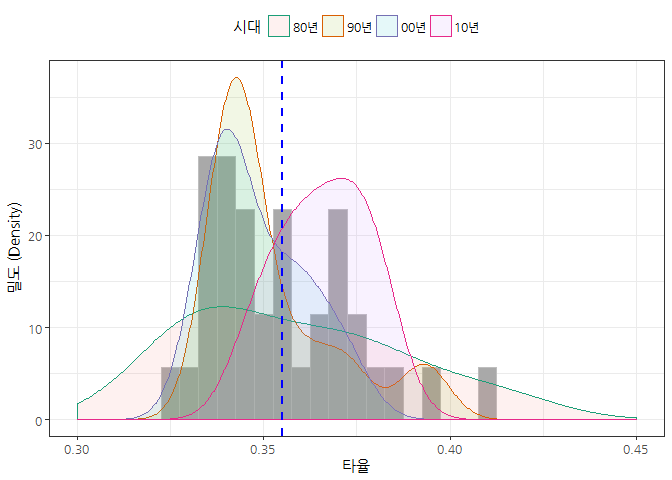
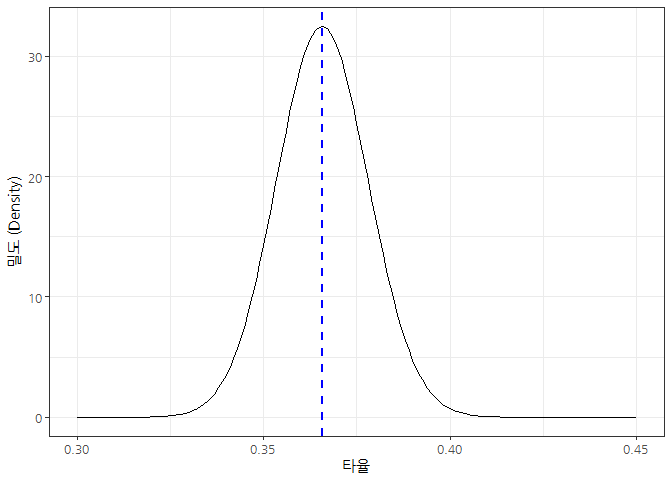
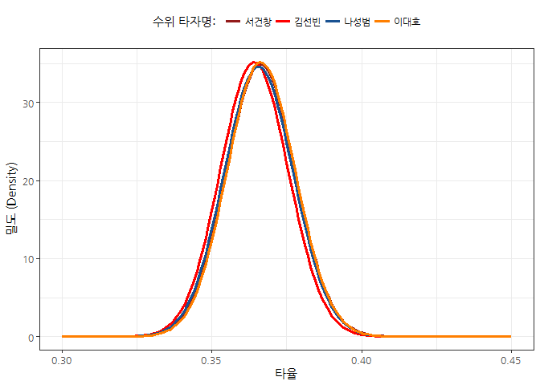

# 데이터 과학 -- 기초 통계

## 1. 대한민국 최고 수위 타자 [^beta-distribution-with-baseball]

[^beta-distribution-with-baseball]: [Understanding the beta distribution (using baseball statistics)](http://varianceexplained.org/statistics/beta_distribution_and_baseball/)

위키피디어 웹사이트에 대한민국 최고 타자에 대한 데이터가 올라가 있다. 

[KBO 리그 타율 관련 기록](https://ko.wikipedia.org/wiki/KBO_%EB%A6%AC%EA%B7%B8_%ED%83%80%EC%9C%A8_%EA%B4%80%EB%A0%A8_%EA%B8%B0%EB%A1%9D)을 살펴보면 
마지막 4할타자인 백인천 전감독의 기록이 눈에 띈다. 1990년에는 소수점 6자리로 수위타자가 갈린 기록도 독특히다.

이러한 데이터를 바탕으로 올해 4할 타자가 나올 것인지 가능성을 점검해 보자.

~~~{.r}
# 0. 환경설정 -------------------------------------------
list_of_packages <- c("ggplot2", "tidyverse", "ggthemes", "pwr", "extrafont", "shiny", "broom", 
                      "tibble", "rvest", "stringr", "extrafont")
new_packages <- list_of_packages[!(list_of_packages %in% installed.packages()[,"Package"])]
if(length(new_packages)) install.packages(new_packages)

sapply(list_of_packages, require, character.only = TRUE)
~~~

~~~{.output}
  ggplot2 tidyverse  ggthemes       pwr extrafont     shiny     broom 
     TRUE      TRUE      TRUE      TRUE      TRUE      TRUE      TRUE 
   tibble     rvest   stringr extrafont 
     TRUE      TRUE      TRUE      TRUE 

~~~

~~~{.r}
# 1. 대한민국 최고 타자 데이터 ------------------------------------
# devtools::install_github('stefano-meschiari/latex2exp')
Sys.setlocale("LC_ALL", "English")
~~~

~~~{.output}
[1] "LC_COLLATE=English_United States.1252;LC_CTYPE=English_United States.1252;LC_MONETARY=English_United States.1252;LC_NUMERIC=C;LC_TIME=English_United States.1252"

~~~

~~~{.r}
hitter_url <- "https://ko.wikipedia.org/wiki/KBO_%EB%A6%AC%EA%B7%B8_%ED%83%80%EC%9C%A8_%EA%B4%80%EB%A0%A8_%EA%B8%B0%EB%A1%9D"
hitter_xml <- read_html(hitter_url)

hitter_tbl <- html_nodes(hitter_xml, xpath='//*[@id="mw-content-text"]/div/table[3]')
hitter_tbl <- html_table(hitter_tbl, fill=TRUE)[[1]]

Sys.setlocale("LC_ALL", "Korean")
~~~

~~~{.output}
[1] "LC_COLLATE=Korean_Korea.949;LC_CTYPE=Korean_Korea.949;LC_MONETARY=Korean_Korea.949;LC_NUMERIC=C;LC_TIME=Korean_Korea.949"

~~~

> ### rvest R 한글 클로링 오류 workaround {.callout}
>
> `Error in utils::type.convert(out[, i], as.is = TRUE, dec = dec) : 
  invalid multibyte string at '<ed><8c><a8>'` 이런 오류가 rvest를 사용하여 
> 한글 웹 페이지를 긁어올 때 흔히 발생된다. R의 고질적인 문제지만 해법은 
> 누군가 정규직으로 3--4달 가량 이러한 인코딩 문제를 해결하면 되지만 아직 아무도 
> 나서고 있지는 않다. 
> 
> 어째든, 웹페이지를 긁어올 때는 `Sys.setlocale("LC_ALL", "English")` 영어로,
> 긁어와서 분석 시작할 때는 `Sys.setlocale("LC_ALL", "Korean")` 한국어로 분석하면 된다.

### 1.1. 최고 수위타자 표

데이터 분석을 하면서 늘 느끼는 것이지만, 정적 표 데이터를 다이나믹 `DT` 팩키지를 활용하여 표현하면 
단순 데이터에서는 볼 수 없는 새로운 사실을 많이 볼 수 있다. 이런 점이 R의 크나 큰 매력인데 명령어 한줄로 해결이 된다.

~~~{.r}
DT::datatable(hitter_tbl)
~~~

<!--html_preserve-->

<!--/html_preserve-->

~~~{.r}
# 2. 최고 타자 타율 시각화 ------------------------------------

hitter_tbl %>% 
  # mutate(IMF전후 = ifelse(연도 >= 1998, "IMF후", "IMF전")) %>% 
  mutate(시대 = cut(연도, breaks = c(0, 1990, 2000, 2010, 2020), labels=c("80년", "90년", "00년", "10년"))) %>% 
  ggplot(data = ., aes(x=타율, color=시대)) +
    geom_histogram(aes(y=..density..), binwidth=0.005, colour="gray", fill="darkgray") +
    geom_density(alpha=.1, aes(fill=시대)) +
    scale_x_continuous(limits=c(0.3, 0.45)) +
    theme_bw(base_family="NanumGothic") +
    theme(legend.position = "top") +
    scale_color_brewer(palette="Dark2") +
    labs(x="타율", y="밀도 (Density)") +
    geom_vline(aes(xintercept=mean(타율)),
             color="blue", linetype="dashed", size=1)
~~~

80년대는 최초이자 마지막 4할 타자 백인천 전감독도 있고 해서 최고타자 타율의 퍼짐의 분포가 상당하다. 하지만,
90년대, 2000년대 들어서며 안정화에 들어섰고, 특히 2010년대를 보면 90년대와 2000년대와 비교해서 볼 때 상당히 높아진 것이 확인된다.

## 2. 대한민국 최고 수위 타자 사전분포

올해 최고타자 타율이 얼마나 될 것인지 베이지안 방법론을 통해서 추정을 할 경우, 먼저 사전분포를 정해야 한다.
타석에 들어서는 것은 시행횟수로 안타를 치는 것은 성공으로 가정하면 이항분포를 활용할 수 있다.
켤레 사전분포(conjugate prior)로 베타분포를 두고 생성함수 확률분포로 이항분포를 가정하면 사후분포도 베타분포가 되는데 
$\alpha$, $\beta$ 모수는 이를 반영하여야 된다.

계산의 편의성을 위해 베타분포는 2010년대 최고타율 분포를 맞출 수 있도록 $\alpha$, $\beta$를 데이터에서 추정한다. [^stackexchange-beta-parameters]
$\alpha$, $\beta$를 추정하는데 적률법(Method of Moments)을 비롯하여 다양한 방법이 존재한다.
적률법을 적용할 경우 `MASS::fitdistr` 함수를 활용하여 $\alpha$, $\beta$를 추정한다.

[^stackexchange-beta-parameters]: [Calculating the parameters of a Beta distribution using the mean and variance](https://stats.stackexchange.com/questions/12232/calculating-the-parameters-of-a-beta-distribution-using-the-mean-and-variance  )

~~~{.r}
## 3.1. 최고타자 사전분포 모수추정 ------------------------
hitter_avg_decade <- hitter_tbl %>% 
  mutate(시대 = cut(연도, breaks = c(0, 1990, 2000, 2010, 2020), labels=c("80년", "90년", "00년", "10년"))) %>% 
  dplyr::filter(시대 %in% c("10년"))

## 3.1. 적률법 ------------------------
hitter_mom <- MASS::fitdistr(hitter_avg_decade$"타율", dbeta,
                    start = list(shape1 = 560, shape2 = 970))
hitter_mom
~~~

~~~{.output}
    shape1     shape2 
  559.7318   970.2151 
 (323.0754) (560.1108)

~~~

~~~{.r}
## 3.2. 평균과 분산을 활용 ------------------------
# https://stats.stackexchange.com/questions/12232/calculating-the-parameters-of-a-beta-distribution-using-the-mean-and-variance  
estBetaParams <- function(mu, var) {
  alpha <- ((1 - mu) / var - 1 / mu) * mu ^ 2
  beta <- alpha * (1 / mu - 1)
  return(params = list(alpha = alpha, beta = beta))
}

## 3.3. 최고타자 사전분포 시각화 ------------------------

hitter_beta <- estBetaParams(0.3658333, 0.0001509667)

gg_x <- seq(0.3, 0.45, .001)
beta_dens <- dbeta(gg_x, hitter_beta$alpha, hitter_beta$beta) 

beta_df <- data.frame(gg_x, beta_dens) 

beta_df %>% 
  ggplot(data = ., aes(x=gg_x, y=beta_dens)) +
    geom_line() +
    scale_x_continuous(limits=c(0.3, 0.45)) +
    theme_bw(base_family="NanumGothic") +
    theme(legend.position = "top") +
    scale_color_brewer(palette="Dark2") +
    labs(x="타율", y="밀도 (Density)") +
    geom_vline(aes(xintercept=hitter_beta$alpha/(hitter_beta$alpha+hitter_beta$beta)),
               color="blue", linetype="dashed", size=1)
~~~

2010년대 최고타율에 맞춰 평균도 맞췄고, 퍼짐의 정도도 반영한 것이 시각적으로 확인된다. 4할을 넘길 확률은 아주 작은 것으로 보이고,
마찬가지로 3할대 초반 타율로 최고타자로 등극하기도 극히 확률적으로 희박하다는 전문가의 의견도 충분히 반영가능하다.

## 3. 2017년 현재 타격 순위 

다음 스포츠, 야구, KBO리그 타자순위 6월 27일 기준 타격 순위 데이터를 [웹사이트](http://score.sports.media.daum.net/record/baseball/kbo/brnk.daum)에서 
긁어온다. 

~~~{.r}
## 3.4. 최고타자 타율 데이터 가져오기 ------------------------
baseball_url <- "http://score.sports.media.daum.net/record/baseball/kbo/brnk.daum"
baseball_html <- xml2::read_html(baseball_url)

## import KBO League Team Ranking
Sys.setlocale("LC_ALL", "English")
~~~

~~~{.output}
[1] "LC_COLLATE=English_United States.1252;LC_CTYPE=English_United States.1252;LC_MONETARY=English_United States.1252;LC_NUMERIC=C;LC_TIME=English_United States.1252"

~~~

~~~{.r}
hitter_table <- rvest::html_nodes(x=baseball_html, xpath='//*[@id="table1"]')
baseball_hitter <- rvest::html_table(hitter_table)[[1]]
Sys.setlocale("LC_ALL", "Korean")
~~~

~~~{.output}
[1] "LC_COLLATE=Korean_Korea.949;LC_CTYPE=Korean_Korea.949;LC_MONETARY=Korean_Korea.949;LC_NUMERIC=C;LC_TIME=Korean_Korea.949"

~~~

~~~{.r}
DT::datatable(baseball_hitter)
~~~

<!--html_preserve-->

<!--/html_preserve-->

서건창 선수와 김선빈 선수가 3할7푼으로 공동선두를 달리고 있다. 차이가 있다면 타수에서 차이가 난다.

## 4. '17년 타율 예측

현재 타율을 기존 2010년대 사전분포를 반영하면 다소 놀라울 수 있는데 이대호가 나성범을 능가하는 것이 
시각적으로 확인된다. 이런 점은 베이지안 분석을 통해서 발견할 수 있는데 이유는 나성범 선수의 타석이 
상대적으로 이대호 선수보다 적어 이를 감안하면 나름 설득력이 있다. 수식으로 표현하면 수식으로 이해하시는 분께 더 편할 수도 있다. 범타는 타석수 - 안타수로 계산한다.

$$Beta (\alpha_0 + \text{안타}, \beta_0 + \text{범타} )$$

~~~{.r}
## 3.5. 최고타자 타율 시각화 ------------------------

gg_x <- seq(0.3, 0.45, .001)
seo_dens  <- dbeta(gg_x, hitter_beta$alpha+100, hitter_beta$beta+170)
kim_dens  <- dbeta(gg_x, hitter_beta$alpha+90, hitter_beta$beta+153)
na_dens  <- dbeta(gg_x, hitter_beta$alpha+77, hitter_beta$beta+134)
lee_dens  <- dbeta(gg_x, hitter_beta$alpha+93, hitter_beta$beta+169)

best_hitter_df <- data.frame(gg_x, seo_dens, kim_dens, na_dens, lee_dens) 

best_hitter_df %>% 
  gather(player, hit_avg, -gg_x) %>% 
  ggplot(data = ., aes(x=gg_x, y=hit_avg, group=player)) +
  geom_line(aes(color=player), size=1.3) +
  scale_x_continuous(limits=c(0.3, 0.45)) +
  theme_bw(base_family="NanumGothic") +
  theme(legend.position = "top") +
  scale_color_brewer(palette="Dark2") +
  labs(x="타율", y="밀도 (Density)") +
  scale_color_manual(name="수위 타자명: ", 
                     values=c("#931a1a", "#ff0000", "#195292", "#ff7f00"),
                     labels=c("서건창", "김선빈", "나성범", "이대호"))
~~~

올해 확률 4할을 넘길 확률은 어떻게 될까? 이 문제 답을 하기 위해서 앞선 사후분포확률에서 4할 이상 칠 확률은 오히려 김선빈 서건창선수보다 약간 앞선다.

~~~{.r}
## 3.6. 4할을 넘을 확률 ------------------------
seo_400  <- 1-pbeta(0.4, hitter_beta$alpha+100, hitter_beta$beta+170)
kim_400  <- 1-pbeta(0.4, hitter_beta$alpha+90, hitter_beta$beta+153)
na_400   <- 1-pbeta(0.4, hitter_beta$alpha+77, hitter_beta$beta+134)
lee_400  <- 1-pbeta(0.4, hitter_beta$alpha+93, hitter_beta$beta+169)

big_four_400 <- data.frame("서건창" = seo_400, "김선빈"=kim_400, "나성범"=na_400, "이대호"=lee_400)
 
big_four_400 %>% gather(선수, 타율4할) %>% 
  dplyr::mutate(타율4할 = scales::percent(타율4할))
~~~

~~~{.output}
    선수 타율4할
1 서건창 0.1730%
2 김선빈 0.1826%
3 나성범 0.1623%
4 이대호 0.0919%

~~~
