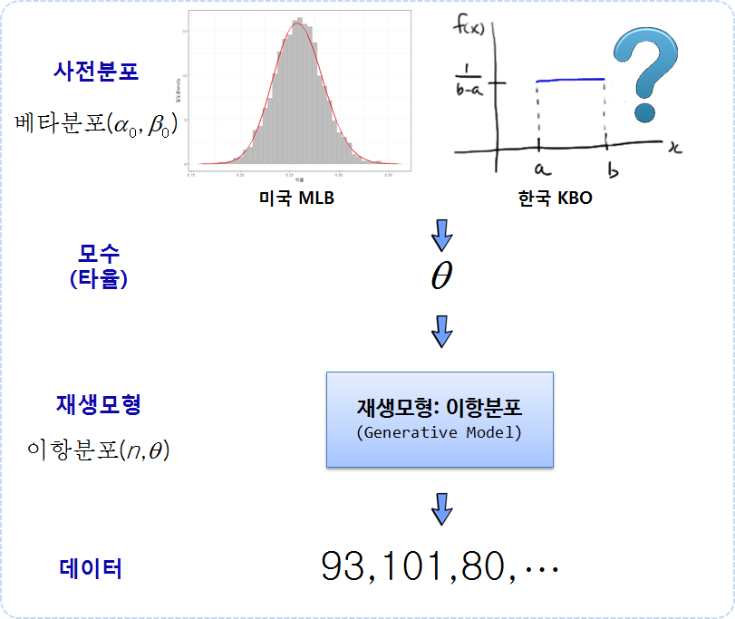

``` {r, include=FALSE}
source("tools/chunk-options.R")
knitr::opts_chunk$set(echo = TRUE, warning=FALSE, message=FALSE)

list_of_packages <- c("Lahman", "ggplot2", "tidyverse", "ggthemes", "pwr", "extrafont", "shiny", "broom", 
                      "tibble", "rvest", "stringr", "extrafont")
new_packages <- list_of_packages[!(list_of_packages %in% installed.packages()[,"Package"])]
if(length(new_packages)) install.packages(new_packages)

sapply(list_of_packages, require, character.only = TRUE)

loadfonts(device="win")

par(family="NanumGothic")

options(scipen = 999)
options(dplyr.width = 120)
options(dplyr.print_max = 1e9)
```

## 1. 타격천재 장효조, 양준혁 그리고 1타수 1안타 선수  

2017년 KBO 한국프로야구 시즌을 보면 
[삼성 최경철](http://www.kbreport.com/leader/main?teamId=&defense_no=&year_from=2017&year_to=2017&split01=&split02_1=&split02_2=&tpa_count=)선수가 
1타수 1안타를 쳐서 타율이 최고 타율을 기록하고 있다.
하지만, 1타수 무안타 타율이 0인 선수도 다수 있다. 이런 경우 타율을 어떻게 의미있게 보정할 수 있을까?



삼성 최경철 선수를 비롯한 상당수 선수는 타석에 올라가 횟수도 매우 적고, 이에 따라 타율도 5할을 넘기는 경우도 심심치 않게 볼 수 있다.
과연 이런 선수가 실제 충분한 타석기회가 주어지면 타율은 얼마나 될까? 이런 문제에 빈도주의 통계를 적용하기가 참 애매하다.

경험적 베이즈(Empirical Bayes) 방법론을 데이터분석 도수상자에 추가하면 흔히 접하게 되는 이러한 문제에 답을 구할 수 있다.

대한민국 야구 데이터가 원데이터 형태가 아닌 웹으로 조회를 통해 볼 수 있게 공개된 경우가 대부분이다. 그래서 경험적 베이즈 방법론을 적용하기 위해,
정확히는 사전분포(Prior)를 구하기 위해 미국 메이져리그 `Lehman` 데이터를 활용한다.

## 2. 경험적 베이즈를 반영한 타율  [^variance-explained-eb]

[^variance-explained-eb]: [Understanding empirical Bayes estimation (using baseball statistics)](http://varianceexplained.org/r/empirical_bayes_baseball/)

경험적 베이즈를 적용하기 위해서 데이터를 적극 활용하는데, 82년부터 타석에 들어선 선수의 안타 데이터가 없어 
사전분포는 미국 메이저리그 야구 기록을 활용하고, 예측하고자 하는 타율 데이터는 현재시점 KBO 프로야구 데이터를 활용한다.

### 2.1. 기본 수학 지식

사전분포가 베타분포이며 우도함수가 이항분포인 경우, 사후분포도 베타분포가 된다. 
즉, 사전분포는 미국 메이저리그 야구 타율분포이며, 우도함수는 2017년 KBO 한국 프로야구 시즌 타석에 들어서서 안타를 친 분포가 된다.
그리고, 이것을 수학적으로 나타내면 다음과 같다.

$$\text{사전분포:} \theta | \alpha_0 , \beta_0 ~ \text{베타분포}(\alpha_0 , \beta_0)$$
$$\text{우도함수:}k|n, \theta ~ \text{이항분포}(\theta , n)$$
$$\text{사후함수:}\theta|k, n, \alpha_0 , \beta_0 ~ \text{베타분포}(\alpha_0 + k, \beta_0 +n-k)$$

따라서, 미국 메이져리그 야구 데이터에서 $\alpha_0$, $\beta_0$를 추정하고, 한국 프로야구 데이터에서 타석에 들어선 안타 데이터가 있다면 
타석이 매우 적은 선수를 포함한 모든 선수에 대한 타율을 설득력있게 추정할 수 있게 된다.


### 2.1. 타율 사전 분포

미국 메이저리그 야구에 100년이 넘는 타자의 야구 기록이 `Lahman` 팩키지에 담겨있어, 
팩키지에 담겨진 타자 데이터를 가져와서 성과 이름을 붙여 전처리한다. 
그런 다음 500 타석을 넘긴 선수에 대한 타율분포를 히스토그램으로 나타내고,
`stat_function` 내부에 베타함수를 넣어 앞서 추정한 $\alpha_0$, $\beta_0$ 값을 넣어 베타함수에 적합시킨다.
보는 사람 관점에서 차이가 날 수도 있지만, 후속 단계를 진행하는 것도 큰 무리가 없어 보인다.

``` {r eb-prior-mlb}
# 0. 환경설정 -------------------------------------------
# list_of_packages <- c("Lahman", "ggplot2", "tidyverse", "ggthemes", "extrafont",
#                       "tibble", "rvest", "stringr", "extrafont")
# new_packages <- list_of_packages[!(list_of_packages %in% installed.packages()[,"Package"])]
# if(length(new_packages)) install.packages(new_packages)
# 
# sapply(list_of_packages, require, character.only = TRUE)

# 1. MLB 베타분포 ------------------------------------

## 투수 제외하고 타율 계산  
career <- Batting %>%
  dplyr::filter(AB > 0) %>%
  anti_join(Pitching, by = "playerID") %>%
  group_by(playerID) %>%
  dplyr::summarize(H = sum(H), AB = sum(AB)) %>%
  mutate(average = H / AB)

# 성과 이름을 붙여 가독성 높임.
career <- Master %>%
  tbl_df() %>%
  dplyr::select(playerID, nameFirst, nameLast) %>%
  unite(name, nameFirst, nameLast, sep = " ") %>%
  inner_join(career, by = "playerID") %>%
  dplyr::select(-playerID)

# 타석이 500석 이상 
career_filtered <- career %>%
  filter(AB >= 500)

m <- MASS::fitdistr(career_filtered$average, dbeta,
                    start = list(shape1 = 1, shape2 = 10))

alpha0 <- m$estimate[1]
beta0 <- m$estimate[2]

career_filtered %>%
  dplyr::filter(AB > 500) %>%
  ggplot() +
  geom_histogram(aes(average, y = ..density..), binwidth = .005, color="darkgray", fill="gray") +
  stat_function(fun = function(x) dbeta(x, alpha0, beta0), color = "red",
                size = 1) +
  theme_bw(base_family="NanumGothic") +
  labs(x="타율", y="밀도(Density")
```

### 2.2. KBO 타자 타율

데이터를 통해서 우도함수를 구할 수 있는데 이런 경우 KBO 타자 타율 데이터가 필요하다.
다음이나 네이버를 통해 데이터를 긁어온다. 그리고 나서, [KBReport](http://www.kbreport.com/) 사이트에서 
일부 타석이 매우 적은 선수 일부를 데이터에 포함시킨다.

``` {r eb-likelihood-kbo}
# 2. 2017년 KBO리그 ------------------------------------

## 2.1. KBO 통계(6/28일) -------------------------------
kbo_url <- "http://score.sports.media.daum.net/record/baseball/kbo/brnk.daum"
kbo_html <- xml2::read_html(kbo_url)

Sys.setlocale("LC_ALL", "English")

kbo_hitter_tbl <- rvest::html_nodes(x=kbo_html, xpath='//*[@id="table1"]')
kbo_hitter <- rvest::html_table(kbo_hitter_tbl)[[1]]
Sys.setlocale("LC_ALL", "Korean")

# DT::datatable(kbo_hitter)
```

### 2.3. KBO 타자 타율 - 경험적 베이즈 추정

베이즈 타율을 계산하는 것은 다음과 같다. 앞서 적률법(Method of Moments)을 통해 $\alpha_0$, $\beta_0$를 
추정했기 때문에 경험적 베이즈를 통해 베이즈 타율을 계산하는 것은 한결 쉽다.
따라서, 강지광, 노경은, 최경철, 이성곤 등 타수가 매우 적은 선수에 대한 타율도 함께 계산할 수 있다.

- `mutate(베이즈_타율 = (안타 + alpha0) / (타수 + alpha0 + beta0))`

``` {r eb-posterior-kbo}
# 3. KBO 경험적 베이즈(Empirical Bayes) (6/28일) -------------------------------
kbo_hitter_eb <- kbo_hitter %>% 
  dplyr::select(`선수 (팀)`, 타수, 안타, 타율) %>% 
  add_row(`선수 (팀)` = "강지광 (넥센)", 타수 = 2, 안타 = 0, 타율 =0) %>% 
  add_row(`선수 (팀)` = "노경은 (롯데)", 타수 = 2, 안타 = 0, 타율 =0) %>% 
  add_row(`선수 (팀)` = "최경철 (삼성)", 타수 = 1, 안타 = 1, 타율 =1) %>%
  add_row(`선수 (팀)` = "이성곤 (두산)", 타수 = 3, 안타 = 1, 타율 =0.333) %>% 
  mutate(베이즈_타율 = round((안타 + alpha0) / (타수 + alpha0 + beta0), 3))

kbo_hitter_eb  %>% 
  dplyr::arrange(타수) %>% DT::datatable()
```

### 2.4. KBO 타자 타율 시각화 비교

경험적 베이즈를 적용하지 않으면 타수가 매우 적은 선수의 경우 타율이 0, 10할과 같이 양극단에 몰려있게 된다.
하지만, 경험적 베이즈를 적용하면 시각적으로도 비교가 가능한 형태로 나타낼 수 있는 장점이 있다.

``` {r eb-posterior-kbo-viz}
prior_g <- kbo_hitter_eb %>% 
  dplyr::select(`선수 (팀)`, 타율) %>% 
  ggplot() +
    geom_histogram(aes(타율, y = ..density..), binwidth = .01, color="darkgray", fill="gray", alpha=0.3) +
    theme_bw(base_family="NanumGothic") +
    labs(x="타율", y="밀도(Density")

## 3.2. KBO 베이즈 타율 시각화 (6/28일) -------------------------------

posterior_g <- kbo_hitter_eb %>% 
  dplyr::select(`선수 (팀)`, 타율, 베이즈_타율) %>% 
  gather(구분, 타율,  -`선수 (팀)`) %>% 
  ggplot() +
    geom_histogram(aes(타율, y = ..density.., fill=구분), binwidth = .005, alpha=0.3) +
    theme_bw(base_family="NanumGothic") +
    stat_function(fun = function(x) dbeta(x, alpha0, beta0), color = "red", size = 1) +
    scale_x_continuous(limits=c(0.2, 0.40)) +
    labs(x="타율", y="밀도(Density") +
    theme(legend.position = "top")

gridExtra::grid.arrange(prior_g, posterior_g,  nrow=1)

```