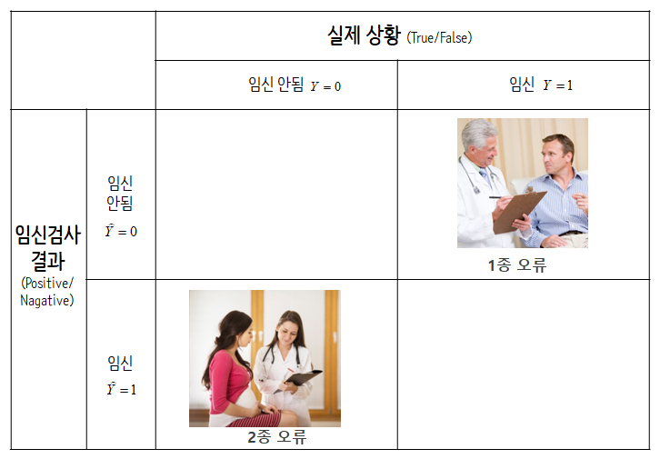

``` {r, include=FALSE}
source("tools/chunk-options.R")
knitr::opts_chunk$set(echo = TRUE, warning=FALSE, message=FALSE)

library(tidyverse)
library(broom)
library(modelr)
library(stringr)
library(plotly)
library(hrbrthemes)
library(ggthemes)
library(extrafont)
library(eulerr)
loadfonts()

options(scipen = 999)
options(dplyr.width = 120)
options(dplyr.print_max = 1e9)
```

## 1. 데이터과학과 수학 {#data-science-math}

데이터는 누구나 다루는 시대가 되었는데 언제나 데이터를 효과적으로 다루고자 하면 언제나 등장하는 것이 수학이다.
그렇다고 수학을 전공할 것도 아니고, 데이터 과학에 꼭 필요한 수학적 지식은 무엇일까? 
이에 대해서 듀크 대학 교수님들이 [코세라, Data Science Math Skills](https://www.coursera.org/learn/datasciencemathskills/)라는 과목을 개설하여 
교육서비스를 제공하고 있다.

- 집합 이론(Set theory)
- 실수의 성질
- 구간 표기법과 부등식을 갖는 대수
- 합계와 시그마($\Sigma$) 표기법
- 데카르트 평면과 기울기, 거리 공식
- $x-y$ 평면 위에 (역)함수를 표현
- 곡선에 대한 접선과 순간변화율에 대한 미분 개념
- 지수, 로그, 자연로그함수
- 베이즈 정리를 포함하는 확률론

고등학교과정을 충실히 이수했다면 이미 알고 있는 지식이라, 오랜동안 사용하기 않아서 잊었다면 다시한번 
다져가는 것도 데이터를 과학적으로 다뤄보고자 할 때 등장하는 수학 공포증을 날려보낼 수도 있을 것으로 판단된다.

## 2. 집합론 [^wiki-set] {#set-theory}

[^wiki-set]: [위키백과 - 집합(Set)](https://ko.wikipedia.org/wiki/%EC%A7%91%ED%95%A9)

**집합(set)**은 서로 구별되는 대상들을 순서와 무관하게 모은 것으로 정의된다.
이때 집합에 속하는 각각의 대상들은 집합의 **원소(element)**라고 하고,
집합의 크기를 **기수(Cardinality)**로 원소의 집합에 대한 포함관계를 $\in$으로 표현한다. 
세상에 존재하는 거의 모든 것들은 집합의 원소가 될 수 있으며, 여기에는 숫자나 대수, 사람, 글자, 집합, 국가와 같은 개념들이 포함된다. 집합을 표현하는 방법은 일반적으로 알파벳의 대문자로 집합을 표기하고, 원소는 소문자로 표기한다.

### 2.1. 집합 표현법과 집합연산 {#set-notation}

집합을 기술하는 방법은 **원소나열법**과 **조건제시법**이 있다.

원소 나열법은 집합에 포함된 원소를 쭉 나열하는 것이다.

- $\{1, 2, 3\}$, $\{흰색, 검은색\}$, ...
- 1부터 10까지 자연수 $\{1, 2, 3, ..., 10\}$, 1부터 11까지 홀수 $\{1, 3, 5, ..., 11\}$

두번째는 원소를 일일이 사례를 들어 표현하는 대신에 논리적 관계를 기술하여 집합을 표현하는 조건제시법으로 다음과 같은 형태로 표현한다.

$$\{(\text{집합의 모든 원소의 형태})|(\text{원소의 조건})\}$$

- {x|x는 $1\le x \le 10$인 자연수} = {1, 2, 3, 4, 5, 6, 7, 8, 9, 10}
- {x+y|x는 1 또는 2, y는 3 또는 4} = {4, 5, 6}
- {(x,y)|x $\in$ {1,2}, y $\in$ {1,2}} = {(1,1), (1,2), (2,1), (2,2)}



예를 들어, 검사결과 임신이 되어 양성이 나온 사람(P)과 그렇지 않은 사람(N)을 집합으로 표현해 보자.

- $P = \{ x \in X | \text{x는 임신 검사결과 임신이 된 사람} \}$
- $N = \{ x \in X | \text{x는 임신 검사결과 임신이 되지 않은 사람} \}$

전체집합은 임신 검사결과 임신으로 판정된 사람과 임신이 되지 않은 것으로 판정된 사람이 되고, 임신이 된 것으로 판명된 사람과 동시에 임신이 되지 않은 것으로 판정된 사람은 없어 공집합($\phi$)이 된다.
또한, 임신 검사결과 오류가 있을 수 있어 집합기호를 통해 True Positive, False Positive, False Negative, True Nagative 4가지 경우로 표현할 수 있다.

보통 데이터과학에서 관심이 있는 사건을 $Y$로 표현하고 $Y$가 발현된 경우 1, 그렇지 않는 경우 0으로 인코딩한다.
$Y$를 임신상태로 표현하면, 1은 임신인 상태, 0은 임신이 되지 않은 상태를 각각 나타낸다.

- 모집단 사람($H$, 임신한 사람과 임신하지 않은 사람)
    - $임신상태 \cup 비임신 = H$ : 임신한 사람과 임신하지 않은 사람을 모두 합치면 전체집합이 된다.
    - $임신상태 \cap 비임신 = \phi$ : 임신한 사람과 동시에 임신하지 않은 사람은 존재하지 않아 공집합이 된다.
- 검사결과(임신검사 결과 임신 혹은 임신되지 않음으로 나옴) 
    - $음성 \cup 양성 = H$ : 임신검사결과 임신되었다는 결과와 임신이 되지 않았다는 결과를 모두 합하면 전체집합이 된다.
    - $음성 \cap 양성 = \phi$ : 임신검사결과 임신되었다는 결과와 동시에 임신이 되지 않았다는 결과는 나올 수가 없어 공집합이 된다.
- 모집단 사람과 검사결과를 조합하게 되면 다음 4가지 경우의 수가 나온다.
    - $비임신상태 \cap 음성$(False Nagative): 비임신상태인데, 검사결과 음성이 나와 임신이 아닌 것으로 판정된 경우
    - $임신상태 \cap 양성$(True Positive): 임신상태인데 검사결과 음성이 나와 임신이 된 것으로 판정된 경우.    
    - $비임신상태 \cap 양성$(False Positive, **1종 오류**): 비임신상태인데, 검사결과 양성이 나와 임신이 된 것으로 판정된 경우.
    - $임신상태 \cap 음성$(True Nagative, **2종 오류**): 임신상태인데 검사결과 음성이 나와 임신이 안 된 것으로 판정된 경우.
    
앞서 정의한 것을 기반으로 다음과 같이 전체 사람중에 임신상태인 사람과 비임신상태 사람의 비율을 계산할 수 있다.

- $\frac{|임신상태|}{|사람|}$ = 전체 사람중에서 임신상태인 사람의 비율
- $\frac{|비임신상태|}{|사람|}$ = 전체 사람중에서 비임신상태인 사람의 비율

또한, True Positive, False Positive, False Negative, True Nagative 경우를 집합으로 표현할 수 있다.

- $\frac{임신상태 \cap 양성}{|임신상태|}$ = True Postive로 임신상태인 사람중에서 임신검사결과 양성으로 판정된 사람의 비율
- $\frac{비임신상태 \cap 양성}{|비임신상태|}$ = False Postive로 비임신상태인 사람중에서 임신검사결과 양성으로 판정된 사람의 비율
- $\frac{임신상태 \cap 음성}{|임신상태|}$ = True Nagative로 임신상태인 사람중에서 임신검사결과 음성으로 판정된 사람의 비율
- $\frac{비임신상태 \cap 음성}{|비임신상태|}$ = False Positive로 비임신상태인 사람중에서 임신검사결과 음성으로 판정된 사람의 비율

데이터 과학에서 예측모형 성능평가와 관련된 사항은 [기계학습 알고리즘 성능평가](http://statkclee.github.io/ml/ml-assessment.html)를 참조한다.

### 2.2. R 코드 {#r-set-notation}

`sets` 팩키지와 `VennDiagram` 팩키지를 활용하여 집합연산을 R코드로 수행해본다. 

- [sets: Sets, Generalized Sets, Customizable Sets and Intervals](https://cran.r-project.org/web/packages/sets/)
- [VennDiagram: Generate High-Resolution Venn and Euler Plots](https://cran.r-project.org/web/packages/VennDiagram/index.html)

먼저 집합 $A,B$를 생성한다. 집합 $A = \{ A, B, \cdots, J \}$, 
집합 $B = \{ E, F, \cdots, O \}$가 된다. 집합의 크기/기수는 `length` 함수로 구한다.
`sets` 팩키지의 합집합, 교집합, "두 집합의 상대 여집합의 합"을 내장된 연산자로 각기 계산한다.

``` {r r-set-operations}
# 0. 환경설정 ----------
library(sets)
library(VennDiagram)
library(RAM)
library(eulerr)

# 1. 집합 정의 ---------
A <- LETTERS[1:10]
B <- LETTERS[5:15]

A_set <- as.set(A)
B_set <- as.set(B)

# 2. 집합 크기/기수(Cardinality) -------

length(A)
length(B)

# 3. 기본 집합 연산 --------------------
# 합집합
A_set | B_set
# 교집합
A_set & B_set
# 두 집합의 상대 여집합의 합(Symmetric Difference)
A_set %D% B_set
```

`draw.pairwise.venn` 함수를 활용하여 앞에서 정의한 집합을 벤다이어그램으로 다음과 같이 시각화할 수 있다. 

``` {r r-set-venn-diagram}
# 4. 벤다이어그램 ---------------------
## 4.1. 종합

draw.pairwise.venn(
  area1 = length(A_set),
  area2 = length(B_set),
  cross.area = length(A_set & B_set),
  category = c("집합 A", "집합 B"),
  cat.pos = c(0, 180),
  euler.d = TRUE,
  sep.dist = 0.03,
  fill = c("light blue", "pink"),
  alpha = rep(0.5, 2),
  lty = rep("blank", 2)
)

## 4.2. 원소도 함께 표현
group.venn(list(집합A=A, 집합B=B), label=TRUE, 
           fill = c("orange", "blue"),
           cat.pos = c(0, 0),
           lab.cex=1.3)
```

실제 임신여부와 검사결과는 0 혹은 1로 표현된다.
이를 난수로 생성하여 표를 만들고 시각화를 하게 되면 다음과 같다.

``` {r r-set-type-i-type-ii}
# 5. 제1종, 제2종 오류 ----------------------
## 5.1. 데이터 준비 -------------------------

pregnant_TF <- rbinom(100, 1, 0.3)
test_PN     <- rbinom(100, 1, 0.3)

table(test_PN, pregnant_TF)

pregnant_df <- data.frame(pregnant_TF, test_PN)

## 5.2. 시각화 -------------------------
pregnant_fit <- euler(pregnant_df)

plot(pregnant_fit, auto.key = TRUE, counts=TRUE, labels = c("1종 오류", "2종 오류"))
```


## 3. 합 $\Sigma$ 표기법 {#sigma-notation}

<iframe width="300" height="180" src="https://www.youtube.com/embed/5jwXThH6fg4" frameborder="0" allowfullscreen></iframe>

$\Sigma$ 표기법을 통해 합을 표현하는 것이 일반적이다.

- $\sum_{i=1}^{10} i = 1+2+3+ \cdots +10$
- $\sum_{i=1}^{100} i = 1+2+3+ \cdots +99+100$
- $\sum_{i=1}^{50} \pi i^2 = \pi \times0^2 + \pi \times 1^2 + \pi \times 2^2 +\cdots + + \pi \times 50^2$

$\Sigma$ 표기법을 통해 수식을 변형하는 것도 가능하다.

- $\begin{align}
     \sum_{i=1}^{3} (i^2 + 7i) &= (1^2 + 7\times 1) + (2^2 + 7\times 2) + (3^2 + 7\times 3) \\
                               &= (1^2 + 2^2 + 3^2) + (7\times 1 + 7\times 2 +7\times 3) \\
                               &= \sum_{i=1}^{3} (i^2) +  \sum_{i=1}^{3} (7i)
   \end{align}$

### 3.1. 평균과 분산 계산 {#mean-and-variance}
                               
산술평균은 가장 일반적으로 수식으로 데이터의 중심을 파악하고자 할 때 많이 사용된다.

$$\bar{x} = \frac{1}{n} \cdot \sum_{i=1}^n{x_i}$$
반면에, 분산은 데이터의 퍼짐을 측정로 자주 사용된다.

$$\sigma^2 = \frac{\sum_{i=1}^{n}(x_i-\overline{x})^2}{n}$$

분산에 제곱근을 취해 표준편차를 정의해서 제곱한 것을 걷어내어 평균에서 떨어진 거리를 파악하는데 직관적으로 활용한다. 

$$\sigma = \sqrt{\frac{\sum_{i=1}^{n}(x_i-\overline{x})^2}{n}}$$

### 3.1. 평균과 분산 {#r-mean-variance}

앞서 정의한 수학적 내용을 R 코드로 표현하면 다음과 같다.

- 합: `sum(dat)`
- 평균: sum(dat)/length(dat)
- 표본분산: sum((dat - mean(dat))^2) / (length(dat) -1)

> 모분산을 알수 없기 때문에 자유도 1을 떼어내서 표본분산을 계산한다. 

``` {r mean-variance}
# 1. 합과 평균, 분산 ----------
## 데이터
dat <- seq(from=1, to=10, by=1)

## 합계
sum(dat)

## 평균
sum(dat)/length(dat) == mean(dat)

## 분산
sum((dat - mean(dat))^2) / (length(dat) -1)  == var(dat)
```

## 4. 함수 [^wiki-function] {#math-function}

[^wiki-function]: [위키백과 - 함수(function)](https://ko.wikipedia.org/wiki/%ED%95%A8%EC%88%98)

함수는 특정 집합에서 다른 집합으로 매핑하는 역할을 수행한다.
즉, 함수 $f$는 다음과 같은 튜플 $(X,Y,\operatorname{graph}f)$로 표현할 수 있으며,
집합 $X$를 정의역, 집합 $Y$를 공역이라고 부르며, 
$\operatorname{graph}f$는 곱집합 $X\times Y$의 부분집합이 되고, $f$의 그래프라고 부르며 
$f:X \rightarrow Y$ 같이 표현한다.

여기서 중요한 것은 임의의 $x\in X$에 대해서 $y\in Y$가 유일하게 존재해야 된다는 점이다. 즉,

- 임의의 $x\in X$에 대하여, $(x,y)\in\operatorname{graph}f$인 $y\in Y$가 유일하게 존재한다.

$f:X \rightarrow Y$로 함수를 표현하면 정의역 $x \in X$ 원소는 $f(x) \in Y$ 집합의 원소로 포함된다.

함수를 표현하는 방식은 크게 세가지로 나눠진다.

- 열거법: 대응 규칙이 유한 개일 때만 완전하게 표현된다.
    - $\{아빠, 엄마, 동생, 나\} \rightarrow  \{1월 1일, 2월 15일, \cdots  12월 30일, 12월 31일\}$
- 공식이나 알고리즘을 통한 표현법
    - $f:\{1,2,3\} \rightarrow  \{4,5,6,7\}$
    - $f:x \rightarrow  x+3$
- 함수의 그래프를 통한 표현법

데이터과학에서 지도학습(Supervised Learning)을 통한 예측모형을 개발하는 경우 함수로 다음과 같이 표현할 수 있다.
즉, 정의역에 속한 $(X_1, X_2,\cdots, X_n)$ 집합원소를 수익 $\mathbb{R}$에 매핑하는 함수가 지도학습 모형이 된다.

$\text{수익}: (X_1, X_2,\cdots, X_n) \rightarrow \mathbb{R}$

### 4.1. 함수 R 코드 {#r-code-function}

$y=2\cdot x -1$ 함수와 $y=x^2$ 함수를 그래프로 표현하면 다음과 같다.

``` {r r-function-code}
#library(hrbrthemes)
#library(extrafont)
#library(tidyverse)
#loadfonts()

x <- seq(from=-5, to=5, by=0.5)
y <- 2 * x -1

df <- data.frame(x, y)

ggplot(df, aes(x, y)) +
  geom_point() +
  geom_line() +
  stat_function(fun=function(x)x^2, geom="line", aes(colour="square")) +
  theme_ipsum_rc(base_family = "NanumGothic") +
  theme(legend.position = "none",
        axis.line.x=element_blank(),
        axis.ticks.x=element_blank(),
        axis.title.x=element_blank(),
        panel.grid.minor.x=element_blank(),
        panel.grid.major.x=element_blank(),
        panel.grid.minor.y=element_blank(),
        panel.grid.major.y=element_blank()) +
  geom_vline(xintercept=0) +
  geom_hline(yintercept = 0) +
  labs(x="", y="") +
  annotate("text", 3, 5, vjust = -1, label = "y=2x-1", parse = FALSE) +
  annotate("text", 4, 15, vjust = -1, label = "y=x^2", parse = FALSE)
```  

### 4.2. 함수 적용사례 - 남자신장 {#r-function-height}

[연령별 학생 평균 키(행정구역/성별)](http://gsis.kwdi.re.kr:8083/statHtml/statHtml.do?orgId=338&tblId=DT_1LEA012#) 데이터를 받아 2015년 기준 남자 연령별로 신장을 매핑하는 함수를 구해보자.

먼저 데이터를 데이터프레임형태로 가공한다. 그리고 나서, 연령을 정의역으로 갖고 신장을 공역으로 갖는데 3차 다항식 함수로 매핑해보자.

$$f: \text{연령} \rightarrow \text{신장}$$
$\text{연령} \rightarrow \text{신장}$으로 매핑하는 함수는 $f(\text{연령}) = \beta_0 + \beta_1 \cdot \text{연령} + \beta_2 \cdot \text{연령}^2 + \beta_3 \cdot \text{연령}^3$으로 정의한다.


``` {r height-funciton}
height_df <- tribble(~연령, ~신장,
                       6	, 120.3,
                       7	, 125.5,
                       8	, 131.8,
                       9	, 136.6,
                       10, 	143.0,
                       11, 	148.9,
                       12, 	156.6,
                       13, 	163.5,
                       14, 	168.5,
                       15, 	171.4,
                       16, 	173.0,
                       17, 	173.4,
                       18, 	173.5)


height_lm <- lm(신장 ~ 연령 + I(연령^2) + I(연령^3), data=height_df)

ggplot(height_df, aes(연령, 신장)) +
  geom_point() +
  stat_function(fun=function(x) coef(height_lm)[1] + coef(height_lm)[2]*x + coef(height_lm)[3]*x^2 + coef(height_lm)[4]*x^3, geom="line", aes(colour="square")) +
  theme_ipsum_rc(base_family = "NanumGothic") +
  theme(legend.position = "none",
        axis.line.x=element_blank(),
        axis.ticks.x=element_blank(),
        panel.grid.minor.x=element_blank(),
        panel.grid.major.x=element_blank(),
        panel.grid.minor.y=element_blank(),
        panel.grid.major.y=element_blank()) +
  geom_vline(xintercept = 6) +
  geom_hline(yintercept = 110) +
  labs(x="연령", y="신장")
```

상기 함수를 수식으로 표현하면 다음과 같다.

- `r paste0("신장=", round(coef(height_lm)[1],1), " ", round(coef(height_lm)[2],1), "연령", " ", round(coef(height_lm)[3],1), "연령^2", " ", round(coef(height_lm)[4],1), "연령^3")`

## 5. 빠른 증가와 느린 증가 [^wiki-exponentiation] {#log-exponent}

[^wiki-exponentiation]: [위키백과 - 거듭제곱](https://ko.wikipedia.org/wiki/%EA%B1%B0%EB%93%AD%EC%A0%9C%EA%B3%B1)

중고등학교 시절에 지수와 로그를 배웠을텐데, 이번에 다시 기억을 빨리 데이터과학을 위한 기초지식으로 이끌어내보자.
**거듭제곱(exponentiation)**은 주어진 수를 주어진 횟수만큼 곱하는 연산으로, 주어진 수를 **밑(base)**, 주어진 횟수를 **지수(exponentiation)**라고 정의한다. 밑이 $a$, 지수가 $n$인 거듭제곱을 $a$의 $n$(거듭)제곱이라고 읽고, $a^{n}$으로 표현한다.

### 5.1. 정수, 유리수, 실수 제곱 그리고 로그 {#from-integer-exponentiation}

실수 밑 $a$ 및 양의 정수 $n$에 대한 거듭제곱을 다음과 같이 표현한다.

$$a^n=\overbrace{a\times a\times a\times\cdots \times a}^n$$

지수가 유리수인 거듭제곱은 거듭제곱근을 사용해서 정의한다. 먼저 유리수인 지수를 기약분수 형태로 다음과 같이 정의한다.

$$\frac mn\qquad(m,n\in\mathbb Z;\;n>0;\;\text{최대공약수}\{m,n\}=1)$$
따라서, 유리수 거듭제곱은 다음과 같이 정의된다.

$$a^\frac mn=\sqrt[n]{a^m}$$

실수 거듭제곱은 유리수 제곱 근사를 통한 정의와 로그를 통한 정의가 있다.
실수 지수 함수는 서로 동치인 두가지 형태로 정의할 수 있다.

$\mathbb R\to(0,+\infty)$, $x\mapsto e^x$,

- 수열의 극한: $e^x=\lim_{n\to\infty}\left(1+\frac xn\right)^n$
- 거듭제곱 급수: $e^x=\sum_{n=0}^\infty \frac{x^n}{n!}$

지수함수의 역함수가 실수 로그 함수다.

$$\ln=\exp^{-1}$$


### 5.2. R 코드와 단리-복리 이자 [^wiki-interest] {#simple-compound-interest}

[^wiki-interest]: [위키백과 - Interest](https://en.wikipedia.org/wiki/Interest#Types_of_interest)

가장 먼저 단리 이자(Simple interest)는 원금(principle)에 붙는 이자에 대해서 기간이 경과하게 됨에 따라 발생하는 이자에 대해서는 고려하지 않는 것이다.

단리 이자는 다음 공식으로 정의된다.

$$\frac {P \cdot r \cdot m}{n}$$

- $r$ :  이자율
- $P$ :  원금
- $m$ :  이자를 받기로 한 경과 기간 수
- $n$ :  이자 적용 빈도수

예를 들어, 원금 2500원 이자율 12.99%로 매월($n$ = 12) 이자를 낸다면 한달($m$ = 1)에 단리 금리를 적용했을 때 얼마나 내야할까? 석달치 이자는 얼마일까? 3번씩 나눠내는 것과 석달치를 한번에 내는 금액은 동일한가?

``` {r simple-interest}
# 2. 단리 -----------------------
principle <- 2500      # 원금 
interest_rate <- 0.1299  # 이자율
m <- 1                 # 경과기간 횟수 
n <- 12                # 이자 적용 빈도수

## (principle * interest_rate * m) / n
## 1회차 지급
(principle * interest_rate * m) / n

## 3회차 지급
(principle * interest_rate * 3) / n

3* (principle * interest_rate * m) / n == (principle * interest_rate * 3) / n
```

이번에는 복리 이자를 생각해보자. [^r-code-compound-interest]

[^r-code-compound-interest]: [Code for interest calculation in R for systematic investments
](# https://stackoverflow.com/questions/24595890/code-for-interest-calculation-in-r-for-systematic-investments)

$e$ 를 발견하게 된 것도 복리 이자를 연구하면서 발견된 것이다.
원금을 1원, 이자율을 100%로 가정하고 이자 지급기간을 매월(12회), 매주(52회),
매일(365회), 매시간(8,760회), 매초(31,622,400회) 지급한다면 이자는 얼마나 될까?

매월(12회), 매주(52회), 매일(365회), 매시간(8,760회), 매초(31,622,400회) 지급하게 되면 
이자 지급금액이 늘어나게 되지만 결국 $\lim_{n\to\infty}\left(1+\frac xn\right)^n = e^x$에 수렴하게 된다.

``` {r compound-interest-rate}
# 3. 복리 -----------------------
principle <- 1       # 원금 
interest_rate <- 1  # 이자율

## 3.1. 복리공식 ----------------
# principle * (1 + interest_rate / n)^{n*t}

1 * (1 + 1/12)**12
1 * (1 + 1/52)**52
1 * (1 + 1/365)**365
1 * (1 + 1/8760)^8760
1 * (1 + 1/31622400)^31622400

## 3.2. 복리함수: 비연속 ----------------
calculate_compound <- function(principle, interest_rate, n, t) {
  principle * (1 + (interest_rate / n))**(n*t)
}
calculate_compound(1,1,12,1)
calculate_compound(1,1,52,1)
calculate_compound(1,1,365,1)
calculate_compound(1,1,8760,1)
calculate_compound(1,1,31622400 ,1)
## 3.3. 복리함수: 연속 ----------------

calculate_compound_exp <- function(principle, interest_rate, t) {
  principle * exp(interest_rate*t)
}

calculate_compound_exp(1,1,1)
```

위키백과사전에 나와 있는 [연습문제](https://en.wikipedia.org/wiki/Compound_interest)를 풀어보자.

원금 $1,500 달러를 은행에 예치했는데 이자율은 4.3%, 분기마다 이자를 지급하는 상품에 가입했는데,
6년 후 원금에 붙은 이자는 얼마나 될까? 

- 원금 = 1500
- 이자율 = 0.043 (4.3%)
- 이자를 받기로 한 경과 기간 수 = 4
- 이자 적용 빈도수 = 6

``` {r wiki-compound-interest-example-01}
## 3.4. 예제 -------------
calculate_compound(1500, 0.043, 4, 6)
```

원금 $1,500 달러를 은행에 예치했는데 이자율은 4.3%, 2년 마다 이자를 지급하는 상품에 가입했는데,
6년 후 원금에 붙은 이자는 얼마나 될까? 

- 원금 = 1500
- 이자율 = 0.043 (4.3%)
- 이자를 받기로 한 경과 기간 수 = 0.5
- 이자 적용 빈도수 = 6

``` {r wiki-compound-interest-example-02}
calculate_compound(1500, 0.043, 1/2, 6)
```


