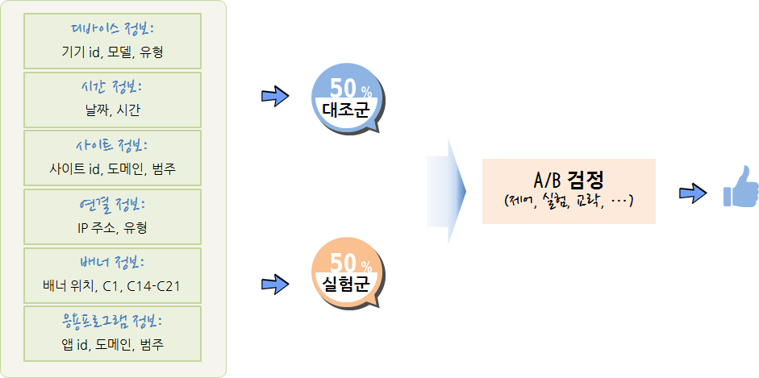

```{r, include=FALSE}
Sys.setlocale("LC_ALL", locale = "Korean")
source("tools/chunk-options.R")

knitr::opts_chunk$set(echo = TRUE, message=FALSE, warning=FALSE,
                      comment="", digits = 3, tidy = FALSE, prompt = TRUE, fig.align = 'center')

library(tidyverse)
library(CausalImpact)
library(xts)
library(lubridate)
```


# A/B 검정 {#ab-testing}

A/B 검정은 통계 가설 검정을 상업적 영역으로 확대한 것으로 구글에 의해 일반화 되었고,
2011년 기준 구글에서 7,000 가지가 넘는 A/B 검정을 돌리는 것으로 보고되고 있다.

웹사이트를 개발할 때, 두가지 실험군(treatment)과 대조군(control)으로 나눠 실험군에는 대조군과 한가지만 다른 설정을 하고 
유입되는 고객을 임의로 예를 들어 50:50으로 나눠 배치한다. 그리고 나서 CTR(Click-Through-Rate)을 비교하여 광고 연결률의 유의미한 차이를 검정한다.


## 왜 검정(Testing)을 할까? {#ab-testing-why}

좀더 나은 웹사이트, 광고 캠페인, 버튼 위치, 매출 전략등 다양한 아이디어가 많고, 특정 아이디어는 다른 아이디어 보다 더 좋다. 그럼 
특정 아이디어가 다른 아이디어보다 더 좋다는 것을 어떻게 선별할 수 있을까?

## A/B 검정 주제 선정 [^ab-testing-objectives] {#ab-testing-topic}

[^ab-testing-objectives]: [온라인 게임에서의 A/B 테스팅](http://boxnwhis.kr/2015/01/29/a_b_testing_online_games.html)

A/B 검정을 통한 전통적인 주제는 다음과 같다.

- 상품 종류, 가격, 위치 등 최적화
- 전자우편 메시지나 푸시 메시지의 제목/본문 등 설정 최적화
- 회원가입 양식, 주문 양식 등 각종 항목 순서 등 배치 최적화
- 웹사이트 네비게이션 UI 배치와 문구 등 설치 최적화
- 회원 가입, 구매 버튼의 위치, 색상, 문구 등 설정 최적화


게임에 있어 A/B 검정 최적화 주제로 검토가능한 것은 다음과 같다.

- MMORPG 게임에서 특정 재화를 투여할 경우 인플레이션이 발생할까?
- 적절한 아이템 드랍률은 얼마인가?
- 광고홍보 무료 아이템의 성능의 성능은 적절한가?
- 게임 스테이지별로 적절하게 난이도가 증가하고 있는가?
- 특정 던젼의 난이도는 다른 던젼과 비교하여 높은가?
- 레벨 설계에 고려되었던 특정 요소가 잘 반영되어 기대한 게임 패턴이 관측되는가?
- 매크로 지능이 설계한 것처럼 게임맵에서 동작하고 있는가?
- 게임 사용자 실력 평가 알고리즘이 적절한가?
- PvP 매칭 알고리즘이 적절한가?

## A/B 검정 작업흐름 {#ab-testing-workflow}

A/B 검정 작업흐름은 실험에 대한 주제선정과 새로운 아이디어를 도출하는 것부터 시작한다.
실험 실행을 하기 전에 먼저 "실험전 기준값 설정"과 필요한 검정력 분석도 사전에 실시해야 한다.
사전 준비가 끝나면 실험을 실행하고 나서 차곡차곡 쌓이는 데이터를 통해 실험결과를 통계적으로 분석해야 한다.
통계분석은 탐색적 데이터분석과 더불어 통계검정도 병행하여 실시한다. 
그리고 나서, 데이터 분석에 대한 결과를 통해 처음 생각해 낸 아이디어가 제대로 먹혔는지 반추하고 나서 
아이디어를 갱신한 후에 또 다른 실험을 기획한다. 
이 과정을 반복적으로 돌려 최선의 결과가 나오도록 과정을 반복한다.


## 광고 최적화 A/B 검정 {#ab-testing-ads-optimization}

효과적인 광고집행을 통해 사업목표 달성에 추진력을 갖을 수 있다. 온라인 사업분야에서 광고를 활용할 수 있는 도구는 단계별로 구분되어진다.

1. 노출횟수(Impression): 노출횟수를 늘려 브랜드를 각인시킨다. 다양한 조합을 통한 브랜드 각인 효과를 A/B 검정을 통해 확인한다.
1. 광고연계율(Click Trhough Ratio, CTR): 클릭율을 높일 수 있는 메시지 및 콘텐츠 최적화를 위해 A/B 검정을 수행한다.
1. 행동/설치 비용(Cost Per Action/Install, CPA/CPI): 클릭을 통해 유입된 고객의 전환율(Conversion Rate)을 높이기 위해 다양한 A/B 검정을 수행한다.
1. 광고비용 최적화: 주어진 전환율에 대한 광고집행 비용 최소화도 함께 진행한다.
1. 고객생애가치(Lifetime Value, LTV): 사용자로 등록되는 순간 고객생애가치를 극대화한다.

$LTV = \begin{equation}	\sum_{t=1}^{N} \frac{(R_t -C_t) \times r_t}{(1+i)^t} -\text{AC}	\end{equation}$


# A/B 검정 모형 {#ab-testing-theory}

## A/B 검정 구성요소 [^ctr-prediction] {#ab-testing-theory-component}

A/B 검정을 구성하는 요소는 다음과 같다.

- 측정단위: 사용자, 점포, 도시 등 
- 표본추출: 독립 임의화[랜덤화,확률화] 블록 설계를 통한 $t-$ 검정, 쌍체 $t-$ 검정
    - 실험군(50%)과 대조군(50%)
- 종속변수: 매출액, 광고 연결률 등 실험에서 확인하고자 하는 목표
- 독립변수: 종속변수에 영향을 주는 요인
    - 실험변수: 실험의 핵심 변수로 대조군에는 적용하지 않고, 실험군에만 적용되는 변수
    - 통제변수: 실험의 대표성을 높이기 위해 인구통제학적인, 환경적인 요인을 유사하게 맞춰주는 변수
    - 교략변수(Lurking, Confounding Varaible): 독립변수와 종속변수 모두 상관되는 외생 변수로, 
    아이스크림 판매량과 익사하는 사람수 관계(온도), 출생 순서와 다운증후군 연관성(산모 나이)을 예로 들 수 있다. 

## A/B 검정 변수 {#ab-testing-variable}

[^ctr-prediction]: [CLICK-THROUGH RATE PREDICTION – TOP-5 SOLUTION FOR THE AVAZU CONTEST](http://www.montis.pmf.ac.me/vol32/15.pdf)

광고 연결률(CTR, click through rates)을 예측하는데 디바이스, 날짜/시간, 웹사이트, 네트워크 연결, 배너 배치, 앱 정보등을 수집하여 이를 바탕으로 
광고 클릭을 연결과 실패로 구분하여 예측한다.



## 다중 슬롯머신 문제(MAB, Multi-Armed Bandit) [^mab-algorithm-blog] [^mab-oreilly] [^google-mab] {#ab-testing-theory-bandit}

[^mab-algorithm-blog]: [A/B 테스트를 보완하는 Multi-Armed Bandit(MAB) 알고리즘](http://hub.zum.com/kimws/2586)
[^mab-oreilly]: [OReilly Webcasts: Bandit Algorithms for The Web](https://www.youtube.com/watch?v=BIP-VtmW_9M)
[^google-mab]: [다중 슬롯머신 실험](https://support.google.com/analytics/answer/2844870?hl=ko&ref_topic=1745207)

카지노에 슬롯머신이 쭉 배치되어 있는데, 각 슬롯머신 별로 승률이 달리 정해져 있지만 승률은 알지 못한다.
한정된 예산을 가지고 가장 많은 돈을 벌기 위해서 어떤 전략을 취하면 될까?
결국 탐색과 획득 딜레마(Explore/Exploit Dilemma)를 통해 우선 가장 승률이 좋은 슬롯머신을 찾아내는 과정과 
본격적으로 돈을 버는 과정을 거치게 된다. 
한정된 탐색과 획득과정 모두 비용과 시간이 들여 가장 많은 돈을 벌게 되는 최적화 문제를 푸는 것으로 귀결된다.

### 용어 정의 {#ab-testing-theory-bandit-terminology}

- Arm: 검정하고자 하는 아이디어 한개
- 밴딧(Bandit): 검정하고자 하는 아이디어 묶음
- Pull/Play/Trial: 아이디어 시험 한번
- 보상(Reward): 시험 후에 측정되는 결과값

2차 세계대전 당시 다중 슬롯머신 문제가 매우 중요하지만 수학적으로 어려워서 이 문제를 잘 정리해서 
독일에 전달하여 연구자원을 분산시키자고 Peter Whittle이 주장하기도 했다. 
하지만, 오프라인에서는 탐색 비용이 매우 커서 비현실적이지만, 온라인 인터넷서비스에서는 
상대적으로 비용이 적게 소요되어 **밴딧 알고리즘**이 A/B 검정의 한계를 극복하는 대안으로 
구글, 야후 등에서 활발히 활용되고 있다. 밴딧 알고리즘은 실시간 온라인 학습(Online learning) 알고리즘이면서
동시에 강화학습과 같이 액티브 학습(Active Learning) 알고리즘이기도 하다.


### A/B 검정과 MAB {#ab-testing-theory-bandit-comp}

머릿속으로 그리는 A/B 검정은 기존 A안에 새로운 대안을 넣어 그것이 더 좋은 결과를 얻은 경우 새로운 대안을 취하고,
B안이 더 좋지 못한 결과를 얻게 되었을 경우 다시 A안으로 회귀하는 것이지만,
A/B 검정 결과 더 좋은 것으로 나온 실험결과가 실제로 적용했을 경우 더 좋지 못한 결과가 되기도 한다.
MAB 알고리즘은 A/B 검정과 달리 연속적으로 가장 좋은 대안을 찾아가는 방법론을 제시하고 있다. 


# A/B 검정 효과 분석 [^google-causal-impact] [^google-causal-impact-paper]

[^google-causal-impact]: [CausalImpact](http://google.github.io/CausalImpact/CausalImpact.html)
[^google-causal-impact-paper]: [Inferring causal impact using Bayesian structural time-series models](http://research.google.com/pubs/pub41854.html)

A/B 검정의 효과를 베이지안 시계열 팩키지를 활용하여 계량화한다. 
[CausalImpact](https://github.com/google/CausalImpact) 팩키지에 나온 예제는 ARIMA 모형에서 표본을 추출하여 
'2014-01-01' 이후 100일을 기간으로 놓고, 70 일을 사전 기간, 30 일을 사후 기간을 비교하여 `CausalImpact` 함수에 넣어
A/B 검정 사전,사후 기간 효과를 시각화하고 보고서로 요약한다.


``` {r ab-testing-causal-impact}
# 0. 환경설정----------------------------------------------
# install.packages("BoomSpikeSlab") # CausalImpact 의존성으로 사전 설치
# devtools::install_github("google/CausalImpact")
library(CausalImpact)
library(xts)

# 1. 데이터 생성----------------------------------------------
set.seed(1)
x1 <- 100 + arima.sim(model = list(ar = 0.999), n = 100)
y <- 1.2 * x1 + rnorm(100)
y[71:100] <- y[71:100] + 10
data <- cbind(y, x1)

time_points <- seq.Date(as.Date("2014-01-01"), by = 1, length.out = 100)
data_zoo <- zoo(data, time_points)

head(data_zoo)

# 2. A/B 검정 기간 설정----------------------------------------------
pre_period <- as.Date(c("2014-01-01", "2014-03-11"))
post_period <- as.Date(c("2014-03-12", "2014-04-10"))

# 3. A/B 검정 효과 분석----------------------------------------------
impact <- CausalImpact(data_zoo, pre_period, post_period)
plot(impact)

summary(impact, "report")
```

# A/B 검정 사례연구 {#ab-testing-case-study}

## 웹사이트와 데이터 {#ab-testing-case-study-site}

웹사이트(예를 들어, http://www.korea.me)에서 많은 방문을 유도하고자 웹사이트 시안에서 고양이 사진과 강아지 사진을 
두고 A/B 검정을 수행할 수 있다. 모든 조건이 동일하고 웹사이트에서 사진만 달리하고 이를 한동안 실험을 지속한다.


특정일을 기준으로 사용자별로 체류시간을 총합내고 `좋아요`, `공유`, `기사` 클릭을 했는지 기록한다.
또한, `체류시간`과 교락요인(Confounding effect)와 부작용(Side effect) 측정을 위해서 페이지 로딩시간과 
체류시간도 함께 기록한다.
이를 바탕으로 A/B 검정의 효과를 추정한다.

``` {r ab-testing-case-study-data}
# 0. 환경설정 ----
library(tidyverse)
library(DT)
library(lubridate)
library(extrafont)
library(broom)
loadfonts()

# 1. 데이터 ----
ab_df <- read_csv("data/website_sample.csv")

ab_df %>% 
  sample_n(10) %>% 
  datatable()
```


## 탐색적 데이터 분석 {#ab-testing-case-study-trend}

월별 좋아요 클릭율 (`like_click`)을 산출하고 이를 시각화하여 추세를 살펴본다.


``` {r ab-testing-case-study-data-trend}
# 2. 탐색적 데이터 분석 ----

ab_df %>% 
  mutate(day = day(date)) %>% 
  group_by(day) %>% 
  summarise(conversion = mean(like)) %>% 
  ggplot(aes(x=day, y=conversion)) +
  geom_line() +
  geom_point(size=2) +
  scale_y_continuous(limits = c(0,0.2), labels = scales::percent) +
  labs(x="일자별", y="전환율(%)", title="강아지/고양이 사진 A/B 검정 일별 전환율 추세",
       color="A/B검정") +
  theme_minimal(base_family = "NanumGothic")

```


## A/B 검정 - 범주형 {#ab-testing-case-study-testing}

한달 동안 실험한 데이터를 불러와서 실험군(test)과 대조군(control) 유의적인 차이가 있는지 즉, 개와 고양이를 바꾼 사진의
차이가 전환율을 높이는데 기여를 했는지 통계적 데이터 분석을 통해 확인한다.

### A/B 검정 - 기술통계 {#ab-testing-case-study-testing-descriptive}

실험군(test)과 대조군(control) 두 집단을 담고 있는 `testing`에 따라 전환율을 산출해본다.


``` {r ab-testing-experiment-data-analysis-descriptive}
# 3. A/B 검정: 범주형 -----
## 3.1. 기술 통계량 -----
ab_df %>% 
  group_by(testing) %>% 
  summarise(conversion = mean(like)) 
```


### A/B 검정 - 시각화 {#ab-testing-case-study-testing-viz}

실험군(test)과 대조군(control) 두 집단을 담고 있는 `testing`에 따라 전환율을 
일자별로 시각화해서 시각으로 다시 한번 확인한다.


``` {r ab-testing-experiment-data-analysis-viz}
## 3.2. 시각화 -----
ab_df %>% 
  mutate(day = day(date)) %>% 
  group_by(day, testing) %>% 
  summarise(conversion = mean(like)) %>% 
  ggplot(aes(x=day, y=conversion, color=testing, group=testing)) +
  geom_line() +
  geom_point(size=2) +
  scale_y_continuous(limits = c(0,1), labels = scales::percent) +
  labs(x="일자별", y="전환율(%)", title="강아지/고양이 사진 A/B 검정 일별 전환율 추세",
       color="A/B검정") +
  theme_minimal(base_family = "NanumGothic")
```


### A/B 검정 - 통계검정 {#ab-testing-case-study-testing-testing}

`t.test()` 함수로 통계검정을 수행해도 되지만, 일반화 선형모형(GLM)을 통해 
두집단간의 차이가 유의적인 차이가 있는지를 확인한다.

``` {r ab-testing-experiment-data-analysis-testing}
## 3.3. 통계검정 -----

glm(like ~ testing, family = "binomial", data = ab_df) %>%
  tidy()
```

## A/B 검정 - 연속형 {#ab-testing-case-study-testing-continuous}

좋아요, 공유, 해당 글을 클릭했는지 않았는지 못지않게 페이지 체류시간 혹은 결재금액 등 연속형 변수를 
검정하는 경우도 있다. 두집단일 경우 `t.test` 혹은 동일집단 A/A 검정일 경우 짝(paired) t-검정이 되기도 하고, 
실험을 두개이상 진행하는 경우 분산분석 모형이 되기도 하지만 동일하게 일반화 선형모형을 사용한다.

### A/B 검정 - 기술통계 {#ab-testing-case-study-testing-descriptive-cont}

실험군(test)과 대조군(control) 두 집단을 담고 있는 `testing`에 따라 전환율을 산출해본다.


``` {r ab-testing-experiment-data-analysis-descriptive-cont}
# 4. A/B 검정: 연속형 -----
## 4.1. 기술 통계량 -----
ab_df %>% 
  group_by(testing) %>% 
  summarise(time_spent = mean(time_spent)) 
```


### A/B 검정 - 시각화 {#ab-testing-case-study-testing-viz-cont}

실험군(test)과 대조군(control) 두 집단을 담고 있는 `testing`에 따라 체류시간변화를 
일자별로 시각화해서 시각으로 다시 한번 확인한다.


``` {r ab-testing-experiment-data-analysis-viz-cont}
## 4.2. 시각화 -----
ab_df %>% 
  mutate(day = day(date)) %>% 
  group_by(day, testing) %>% 
  summarise(time_spent = mean(time_spent))%>% 
  ggplot(aes(x=day, y=time_spent, color=testing, group=testing)) +
  geom_line() +
  geom_point(size=2) +
  labs(x="일자별", y="체류시간(분)", title="강아지/고양이 사진 A/B 검정 일별 체류시간",
       color="A/B검정") +
  theme_minimal(base_family = "NanumGothic")
```


### A/B 검정 - 통계검정 {#ab-testing-case-study-testing-testing-cont}

범주형 변수에 대한 회귀분석 대신 연속형 변수 체류시간(`time_spent`)에 대한 회귀분석을 실시한다.  

``` {r ab-testing-experiment-data-analysis-testing-cont}
## 4.3. 통계검정 -----

glm(time_spent ~ testing, family = "gaussian", data = ab_df) %>%
  tidy()
```  
