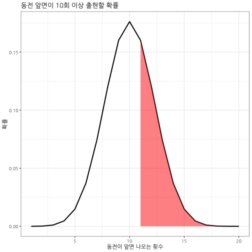

# 데이터 과학 -- 기초 통계

## 1. 베르누이 분포 [^bernoulli-wiki] [^wikibooks-bernoulli] {#bernoulli}

[^bernoulli-wiki]: [Bernoulli distribution](https://en.wikipedia.org/wiki/Bernoulli_distribution)
[^wikibooks-bernoulli]: [R Programming/Probability Functions/Bernoulli](https://en.wikibooks.org/wiki/R_Programming/Probability_Functions/Bernoulli)

베르누이 시행은 일반적으로 "성공", "실패"처럼 두가지 중 하나의 결과만 갖는다.
따라서 추정해야 되는 모수는 성공 확률 $p$, 반대로 실패는 $1-p$로 정의된다.

- 동전을 던졌을 때 동전 앞면이 나왔을 때 성공이라고 하면 "앞면"="성공"=1, 
"뒷면"="실패"=0 으로 표현할 수 있다.
- 일정거리를 두고 특수 제작된 총으로 사격훈련을 할 때 표적에 총격을 가할 때, "명중"="성공"=1, "빗나감"="실패"=0 으로 표현할 수 있다.

### 1.1. 베르누이 분포를 수식으로 표현

확률질량함수와 분포함수, 그리고 평균과 분산은 다음과 같이 수식으로 표현할 수 있다.

- 확률질량함수(Probability Mass Function)
  $$f(x) = dbinom(x,1,p) = 
  \begin{cases}
   p          & \text{if } x = 1 \\
   1-p        & \text{if } x = 0 \\
   0          & \text{상기 경우 외}
  \end{cases}$$
- 분포함수(Distribution Function)
  $$f(x) = pbinom(x,1,p) = 
  \begin{cases}
   0          & \text{if } x < 0 \\
   1-p        & \text{if } 0 	\leq x < 1 \\
   1          & \text{if } 1 	\leq x
  \end{cases}$$
- 평균: $E(x) = p$
- 분산: $Var(x) = p \times (1-p)$

### 1.2. 프로그램 R 코드로 표현

베르누이 확률분포를 적용가능한 상황을 살펴봤고, 수식으로 표현했다면 R 코드로 구현해 본다.
R에서 기본함수로 내장되어 있어 별도 프로그램 구현은 생략하고 사용법만 확인해보자

- dbinom(x, size, prob): 밀도함수
- pbinom(x, size, prob): 누적 분포함수
- qbinom(p, size, prob): 분위수 함수
- rbinom(n, size, prob): 난수 생성

네가지 함수에 입력값으로 들어가는 매개변수는 다음과 같다.
- $x$: 벡터
- $size$: 시행횟수
- $prob$: 확률
- $p$: 확률벡터
- $n$: 관측점 갯수

베르누이 확률분포는 이항분포의 특수한 경우로 `rbinom` 함수를 통해 계산할 수 있다.
`rbinom(1,1,0.5)`는 동전던지는 경우를 표현한 것으로 앞면이 나올 확률을 0.5로 지정하고 
성공은 1, 실패는 0으로 각기 정의해서 하나를 뽑아본다. 매번 `rbinom(1, 1, 0.5)` 코드를 돌리기 번거럽기 때문에 `replicate` 함수를 통해 반복적으로 뽑아내거나, `10`을 벡터값으로 전달하여 10개 난수를 뽑아낸다.

~~~{.r}
# 1. 베르누이 분포 -------------------
rbinom(1, 1, 0.5)
~~~

~~~{.output}
[1] 1

~~~

~~~{.r}
replicate(10, rbinom(1, 1, 0.5))
~~~

~~~{.output}
 [1] 0 0 1 0 0 1 0 0 1 1

~~~

~~~{.r}
rbinom(10, 1, 0.5)
~~~

~~~{.output}
 [1] 0 0 1 1 1 0 0 0 1 1

~~~

1, 0 이 컴퓨터가 인식하기 좋은 숫자라 사람이 이해가능한 방식으로 코드를 작성하면 다음과 같다. 

~~~{.r}
## 1.1. 동전 던지기
rbinom(100, 1, 0.5)
~~~

~~~{.output}
  [1] 0 1 1 1 1 0 1 0 0 1 0 1 1 1 0 1 0 1 1 0 0 0 0 1 0 0 0 1 0 1 0 1 1 0 0
 [36] 1 0 0 1 1 0 1 1 1 1 0 0 0 0 0 0 1 1 0 0 0 1 0 1 1 1 0 0 0 0 0 1 0 0 1
 [71] 0 1 0 0 1 1 1 1 0 0 0 0 0 1 0 0 0 0 0 0 1 1 0 1 1 1 0 1 0 0

~~~

~~~{.r}
(coin_toss <- sample(c("앞면", "뒷면"), 100, replace=TRUE, prob=c(0.5, 0.5)))
~~~

~~~{.output}
  [1] "앞면" "뒷면" "앞면" "뒷면" "뒷면" "앞면" "뒷면" "뒷면" "앞면" "앞면"
 [11] "뒷면" "뒷면" "뒷면" "앞면" "앞면" "뒷면" "앞면" "앞면" "뒷면" "뒷면"
 [21] "앞면" "뒷면" "앞면" "뒷면" "뒷면" "앞면" "뒷면" "앞면" "뒷면" "앞면"
 [31] "뒷면" "앞면" "뒷면" "뒷면" "앞면" "뒷면" "뒷면" "뒷면" "뒷면" "뒷면"
 [41] "앞면" "뒷면" "뒷면" "뒷면" "앞면" "앞면" "뒷면" "앞면" "뒷면" "앞면"
 [51] "앞면" "앞면" "앞면" "뒷면" "앞면" "앞면" "앞면" "앞면" "뒷면" "앞면"
 [61] "뒷면" "뒷면" "뒷면" "앞면" "뒷면" "뒷면" "앞면" "뒷면" "앞면" "뒷면"
 [71] "뒷면" "앞면" "뒷면" "뒷면" "뒷면" "앞면" "뒷면" "뒷면" "앞면" "앞면"
 [81] "뒷면" "뒷면" "뒷면" "뒷면" "앞면" "뒷면" "앞면" "앞면" "앞면" "앞면"
 [91] "뒷면" "앞면" "앞면" "뒷면" "뒷면" "앞면" "뒷면" "뒷면" "뒷면" "앞면"

~~~

~~~{.r}
table(coin_toss)
~~~

~~~{.output}
coin_toss
뒷면 앞면 
  55   45 

~~~

예를 들어 KBO 한국시리즈에 한시즌 100번 타석에 들어선 선수가 있는데 타율이 3할이라고 하자.
이 선수는 100번 들어서면 30번 안타를 치고 70번 범타로 물러난다.
평균과 분산은 R에서 `TRUE`는 1, `FALSE`는 0으로 처리하는 방식을 활용하여 쉽게 계산할 수 있다.

~~~{.r}
## 1.2. 타자
rbinom(100, 1, 0.3)
~~~

~~~{.output}
  [1] 0 0 0 0 0 0 0 1 1 0 0 0 0 0 0 1 1 1 1 1 1 1 1 0 1 0 1 1 0 1 0 0 1 1 0
 [36] 0 0 1 0 0 0 0 0 0 0 0 1 0 0 1 0 1 1 0 0 0 1 1 0 0 1 0 1 0 0 1 0 0 0 1
 [71] 1 1 0 1 0 0 1 0 0 0 0 1 1 0 1 1 0 0 1 0 0 0 0 1 1 0 0 0 1 0

~~~

~~~{.r}
hitter <- sample(c("안타", "범타"), 100000, replace=TRUE, prob=c(0.3, 0.7))
mean(hitter=="안타")
~~~

~~~{.output}
[1] 0.29955

~~~

~~~{.r}
var(hitter=="안타")
~~~

~~~{.output}
[1] 0.2098219

~~~

## 2. 이항분포 [^binomial-wiki] {#binomial}

[^binomial-wiki]: [Binomial distribution](https://en.wikipedia.org/wiki/Binomial_distribution)

베르누이 시행을 반복한 것을 이항분포로 간주할 수 있다.
동전을 10번 던져 앞면이 1번 나올 확률을 계산해본다. 
`dbinom()` 함수를 사용해서 확률을 계산할 수도 있지만, 
`rbinom()` 함수로 난수를 뽑아내서 1이 나온 경우를 평균내면 확률을 계산할 수 있다.

~~~{.r}
dbinom(1, 10, 0.5)
~~~

~~~{.output}
[1] 0.009765625

~~~

~~~{.r}
mean(rbinom(100000, 10, 0.5) == 1)
~~~

~~~{.output}
[1] 0.00986

~~~

### 2.1. 이항분포 수식

이항분포는 $n$번 시행하여 성공확률 $p$를 갖고 $k$번 성공할 경우 다음과 같이 표현할 수 있다.
$\binom n k =\frac{n!}{k!(n-k)!}$은 이항계수로 수식으로 간략히 표현하면 다음과 같다.

$$Pr(k;n,p) = \Pr(X = k) = {n\choose k}p^k(1-p)^{n-k}$$
이항분포 평균과 분산은 다음과 같이 계산된다.

- 평균: $\mu = np$
- 분산: $\sigma^2 = np(1-p)$

### 2.2. 이항분포 R 코드

공정한 동전으로 앞면이 나올 확률이 50%인 동전을 25번 던져 앞면이 평균적으로 얼마나 나올 것인가?
수식으로 표현하면 $\mu = np$가 되어, $25 \times 0.5 = 12.5$가 되는데 이를 확률 50% 동전을 100,000 번 던지는  난수를 뽑아 계산하면 근사적으로 유사하게 나온다. 분산도 수식으로 표현하면 $\sigma^2 = np(1-p)$이 되고, 수치적으로 계산하면 $25 \times 0.5 \times (1-0.5) = 6.25$가 된다. 물론 난수를 뽑아 계산해도 이론값에 근사하게 나타난다.

~~~{.r}
# 2. 평균과 분산
25 * 0.5
~~~

~~~{.output}
[1] 12.5

~~~

~~~{.r}
25 * 0.5 * (1 - 0.5)
~~~

~~~{.output}
[1] 6.25

~~~

~~~{.r}
mean(rbinom(100000, 25, 0.5))
~~~

~~~{.output}
[1] 12.49846

~~~

~~~{.r}
var(rbinom(100000, 25, 0.5))
~~~

~~~{.output}
[1] 6.239537

~~~

### 2.3. 이항분포 시각화

공정한 동전을 던져 10번 이상 앞면이 나올 확률은 어떻게 될까? 
이론적으로 `pbinom()` 함수를 사용해서 누적확률을 계산하면 된다. 하지만 10이상 앞면이 나와야 하니 전체 확률에서 10번보다 적게 나온 누적확률을 빼야한다.

~~~{.r}
df <- data.frame(x=1:20, prob=dbinom(1:20, 20, prob=0.5))

DT::datatable(df) %>% 
  DT::formatRound(c("prob"), digits=5)
~~~

<!--html_preserve-->

<!--/html_preserve-->

~~~{.r}
ggplot(data=df, aes(x=x, y=prob)) + 
  geom_line(size=1) +
  geom_ribbon(data=subset(df, x > 10), 
              aes(ymax=prob),ymin=0,
              fill="red", colour = NA, alpha = 0.5) +
  theme_bw(base_family = "NanumGothic") +
  labs(x="동전이 앞면 나오는 횟수", y="확률", title="동전 앞면이 10회 이상 출현할 확률")
~~~

~~~{.r}
1 - pbinom(10, 20, 0.5)
~~~

~~~{.output}
[1] 0.4119015

~~~

~~~{.r}
mean(rbinom(100000, 20, 0.5) > 10)
~~~

~~~{.output}
[1] 0.41137

~~~

~~~{.r}
df %>% filter(x>10) %>% 
  summarise(over_10 = sum(prob))
~~~

~~~{.output}
    over_10
1 0.4119015

~~~

