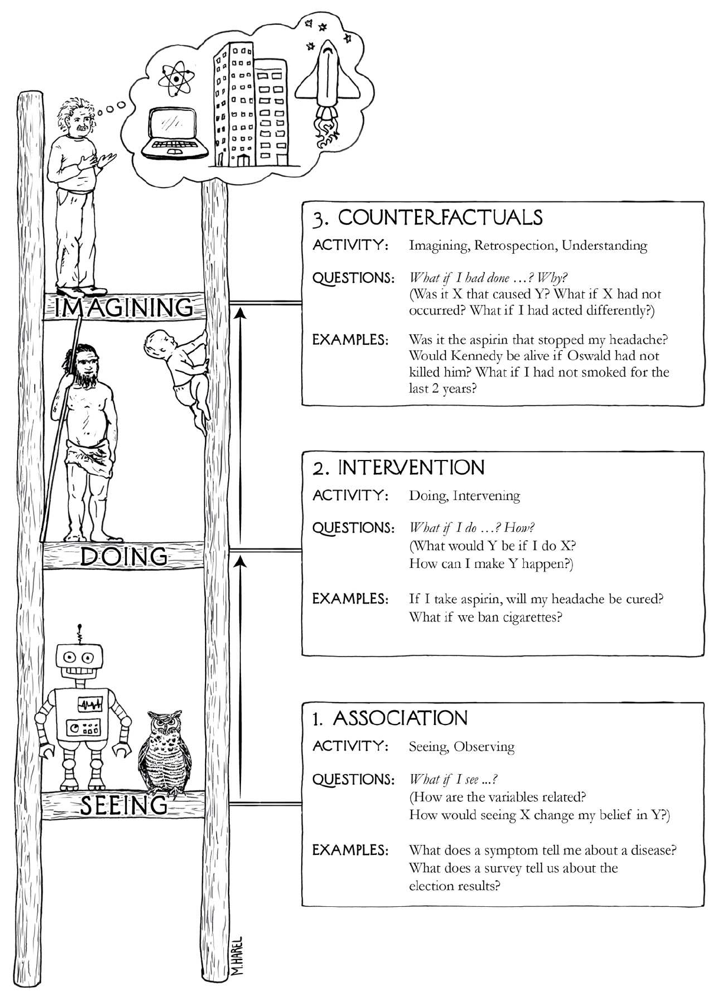
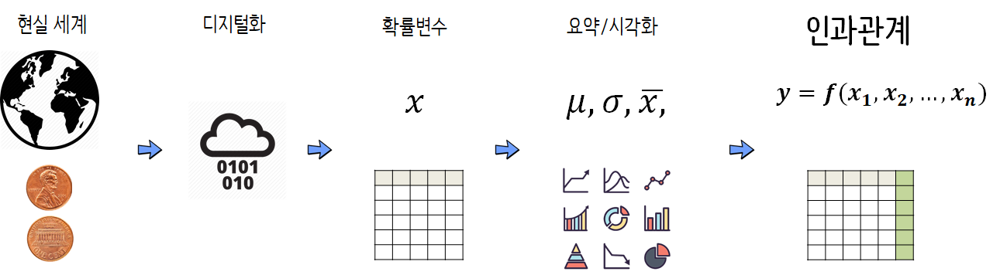

``` {r, include=FALSE}
source("tools/chunk-options.R")
knitr::opts_chunk$set(echo = TRUE, warning=FALSE, message=FALSE)

library(tidyverse)
library(stringr)
library(DT)
library(ggthemes)
library(extrafont)
loadfonts()

options(scipen = 999)
options(dplyr.width = 120)
options(dplyr.print_max = 1e9)
```

# 인과관계 사다리 [^the-why-book] {#ladder-of-causation}

[^the-why-book]: [Pearl, Judea and Mackenzie, Dana (2018), "The book of why: the new science of cause and effect", Basic Books](http://cdar.berkeley.edu/wp-content/uploads/2017/04/Lisa-Goldberg-reviews-The-Book-of-Why.pdf)

Judea Pearl 교수는 인과관계(Causation) 사다리를 통해 관찰하는 것(Seeing)은 Assocation으로 가장 낮은 단계로 정의했고, 그 상위단계로 실험/행동(doing) 단계로 Intervention을 중간단계, 그리고 마지막으로 상상(Imagining)하는 것으로 Counterfactuals, 즉 "조건법적 서술"을 최상위단계로 정의하였다.



# 현실세계와 인과관계 {#realworld-data-causality}

현재시점(2020년) 가장 큰 이슈는 거대 담론으로 코로나-19로 인한 사회적 거리두기와 포스트 코로나 경제체계에 관심이 많다. 가장 가까이는 기본재난소득에 대한 검증되지 않은 효과와 경제살리기에 대한 인과관계가 커다란 관심사다. 이를 다음과 같이 도식화 시키게 되면, 동전던지기는 어떻게 보면 기본재난소득이라는 실험으로 볼 수 있고 이것이 확률변수를 통해 수학적 토대를 갖게 되고 디지털화(digitization)되어 인과관계를 추론할 수 있는 다수 방법론으로 이어지고 결론에 이르게 된다.




# 실험과 관찰 [^coursera-doe] {#experiment-vs-observation}

[^coursera-doe]: [Designing, Running, and Analyzing Experiments](https://www.coursera.org/learn/designexperiments)

김재광 교수님께서 실험 데이터와 관찰 데이터에 대한 차이를 페이스북 담벼락에 사례와 함께 잘 정리해 주셨습니다.

실험 데이터와 관찰 데이터를 구분하는 것은 통계학에서는 가장 기본적인 내용입니다. 
실험은 분석보다는 설계가 어렵고 관찰은 분석이 어렵습니다. 
관찰에서 분석이 어려운 이유는 **중첩요인(confounding factor)**이 존재하기 때문입니다. 
(예를 들어 커피를 마시는 사람들이 암발병률이 높은데 이는 커피 때문이 아니라 커피를 마시는 사람들이 담배를 피우는 경향이 높기 때문입니다. 
  따라서 담배 피는지 여부를 포함해서 분석해야 올바른 결론이 나옵니다.) 
즉, 중첩요인(Confounding factor)을 모형에 포함시켜서 보정해주어야 인과관계에 대해 보다 정확한 결론을 얻을수 있는데, 
문제는 현실적으로 중첩요인을 모두 관측하지 못한다는 것입니다. 
따라서, 중요한 중첩요인을 빼놓고 분석을 하면 잘못된 결론을 얻습니다. 
그래서 과학은 진리라기 보다는 해석에 가깝다고 이야기 할수 있을 것입니다. 
데이터를 바탕으로하고 주관을 최대한 배제한 해석인 것입니다.

<iframe src="https://www.facebook.com/plugins/post.php?href=https%3A%2F%2Fwww.facebook.com%2Fjaekwang.kim.125%2Fposts%2F1856505211031977&width=500" width="500" height="382" style="border:none;overflow:hidden" scrolling="no" frameborder="0" allowTransparency="true"></iframe>

1. 의학적 지식은 종종 업데이트 된다. 술이 몸에 나쁘다고 했다가 한두잔은 괜찮다고 했다가 또 그것 틀렸다고 했다가 자꾸 바뀐다. 또 물도 많이 먹는게 좋다고 했다가 아니라고 했다가 자꾸 헷갈리게 한다. 왜 그럴까?
1. 두가지 이유를 생각해 볼수 있는데 하나는 관찰연구의 한계이다. 
인간을 대상으로는 통제된 실험을 하기 어렵다. (인권 문제 등등 때문에.) 따라서 많은 결론들이 실험이 아닌 관찰 연구 (observational study)를 통해서 얻어지기 때문에 관찰 연구의 한계가 적용된다. 
관찰 연구로는 원칙적으로 인과 관계를 규명하는 것이 불가능하다. (그때문에 논문이 자꾸 나올수 있는지도 모르겠다.)
1. 다른 또 하나의 이유는 인간의 생물학적 다양성 때문이다. 
인간으로부터 얻어지는 자료는 물리적 자료와는 근본적인 차이가 있는데 그건 같은 인간 종족 내에서도 엄청난 다양성이 있다는 것이다. 기계에서 얻어지는 물리적 자료는 기본적으로 동질적이다. (이는 물리학이나 공대에서 통계학을 우습게 보는것과도 연결되어 있다. physical 한 물질을 대상으로 하는 자료는 샘플링이 필요없다. 자료가 어차피 동질적이므로. ) 하지만 생물학 자료는 그렇지 않다. 똑같은 부모 밑에서도 엄청 다른 자녀가 탄생한다.
1. 따라서 인간을 대상으로 관찰을 하고 이를 통해 일반화를 하는 모든 지식은 어느 정도 한계가 있다는 것을 감안해서 받아 들어야한다. 측정기술이 발달하면 예전에 맞는 것으로 믿어졌던 이론이 틀린 것으로 밝혀진다. 절대적인 지식이 아니라는 것이다. 뇌과학 이런것도 마찬가지.
