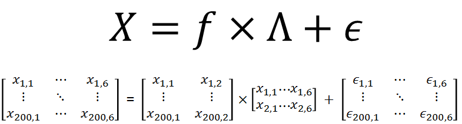

``` {r, include=FALSE}
source("tools/chunk-options.R")
knitr::opts_chunk$set(echo = TRUE, warning=FALSE, message=FALSE,
                    comment="", digits = 3, tidy = FALSE, prompt = TRUE, fig.align = 'center')

```

# 요인분석(factor analysis) [^factor-analysis-fit-measure] [^factor-analysis-namu] [^factor-analysis-simulation] {#factor-analysis}

[^factor-analysis-simulation]: [StackExchange - Looking for a step through an example of a factor analysis on dichotomous data (binary variables) using R](https://stats.stackexchange.com/questions/31948/looking-for-a-step-through-an-example-of-a-factor-analysis-on-dichotomous-data)

[^factor-analysis-fit-measure]: [David A. Kenny (November 24, 2015), "Measuring Model Fit"](http://davidakenny.net/cm/fit.htm)

[^factor-analysis-namu]: [요인분석 - 나무위키](https://namu.wiki/w/%EC%9A%94%EC%9D%B8%20%EB%B6%84%EC%84%9D)

1904년에 찰스 스피어만(C.Spearman)에 의해 개발되었으며, 어떤 변인 (질문 문항, 측정 대상)들 간에 공통적인 요인이 있다고 가정하고, 
그 변수들 간의 상호 관련성을 소수의 잠재 요인으로 집약하는 방법이다.

$$X = \Lambda f + \epsilon$$

## 요인분석 데이터 생성{#factor-analysis-simulate-data}



- `X_mat` : $N \times P$ 행렬($200 \times 6$)
- `lambda`: $\Lambda$, 요인적재(factor loading) $P \times Q$ 행렬($6 \times 2$)
- `FF`: 요인점수(Factor Score), $N \times Q$ 행렬($200 \times 2$) 행렬.
- `E`: 오차 행렬, $N \times P$ 행렬($200 \times 6$)

```{r factor-analysis-simulation}
# 0. 환경설정 -----
library(tidyverse)
library(psych)
library(GPArotation)
library(mvtnorm)

# 1. 요인분석 데이터 생성 -----

N <- 200
P <- 6
Q <- 2
lambda <- matrix(c(0.7,-0.4, 0.8,0, -0.2,0.9, -0.3,0.4, 0.3,0.7, -0.8,0.1),
                  nrow=P, ncol=Q, byrow=TRUE)

FF <- rmvnorm(N, mean = c(5, 15), sigma=diag(Q)) # 요인점수(factor score)
E  <- rmvnorm(N, mean = rep(0, P), sigma=diag(P))
X_mat  <- FF %*% t(lambda) + E
```

## 모의실험 요인분석 {#factor-analysis-simulate-data-fa}

가장 먼저 요인 갯수를 선정한다. 이를 위해서 `scree()` 함수를 사용해서 팔꿈치가 꺾어지는 지점 요인 2개로 선정한다.

```{r fa-simulated-data}
# 2. 요인분석 -----
## 2.1. 요인수 결정 -----
X_cor <- cor(X_mat, use = "pairwise.complete.obs")

scree(X_cor, factors = FALSE)
```


`psych` 팩키지 `fa()` 함수를 사용해서 `nfactors=2`로 지정한 후에 요인분석 모형 적합을 시도한다.
RMSEA, TLI 값을 통해 적합성을 확인한다.

```{r fa-simulated-data-fit}
## 2.2. 요인분석 모형 적합 -----

X_fa <- fa(X_mat, nfactors=2, n.obs=N, rotate="varimax")

X_fa$RMSEA
X_fa$TLI
```

`fa.plot()` 함수를 통해 6개 변수를 2개 요인으로 축약하는데 각 변수별 요인에 대한 기여분을 시각화한다.

```{r fa-simulated-data-fit-loading}
## 2.3. 요인분석 모형 -----
fa.plot(X_fa)

print(X_fa$loadings, cutoff = 0.2)
```


커뮤니케이션을 위해서 측정변수와 요인(Factor)의 관계를 시각적으로 표현한다.

```{r fa-simulated-data-fit-communication}
colnames(X_fa$loadings) <- c("FactorA", "FactorB")

fa.diagram(X_fa)
```

# 요인분석 사례 {#factor-analysis-case-study}

[Exploratory Factor Analysis in R](https://www.promptcloud.com/blog/exploratory-factor-analysis-in-r/) 요인분석에 사용된 사례를 준용하여 
자동차 구입에 중요한 요인을 추출해보자.

## 자동차 설문 데이터 {#factor-analysis-case-study-data}

탐색적 요인분석을 위한 데이터를 다운로드해서 살펴본다.
[EFA.csv](https://www.promptcloud.com/wp-content/uploads/2017/02/EFA.csv) 파일을 다운로드 받아 로컬 파일에 저장하는 것도 가능하고,
아니면 직접 `read_csv()` 함수로 데이터를 가져온다.

``` {r fa-car-data}
# 0. 환경설정 -----
library(tidyverse)
library(psych)
library(GPArotation)

# 1. 데이터 -----
download.file(url="https://www.promptcloud.com/wp-content/uploads/2017/02/EFA.csv", destfile = "data/EFA.csv")

car_df <- read_csv("https://www.promptcloud.com/wp-content/uploads/2017/02/EFA.csv")
DT::datatable( options = list(scrollX = TRUE), car_df)
```

## 요인수 결정 {#factor-analysis-case-study-number-factor}

요인분석에서 가장 답이 없지만 중요한 방식이 적정한 요인수를 결정하는 것이다.
원데이터에서 상관관계 행렬을 추출한 후에 `scree()` 함수로 요인수를 결정하거나,
`fa.parallel()` 함수를 활용해서 적절한 요인수를 결정한다. 시각적으로 2~5개 요인이 적절해 보인다.

``` {r fa-car-decide-factor-number}
# 2. 요인분석 -----
## 2.1. 요인수 결정 -----
### 2.1.1. 탐색적 요인수 결정 -----
car_cor <- cor(car_df, use = "pairwise.complete.obs")
scree(car_cor, factors = FALSE)

car_parallel <- fa.parallel(car_df, fm = 'minres', fa = 'fa')
```

시각적인 방식을 참조하여 잠정적인 요인수를 결정하고 나서,
각 요인수에 맞춰 요인분석을 실행한 후에 `anova()` 함수로 요인수에 따른 모형의 차이가 있는지 검정한다.
4개 요인이 적절해 보인다.

``` {r fa-car-decide-factor-number-stat}
### 2.1.2. 요인 수 결정 -----
car_two_fa   <- fa(car_df, nfactors=2, n.obs=N, rotate="varimax")
car_three_fa <- fa(car_df, nfactors=3, n.obs=N, rotate="varimax")
car_four_fa  <- fa(car_df, nfactors=4, n.obs=N, rotate="varimax")
car_five_fa  <- fa(car_df, nfactors=5, n.obs=N, rotate="varimax")

anova(car_two_fa, car_three_fa)
anova(car_three_fa, car_four_fa)
anova(car_four_fa, car_five_fa)
```


## 요인분석 적합 {#factor-analysis-case-study-fit}

요인 4개를 선정한 모형을 최종모형으로 하고 `RMSEA`, `TLI` 지표를 바탕으로 탐색적 요인분석 모형의 적합성을 확인한다.

``` {r fa-car-decide-factor-fit}
## 2.2. 요인모형 적합 -----
car_fa <- fa(car_df, nfactors = 4, rotate = "oblimin", fm="minres")

car_fa$RMSEA
car_fa$TLI
```

## 요인분석 커뮤니케이션 {#factor-analysis-case-study-communication}

선정된 요인 4개를 설문조사 문항과 결합하여 4개 요인에 대한 요인 명칭부여 작업을 수행한다.

- 외관: "Exterior_Looks", "Color"
- 기능: "Space_comfort", "Technology", "Safety", "After_Sales_Service", "Fuel_Type"
- 가성비:  "Price", "Maintenance", "Resale_Value", "Fuel_Efficiency"
- 신뢰성: "Product_reviews", "Testimonials", "Test_drive"

``` {r fa-car-decide-factor-viz}
## 2.3. 요인모형 시각화 -----
colnames(car_fa$loadings) <- c("Factor_1", "Factor_2", "Factor_3", "Factor_4")
print(car_fa$loadings, cutoff = 0.3)
fa.diagram(car_fa)
```


