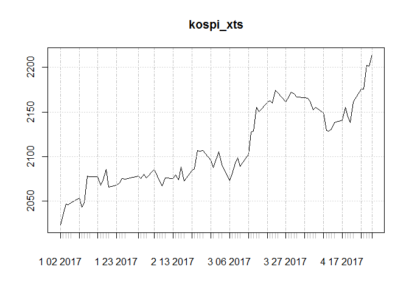
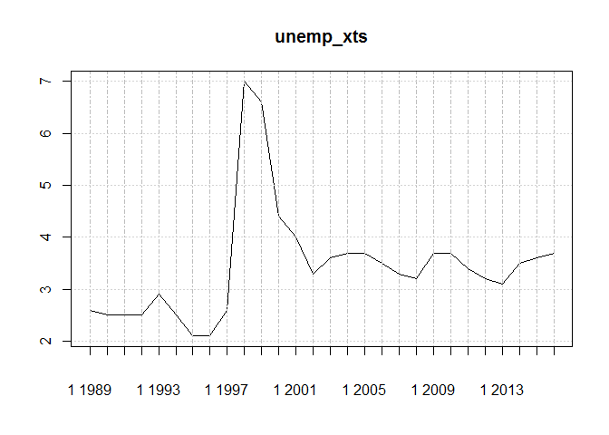

# 데이터 과학 -- 기초 통계

## 1. `quantmod`, `quandl` 팩키지 

`quantmod`, `quandl` 팩키지를 활용하여 많이 사용되는 금융데이터를 다양한 곳에서 R로 바로 불러올 수 있다.
특히 `quantmod` 팩키지 `getSymbols()` 함수는 **Yahoo! Finance**, **Google Finance**, **FRED**, **Oanda** 등에서 
바로 데이터를 원하는 형태로 가져오고 가져온 데이터는 기본적으로 `xts` 자료구조로 일관되게 후속처리를 할 수 있다.

> **다양한 데이터 저장소**
> 
> - 야후 금융: [https://finance.yahoo.com/](https://finance.yahoo.com/)
> - 구글 금융: [https://www.google.com/finance](https://www.google.com/finance)
> - OANDA 환율: [https://www.oanda.com/](https://www.oanda.com/)
>     - `quantmod::oanda.currencies` 각국환종에 대한 요약표를 제공
> - 경제 데이터: [https://fred.stlouisfed.org/](https://fred.stlouisfed.org/)

종합주가지수(Kospi)에 대해 구글 금융 웹사이트 검색창에 `kospi`를 타이핑하면 **KRX:KOSPI** 이 확인된다.
이를 해당 기간에 맞춰 가져온다.  마찬가지로 방법으로 환율은 `oanda` 웹사이트에서 불러오는데
환종을 확인해야 한다. 환종정보는 `quantmod::oanda.currencies`에서 주요국에 대한 환종을 확인한다.
마찬가지로 대한민국 실업률도 `FRED` 웹사이트에 검색하게 되면 `LRHUTTTTKRA156N` 확인된다.
이를 가져와서 시각화한다.

~~~{.r}
# 0. 환경설정 ---------------------------------------
#library(quantmod)
#library(Quandl)
# 1. 데이터 가져오기 -------------------------------

ski_xts <- getSymbols(Symbols="096770.KS", 
                      src = "yahoo", 
                      from= "2017-01-01", 
                      to = "2017-05-01", auto.assign = FALSE)

class(ski_xts)
~~~

~~~{.output}
[1] "xts" "zoo"

~~~

~~~{.r}
# 2. 다양한 데이터 원천 ----------------------------
## 2.1. 주식:구글
kospi_xts <- getSymbols(Symbols="KRX:KOSPI", 
                      src = "google", 
                      from= "2017-01-01", 
                      to = "2017-05-01", auto.assign = FALSE)
plot(kospi_xts)
~~~

~~~{.r}
## 2.2. 환율: 원화/1달러
usdkrw_xts <- getSymbols(Symbols="USD/KRW", 
                        src = "oanda", 
                        from=  Sys.Date() - 30, 
                        to =  Sys.Date(), auto.assign = FALSE)
plot(usdkrw_xts)
~~~

~~~{.r}
## 2.3. 경제: 실업률
unemp_xts <- getSymbols(Symbols="LRHUTTTTKRA156N", 
                         src = "FRED", 
                         from= "1998-01-01", 
                         to = "2017-05-01", auto.assign = FALSE)
plot(unemp_xts)
~~~

