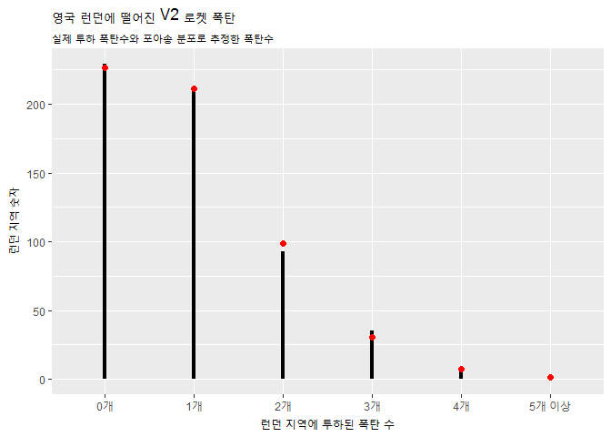
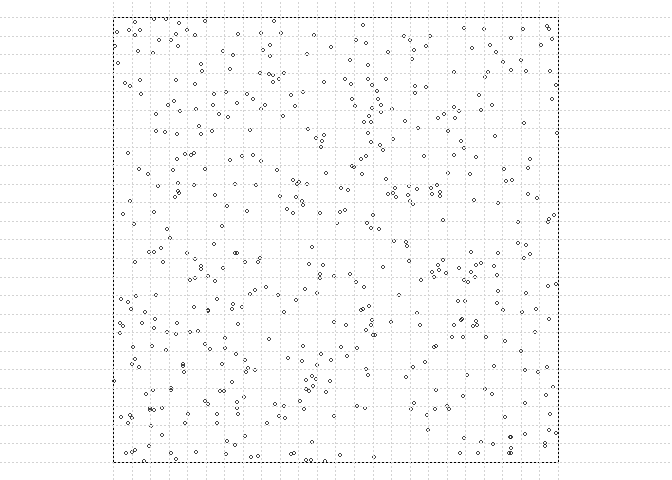
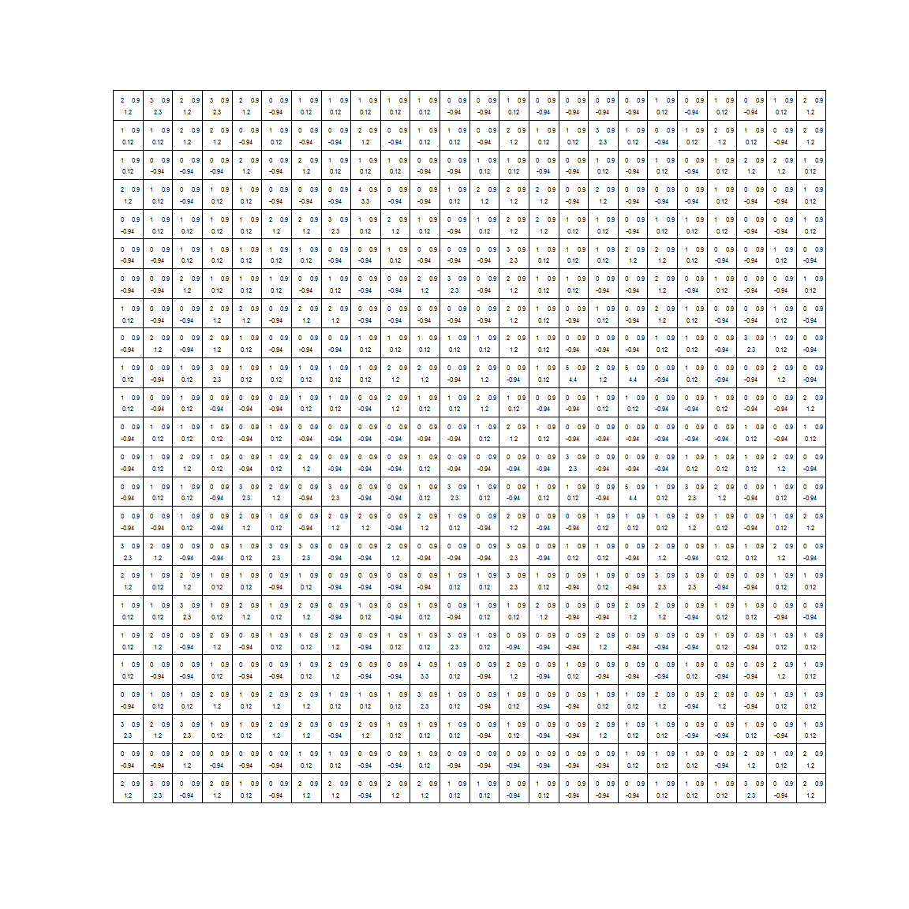

# 데이터 과학 -- 기초 통계

## 영국 런던에 떨어진 V2 로켓 폭탄 [^v2-bomb-stat] {#v2-rocket}

[^v2-bomb-stat]: [Generalized Linear Models - 4. Poisson Models for Count Data](http://data.princeton.edu/wws509/notes/c4s1.html)

2차 세계대전 중 독일은 신형 무기 V1, V2 로켓을 개발하여 전쟁 막판에 영국 런던을 폭격하여 반전을 노렸다.
독일 신형폭탄의 공격을 받은 영국에서는 독일에서 발사한 신형 폭탄이 정밀 타격한 것인지 아니면 무작위로 대충 발사를 한 것인지 데이터를 통해 검정을 하고자 한다. [^clark-poisson]

[^clark-poisson]: [R. D. Clarke, “An Application of the Poisson Distribution,” Journal of the Institute of Actuaries, Vol. 72 (1946), p. 481; V-2]()

## V2 로켓 검정 {#v2-testing}

### 데이터 {#v2-data}

가장 먼저 데이터를 준비한다. 데이터는 [R.D. Clarke, "An Applicatin of the Poisson Distribution"](https://www.actuaries.org.uk/system/files/documents/pdf/0481.pdf)을 참조한다.

~~~{.r}
# 1. 기본 데이터 --------- 

bombs <- c("0개","1개", "2개","3개","4개","5개 이상")
hit <- c(229, 211, 93, 35, 7, 1)
expected <- c(226.74, 211.39, 98.54, 30.62, 7.14, 1.57)

bomb_df <- tibble(bombs, hit, expected)
bomb_df %>% knitr::kable()
~~~

bombs       hit   expected
---------  ----  ---------
0개         229     226.74
1개         211     211.39
2개          93      98.54
3개          35      30.62
4개           7       7.14
5개 이상      1       1.57

### 포아송 분포 {#v2-poisson}

런던에 떨어진 폭탄이 포아송 분포, 즉 무작위로 떨어진 것이라고 가정하고 시각화를 한다.
포아송 분포는 모수가 $\lambda$ 하나만 추정하면 되기 때문에 데이터에서 모수를 추정한다.

$$P(\text{ 해당 구간에서 발생한 k개 사건(k events in interval)}) = e^{-\lambda}\frac{\lambda^k}{k!}$$

~~~{.r}
# 2. 포아송 분포 --------- 

hit <- 537
area <- 576

(lambda <- hit/area)
~~~

~~~{.output}
[1] 0.9322917

~~~

~~~{.r}
ggplot(bomb_df, aes(x=bombs,xend=bombs, y=0, yend=hit)) +
  geom_segment(size=1.5) +
  geom_point(aes(bombs, expected), size=2, color="red") +
  labs(x="런던 지역에 투하된 폭탄 수", y="런던 지역 숫자", title="영국 런던에 떨어진 V2 로켓 폭탄",
       subtitle="실제 투하 폭탄수와 포아송 분포로 추정한 폭탄수")
~~~

모수($\lambda$)는 0.9322917로 추정된다. 이를 실제 데이터와 포아송 분포에서 나온 데이터와 겹쳐 시각화한다. 

예를 들어, 폭탄이 투하되지 않을 확률은 다음과 같다.

$$P(x=0) = e^{-0.9322917}\frac{0.9322917^0}{0!} = 0.3936506$$

이를 R 코드로 표현하면 다음과 같다.

~~~{.r}
lambda^0 *exp(-lambda) / factorial(0)
~~~

~~~{.output}
[1] 0.3936506

~~~

### 가설 검정 {#v2-goodness-of-fit}

시각적으로 살펴봤지만, 통계적 가설검정을 통해 다시 한번 런던에 투척된 폭탄이 포아송 분포를 따르는 것인지 검정해본다.

- 귀무가설($H_0$): 런던에 투하된 폭탄은 무작위로 떨어진 것이다. 즉, 폭탄이 떨어진 분포는 포아송 분포다.
- 대립가설($H_A$): 폭탄이 떨어진 것은 의도를 갖고 특정지역에 투하된 것이다.

유의수준을 설정하고 검정통계량 $\chi^2$을 정의해서 계산하면 귀무가설을 채택하게 된다.

~~~{.r}
# 3. 통계적 검정 --------- 

chisq.test(bomb_df$hit, p=bomb_df$expected, rescale.p=TRUE, simulate.p.value=TRUE)
~~~

~~~{.output}

	Chi-squared test for given probabilities with simulated p-value
	(based on 2000 replicates)

data:  bomb_df$hit
X-squared = 1.1709, df = NA, p-value = 0.9445

~~~

~~~{.r}
# 4. 최종 데이터 ---------

bomb_df$r_expected <- 573 * c( dpois(0:4, lambda), 1 - sum(dpois(0:4, lambda)))
DT::datatable(bomb_df) %>% 
  DT::formatRound(c("r_expected"), digits = 2)
~~~

<!--html_preserve-->

<!--/html_preserve-->

## 지리정보를 통한 이해 {#v2-spatial}

공간정보를 활용한 사례로 이를 공간정보에 시각화하면 다음과 같다.
물론 정확한 데이터가 없어 런던 남부에 떨어진 폭탄이 포아송 분포를 따른다고 가정하고 576개 구획으로 나눈 것에 임의로 폭탄이 떨어진 것을 시각화하면 다음과 같다.

~~~{.r}
# 5. 지리정보 ---------
library(spatstat)
par(mar = rep(0, 4))

# 24*24 = 576
south_london <- rpoispp(lambda, win = owin(c(0, 24), c(0, 24)))
plot(south_london, main="", cex=0.5)
abline(h = 0:24, v = 0:24, col = "lightgray", lty = 3)
~~~

포아송 분포를 가정하고 통계적 검정도 물론 가능하다. `spatstat` 팩키지의 함수를 활용하여 통계적 검정을 해도 동일한 결론에 도달하게 된다.

~~~{.r}
bomb_test <- quadrat.test(south_london, nx = 24, ny = 24, method="Chisq")
plot(bomb_test, cex=0.5, main="")
~~~

~~~{.r}
bomb_test
~~~

~~~{.output}

	Chi-squared test of CSR using quadrat counts
	Pearson X2 statistic

data:  south_london
X2 = 567.18, df = 575, p-value = 0.8321
alternative hypothesis: two.sided

Quadrats: 24 by 24 grid of tiles

~~~
