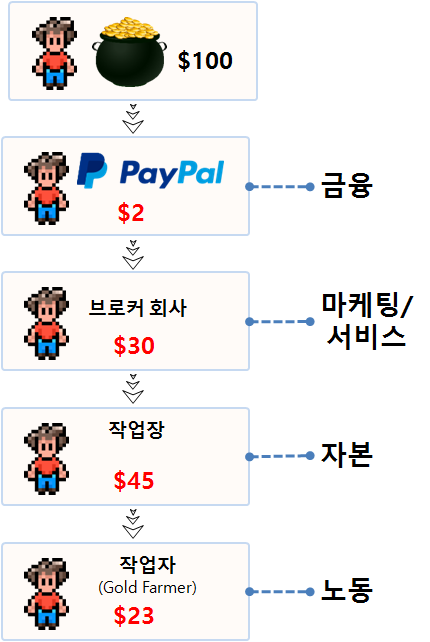

> ## 학습 목표 {.objectives}
>
> * MMORPG 게임에서 경제 시스템과 작업장을 이해한다.
> * 작업장 가치사슬(Value Chain)과 글로벌 노동 분업에 대해 이해한다.
> * 현금거래 및 골드파밍 산업의 연결고리를 이해한다.
> * 골드파밍 산업 주체 및 자금담당/물주에 대해 파악한다.
> * 작업장의 대략적인 원가구조를 이해한다.

### 1. 정보기술과 경제 모형

정보기술 인프라는 광대역 유무선 네트워크가 깔리게 되면 그 위에 디지털 경제가 자연스럽게 열리게 된다. 유무선 네트워크 위에 온라인 서비스, 전자상거래, 전자정부등이 올라가게 되면 가상경제가 출현하고 가상 재화에 대한 거래 및 이를 뒷받침하는 디지털 노동이 발생된다.

| 계층 구분    |    제공 서비스 상세                                                |  부가가치 | 안정성 |
|--------------|--------------------------------------------------------------------|-----------|--------|
| ICT 인프라   | 광대역 네트워크와 무선 네트워크                                    |   낮음    | 높음   |
| 디지털 경제  | 온라인 서비스, 커뮤니티, 게임, 온라인 쇼핑, 전자상거래, 전자 정부  |   중간    | 중간   |
| 가상 경제    | 가상 재화 거래, 링크, 디지털 노동                                  |   높음    | 낮음   |

InfoDev와 세계은행은 가상 경제(Virtual Economy)를 네가지로 구분했다.

* 온라인 게임 서비스: MMORPG
* 벗꽃 개화(Cherry Blossoming): 페이스북 팬, 트위터 팔로우, 추천엔진, 투표와 링크
* 사용자가 만든 가상 재화 생산: 3D 아바타 등
* 마이크로 노동(Microwork): 아마존 M'Turk 크라우드 소싱(Crowdsourcing) 혹은 작업장 노동

### 2. 글로벌 작업장(Gold Farming) [^gf-geography] [^gf-china] [^gf-play-money] [^gf-virtual-economy]

[^gf-virtual-economy]: [ECONOMY, TUAL. "KNOWLEDGE MAP OF THE VIRTUAL ECONOMY."](http://www.infodev.org/infodev-files/resource/InfodevDocuments_1056.pdf)

[^gf-play-money]: [PLAY MONEY A DOCUMENTARY ABOUT MAKING REAL MONEY IN UNREAL PLACES](http://www.playmoneyfilm.com/)

[^gf-china]: [Update on Chinese Gold Farming](https://virtualeconomyresearchnetwork.wordpress.com/2009/05/05/update_on_chinese_gold_farming/)

[^gf-geography]: [Geographies of gold farming: New research on the third-party gaming services industry](http://cii.oii.ox.ac.uk/2014/10/29/geographies-of-gold-farming-new-research-on-the-third-party-gaming-services-industry/)

2009년 기준 약 40만명 중국인이 작업장에 종사하는 것으로 추정되고 있으며 경우에 따라서는 50만명에서 백만명까지도 보고 있다.
매년 $10조 달러 매출이 발생되는 것으로 추산된다. 중국 대도시에 상당수 거점을 운영하고 있으며 브로커가 약 6만으로 보고 있다.

작업장(gold farm)은 여러 브로커 회사에 재화를 공급하고, 브로커도 직영 작업장을 운영하기도 하지만 다양한 작업장을 통해 고객에게 제공할 재화를 공급받는다.
브로커 회사는 재화 판매를 위해 광고 마케팅, 스팸 전자우편을 전문으로 보내는 조직, 고객서비스를 전담하는 조직, IT 전산을 담당하는 조직, 재화를 고객에게 조달하는 조직으로 나눠져서 분업을 통해 효율성을 극대화한 기업이다. 특히, 고객서비스는 주로 여성이 담당하고, 나머지 업무는 남성이 담당한다. 합법적인 고객서비스 사업으로 대도시에 위치하고 전세계 고객을 대상으로 영어회화가 가능한 직원이 상주하며 회계/현금거래/목표설정 등의 기능을 담당하고 있다.

작업장(gold farm)도 기업의 형태를 취하고 있어 인건비가 저렴한 중소도시에 주로 위치하지만 광대역 인터넷에 연결되어야 하는 조건이 충족되어야 된다. 과거 주로 젊은 남성이 담당하던 골드파밍이 인건비가 저렴한 베트남과 필리핀으로 외주를 주기도 하고, 전산화가 상당히 진전되어 전투와 자원수집에 봇과 다양한 소프트웨어 기술을 활용하여 자동화 및 규모의 경제를 이뤄나가고 있다.

|    역할    | 월급 |
|------------|------|
| 골드파머   | $140 | 
| 고객서비스 | $350 |
| 도시근로자 | $190 |
| 시골근로자 | $58  |

중국 도시근로자 월급이 $190, 시골근로자 월급이 $58달러임을 고려하면, 숙식이 제공되고 원하는 게임을 돈들이지 않고 얼마든지 할 수 있는 골드파머 직업은 10대 후반 20대 초반 젊은이들에게
매력적일 수도 있다.

#### 2.1. 국제분업 [^gf-global-division-of-labor]

[^gf-global-division-of-labor]: [Lehdonvirta, Vili, et al. "Online labour markets–leveling the playing field for international service markets?." (2015)](http://ipp.oii.ox.ac.uk/sites/ipp/files/documents/IPP2014_Lehdonvirta_0.pdf)

고객이 $100 달러 재화를 매입하는 경우 재화를 공급한 공급업자에 대한 가치사슬(Value Chain)은 WoW(World of Warcraft) 게임을 예를 들어 저자(Dr. Vili Lehdonvirta & Dr. Mirko Ernkvis, 2011) 보고서에 따라 추산된다.

또한, 미국을 비롯한 서양 국가들이 작업장에서 생산된 재화를 소비하는 국가이며, 대표적으로 미국을 들 수 있다. PlayerAuctions 과 Lehdonvirta 연구결과를 보면 중국이 제품중심 재화를 게임유저에게 판매를 하고 있으며 영어 의사소통이 가능하고 전력이 공급되어 고속 인터넷 서비스가 제공되는 국가는 용역 서비스를 게임유저에게 판매하고 브로커 고객서비스를 통해 매출을 올리는 국제적 분업을 통해 MMORPG가 만들어 놓은 가상경제를 영위하고 있다.

중국이 대표적인 제품중심 재화를 판매하는 국가로 상정한다면 필리핀은 고객서비스를 제공하는 국가이며 의사소통이 가능하기 때문에 oDesk, 아마존 M'Turk등을 통해 용역서비스를 제공하는 것으로 파악된다.

| 순  |   구매 국가  | 구매율|  판매 국가    |  판매율 |
|-----|--------------|-------|---------------|---------|
| 1   |  미국        |100.0% | India         |  100.0% |
| 2   |  Australia   | 14.6% | Philippines   |   68.5% |
| 3   |  Canada      |  9.0% | United States |   58.6% |
| 4   |  영국        |  8.0% | Ukraine       |   37.1% |
| 5   |  UAE         |  4.5% | Pakistan      |   24.5% |
| 6   |  Germany     |  2.0% | Bangladesh    |   21.4% |
| 7   |  Netherlands |  1.8% | Russia        |   21.2% |
| 8   |  Israel      |  1.5% | China         |   18.2% |
| 9   |  France      |  1.5% | Poland        |    8.5% |
| 10  |  Sweden      |  1.1% | Canada        |    7.0% |
| 11  |  Norway      |  1.0% | 영국          |    6.3% |
| 12  |  Denmark     |  0.9% | Belarus       |    6.1% |
| 13  |  Switzerland |  0.8% | Romania       |    4.4% |
| 14  |  Belgium     |  0.7% | Egypt         |    3.6% |
| 15  |  Malaysia    |  0.7% | Argentina     |    2.9% |
| 16  |  Spain       |  0.6% | Moldova       |    2.9% |
| 17  |  Ireland     |  0.6% | Armenia       |    2.9% |
| 18  |  Singapore   |  0.5% | Australia     |    2.9% |
| 19  |  India       |  0.5% | Serbia        |    2.8% |
| 20  |  New Zealand |  0.5% | Italy         |    2.7% |

#### 2.2. 국가별 재화/서비스 거래 유형

제품범주별로 국가별 판매업자의 특징이 다른 것이 다음 표에 정리되어 있다.
중국은 현금거래와 아이템 거래에 다른 국가보다 높은 비중을 차지하고 있지만, 계정거래나 캐릭터 육성 같은 레벨업 서비스는 낮은 것이 확인된다.

그리고, 현금과 아이템은 제품에 가까운 특성이 강하고, 계정거래와 레벨업은 좀더 서비스에 가까운 특성을 갖고 있다. 따라서 중국은 언어가 영어가 아니라 상대적으로 의사소통이 쉽지 않아 서비스 중심 거래를 적극적으로 나서는데 한계가 있어 보인다.

| 국가    |    현금 | 아이템 | 계정거래 | 레벨업  |
|---------|---------|--------|----------|---------|
| 중국    |  60.3 % | 63.5 % |   5.7 %  |  50.6 % |
| 미국    |  12.8 % | 10.8 % |  79.0 %  |  41.2 % |
| 캐나다  |   8.9 % |  4.4 % |   1.7 %  |   0.9 % |
| 영국    |   7.9 % |  0.7 % |   0.6 %  |   0.6 % |
| 싱가폴  |   1.5 % | 11.1 % |   0.0 %  |   2.6 % |

### 3. 작업장 운영

**게임 아이템(Item)** 은 무기, 방어구, 장신구, 물약, 음식물, 옷 등으로 신나고 재미난 게임을 돕도록 게임사용자가 구매하거나 습득하여 사용할 수 있는 재화를 의미한다. 특히,  MMORPG(Massive Multiplayer Online Role Playing Game) 게임은 게임사용자는 다른 동인도 있지만 우선 강한 아이템을 획득하여 상대 혹은 상대 클랜을 제압하는 것이 목표다. 이를 위해서 MMORPG 게임 사용자는 다음과 같은 다양한 방식으로 아이템을 습득한다.

* 사냥을 통한 아이템 습득
* 게임사용자 및 부분 유료화 게임제작사 및 중개 사이트([아이템베이](http://www.itembay.com/), [아이템매니아](http://www.itemmania.com/) 등)를 통한 아이템 현금 구매
* 작업장을 통한 대량 아이템 생산 및 판매

온라인 게임 및 아이템 중개시장 활성화는 고용확대, 콘텐츠 제작과 수출등의 장점도 있지만, 장시간 게임 중독, 작업장, 개인정보 도용, 계정거래 사기 등 문제점도 함께 내포하고 있다.

#### 3.1. 작업장 문제점

현금거래(RMT,Real Money Trading)는 MMORPG 제작사, 운영사업자, 게임사용자 모두에게 다양한 문제를 야기한다. [^mmorpg-rmt]

[^mmorpg-rmt]: [Fujita, Atsushi, Hiroshi Itsuki, and Hitoshi Matsubara. "Detecting Real Money Traders in MMORPG by Using Trading Network." AIIDE. 2011.](http://paraphrasing.org/~fujita/publications/fujita-AIIDE2011.pdf)

* 가상경제 불균형 심화: 현금거래의 증가는 가상경제 인플레이션을 심화시켜, 일반보통 게임사용자가 게임생태계에서 정상적인 경제활동을 영위하지 못하게 방해한다.
* 게임사용자에 직접적인 피해: 게임머니와 아이템 확보를 위해 특정 위치를 선점하고 통행을 방해하거나, 심지어 게임캐릭터를 공격하여 아이템을 빼앗기도 한다.
* 인증되지 않는 행동을 부추김: 현금거래자는 게임봇 사용, 계정 도용, 사기 등의 용인되지 않는 행동을 게임내외에서 서슴지 않고 거치없이 실행에 옮긴다.

#### 3.2. 작업장 역할 분담

MMORPG 게임에서 현금거래는 골드 파밍 산업과 밀접하게 연관되어 있고, 이들의 역할은 기업적으로 세분화되고 전문적이다. 채굴자로 게임봇을 사용하여 규모이 경제를 통해 대규모로 게임 아이템과 자원을 생산해 내고, 이를 자금담당/물주에게 연결하여 게임사용자의 주문이 들어오는 경우 보관할 금고역할을 수행하고 있으면, 마케터와 운반책/밀매업자로 판매쪽은 세분화되어 MMORPG 게임운영자를 따돌리고 현금거래를 통해 이익을 극대화하는 체제를 갖추고 있다.

* 채굴자(Gatherer): 골드 혹은 자원을 긁어모은 계정
* 자금담당/물주(Banker), 골드파머(Gold Farmer): 분산되고 활동이 적은 계정으로 채굴자와 다른 자금담당 계정이 정지된 경우 골드를 저장/관리하는 계정
* (마약) 운반책(Mule)과 밀매업자(dealer): 고객과 거래하는 일회성 게임캐릭터, 고객과 연결고리 역할을 하지만 거리를 두어 관리자가 추적하기 복잡하게 한다.
* 마케터(Marketer): 게임유저 관심을 끌거나, (마약) 판매원, 스패머 역할을 하는 일회성 게임 캐릭터

#### 3.3. 작업장 사업 유형 

작업장 사업은 재화에 중심을 둔 제품 작업장과 용역 서비스에 초점을 둔 서비스 중심 작업장으로 나뉜다. 서비스 중심 작업장은 자본 대신 고객의 요구에 맞춰 캐릭털 육성하고 전달하여 주는 것이 중점이 되기 때문에 의사소통 역량도 중요한 역할을 한다. 반면에 재화중심 작업장은 재화를 생산해서 도매 브로커나 소매 브로커를 통해 유통을 시킬 수 있어 상대적으로 의사소통에 대한 역량이 중요하지는 않다.

### 4. 작업장 요약 손익 계산서

작업장의 대략적인 매출은 사람을 투입해서 생기는 매출과 봇을 투입해서 생산되는 
매출과 해커를 통해 얻는 매출이 적절한 포트폴리오를 갖추고 있다. 
또한, 용역 매출도 일정부분 차지하고 있는 것이 파악된다.

|                Gross revenues                          | $3,023 |  총매출  |
|--------------------------------------------------------|--------|----------|
| ...Gross revenues from currency and items (85%)        | $2,570 | 제품매출 |
| ......Producers' share of revenues (65%)               | $1,670 |                |
| .........Manual gold farm revenues (30%)               | $501   | 사람투입 매출  |
| ............Amount spent on game laborers' wages (33%) | $165   |                |
| .........Bot farm revenues (50%)                       | $835   | 봇 투입 매출   |
| ............Amount spent on game laborers' wages (3%)  | $25    |                |
| ......Hacker groups' criminal revenues (20%)           | $334   | 해커 투입 매출 |
| ...Gross revenues from powerleveling (15%)             | $453   | 용역 매출      |
| ......Producers' share of revenues (70%)               | $317   |    |
| .........Manual powerleveling (100%)                   | $317   |    |
| ............Amount spent on game laborers' wages (33%) | $105   |    |
| Total spent on game laborers' wages:                   | $295   |    |

### 5. 현금거래 대응

MMORPG 가상경제 생태계를 건강하게 하고, 게임사용자에게 게임을 통해 쾌적한 환경을 제공하고자 게임운영추제는 다음과 같은 작업을 수행한다.

1. **용의자 식별:** 게임로그를 포함한 이력 및 게임활동을 지속적으로 모니터링하여 현금거래 판매자 및 구매자를 모니터링한다.
1. **용의자 검증:** 게임서버에 쌓여있는 로그 및 활동이력을 바탕으로 현금거래 판매자 혹은 구매자인지를 검증한다.
1. **계정 중지:** 현금거래 판매자 혹은 구매자로 확인되면 지체없이 연관된 계정을 모두 정지시킨다.

### 참고 문헌

* [Lee, Eunjo, et al. "You are a game bot!: uncovering game bots in MMORPGs via self-similarity in the wild." NDSS, 2016.](https://www.internetsociety.org/sites/default/files/blogs-media/you-are-game-bot-uncovering-game-bots-mmorpgs-via-self-similarity-wild.pdf)
* [Heeks, Richard. "Understanding" gold farming" and real-money trading as the intersection of real and virtual economies." Journal For Virtual Worlds Research 2.4 (2009).](https://jvwr-ojs-utexas.tdl.org/jvwr/index.php/jvwr/article/download/868/633)
* [심상은, 게임 아이템 거래를 통한 자금세탁 기법 고찰 및 방지방법에 대한 연구, Journal of Digital Forensics 2015 Dec.: 9(2)](http://kdfs.or.kr/?module=file&act=procFileDownload&file_srl=6203&sid=eb144323371eba519c1a0a96c4d8c852&module_srl=6199)
* 
[강성욱, 이진,  이재혁 ,  김휘강, MMORPG에서 GFG 쇠퇴를 위한 현금거래 구매자 탐지 방안에 관한 연구, 정보보호학회논문지, 2015, vol.25, no.4, pp. 849-861](https://www.kci.go.kr/kciportal/ci/sereArticleSearch/ciSereArtiView.kci?sereArticleSearchBean.artiId=ART002024918)

