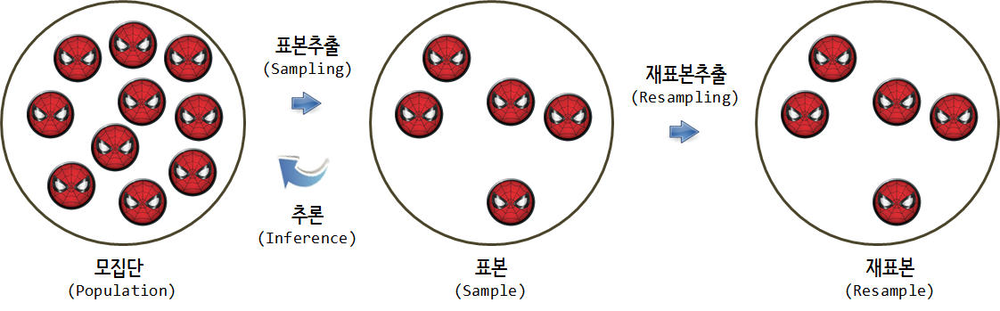
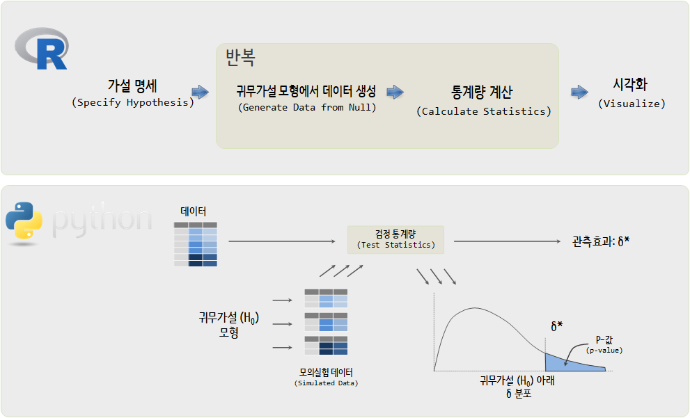
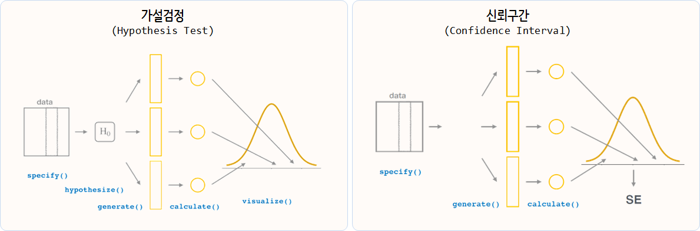

``` {r, include=FALSE}
source("tools/chunk-options.R")
knitr::opts_chunk$set(echo = TRUE, warning=FALSE, message=FALSE)

library(tidyverse)
library(ggthemes)
library(extrafont)
loadfonts()

```


# 코딩을 통한 통계가설 검정 [^allen-downey-test]  {#computer-age-statistical-inference}

[^allen-downey-test]: [Allen Downey (2016), There is still only one test](http://allendowney.blogspot.kr/2016/06/there-is-still-only-one-test.html)

컴퓨터가 활발히 사용되기 전에 통계적 검정에 대한 필요성은 과거에도 존재했다. 하지만, 그 당시에는 컴퓨터가 너무 희귀한 자원이고 
컴퓨터를 잘 다둘 수 있는 사람도 극도로 적었기 때문에 수학을 바탕으로한 통계적 추론 방법(Analytic Method)이 발달했지만 여전히 진입장벽은 높기만 했다.

하지만, 수많은 연구자들과 개발자의 기여로 코딩을 통해서 직관적으로 다양한 통계가설 검정을 할 수 있는 시대가 열리고 있다.
[`infer`](https://cran.r-project.org/web/packages/infer/) 팩키지에 최근 기능이 많이 추가되고 있어 이에 대한 기대가 크다.

기본적으로 모집단에 대해 알고자 하는 경우 표본을 추출하여 이를 기반으로 모집단에 대한 추론을 한다.
뽑혀진 표본에 대해서 컴퓨팅 기술을 활용하여 재표본추출을 반복하여 모집단에 대해 추론을 하는 방법에 대해 주로 살펴보자.



## 통계적 가설검정 [^wiki-statistical-testing] {#computer-age-statistical-inference}

[^wiki-statistical-testing]: [위키 백과 - 가설 검정](https://ko.wikipedia.org/wiki/%EA%B0%80%EC%84%A4_%EA%B2%80%EC%A0%95)

통계적 가설 검정(統計的假說檢定, statistical hypothesis test)은 통계적 추측의 하나로서, 
모집단 실제의 값이 얼마가 된다는 주장과 관련해, 표본의 정보를 사용해서 가설의 합당성 여부를 판정하는 과정을 의미하는데 이를 위해서 프로세스(Process)와 함께
검정 통계량을 수식으로 나타낼 수 있어야 하고 이를 해석하는 별도의 훈련도 받아야 했고 이 과정에서 상당량의 수학 및 통계학적 지식이 요구된다.

1. 유의수준의 결정, 귀무가설과 대립가설 설정
1. 검정통계량의 설정 (예를 들어, t-검정)
    - $t \quad = \quad {\; \overline{X}_1 - \overline{X}_2 \; \over \sqrt{ \; {s_1^2 \over N_1} \; + \; {s_2^2 \over N_2} \quad }}$
    - 자유도: $\nu \quad  \approx \quad {{\left( \; {s_1^2 \over N_1} \; + \; {s_2^2 \over N_2} \; \right)^2 } \over { \quad {s_1^4 \over N_1^2 \nu_1} \; + \; {s_2^4 \over N_2^2 \nu_2 } \quad }}$
1. 기각역의 설정
1. 검정통계량 계산
1. 통계적인 의사결정

통계적 가설검정(Statistical Testing)은 기존 통계학 전공자의 전유물이었으나, 
컴퓨터의 일반화와 누구나 코딩을 할 수 있는 현재(`r Sys.Date()`)는 더 이상 기존 통념이 통용되지는 않게 되었다. 
특히 [파이썬](https://www.python.org/) 진영에서 이런 움직임이 
활발하다. 그렇다고 [R](https://www.r-project.org/) 진영에서도 기존의 방식을 고수하는 것은 아니다. 

## tidyverse 가설검정 [^tidyverse-manifesto] {#computer-age-statistical-inference}

[^tidyverse-manifesto]: [Hadley Wickham(2017-11-13), The tidy tools manifesto](https://cran.r-project.org/web/packages/tidyverse/vignettes/manifesto.html)

데이터 과학을 이끌어 나가는 있는 R과 파이썬 진영의 현재 주도적인 흐름을 살펴보자. 
우선 다소 차이가 있지만, `for` 반복루프를 이해하고 이를 코드로 구현할 수만 있다면 컴퓨터를 활용한 가설검정이 가능한 것은 사실이다.
하지만, 2011년 Allen Downey 교수가 주장했던 것처럼 오랜동안 검정된 해석학적 방법(Analytic Method)에 대한 교차검정하는 방식으로 활용하는 것이 추천된다.



코딩기반 가설검정은 우선 데이터로부터 시작된다. 데이터를 컴퓨터의 기능을 활용하여 모의실험 표본을 생성하고 나서 귀무가설($H_0$) 모형에서 검정통계량을 추출하여 
이를 바탕으로 $p-값$을 계산하여 의사결정을 추진한다.


|      Allen Downey(2011)       |      John Rauser(2014)        |
|-------------------------------|-------------------------------|
|<iframe width="300" height="180" src="https://www.youtube.com/embed/S41zQEshs5k" frameborder="0" allow="autoplay; encrypted-media" allowfullscreen></iframe> | <iframe width="300" height="180" src="https://www.youtube.com/embed/5Dnw46eC-0o" frameborder="0" allow="autoplay; encrypted-media" allowfullscreen></iframe> |

|     Jake VanderPlas (2016)    |  **Andrew Bray and Chester Ismay(2018)** |
|-------------------------------|------------------------------------------|  
|<iframe width="300" height="180" src="https://www.youtube.com/embed/-7I7MWTX0gA" frameborder="0" allow="autoplay; encrypted-media" allowfullscreen></iframe> | <iframe width="300" height="180" src="https://www.youtube.com/embed/kTGtgO2WcAw" frameborder="0" allow="autoplay; encrypted-media" allowfullscreen></iframe> |

통계검정에도 `tidyverse`를 반영하고 `Allen Downey` 교수가 주창한 통계검정 프레임워크를 도입하여 
극단적으로 말하며 딥러닝 모형이 거의 모든 통계, 기계학습 모형을 통일해 나가듯이 다양한 통계검정에 대해서도 비숫한 위치를 점할 것으로 예측된다.

## 가설검정과 신뢰구간 {#computer-age-statistical-inference-ho-ci}

`infer` 팩키지는 `tidyverse` 철학(?)에 따라 가설검정과 신뢰구간을 추정하는 목적으로 개발되었다.
크게 통계적 추론은 가설검정과 신뢰구간 추정이 주된 작업이다. 이를 위해서 5가지 동사(verb)를 새로 익혀야 한다.

- `specify()`
- `hypothesize()`
- `generate()`
- `calculate()`
- `visualize()`




# 사례: 맥주를 마시는 성인은 모기에게 매력적으로 보일까? [^beer-mosquitoes] {#mosquitoes-love-beer-drinkers}

[^beer-mosquitoes]: [Lefèvre, Thierry, et al. “Beer consumption increases human attractiveness to malaria mosquitoes.” PloS one
5.3 (2010): e9546. http://dx.doi.org/10.1371/journal.pone.0009546](http://journals.plos.org/plosone/article?id=10.1371/journal.pone.0009546)

## 가설검정 환경설정 {#mosquitoes-love-beer-drinkers-setup}

데이터 전처리와 시각화, 한글설정을 위한 팩키지를 준비한다.
특히 `infer` 코딩기반 가설검정을 위해 필수적인 팩키지로 활용하는데 기본적인 사용방법은 `mtcars`, `flights` 데이터를 활용한 사례를 살펴본다.

- [`flights` 데이터 소품문](https://cran.r-project.org/web/packages/infer/vignettes/flights_examples.html)
- [`mtcars` 데이터 소품문](https://cran.r-project.org/web/packages/infer/vignettes/mtcars_examples.html)

``` {r mosquitoes-love-beer-drinkers-setup}
# 0. 환경설정 ----------
library(tidyverse)
library(infer)
library(skimr)
library(gridExtra)
library(viridis)
library(extrafont)
loadfonts()

# 1. 데이터 가져오기 -----

beer_dat <- read_csv("https://raw.githubusercontent.com/aloy/m107/master/data/mosquitos.csv")

beer_df <- beer_dat %>% 
    mutate(treatment = factor(treatment, levels = c("beer", "water"), labels=c("맥주", "맹물"))) 
```

## 탐색적 데이터 분석 {#mosquitoes-love-beer-drinkers-eda}

탐색적 데이터 분석을 통해서 말라리아 모기가 맥주를 마신 사람과 맹물을 마신 사람 어디에 더 많이 접근을 하는지 개체수 차이를 살펴본다.
평균적으로 4.38 모기개체수 만큼 차이가 나는데 이런 차이가 우연에 의한 것인지 아니면 맥주가 더 모기에게 섹시하게 반응하는 역할을 하기 때문인지 살펴본다.

``` {r mosquitoes-love-beer-drinkers-eda}
# 2. 탐색적 데이터 분석 -----
## 2.1. 전체 데이터 
skim(beer_df)

## 2.2. 맥주와 맹물 투여 집단 비교
beer_df %>% 
    group_by(treatment) %>% 
    summarise(최소 = min(count),
                분위수_25 = quantile(count, 0.25),
                평균 = mean(count),
                중위수 = median(count),
                분위수_75 = quantile(count, 0.75),
                표준편차 = sd(count),
                중위절대편차 = mad(count)) %>% 
    mutate(맥주맹물차이 = max(평균) - min(평균))

## 2.3. 맥주와 맹물 투여 집단 비교 시각화

beer_density_g <- ggplot(data = beer_df, mapping = aes(x = count, fill=treatment)) +
    geom_density(aes(y = ..count..), alpha = 0.7) +
    scale_x_continuous(limits=c(5,40)) +
    scale_fill_viridis(discrete = TRUE) +
    theme_bw(base_family="NanumGothic") +
    labs(title="맥주를 마시면 모기에게 섹시하게 보일까라고 쓰고 잘 물릴까라고 읽는다.",
        x="채집된 모기 개체수", y="빈도수", fill="실험처리(treatment): ")

beer_boxplot_g <- ggplot(data = beer_df, mapping = aes(x = treatment, y = count, fill=treatment)) +
    geom_boxplot(alpha = 0.5) +
    geom_jitter(width = 0.2) +
    scale_fill_viridis(discrete = TRUE) +
    theme_bw(base_family="NanumGothic") +
    coord_flip() +
    theme(legend.position = "none") +
    labs(title="",
         y="채집된 모기 개체수", x="실험처리", fill="실험처리(treatment): ")

grid.arrange(beer_density_g, beer_boxplot_g, nrow=2)
```

## 의사결정 - 가설검정 {#mosquitoes-love-beer-drinkers-infer}

맥주를 마신 집단과 맹물을 마신 집단간에 평균적으로 4.38 모기개체수 만큼 차이가 나는데 
이런 차이가 유의적인지 전통적인 t-검정과 코딩기반 모의실험을 통해서 살펴보자.

### 전통적인 t-검정 {#mosquitoes-love-beer-drinkers-infer-ttest}

t-검정 결과 유의적인 차이가 나타나느 것으로 나타난다. p-값이 무척이나 작게 나온다.

``` {r mosquitoes-love-beer-drinkers-ttest}
# 3. 통계 검정 -----
## 3.1. 전통적인 해석적인 방법 (t-검정)
t.test(count ~ treatment, beer_df, null = 0, var.equal = TRUE, alternative="greater")
```

### 코딩기반 t-검정 {#mosquitoes-love-beer-drinkers-infer-computer}

코딩기반 t-검정은 다음 절차를 통해 준비한다.

1. 코딩기반 t-검정을 수행할 경우 `beer_df`가 $\delta^*$에 해당되어 데이터에서 사전에 계산해 놓는다.
1. 가설검정 공식을 `specify` 함수에 명세한다.
1. 귀무가설을 `hypothesize` 함수에서 적시한다.
1. 컴퓨터에서 모의실험 난수를 `generate`에서 생성시킨다.
1. 검정 통계량을 `calculate` 함수에 명시한다.

그리고 나서 `p-값`, 95% 신뢰구간을 모의실험결과에서 단순히 세어서 정리하면 된다.

마지막으로 시각적으로 한번 더 확인한다. 즉, 4.38번 더 물리는 것은 극히 드물게 일어나는 사례로 맥주를 마시면 모기에 더 
잘 물리게 된다고 볼 수 있다.

``` {r mosquitoes-love-beer-drinkers-infer-computer}
## 3.2. `infer` 팩키지 -----

### 3.2.1. 데이터에서 두 집단 간 차이 산출
beer_diff <- beer_df %>% 
    group_by(treatment) %>% 
    summarise(mean = mean(count)) %>% 
    summarise(abs(diff(mean))) %>% 
    pull

### 3.2.2. 귀무가설 모형에서 모의실험을 통해서 통계량 산출
null_model <- beer_df %>%
    specify(count ~ treatment) %>%
    hypothesize(null = "independence") %>% 
    generate(reps = 1000, type = "permute") %>% 
    calculate(stat = "diff in means", order = c("맥주", "맹물"))

### 3.2.3. p-갑과 95% 신뢰구간: 백분위수(Percentile) 방법
null_model %>%
    summarize(p_value = mean(stat > beer_diff))

null_model %>%
    summarize(l = quantile(stat, 0.025),
              u = quantile(stat, 0.975))

### 3.2.4. 시각화
ggplot(null_model, aes(x = stat, fill="gray75")) +
    geom_density(aes(y=..count..), alpha=0.7) +
    geom_vline(xintercept = beer_diff, color = "red", size=1.5) +
    scale_x_continuous(limits=c(-5,5)) +
    scale_fill_viridis(discrete = TRUE) +
    theme_bw(base_family="NanumGothic") +
    theme(legend.position = "none") +
    labs(title="맥주를 마시고 4.38번 더 모기에 물린다면...  ",
         x="맥주와 맹물 개체수 차이", y="빈도수")
```

