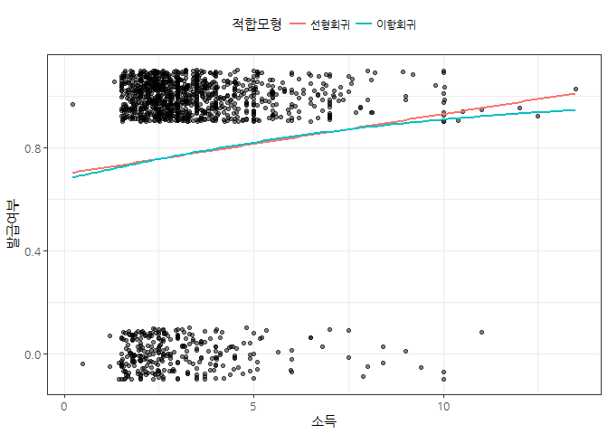
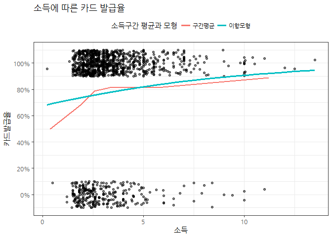
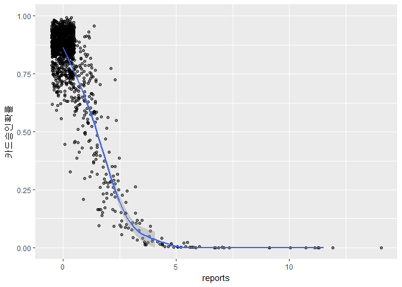
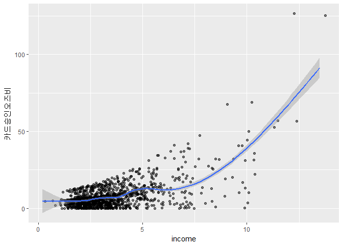
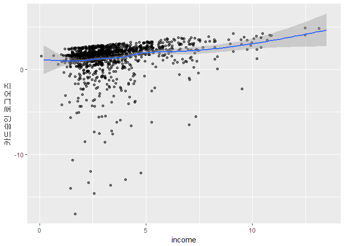

# 데이터 과학 -- 기초 통계

## 1. 이항 회귀모형 [^logistic-regression] {#logistic-regression}

[^logistic-regression]: [LOGIT REGRESSION - R DATA ANALYSIS EXAMPLES](https://stats.idre.ucla.edu/r/dae/logit-regression/)

이항 회귀모형은 로지스틱(Logistic) 회귀모형이라고 부르기도 하고 일반화선형모형(Generalized Linear Model, GLM)의 
이항분포를 따르는 모형의 일부로 해석하기도 한다.

이항 회귀모형은 D.R.Cox가 1958년에 제안한 확률 모델로서 독립 변수의 선형 결합을 이용하여 
사건의 발생 가능성을 예측하는데 흔히 사용되는 통계모형이다. [^wiki-logistic]

[^wiki-logistic]: [위키백과 - 로지스틱 회귀](https://ko.wikipedia.org/wiki/%EB%A1%9C%EC%A7%80%EC%8A%A4%ED%8B%B1_%ED%9A%8C%EA%B7%80)

$$\hat{y} = \frac{e^{\hat{\beta_0} + \hat{\beta_1} x_1}}{1+e^{\hat{\beta_0} + \hat{\beta_1} x_1}}$$

선형회귀 모형과 비교하여 뚜렷한 차이점은 다음과 같이 두가지가 있다.

- 이항형인 데이터에 적용하였을 때 종속 변수 y의 결과가 범위[0,1]로 제한.
- 종속 변수가 이진적이기 때문에 조건부 확률($P(y│x)$)의 분포가 정규분포 대신 이항 분포를 따름.

## 2. 이항 회귀 시각화 [^xwMOOC-ml-logistic] {#viz-logistic-regression}

[^xwMOOC-ml-logistic]: [xwMOOC 기계학습 - 카드발급](http://statkclee.github.io/ml/ml-credit-greene.html)

### 2.1. 카드발급 데이터 {#creditcard-data}

`AER` 팩키지 내부에 포함된 `CreditCard` 승인 데이터를 바탕으로 이항회귀모형을 시각화한다.
데이터를 시각화를 위해서 필요한 데이터 전처리 작업을 수행한다.

~~~{.r}
# 0. 환경설정 --------------------------------------
# library(tidyverse)
# library(AER) # 카드발급 데이터가 포함됨
# library(broom)
# library(ggthemes)
# library(extrafont)
# loadfonts()

# 1. 데이터 --------------------------------------
data(CreditCard)
cc_df <- as.tbl(CreditCard)

# 2. 데이터 --------------------------------------
cc_df <- cc_df %>% 
    mutate(발급여부 = ifelse(card == "yes", 1, 0)) %>% 
    mutate(income_bin = cut(income, breaks = c(-Inf, 0.1, 2.244, 2.900, 4.000, 0.6, 0.8, 10, Inf)))

cc_binned_df <- cc_df %>% 
    group_by(income_bin) %>% 
    summarise(income_mean = mean(income),
              approved_rate = mean(발급여부))
~~~

### 2.2. 이항 원데이터 시각화 {#rawdata-logistic}

종속변수에 범주형 변수를 두고 설명변수로 연속형 변수로 `ggplot`으로 시각화하는데,
`geom_jitter` 함수를 사용한다. 그리고 선형회귀모형과 이항회귀모형을 적합시키고 
범례를 추가한다.

~~~{.r}
# 3. 시각화 --------------------------------------
## 3.1. 원데이터 ---------------------------------
ggplot(data = cc_df, aes(x = income, y = 발급여부)) +
    geom_jitter(width = 0, height = 0.1, alpha = 0.5) +
    geom_smooth(method = "lm", se = 0, aes(color="blue")) +
    geom_smooth(method = "glm", se = 0, aes(color = "red"),
                method.args = list(family = "binomial")) +
    theme_bw(base_family="NanumGothic") +
    labs(x="소득", y="발급여부") +
    scale_color_discrete(name = "적합모형", labels = c("선형회귀", "이항회귀")) +
    theme(legend.position = "top")
~~~

### 2.3. 확률을 종속변수로 구간별 시각화 {#logistic-viz-binned-probability}

가장 먼저 확률을 종속변수로 두고 시각화를 한다.
특히, 구간별로 구간 평균 카드 승인율을 계산하고 이를 이항회귀모형과 겹쳐 시각화한다.

~~~{.r}
## 3.2. 이항 회귀분석 ---------------------------------
cc_glm <- glm(발급여부 ~ income, data = cc_df, family = binomial)

cc_glm_df <- cc_glm %>%
    augment(type.predict = "response")

ggplot(data = cc_df, aes(x = income, y = 발급여부)) + 
    geom_jitter(width = 0, height = 0.1, alpha = 0.5) +
    geom_line(data = cc_binned_df, 
              aes(x = income_mean, y = approved_rate, color = "blue"), size=1.0) +
    geom_line(data = cc_glm_df, 
              aes(x = income, y = .fitted, color = "red"), size=1.3) +
    theme_bw(base_family="NanumGothic") +
    labs(x="소득", y="카드발급율", title="소득에 따른 카드 발급율") +
    scale_y_continuous(labels = scales::percent, limits = c(-0.1,1.1), breaks = c(0, 0.2, 0.4,0.6,0.8,1.0)) +
    scale_color_discrete(name = "소득구간 평균과 모형", labels = c("구간평균", "이항모형")) +
    theme(legend.position = "top")
~~~

## 3. 각 측도별 시각화 {#logistic-viz-classification}

이항회귀모형을 구축한 후에 모형을 기술하는 단계로 접어들게 되면 세가지 방법이 동원된다.

- 확률: $\hat{y} = \frac{e^{\hat{\beta_0} + \hat{\beta_1} x_1}}{1+e^{\hat{\beta_0} + \hat{\beta_1} x_1}}$
- 오즈: $\text{odds}(\hat{y}) = \frac{\hat{y}}{1-\hat{y}} =  {exp^{\hat{\beta_0} + \hat{\beta_1} x_1}}$
- 로그 오즈: $\text{logit}(\hat{y}) = \text{log}\frac{\hat{y}}{1-\hat{y}} =  =  \hat{\beta_0} + \hat{\beta_1} x_1$

종속변수를 확률, 오즈, 로그오즈를 두게 되면 각자 장단점이 있다. 예를 들어, 확률은 결과값을 해석하기 쉽지만, 설명변수가 어떤 메커니즘을 통해 확률에 영향을 미치는지 난해하다. 

### 3.1. 확률 {#logistic-viz-classification-prob}

가장 먼저 확률을 모형을 기술하는데 사용한다.

~~~{.r}
# 3. 이항회귀 계수  -----------------------------------
## 3.1. 모형 ------------------------------------------
cc_mod_df <- cc_df %>% 
    select(-발급여부, -income_bin)

cc_glm <- glm(card ~ reports + income + owner +selfemp + dependents + majorcards, data = cc_mod_df, family = "binomial", maxit = 1000)

summary(cc_glm)
~~~

~~~{.output}

Call:
glm(formula = card ~ reports + income + owner + selfemp + dependents + 
    majorcards, family = "binomial", data = cc_mod_df, maxit = 1000)

Deviance Residuals: 
    Min       1Q   Median       3Q      Max  
-2.8499   0.2743   0.4686   0.5860   2.5230  

Coefficients:
            Estimate Std. Error z value             Pr(>|z|)    
(Intercept)  0.61005    0.22687   2.689             0.007166 ** 
reports     -1.37330    0.11485 -11.958 < 0.0000000000000002 ***
income       0.24747    0.06362   3.890             0.000100 ***
owneryes     0.76447    0.18076   4.229            0.0000235 ***
selfempyes  -0.68196    0.28211  -2.417             0.015635 *  
dependents  -0.25630    0.06724  -3.811             0.000138 ***
majorcards   0.62885    0.18578   3.385             0.000712 ***
---
Signif. codes:  0 '***' 0.001 '**' 0.01 '*' 0.05 '.' 0.1 ' ' 1

(Dispersion parameter for binomial family taken to be 1)

    Null deviance: 1404.6  on 1318  degrees of freedom
Residual deviance: 1041.5  on 1312  degrees of freedom
AIC: 1055.5

Number of Fisher Scoring iterations: 6

~~~

~~~{.r}
## 3.2. 해석(확률) ------------------------------------------

cc_fit_prob_df <- augment(cc_glm, type.predict = "response") %>% 
    mutate(y_hat = .fitted)

ggplot(cc_fit_prob_df, aes(x = reports, y = y_hat)) +
    geom_jitter(width = 0.5, height = 0.0, alpha = 0.5) + 
    geom_smooth() +
    scale_y_continuous("카드승인확률", limits = c(0, 1))
~~~

### 3.2. 오즈(Odds) {#logistic-viz-classification-odds}

오즈는 두가지 경우가 있을 때 실패 대비 성공 비율로 흔히, 내기 시합에서 많이 다뤄지는 측도다.

~~~{.r}
## 3.3. 해석(오즈) ------------------------------------------

cc_fit_odds_df <- augment(cc_glm, type.predict = "response") %>% 
    mutate(y_hat = .fitted) %>% 
    mutate(odds = y_hat / (1-y_hat))

ggplot(cc_fit_odds_df, aes(x = income, y = odds)) +
    geom_jitter(width = 0.5, height = 0.0, alpha = 0.5) + 
    geom_smooth() +
    scale_y_continuous("카드승인오즈비")
~~~

### 3.3. 로그 오즈(Log Odds) {#logistic-viz-classification-log-odds}

오즈는 표현했지만, 여전히 독립변수에는 `exp` 함수가 있어 이를 선형화하기 위해 
로그를 취해 로그오즈를 도출한다.

~~~{.r}
## 3.3. 해석(로그오즈) ------------------------------------------

cc_fit_log_odds_df <- augment(cc_glm, type.predict = "response") %>% 
    mutate(y_hat = .fitted) %>% 
    mutate(odds = y_hat / (1-y_hat)) %>% 
    mutate(log_odds = log(odds))

ggplot(cc_fit_log_odds_df, aes(x = income, y = log_odds)) +
    geom_jitter(width = 0.5, height = 0.0, alpha = 0.5) + 
    geom_smooth() +
    scale_y_continuous("카드승인 로그오즈")
~~~

### 3.5. 오즈비 (Odds Ratio) {#logistic-viz-classification-odds-ratio}

선형회귀에서도 관심있는 것이 독립변수 한단위가 증가할 때 종속변수가 얼마나 변화하는지 관심이 크다.
이항 회귀분석에서 이런 욕구를 충족시킬 수 있는 것이 오즈비를 활용하는 방법이다.

$$\text{오즈비(OR)} = \frac{\text{오즈}(\hat{y}|x+1)}
{\text{오즈}(\hat{y}|x)} = \frac{exp^{\hat{\beta_0} + \hat{\beta_1} (x_1 + 1)}}
{exp^{\hat{\beta_0} + \hat{\beta_1} x_1}} = exp(\beta_1)$$

~~~{.r}
## 3.4. 오즈비 ------------------------------------------
(cc_odds <- cbind(OR = coef(cc_glm), confint(cc_glm)))
~~~

~~~{.output}
                    OR      2.5 %     97.5 %
(Intercept)  0.6100538  0.1652720  1.0557593
reports     -1.3733044 -1.6076547 -1.1573091
income       0.2474687  0.1266975  0.3761975
owneryes     0.7644701  0.4145744  1.1240480
selfempyes  -0.6819577 -1.2239891 -0.1142868
dependents  -0.2562969 -0.3877760 -0.1236635
majorcards   0.6288470  0.2606239  0.9898468

~~~

~~~{.r}
(cc_odds_ratio <- exp(cbind(OR = coef(cc_glm), confint(cc_glm))))
~~~

~~~{.output}
                   OR     2.5 %    97.5 %
(Intercept) 1.8405304 1.1797140 2.8741566
reports     0.2532687 0.2003570 0.3143309
income      1.2807792 1.1350736 1.4567348
owneryes    2.1478559 1.5137263 3.0772860
selfempyes  0.5056262 0.2940548 0.8920021
dependents  0.7739121 0.6785643 0.8836771
majorcards  1.8754470 1.2977395 2.6908222

~~~
