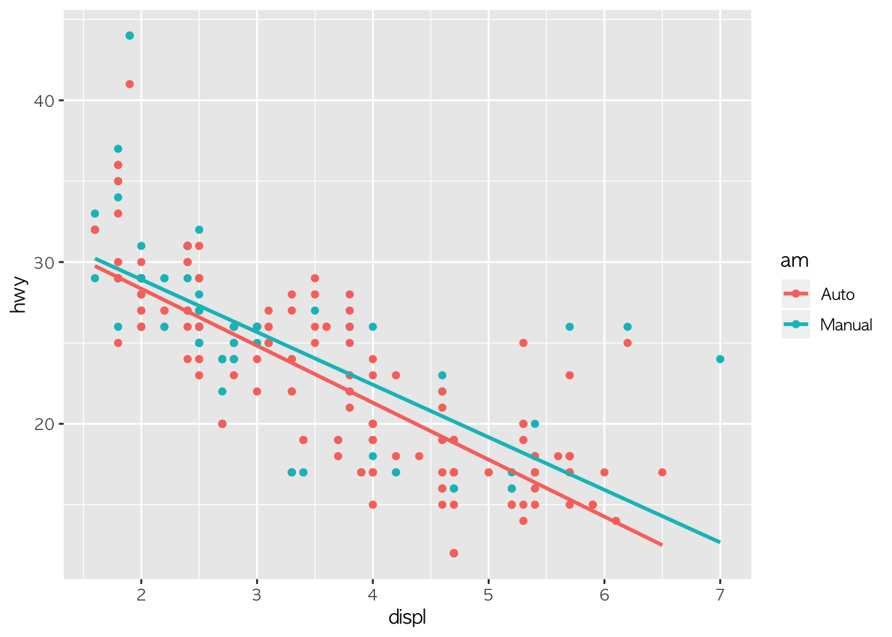
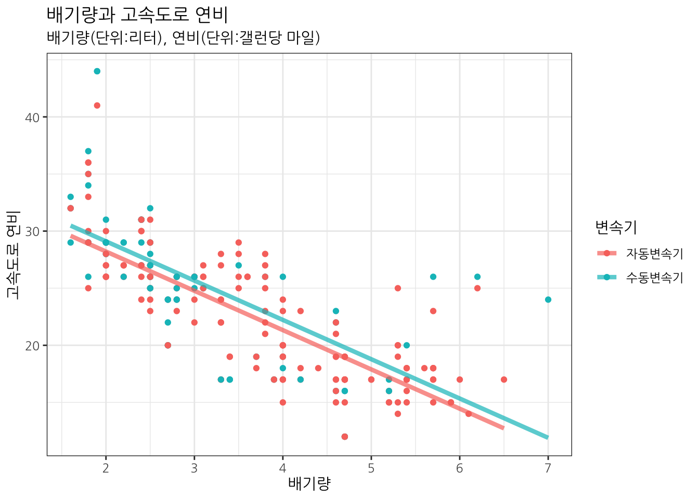
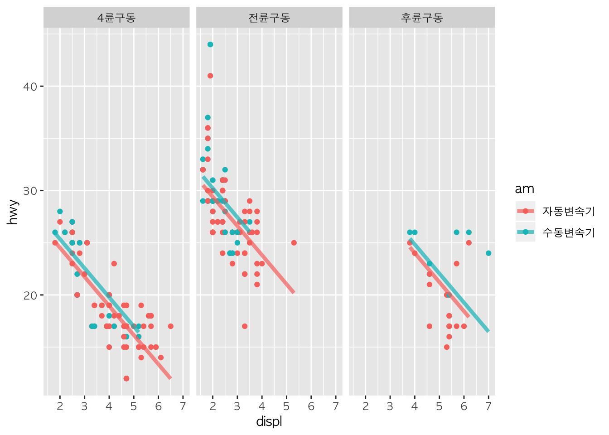
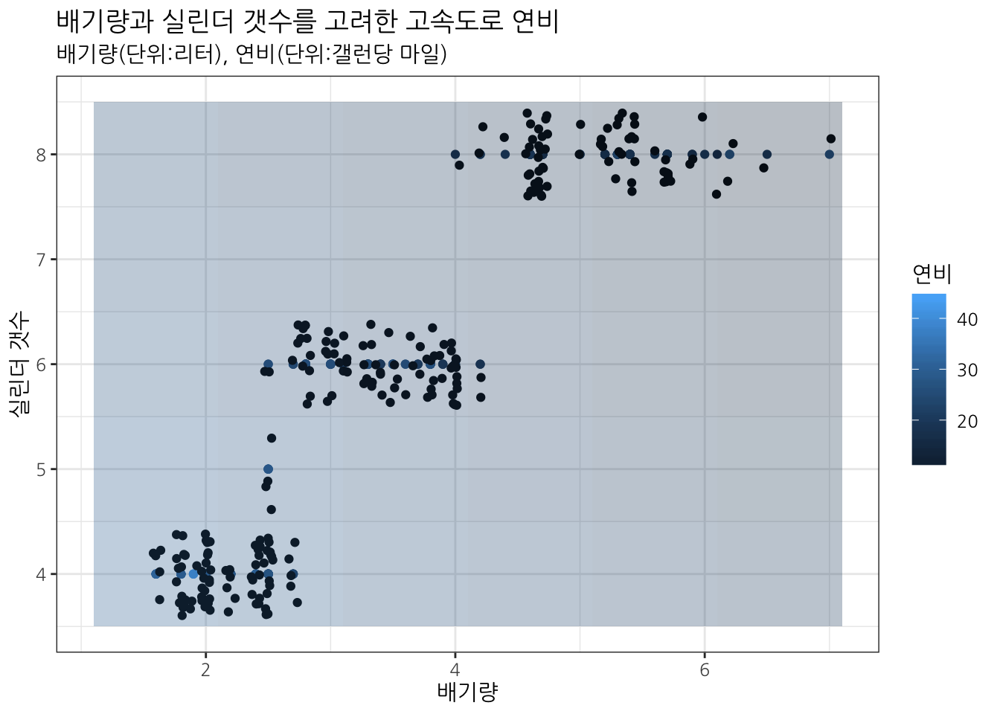

# 데이터 과학 -- 기초 통계

## 1. 모형을 기술하는 방법 {#describe-statistical-model}

데이터에 기반한 통계 모형을 기술하는 방식은 세가지로 나눌 수 있다.

1. 수학을 동원
2. 기하학(Geometry)을 동원한 시각화
3. 컴퓨터 구문(Syntatic)

### 1.1. 수학 

수학을 동원하여 모형을 기술하는 방식은 수식으로 모형 아키텍쳐를 정의하고 
수학과 다른 확률분포도 함께 정의하고 나서, 추정해애되는 회귀계수 등 모수를 표기한다.

- 방정식 : $y = beta_0 + beta_1 x_1 + beta_2 x_2 + \epsilon$
- 잔차 : $\epsilon ~ N(0, \sigma_{\epsilon}$
- 회귀계수 : $beta_0 , beta_1 , beta_2$

### 1.2. 기하학적인 시각화

기하적인 방법을 동원하여 모형을 기술하는 방식은 데이터를 `ggplot` 등을 동원하여 
시각적으로 데이터와 함께 모형을 기술한다.

~~~{.r}
data(mpg)
mpg_df <- mpg

mpg_df <- mpg_df %>% 
    mutate(am = ifelse(str_detect(trans, "auto"), "Auto", "Manual")) %>% 
    mutate(am = factor(am, levels=c("Auto", "Manual")))

ggplot(mpg_df, aes(x=displ, y=hwy, color=am)) +
    geom_point() +
    geom_smooth(method="lm", se=FALSE)
~~~

### 1.3. 컴퓨터 출력결과

데이터를 수학/통계적인 모형으로 적합시킨 결과를 컴퓨터 출력 결과물로 기술한다.

~~~{.r}
mpg_lm <- lm(hwy ~ displ + factor(am), data = mpg_df)
summary(mpg_lm)
~~~

~~~{.output}

Call:
lm(formula = hwy ~ displ + factor(am), data = mpg_df)

Residuals:
    Min      1Q  Median      3Q     Max 
-7.8130 -2.2109 -0.2639  2.0964 14.5517 

Coefficients:
                 Estimate Std. Error t value            Pr(>|t|)    
(Intercept)       35.0933     0.8096  43.348 <0.0000000000000002 ***
displ             -3.4412     0.2016 -17.070 <0.0000000000000002 ***
factor(am)Manual   0.8933     0.5531   1.615               0.108    
---
Signif. codes:  0 '***' 0.001 '**' 0.01 '*' 0.05 '.' 0.1 ' ' 1

Residual standard error: 3.823 on 231 degrees of freedom
Multiple R-squared:  0.5914,	Adjusted R-squared:  0.5879 
F-statistic: 167.2 on 2 and 231 DF,  p-value: < 0.00000000000000022

~~~

## 2. 예제 데이터 - 연비 데이터셋(mpg) {#mpg-dataset}

1999년과 10년후 두시점에 대해서 미국에서 시판되는 자동차 차종에 대한 연비를 측정한 데이터가 
`ggplot` `mpg` 데이터로 제공되고 있다. 범주형 변수와 연속형 변수가 다수 섞여있어 회귀분석 
모형을 시각화하는데 적합한 것으로 판단되어 예제 데이터로 사용한다.

~~~{.r}
# 0. 환경설정 -----------------------------------
# library(tidyverse)
# library(broom)
# library(modelr)
# library(stringr)
# library(plotly)
# library(ggthemes)
# library(extrafont)
# loadfonts()

# 1. 데이터 -----------------------------------
data(mpg)
mpg_df <- mpg

mpg_df <- mpg_df %>% 
    mutate(am = ifelse(str_detect(trans, "auto"), "Auto", "Manual")) %>% 
    mutate(am = factor(am, levels=c("Auto", "Manual"), labels = c("자동변속기", "수동변속기"))) %>% 
    mutate(drv = factor(drv, levels=c("4", "f", "r"), labels = c("4륜구동", "전륜구동", "후륜구동")))

DT::datatable(mpg_df)    
~~~

<!--html_preserve-->

<!--/html_preserve-->

## 3. 모형을 시각화하는 구분 {#taxonym-statistical-model}

관심을 결과값($y$)를 예측하고 기술하는데 다양한 숫자형, 범주형 변수를 동원할 수 있다.
사람이 인지할 수 있는 한정된 차원에 이를 시각적으로 모형을 기술하는 방법은 다음과 같다.

- 숫자형 변수 1 개 + 범부형 변수 1 개 &rarr; 평행선(Parallel Line)
- 숫자형 변수 1 개 + 범부형 변수 2 개 &rarr; 작은창(Facet) + 평행선(Parallel Line)
- 숫자형 변수 2 개 &rarr; 평면(Plane)
- 숫자형 변수 2 개 + 범부형 변수 1 개 &rarr; 평행 평면(parallel Plane)

### 3.1. 숫자형 변수 1 개 + 범부형 변수 1 개 {#num-one-cat-one}

`hwy`는 고속도로 연비로 자동차를 운전하면서 관심을 갖는 중요한 측정변수 중 하나다.
갤런당 몇 마일을 갈 수 있는지 나타나는 지표로 우리나라에서는 리터당 킬로미터에 대응된다.

- 종속변수: `hwy`
- 예측변수/독립변수: `disp`, `am`
    - `disp`: 연속형 변수
    - `am`: 범주형 변수

$$\text{연비(hwy)} = \beta_0 + \beta_1 \text{배기량(disp)} + \beta_2 \text{변속기(am)} + \epsilon$$

~~~{.r}
# 2. 숫자형 변수 1개 범주형 변수 1개 시각화 -----------------------------------
mpg_lm <- lm(hwy ~ displ + am, data = mpg_df)

mpg_data_space <- ggplot(mpg_df, aes(x=displ, y=hwy, color=am)) +
    geom_point() +
    labs(x="배기량", y="고속도로 연비", color="변속기", title="배기량과 고속도로 연비",
         subtitle="배기량(단위:리터), 연비(단위:갤런당 마일)") +
    theme_bw(base_family="NanumGothic")

mpg_data_space +
    geom_line(data= augment(mpg_lm), aes(y=.fitted, color=am), size=1.5, alpha=0.7) 
~~~

### 3.2. 숫자형 변수 1 개 + 범부형 변수 2 개 {#num-one-cat-two}

3.1.에서 다룬 숫자형 변수 1 개 + 범부형 변수 1 개 모형에서 범주형 변수를 하나 더 추가한다.

- 종속변수: `hwy`
- 예측변수/독립변수: `disp`, `am`, `drv`
    - `disp`: 연속형 변수
    - `am`: 범주형 변수
    - `drv`: 구동방식

$$\text{연비(hwy)} = \beta_0 + \beta_1 \text{배기량(disp)} + \beta_2 \text{변속기(am)} + \beta_3 \text{구동방식(drv)} + \epsilon$$

~~~{.r}
# 2. 숫자형 변수 1개 범주형 변수 2개 시각화 -----------------------------------

mpg_lm <- lm(hwy ~ displ + am + drv, data = mpg_df)

mpg_1n_1c_data_space <- ggplot(mpg_df, aes(x=displ, y=hwy, color=am, group=drv)) +
    geom_point() +
    facet_wrap(~drv)

mpg_1n_1c_data_space +
    geom_line(data= augment(mpg_lm), aes(y=.fitted, group=am), size=1.5, alpha=0.7) 
~~~

### 3.3. 숫자형 변수 2 개 + 범부형 변수 0 개 [^so-plane] {#num-two-cat-zero}

[^so-plane]: [Add Regression Plane to 3d Scatter Plot in Plotly](https://stackoverflow.com/questions/38331198/add-regression-plane-to-3d-scatter-plot-in-plotly)

숫자형 변수 1 개 + 범부형 변수 조합에서 숫자형 변수만 2개인 경우를 상정해본다.

- 종속변수: `hwy`
- 예측변수/독립변수: `disp`, `cyl`
    - `disp`: 연속형 변수
    - `cyl`: 실린더 갯수

$$\text{연비(hwy)} = \beta_0 + \beta_1 \text{배기량(disp)} + \beta_2 \text{실린더 갯수(cyl)} + \epsilon$$

#### 3.3.1. 2차원 평면 위에 색상

연속형 변수가 총 3가지로 2차원 평면에 두개 독립변수를 놓고 색상으로 종속변수를 시각화한다.

~~~{.r}
# 2. 숫자형 변수 2개 범주형 변수 0개 시각화 -----------------------------------
## 2.1. 모형
mpg_lm <- lm(hwy ~ displ + cyl, data = mpg_df)

mpg_data_grid <- mpg_df %>%
    data_grid(
        cyl = seq_range(cyl, by = 1),
        displ = seq_range(displ, by = 1)
    )

mpg_hats <- augment(mpg_lm, newdata = mpg_data_grid)

## 2.2. 2차원 평면 
mpg_2n_0c_data_space <- ggplot(mpg_df, aes(x=displ, y=cyl)) +
    geom_point(aes(color=hwy)) +
    geom_jitter() +
    labs(x="배기량", y="실린더 갯수", color="연비", title="배기량과 실린더 갯수를 고려한 고속도로 연비",
         subtitle="배기량(단위:리터), 연비(단위:갤런당 마일)") +
    theme_bw(base_family="NanumGothic") +
    theme(legend.position = "right")

mpg_2n_0c_data_space +
    geom_tile(data = mpg_hats, aes(fill = .fitted), alpha = 0.3) +
    scale_fill_continuous("hwy", limits = range(mpg_df$hwy), guide = 'none')
~~~

#### 3.3.2. 3차원 공간 

연속형 변수가 총 3가지로 3차원 공간에 데이터를 표현하고 이를 평면으로 시각화한다.

~~~{.r}
## 2.3. 3차원 공간
graph_reso <- 0.1

axis_x <- seq(min(mpg_df$displ), max(mpg_df$displ), by = graph_reso)
axis_y <- seq(min(mpg_df$cyl), max(mpg_df$cyl), by = graph_reso)

mpg_data_grid <- mpg_df %>%
    data_grid(
        cyl = seq_range(cyl, by = graph_reso),
        displ = seq_range(displ, by = graph_reso)
    )

mpg_data_grid$plane <- predict.lm(mpg_lm, newdata = mpg_data_grid)

mpg_lm_plane <- reshape2::acast(mpg_data_grid, displ ~ cyl, value.var = "plane")

plot_ly(data = mpg_df, z = ~hwy, x = ~displ, y = ~cyl, opacity = 0.6) %>%
    add_markers(text = ~model, marker = list(size = 2)) %>%
    add_surface(x = ~axis_x, y = ~axis_y, z = ~mpg_lm_plane, showscale = TRUE, cmax = 1)
~~~

<!--html_preserve-->

<!--/html_preserve-->

### 3.2. 숫자형 변수 2 개 + 범부형 변수 1 개 {#num-two-cat-one}

숫자형 변수 2 개 + 범부형 변수 1 개 모형을 시각화한다.

- 종속변수: `hwy`
- 예측변수/독립변수: `disp`, `cyl`, `am`
    - `disp`: 연속형 변수
    - `cyl`: 실린더 갯수
    - `am`: 범주형 변수

$$\text{연비(hwy)} = \beta_0 + \beta_1 \text{배기량(disp)} + \beta_2 \text{변속기(am)} + \beta_3 \text{실린더 갯수(cyl)} + \epsilon$$

~~~{.r}
# 2. 숫자형 변수 2개 범주형 변수 1개 시각화 -----------------------------------
## 2.1. 모형

mpg_lm <- lm(hwy ~ displ + cyl + am, data = mpg_df)

## 2.2. 평면 데이터 준비 

graph_reso <- 1

axis_x <- seq(min(mpg_df$displ), max(mpg_df$displ), by = graph_reso)
axis_y <- seq(min(mpg_df$cyl), max(mpg_df$cyl), by = graph_reso)

mpg_data_grid <- expand.grid(displ = axis_x, cyl = axis_y, am =  mpg_df$am, KEEP.OUT.ATTRS = FALSE)

mpg_data_grid <- mpg_df %>%
    data_grid(
        cyl = seq_range(cyl, by = graph_reso),
        displ = seq_range(displ, by = graph_reso),
        am = am
    )

mpg_data_grid$plane  <- predict.lm(mpg_lm, newdata = mpg_data_grid)

mpg_data_grid_auto   <- mpg_data_grid %>% filter(am == "자동변속기") %>% select(-am)
mpg_data_grid_manual <- mpg_data_grid %>% filter(am == "수동변속기") %>% select(-am)

mpg_lm_surface_auto   <- reshape2::acast(mpg_data_grid_auto, displ ~ cyl, value.var = "plane") 
mpg_lm_surface_manual <- reshape2::acast(mpg_data_grid_manual, displ ~ cyl, value.var = "plane") 

## 2.3. 시각화

plot_ly(data = mpg_df, z = ~hwy, x = ~displ, y = ~cyl, opacity = 0.6) %>%
    add_markers(text = ~model, marker = list(size = 2)) %>%
    add_surface(x = ~axis_x, y = ~axis_y, z = ~mpg_lm_surface_auto, showscale = FALSE, cmax = 1) %>% 
    add_surface(x = ~axis_x, y = ~axis_y, z = ~mpg_lm_surface_manual, showscale = TRUE, cmax = 1)
~~~

<!--html_preserve-->

<!--/html_preserve-->

