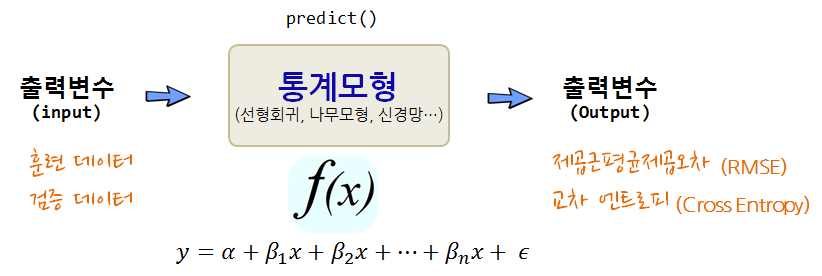

```{r, include=FALSE}
source("tools/chunk-options.R")
knitr::opts_chunk$set(echo = TRUE, warning=FALSE, message=FALSE,
                    comment="", digits = 3, tidy = FALSE, prompt = TRUE, fig.align = 'center')

library(tidyverse)
library(statisticalModeling)
library(scales)
library(cowplot)
library(extrafont)
loadfonts()
```


# 통계모형(Statistical Models) {#statistical-model}

**수학적 모형(Mathematical Model)**은 숫자, 모형 공식, 등식 등을 활용하여 구성되는 반면에 
**통계모형(Statistical Model)**은 수학모형의 한가지 형태로 데이터로부터 만들어지며 불확실성, 무작위 확률 개념을 모형에 담을 수 있다.
통계 모형을 활용하는 곳은 다음과 같다.

- 데이터 숨겨진 패턴을 식별한다.
- 사건을 분류한다.
- 영향을 미치는 것이 다양한데 이를 풀어낸다.
- 증거의 강도를 가늠한다.

미래 결과를 예측하거나, 실험을 통해서 변수들 간의 관계를 연구하거나, 데이터를 탐색해서 변수관계를 파악하는데 통계모형을 적용한다.

<style>
div.blue { background-color:#e6f0ff; border-radius: 5px; padding: 10px;}
</style>
<div class = "blue">

**모형(Model)이란?**

특정 목적을 표현한 것이 모형이다. (A model is a representation for a purpose) [^model-definition]
 
- 표현(representation) : 현실세계 무언가를 표상한 것.
- 목적(Purpose) : 모형에 대한 특별한 사용처.
</div>


[^model-definition]: [Starfield, Smith, and Blelock, "How to Model It: Problem Solving for the Computer Age"](https://cran.r-project.org/web/packages/statisticalModeling/vignettes/modeling.html)


##  통계모형의 구성요소 {#statistical-model-element}

모형(Model)은 특정목적을 표현한 것이며, 수학모형은 수학 구성요소를 조합해서 생성되고, 통계모형은 데이터를 기반으로 이를 학습시켜 만들어진다.
통계모형은 세가지 구성요소로 구성된다.

- 데이터 : 데이터프레임으로 깔끔한 데이터(Tidy Data)로 구성이 되어야 되고, 변수와 관측점 그리고 값으로 구성되는데 컴퓨터가 인식할 수 있을 뿐만 아니라 개념적으로도 일관된 체계를 갖춰야 된다.
- 함수: 데이터에서 패턴을 뽑아낼 수 있는 모형 훈련함수(training function)와 모형을 평가할 수 있는 평가함수(evaluation function) 한쌍으로 구성되고, 회귀모형, 나무모형, 신경망, 군집모형, 딥러닝 모형이 여기에 포함된다.
- 공식: 함수가 정해졌다면 변수들간의 관계를 R 공식에 맞춰 표현한다.


<style>
div.blue { background-color:#e6f0ff; border-radius: 5px; padding: 10px;}
</style>
<div class = "blue">

**공변량(Covariate)?**

공변량은 그 자체로 관심을 갖는 변수는 아니지만, 종속변수에 영향을 주는 독립변수다. [^covariate-wiki]

예를 들어, Woodworth (1987)는 특정 지점의 평균해수면 높이를 예측하고자 했고, 시간에 따른 해수면높이를 예측하고자 해서 
주된 독립 관심변수는 시간이지만, 해수면 대기압을 함께 독립변수에 넣어 평균해수면 높이를 예측하는 경우 훨씬 더 좋은 예측 모형을 개발할 수 있었다.
이 경우 대기압이 공변량이 된다. 경우에 따라서는 공변량이 주된 독립 관심변수로 바뀌는 경우도 종종 있다.

</div>


[^covariate-wiki]: [Covariate](https://en.wikipedia.org/wiki/Covariate)

## 통계모형 구축 흐름 {#statistical-model-workflow}

통계모형 개발과정은 데이터 과학 프로세스와 크게 차이나지 않는다. 
다만, 일반적인 통계모형을 개발할 경우 다음과 같은 과정을 거치게 되고, 지난한 과정이 될 수도 있다.

1. 데이터를 정제하고, 모형에 적합한 데이터(R과 모형 팩키지와 소통이 될 수 있는 데이터형태)가 되도록 준비한다.
1. 변수에 대한 분포를 분석하고 기울어짐이 심한 경우 변수변환도 적용한다.
1. 변수와 변수간에, 종속변수와 설명변수간에 산점도와 상관계수를 계산한다. 특히 변수간 상관관계가 $r > 0.9$ 혹은 근처인 경우 변수를 빼거나 다른 방법을 강구한다.
1. 동일한 척도로 회귀계수를 추정하고 평가하려는 경우, `scale()` 함수로 척도로 표준화한다.
1. 모형을 적합시킨 후에 잔차를 보고, 백색잡음(whitenoise)인지 확인한다. 만약, 잔차에 특정한 패턴이 보이는 경우 패턴을 잡아내는 모형을 새로 개발한다.
    1. `plot()` 함수를 사용해서 이상점이 있는지, 비선형관계를 잘 잡아냈는지 시각적으로 확인한다.
    1. 다양한 모형을 적합시키고 $R^2$ 와 `RMSE`, 정확도 등 모형평가 결과가 가장 좋은 것을 선정한다.
    1. 절약성의 원리(principle of parsimony)를 필히 준수하여 가장 간결한 모형이 되도록 노력한다.
1. 최종 모형을 선택하고 모형에 대한 해석결과와 더불어 신뢰구간 정보를 넣어 마무리한다.    


## 모형 설계(Model Design) {#statistical-model-design}

모형 설계 과정은 탐색적 데이터 분석을 통해 충분한 데이터에 대한 이해를 바탕으로 목적에 맞는 모형을 개발해 나간다.
모형설계 과정에서 중요한 의사결정을 하게 되는데 중요 모형 설계 변수에는 다음이 포함된다.

- 적합한 훈련 데이터
- 종속변수와 설명변수 선정: 독립 관심변수와 공변수(Covariate)
- 모형 아키텍쳐
    - 선형회귀모형: lm(), glm()
    - 반복분할(recursive partitioning): rpart()
    - 신경망(neural network): nnet()
    - 최근접이웃(k-nn) : knn()

결국 모형을 개발한다는 것은 데이터와 모형 개발자의 선택에 따라 이루어지는 과정의 결과물이 된다.

## 모형평가(Evaluate Model) {#stat-model-evaluation}

훈련데이터를 달리하거나, 모형 아키텍쳐를 달리 선택하거나, 공식을 달리하면 무수히 많은 다양한 모형 출력결과를 얻게 된다.
그 수많은 모형 중에서 어떤 것을 선택할 것인가? 이 문제에 답을 주는 것이 모형평가과정이다. 
예측하고자 하는 변수가 연속형이냐 범주형이냐에 따라 차이가 있기는 하지만, 기본적으로 오차가 최소화되는 모형이 가장 좋은 모형이 되지만,
과적합에 대한 문제, 모형의 복잡성에 대한 문제, 컴퓨터 계산 자원 소모에 대한 문제, 연산시간에 대한 다양한 조건이 만족되고 나서 
오차가 최소화되는 모형이 적합한 모형으로 평가된다.




# 키보드 자판으로 통계모형 표현법 [^chicago-formula] {#stat-model-formula}

[^chicago-formula]: [Statistical Formula Notation in R](http://faculty.chicagobooth.edu/richard.hahn/teaching/formulanotation.pdf)

수학공식을 R공식으로 변환해서 표현해야 되는 사유는 자판을 통해 수식을 입력해야 한다는 한계에 기인한다.
따라서, 자판에 있는 키보드의 특수기호를 잘 활용하여 가장 가독성이 좋고 입력이 용이하게 나름대로 R에서 
구현한 방식은 다음과 같다.

1. 주효과에 대해 변수를 입력으로 넣을 `+`를 사용한다.
1. 교호작용을 변수간에 표현할 때 `:`을 사용한다. 예를 들어 `x*y`는 `x+y+x:z`와 같다.
1. 모든 변수를 표기할 때 `.`을 사용한다. 
1. 종속변수와 예측변수를 구분할 때 `~`을 사용한다. `y ~ .`은 데이터프레임에 있는 모든 변수를 사용한다는 의미가 된다.
1. 특정변수를 제거할 때는 `-`를 사용한다. `y ~ . -x`는 모든 예측변수를 사용하고, 특정 변수 `x`를 제거한다는 의미가 된다.
1. 상수항을 제거할 때는 `-1`을 사용한다.


| R 공식구문 | 수학 모형 | 설명 |
|------------|---------------|-----------------------------|
|`y~x`       | $y_i = \beta_0 + \beta_1 x_i + \epsilon_i$ | `x`를 `y`에 적합시키는 1차 선형회귀식 |
|`y~x -1`    | $y_i = \beta_1 x_i + \epsilon_i$ | `x`를 `y`에 적합시 절편 없는 1차 선형회귀식 |
|`y~x+z`     | $y_i = \beta_0 + \beta_1 x_i + \beta_2 z_i +\epsilon_i$ | `x`와 `z`를 `y`에 적합시키는 1차 선형회귀식 |
|`y~x:z`     | $y_i = \beta_0 + \beta_1 x_i \times z_i +\epsilon_i$ | `x`와 `z` 교호작용 항을 `y`에 적합시키는 1차 선형회귀식 |
|`y~x*z`     | $y_i = \beta_0 + \beta_1 x_i + \beta_2 z_i + \beta_1 x_i \times z_i +\epsilon_i$ | `x`와 `z`, 교호작용항을 `y`에 적합시키는 1차 선형회귀식 |


교육수준에 따른 가계소득을 예측하는 경우 `income ~ educ` 공식을 적용할 경우 $\text{income} = \alpha + \beta \times \text{education}$, 
$\text{가계 소득} = \alpha + \beta \times \text{교육 수준}$이 되고, 가계소득은 교육수준의 함수가 된다, 가계소득은 교육수준으로 설명된다, 
가계소득은 교육수준으로 모형화되고, 가계소득을 교육수준으로 설명할 수 있다 등등으로 언급된다.

``` {r r-formular-in-plain-english, eval=FALSE}
inc_lm <- lm(income ~ educ, data=income)
```

앞서 기술한 통계모형공식을 키보드 자판으로 표현하는데 주요 사용되는 기호와 의미는 다음과 같다.

|  기호  |              의미                    |
|--------|--------------------------------------|
|   +    | 해당변수 포함                        |
|   -    | 해당변수 제외                        |
|   :    | 두변수 교호작용 포함                 |
|   *    | 해당변수와 교호작용 포함             |
|   `|`  | 조건 반영 해당변수 포함              |
|   ^    | 모든 변수와 모든 교호작용 포함       |
|  `I`   | 해당 수식으로 구성된 변수 새로 추가  |
|   1    | 상수항                               |

세가지 변수를 공식에 넣어 예측을 하는 경우 교호작용까지 고려하여 공식에 넣게 되면 다음과 같다.

$y_i = \beta_0 + \beta_1 X_i + \beta_2 Z_i + \beta_3 W_i + \beta_4 X_i \times Z_i + \beta_5 X_i \times W_i + \beta_6 W_i \times Z_i +\epsilon_i$

``` {r r-model-notation, eval=FALSE}
formula_notation_1 <- 'Y ~ X + Z + W + X:Z + X:W + Z:W'
formula_notation_2 <- 'Y ~ X * Z * W - X:Z:W'
formula_notation_3 <- 'Y ~ (X + Z + W)^2'

income_lm <- lm(formula_notation_1, data=income_df)
income_lm <- lm(formula_notation_2, data=income_df)
income_lm <- lm(formula_notation_3, data=income_df)
```

# 집값 예측 사례 {#stat-model-case-study}

처음에 벽난로 숫자(`fireplaces`)로 집값을 예측하고, 평수(`living_area`)를 추가하고,
벽난로 숫자와 평수간의 교호작용도 추가하고, 땅값(`land_value`)도 추가하고, 
침실숫자(`bedrooms`)도 넣어가며 좀더 정밀한 집값 예측모형을 이해하면서 만들어 나간다.

<style>
div.blue { background-color:#e6f0ff; border-radius: 5px; padding: 10px;}
</style>
<div class = "blue">

[`statisticalModeling`](https://cran.r-project.org/src/contrib/Archive/statisticalModeling/)가 CRAN에서 제거 되어 `archived` 되었으니 `install.packages()` 함수 대신 팩키지 파일을 다운로드 받은 후에, `install.packages("~/Downloads/statisticalModeling_0.3.0.tar.gz", repos = NULL, type = "source")` 명령어로 설치를 대신한다. 그전에 이 팩키지가 `mosaic` 팩키지 의존성이 있어 이를 먼저 `install.packages(mosaic)` 으로 설치한다.

</div>


``` {r house-prediction-case-study}
library(statisticalModeling)
data(Houses_for_sale)

house_mod <- lm(price ~ fireplaces, data = Houses_for_sale)
gmodel(house_mod)

house_mod <- lm(price ~ fireplaces + living_area, data = Houses_for_sale)
gmodel(house_mod)

house_mod <- lm(price ~ fireplaces * living_area, data = Houses_for_sale)
gmodel(house_mod)

house_mod <- lm(price ~ fireplaces * living_area + land_value, data = Houses_for_sale)
gmodel(house_mod)

house_mod <- lm(price ~ fireplaces * living_area + land_value + bedrooms, data = Houses_for_sale)
gmodel(house_mod)
```

# 일반화 선형모형 {#stat-modeling-GLM}

선형모형(Linear Model)은 선형 계수(Linear coefficient)/기울기(Slope)와 기준효과가 되는 절편(intercept)을 통해 데이터를 설명한다. 
수식으로 $y=\beta_0 + \beta_1 x +\epsilon $으로 표현한다. 수식을 R 코드로 `lm(y ~ x, data=df)`와 같이 표현하게 된다. 
선형모형은 정규성(normality) 가정과 함께 선형 단조증가감수(Linear Monotonic)을 가정하여 비선형 단조증가감소 혹은 비선형 단조증가감소가 아닌 경우 적정한 모형이 아니다.
특히, 연속형 변수를 가정한 경우가 아니면 선형모형은 특히 부적절하다. 
예를 들어, 생존여부, 인터넷 광고 클릭수 등은 선형모형으로 한계가 있어 일반화선형모형(Generalized Linear Model)이 도입되게 된다.

일반화선형모형(Generalized linear model, GLM)은 선형모형과 유사하나 비정규 오차분포(Non-normal error distribution)을 가정하고,
연결함수(link function) $y = \psi(\beta_0 + \beta_1 x + \epsilon)$ 개념을 도입하여 문제를 해결한다. 이를 R 코드로 구현할 경우 `glm(y ~ x, data=df, family="gaussian")`처럼, `lm()`과 유사하나 분포 패밀리(family) 명시가 추가된다.

## 계수(count) 데이터 [^glm-poisson-korean] [^shark-poisson] {#stat-modeling-GLM-poisson}

[^glm-poisson-korean]: [깨고 싶은 알, "일반화 선형 모델"](http://r-bong.blogspot.com/2016/11/blog-post.html)

[^shark-poisson]: [Poisson Regression Example, STAT 538A 2015](https://www.stat.ubc.ca/~rollin/teach/538A/PoissonReg.html)


0보다 큰 양수 계수형 데이터를 흔히 관측된다. 축구경기 골수를 비롯하여 소방관 월별 사망 숫자, 말에 치어죽은 프로이센 병사수 등이 이런 유형에 포함된다.
계수형 데이터를 모형화하는데 포아송 분포를 도입하는데 $x = 0,1,2, \codts$, 평균과 분선은 $\lambda$를 갖고,
확률분포는 $P(x) = \frac{\lambda^x e^{-\lambda}}{x!}$으로 정의되고 고정된 공간과 시간에 발생하는 사건을 모형화하는데 적합하다. 
계수형 데이터를 R코드로 일반화선형모형으로 반영하는 방법은 `glm(y ~ x, data=df, family="poisson")`이 된다.
포아송분포를 적용하기 적절하지 못한 사례는 음수 혹은 소수점이 붙은 데이터, 시간과 공간에 사건이 고정되지 않고, 평균이 30 보다 큰 경우, Over-dispersed/Zero-inflated 데이터의 경우 다른 방법을 찾아봐야 한다. 예를 들어, 평균 $\lambda > 30$인 경우 정규분포를 따르는 선형모형을 적용함이 타당하다.


<style>
div.blue { background-color:#e6f0ff; border-radius: 5px; padding: 10px;}
</style>
<div class = "blue">

**포아송 분포 가정**

- 동일한 길이의 어떤 두 구간에서 사건발생의 확률은 동일하다.
- 어떤 구간의 사건발생이나 사건 불발은 다른 구간에서의 사건 발생, 불발과는 무관하다.
- 매우 짧은 시간이나 매우 작은 공간에 두 개 이상의 결과가 동시에 발생할 확률은 0이다.

</div>


## 오프셋(offset) [^glm-offset] {#stat-modeling-GLM-poisson-offset}

[^glm-offset]: [StackExchange, "When to use an offset in a Poisson regression?"](https://stats.stackexchange.com/questions/11182/when-to-use-an-offset-in-a-poisson-regression)

[플로리다 상어공격 데이터](http://people.stern.nyu.edu/jsimonof/AnalCatData/Data/)를 다운로드 받아 일반화선형모형 적합해본다. 포아송 분포를 GLM에 적합하는데 계수(count) 데이터를 선형모형으로 적합시키는데 사용되고 전형적인 수식은 다음과 같다.

$$\log \mu_x = \beta_0 + \beta_1 x$$

여기서, $\mu_x$는 공변량($x$)에 대한 기대 계수(count)가 된다.
하지만, 계수보다는 비율을 모형하는게 일반적으로 단위를 맞추는데 적합하다.
따라서 수식은 비율 $t_x$를 반영하여 다음과 같이 적을 수 있다.

$\log \tfrac{\mu_x}{t_x} = \beta'_0 + \beta'_1 x$

여기서 $t_x$는 공변량($x$)에 대한 노출된 시간, 플로리다 거주민수 등이 해당된다.
수식을 다시 전개하여 정리하면 다음과 같다.

$\log \mu_x = \log t_x + \beta'_0 + \beta'_1 x$

여기서, $\log t_x$는 오프셋 역할을 하고 `glm()`에서는 이에 해당되는 계수를 추정하지 않고 회귀모형을 적합시키게 된다.

원본데이터를 다운로드 받아 플로리다 주민수가 많아 주민수를 천명단위로 조정하고 `glm()` 모형에 
`offset`, `family`를 반영하여 일반화선형모형 적합을 수행한다.

`ggplot`에 `geom_smoth()` 함수를 사용해서 선형모형으로 적합한 결과와 비교한다.

```{r shark-data-glm, fig.width=10}
shark_df <- read_csv("http://people.stern.nyu.edu/jsimonof/AnalCatData/Data/Comma_separated/floridashark.csv")

shark_df <- shark_df %>% 
    mutate(pop_offset = Population/1000,
           attack_rate = Attacks / Population * 100)

shark_glm <- glm(Attacks ~ offset(log(pop_offset)) + Year, family=poisson, data=shark_df)

shark_glm_g <- ggplot(data = shark_df, aes(x = Year, y = Attacks + offset(log(pop_offset)))) + 
    geom_point() +
	geom_smooth(method = 'glm', method.args = list(family = 'poisson'), se=FALSE, color="red") +
    labs(x="연도", y="상어 공격횟수", title="일반화 선형모형 적합") +
    theme_bw(base_family="AppleGothic")

shark_lm_g <- ggplot(data = shark_df, aes(x = Year, y = Attacks + offset(log(pop_offset)))) + 
    geom_point() +
	geom_smooth(method = 'lm', se=FALSE, color="red") +
    labs(x="연도", y="상어 공격횟수", title="단순 선형모형 적합") +
    theme_bw(base_family="AppleGothic")

cowplot::plot_grid(shark_lm_g, shark_glm_g)
```


`broom` 팩키지 `tidy()`함수를 사용해서 회귀계수를 추출하는데 적절한 해석이 이루어지도록 `exponentiate` 인자를 넣어 해석한다. `conf.int` 인자도 함께 넣어 회귀계수에 대한 신뢰구간도 함께 해석하는데 지수변환을 했기 때문에 0을 포함하는 여부보다는, **1**의 포함여부가 유의성 검정기준이 된다.

```{r shark-data-glm-coef, fig.width=10}
options(scipen=999)
shark_glm %>% broom::tidy(exponentiate = TRUE, conf.int = TRUE)
```


