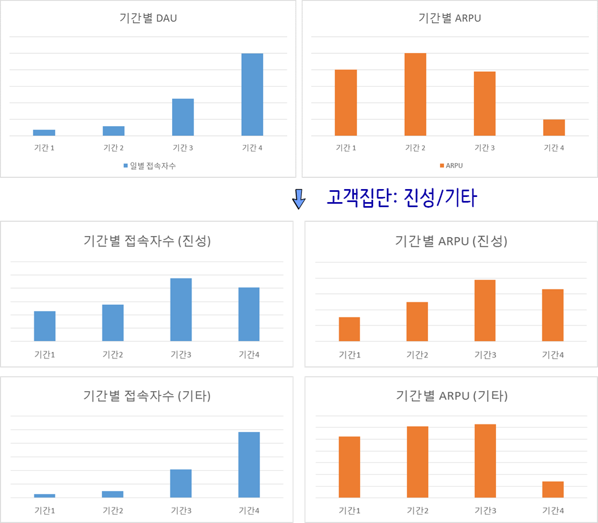

```{r, include=FALSE}
source("tools/chunk-options.R")
knitr::opts_chunk$set(echo = TRUE, warning=FALSE, message=FALSE,
                    comment="", digits = 3, tidy = FALSE, prompt = TRUE, fig.align = 'center')

library(tidyverse)
library(cowplot)
library(extrafont)
loadfonts()
```


# 심슨의 역설 [^erick-simpson] [^hr-example-simpson] {#simpson-paradox}

[^erick-simpson]: [Prof. Eric A. Suess(February 23, 2016), "Simpson’s Paradox - Correlations and Slopes"](http://rstudio-pubs-static.s3.amazonaws.com/155188_cc8b400f7d134a3e9de6cbfb8320e1e0.html)

[^hr-example-simpson]: [Paul van der Laken (27 September 2017), "Simpson’s Paradox: Two HR examples with R code."](https://paulvanderlaken.com/2017/09/27/simpsons-paradox-two-hr-examples-with-r-code/)

영국의 통계학자 에드워드 심슨이 정리한 역설(Simpson paradox)로, 전반적인 추세가 경향성이 존재하는 것으로 보이지만, 그룹으로 나눠서 개별적으로 보게 되면 경향성이 사라지거나 해석이 반대로 되는 경우를 이른다.

중요한 변수(lurking variable)가 빠져서 주로 이런 역설이 발생한다.
[심슨의 역설](https://statkclee.github.io/r-algorithm/r-history-of-probability.html#simpson-paradox-1951)은 확률의 역사에서 중요한 주제 중의 하나로 자리를 잡고 있다.


$\frac{a_1}{A_1} > \frac{b_1}{B_1}$ 이고 $\frac{a_2}{A_2} > \frac{b_2}{B_2}$
이라고 반드시 $\frac{a_1+a_2}{(A_1+A_2)} > \frac{(b_1+b_2)}{(B_1+B_2)}$ 인 것은 아니다. 
즉, "각 부분에 대한 평균이 크다고 해서 전체에 대한 평균까지 크지는 않다"는 의미이다.[^namu-simpson]

[^namu-simpson]: [나무위키, "심슨의 역설"](https://namu.wiki/w/%EC%8B%AC%EC%8A%A8%EC%9D%98%20%EC%97%AD%EC%84%A4)

<div class = "row">
  <div class = "col-md-6">

<iframe width="300" height="180" src="https://www.youtube.com/embed/ebEkn-BiW5k" frameborder="0" allow="autoplay; encrypted-media" allowfullscreen></iframe>

  </div>
  <div class = "col-md-6">

<iframe width="300" height="180" src="https://www.youtube.com/embed/E_ME4P9fQbo" frameborder="0" allow="autoplay; encrypted-media" allowfullscreen></iframe>

  </div>
</div>

# 심슨의 역설 사례 {#simpson-paradox-case-study}

심슨의 역설 사례를 책페이지수와 책가격의 관계를 살펴보자.
데이터는 책 유형(하드커버, 페이퍼백)은 두가지가 있고,
페이지수와 책가격이 달러로 구성된 데이터프레임이다.

## 데이터 시각화 {#simpson-paradox-case-study-EDA}

이를 시각적으로 표현하면 관계가 음의 상관관계를 갖는 것을 알 수 있다.

```{r simpson-data}
library(tidyverse)
simp_df <- tribble(
    ~book_type, ~num_pages, ~book_price,
    "hardcover", 150, 27.43, 
    "hardcover", 225, 48.76, 
    "hardcover", 342, 50.25, 
    "hardcover", 185, 32.01, 
    "paperback", 475, 10.00, 
    "paperback", 834, 15.73, 
    "paperback", 1020, 20.00, 
    "paperback", 790, 17.89)

simp_df %>% 
    ggplot(aes(x=num_pages, y=book_price)) +
      geom_point(size=3) +
      geom_smooth(method = "lm", se=FALSE)

```

## 기술통계량 {#simpson-paradox-case-study-EDA-cor}

`num_pages`, `book_price` 두변수를 추출하여 상관계수를 도출한다.
그리고 나서, 책 유형에 따른 상관관계도 도출해 낸다.
먼저 책 유형에 관계없이 `num_pages`, `book_price` 상관관계는 `-0.5949366`으로 나름 강한 음의 상관계수가 관측된다.

```{r simpson-data-cor}
simp_df %>% 
    summarise(book_cor = cor(num_pages, book_price)) %>% 
    pull()
```

이번에는 책 유형에 따른 상관계수는 어떤지 계산해 보자.
이 경우, 하드커버는 `0.848`, 페이퍼백은 `0.956`로 강한 양의 상관관계가 존재함이 확인된다.

```{r simpson-data-cor-group}
simp_df %>% 
    group_by(book_type) %>% 
    summarise(book_cor = cor(num_pages, book_price))
```

## 상관관계 시각화 {#simpson-paradox-case-study-EDA-cor-viz}

앞서 확인한 결과를 책 유형별로 나눠 상관계수를 시각화한다.

```{r simpson-data-cor-viz}
simp_df %>% 
    ggplot(aes(x=num_pages, y=book_price, color=book_type)) +
      geom_point(size=3) +
      geom_smooth(method = "lm", se=FALSE) +
      theme_minimal(base_family = "NanumGothic") +
      labs(x="책페이지 수", y="책가격($)", title="심슨의 역설 사례", color="책유형" )+
      theme(legend.position = "top")
```

# 심슨의 역설 기사 {#simpson-paradox-news-article}

심슨의 역설에 대해서 [동아사이언스](http://dl.dongascience.com/search?keyword=%EC%8B%AC%EC%8A%A8%EC%9D%98+%EC%97%AD%EC%84%A4)에서 2008년, 2013년 3회 심슨의 역설에 대한 기사를 실었는데 "명문대 남녀 합격생의 반전", "오류를 잡아라! 확률 법정" 의 기사가 눈에 띈다.

- [박경미 교수의 수학캠핑 - 확률 패러독스, "명문대 남녀 합격생의 반전"](http://dl.dongascience.com/magazine/view/S201307N052)
- [최영준(2013), "오류를 잡아라! 확률 법정", 수학동아](http://dl.dongascience.com/magazine/view/M201302N008)

## UC 버클리 입학 [^simpson-berkeley] {#simpson-paradox-berkeley}

[^simpson-berkeley]: [Johnny Hong(January 30, 2016), "A (very) brief introduction to ggplot2"](http://jcyhong.github.io/ggplot_demo.html)

심슨의 역설관련 가장 유명한 사례는 1973년 UC 버클리 대학 입학데이터로 입학에 성차별이 존재하는지에 관한 데이터다.


<div class = "row">
  <div class = "col-md-6">
**성별에 따른 입학률 비교**  
```{r uc-berkeley-simpson}
library(datasets)
admin_df <- UCBAdmissions %>% tbl_df

admin_df %>% 
    group_by(Gender, Admit) %>% 
    dplyr::summarise(total = sum(n)) %>% 
    spread(Admit, total) %>% 
    mutate(Admitted_Pcnt = Admitted/ (Admitted+Rejected),
           Rejected_Pcnt = Rejected/ (Admitted+Rejected)) %>% 
    DT::datatable(options = list(scrollX = TRUE)) %>% 
    DT::formatPercentage(c("Admitted_Pcnt","Rejected_Pcnt"), digits=1)
```
  </div>
  <div class = "col-md-6">
**복사하여 붙여넣기**

```{r uc-berkeley-simpson-dept}
admin_df %>% 
    group_by(Gender, Admit, Dept) %>% 
    dplyr::summarise(total = sum(n)) %>% 
    spread(Admit, total) %>% 
    mutate(Admitted_Pcnt = Admitted/ (Admitted+Rejected),
           Rejected_Pcnt = Rejected/ (Admitted+Rejected)) %>% 
    DT::datatable(options = list(scrollX = TRUE)) %>% 
    DT::formatPercentage(c("Admitted_Pcnt","Rejected_Pcnt"), digits=1)

```

  </div>
</div>

기술통계량을 통해 살펴본 사항을 그래프로 시각화한다. 막대 그래프를 통해 
남성 합격률이 여성보다 높은 것으로 나타나 성차별이 존재하는 것으로 파악되지만,
학과별로 놓고 보면 여성 합격률이 더 높거나 남성과 유사한 것으로 시각적으로 나타난다.

```{r berkeley-simpson-viz, fig.width=12}
# A barplot for overall admission percentage for each gender.

admit_g <- admin_df %>% 
    group_by(Gender, Admit) %>% 
    dplyr::summarise(total = sum(n)) %>% 
    spread(Admit, total) %>% 
    mutate(Admitted_Pcnt = Admitted/ (Admitted+Rejected),
           Rejected_Pcnt = Rejected/ (Admitted+Rejected)) %>% 
    ggplot(aes(x = Gender, y = Admitted_Pcnt, width = 0.2, fill=Gender)) +
    geom_bar(stat = "identity") +
    labs(x="성별", y="입학합격율", title="버클리 전체 입학합격률") +
    scale_y_continuous(labels = scales::percent, limits = c(0,1)) +
    theme_minimal(base_family = "NanumGothic") +
    theme(legend.position = "none") 

admit_dept_g <- admin_df %>% 
    group_by(Gender, Admit, Dept) %>% 
    dplyr::summarise(total = sum(n)) %>% 
    spread(Admit, total) %>% 
    mutate(Admitted_Pcnt = Admitted/ (Admitted+Rejected),
           Rejected_Pcnt = Rejected/ (Admitted+Rejected)) %>% 
    ggplot(aes(x = Gender, y = Admitted_Pcnt, fill=Gender)) +
    geom_bar(stat = "identity") +
    facet_grid(. ~ Dept) +
    labs(x="성별", y="", title="버클리 학과별 입학합격률") +
    scale_y_continuous(labels = scales::percent, limits = c(0,1)) +
    theme_bw(base_family = "NanumGothic") +
    theme(axis.text.x = element_text(angle = 90, hjust = 1),
          legend.position = "none") 

plot_grid(admit_g, admit_dept_g, labels = "")
```


# 실제 사례 {#simpson-paradox-news-article-case}

## 게임 업데이터 사례 [^game-case] {#simpson-paradox-news-article-game-case}

[^game-case]: [NC소프트 (2017-07-05) "데이터 분석을 이용한 게임 고객 모델링 #4"](http://blog.ncsoft.com/?p=28900)

예전에 모 게임에서 큰 규모의 업데이트를 한 후 게임 고객 동향을 분석한 적이 있습니다. 이 게임은 전체 게임 고객을 약 십 여가지 유형으로 분류하고 있는데, 크게 보면 게임 활동이 왕성하고 충성도가 높은 ‘진성’ 유형, 게임 활동이 그리 활발하지 않은 ‘라이트’ 유형, 자동 사냥 유저로 의심되는 ‘봇’ 유형 등이 있죠.

이 게임의 업데이트 전/후 일별접속자수(DAU)와 유저당 결제금액(ARPU) 지표를 확인해 보니 아래와 같이 나왔습니다.



일별 접속자수(DAU)가 크게 늘었지만 유저당 결재금액(ARPU)가 하락하여 뭔가 특단의 조치가 필요한 것으로 파악되지만, 이를 고객 집단을 반영하여 분석을 하게 되면 진성유저는 큰 차이가 없고, 크게 늘어난 유저가 봇이거나 Non-PU 유저라 봇을 비용으로 간주하여 제거하거나 Non-PU유저를 PU로 바꾸거나 PU 유저의 결재금액을 높이는 방향으로 사업적인 조치를 취하는 것이 바람직스러워 보인다.


