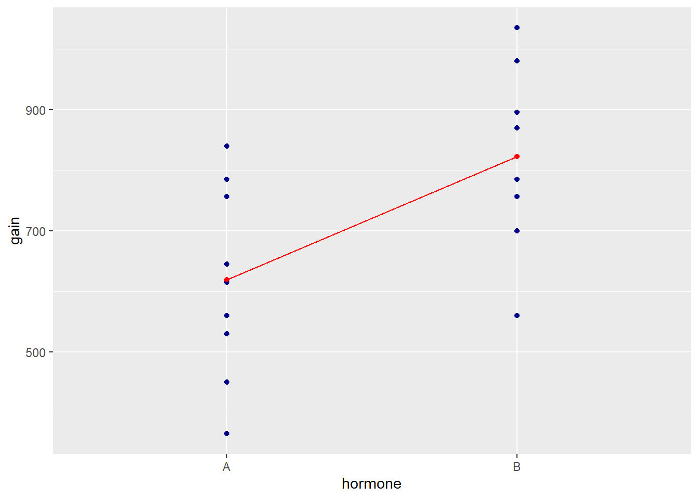
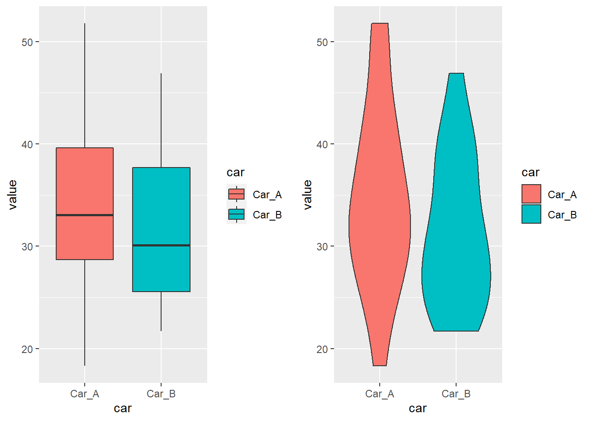

> ## 학습 목표 {.objectives}
>
> * 실무에서 자주 사용하는 검정에 대해 살펴본다.
> * 세가지 $t-$검정에 대해 이해하고 단계별 확인사항을 점검한다.
> * $t-$검정과 A/B 검정의 연결점을 파앟ㄱ한다.

## 1. 언제 $z-$검정과 $t-$검정을 사용해야 할까?

표본평균과 모평균을 비교할 때 $z-$검정과 $t-$검정을 사용하지만 결정적인 차이는 모집단 표준편차(SD)를 아느냐 모르냐에 따라 달라진다. 
일반적인 경우 모집단 표준편차를 알지 못한다. 

### 1.1. 4가지 검정 비교

$z-$검정, 단일 표본 $t-$검정, 쌍체 $t-$ 검정, 독립 $t-$검정 이 네가지 검정은 평균을 비교하는데 많이 사용되는 통계적 검정이다.
데이터에서 관측값(Observed)을 얻고, 기대값(Expected)을 빼고 이를 표준오차로 나누어서 평균 비교작업을 수행한다.

|                    |          관측값          |        기대값       |      표준오차       |
|--------------------|--------------------------|---------------------|---------------------|
| $z-$검정           |         표본 평균        |     모평균          |     평균 표준오차   |
| 단일 표본 $t-$검정 |         표본 평균        |     모평균          |     평균 표준오차   |
| 쌍체 $t-$ 검정     |   점수 차이 표본 평균    | 점수 차이 모평균    | 평균차이 표준오차   |
| 독립 $t-$검정      |     두 표본평균 차이     |  두 표본평균 차이   | 평균간 차이 표준오차|

### 1.2. 표집 분포

요약 통계량에 대한 가설분포를 표집 분포라고 부른다.  $z-$검정의 경우 표집분포의 평균은 근사적으로 모평균과 같고,
표집분포의 표준편차는 표준오차가 된다. 중심극한정리에 따라 표본크기가 증가함에 따라 표준오차는 감소한다. 

귀무가설 유의성검정(Null Hypothesis Significance Testing, NHST) 얼개에 따르면, 귀무가설은 효과가 없다가 된다.
표준오차는 표본크기가 증가함에 따라 감소하게 된다.

$\textrm{표준오차}\downarrow = \frac{\textrm{모 표준편차}}{\sqrt{\textrm{표본 크기}\uparrow}}$

$p-$값은 확률값(Probability Value)를 줄인 것으로 귀무가설이 참일 때 조건부 확률값이 된다. 
표준오차는 우연에 의한 차이로 볼 수 있는데, 우연의 차이가 아닌 유의성을 주장하려면 적어도 **$2 \times$ 표준편차** 보다 차이가 나야 된다. 

## 2. $t-$검정

### 2.1. 일표본 $t-$검정  [^one-sample-t-test-raccoon]

[^one-sample-t-test-raccoon]: [1-sample t-test](http://www.quantide.com/raccoon-ch-2-1-1-sample-t-test-with-r/)

모집단 모수 ($\mu$)를 알고 있는 경우, 데이터를 통해 모수가 변경되었는지를 통계적 검정을 수행한다.

이론적 화학 반응온도가 180도임을 알고 있는데, 정말 반응온도가 180도인가를 데이터를 통해 검정한다.
`qdata` 팩키지에서 `reaction` 데이터를 뽑아낸다. 그리고, 기술통계량과 기본 시각화를 통해 데이터를 이해한다.

~~~{.r}
# devtools::install_github(repo = "quantide/qdata")

require(ggplot2)
require(dplyr)
require(gridExtra)
require(tidyr)
require(qdata)
~~~

~~~{.output}
Loading required package: qdata

~~~

~~~{.r}
require(lsr)
require(nortest)
require(car) 

data(reaction) 

# 1. t-검정---------------------------------------
# 목적: 화학반응이 180도 인지 검정
data(reaction)
glimpse(reaction)
~~~

~~~{.output}
 num [1:10] 181 179 181 178 180 ...

~~~

~~~{.r}
## 1.1. 기술통계량---------------------------------
reaction <- data.frame(reaction=reaction, index=1:10)

summary_stat <- reaction %>%  summarise(n=n(),
                                        min=min(reaction),
                                        first_qu=quantile(reaction, 0.25),
                                        mean=mean(reaction),
                                        median=median(reaction),
                                        third_qu=quantile(reaction, 0.75),
                                        max=max(reaction),
                                        sd=sd(reaction))

print(summary_stat)
~~~

~~~{.output}
   n   min first_qu   mean median third_qu   max       sd
1 10 176.9  178.725 179.49  179.6   180.55 181.3 1.427079

~~~

~~~{.r}
## 1.2. 데이터 시각화---------------------------------
# 인덱스 갖는 시각화
ggp <- ggplot(data = reaction, mapping=aes(x=index, y=reaction)) + 
  geom_point() + 
  ylim(c(177,183)) +
  ylab("반응 온도") +
  xlab("") +
  geom_hline(yintercept = 180, color="red") +
  geom_hline(yintercept = mean(reaction$reaction), color="darkgreen")

ggp
~~~

~~~{.r}
# 인덱스 없는 시각화
reaction$index <- rep(0, times=10)
ggp <- ggplot(data = reaction, mapping=aes(x=reaction, y=index)) + 
  geom_point() + ylim(c(-2,2)) +
  geom_vline(xintercept = 180, color="red") +
  geom_vline(xintercept = mean(reaction$reaction), color="darkgreen") +
  ylab("") +
  xlab("반응 온도")+
  theme(axis.text.y=element_blank(), axis.ticks=element_blank()) +
  annotate("text", label = "반응온도 평균", x = 178.8, y = 2, size = 4, colour = "darkgreen") +
  annotate("text", label = "이론 반응온도", x = 180.3, y = 2, size = 4, colour = "red")

ggp
~~~

일표본 $t-$검정의 가정인 정규성을 앤더슨-다링(Anderson-Darling) 통계량을 활용하여 검정하고 
분위수-분위수 그림(quantile-quantile plot, QQ-plot)을 통해 정규성을 확인한다.

가정이 만족되었기 때문에, t.test() 함수를 활용하여 `mu=180` 인자를 넣어 가설검정하면,
p-값이 0.05보다 크기 때문에 180과 차이는 우연에 의한 것으로 판정되어 이론적 반응온도는 여전히 180도라고 결론낼 수 있다.

~~~{.r}
## 1.3. 가설검정---------------------------------
# 정규분포 검정 통계량
ad.test(reaction$reaction)
~~~

~~~{.output}

	Anderson-Darling normality test

data:  reaction$reaction
A = 0.25437, p-value = 0.6473

~~~

~~~{.r}
# 정규분포 QQ-플롯
ggp <- ggplot(data = reaction, mapping = aes(sample = reaction)) + 
  stat_qq(color="darkblue", size=2) +
  geom_abline(mapping = aes(intercept=mean(reaction),slope=sd(reaction)), color="red", linetype=2)
ggp
~~~

~~~{.r}
# t-검정

t.test(reaction$reaction, mu = 180)
~~~

~~~{.output}

	One Sample t-test

data:  reaction$reaction
t = -1.1301, df = 9, p-value = 0.2876
alternative hypothesis: true mean is not equal to 180
95 percent confidence interval:
 178.4691 180.5109
sample estimates:
mean of x 
   179.49 

~~~

### 2.2. 독립 $t-$검정 [^two-sample-t-test-raccoon]

[^two-sample-t-test-raccoon]: [2 sample t-test and paired t](http://www.quantide.com/raccoon-ch-2-2-2-sample-t-test-and-paired-t/)

신규 기능이 소프트웨어에 추가되었는데 이에 대해 매출 효과가 발생했는지 측정하는데 있어, 
한 사용자 집단은 기존 방식대로 기능을 제공하여 매출을 측정하고, 다른 사용자 집단은 신규 기능이 추가된 소프트웨어를 제공하여
유의적인 매출 증대효과가 있는지 검증할 때 독립 이표본 $t-$검정을 사용한다.

$t-\textrm{값} = \frac {\textrm{관측값} - \textrm{기대값}}{\textrm{표준오차}}$

$t = \frac{\bar {X}_1 - \bar{X}_2}{s_{X_1X_2} \cdot \sqrt{\frac{2}{n}}}$

여기서 $s_{X_1X_2} = \sqrt{\frac{s_{X_1}^2+s_{X_2}^2}{2}}$

> ### $t-$ 검정 편향 문제 {.callout}
> 
> $t-$검정은 표본 크기에 따라 편향되는 문제가 있어 코헨-d (Cohen d)가 일반적인 효과크기 추정치가 된다.
> 
> 코헨-d는 다음과 같이 정의된다.
> 
> $d = \frac{\bar{x}_1 - \bar{x}_2}{s}$
> 
> 여기서, $s = \sqrt{\frac{(n_1-1)s^2_1 + (n_2-1)s^2_2}{n_1+n_2 - 2}}$는 두 표준편차를 합동하여 합친 것이 된다.

두 집단간 평균의 차이를 검증할 때 또 확인해야 되는 사항이 등분산성 검정이다. 
두 집단의 분산이 동일해야 여기에서 추론하는 결론이 유의미할 수 있다.
등분산성 가정을 검정하는 방법이 [레빈 검정(Levene test)](https://en.wikipedia.org/wiki/Levene%27s_test)이다. 
따라서 독립 $t-$검정을 시작하기 전에 레빈 검정을 통해 등분산성이 만족되는지 사전에 확인하고 이게 충족되면 $t-$검정 혹은 분산분석으로 넘어가고 
그렇지 않는 경우 비모수 검정이나 일반화된 웰치 $t-$검정(Welch $t-$test)로 넘어간다.
웰치 $t-$검정의 또다른 이름은 이분산(unequal variance) $t-$ 검정으로 $t-$ 검정을 일반화한 것이다.

즉, 등분산성 가정이 만족되지 않고, 두집단간 표본크기가 불균형된 경우 웰치 $t-$검정을 우선 검토한다.

$W = \frac{(N-k)}{(k-1)} \frac{\sum_{i=1}^k N_i (Z_{i\cdot}-Z_{\cdot\cdot})^2} {\sum_{i=1}^k \sum_{j=1}^{N_i} (Z_{ij}-Z_{i\cdot})^2}$

#### 2.2.1. 호르몬이 닭 성장에 미치는 영향

두가지 호르몬이 있고 두 호르몬 차이가 닭 성장에 유의적인 영향을 미치는지 검정한다.
기술통계량을 통해 평균, 분산, 분위수 등을 확인하고 바이올린/상자 그림을 통해 호르몬간 닭성장에 차이가 있는지 살펴본다.

~~~{.r}
# 1. 이표본 t-검정---------------------------------------
# 목적: 호르몬이 닭 성장에 미치는 영향 측정
data(hormones)
glimpse(hormones)
~~~

~~~{.output}
Observations: 18
Variables: 2
$ hormone <fctr> A, A, A, A, A, A, A, A, A, A, B, B, B, B, B, B, B, B
$ gain    <int> 615, 645, 840, 645, 365, 450, 530, 756, 785, 560, 870,...

~~~

~~~{.r}
## 1.1. 기술통계량 

hormones %>% group_by(hormone) %>%
  summarise(cases = n(),
            min = min(gain), 
            first_qu = quantile(gain, 0.25),
            median = median(gain),
            mean = mean(gain),
            third_qu = quantile(gain, 0.75),
            max = max(gain),
            sd = sd(gain))
~~~

~~~{.output}
# A tibble: 2 × 9
  hormone cases   min first_qu median    mean third_qu   max       sd
   <fctr> <int> <int>    <dbl>  <dbl>   <dbl>    <dbl> <int>    <dbl>
1       A    10   365    537.5  630.0 619.100   728.25   840 149.4482
2       B     8   560    742.0  827.5 822.625   916.25  1035 154.5574

~~~

~~~{.r}
## 1.2. 데이터 시각화

gg_violin <- ggplot(data = hormones, mapping = aes(x=hormone, y=gain, fill=hormone)) +
  geom_violin()

gg_boxplot <- ggplot(data = hormones, mapping = aes(x=hormone, y=gain, fill=hormone)) +
  geom_boxplot()

grid.arrange(gg_boxplot, gg_violin, ncol = 2)
~~~

~~~{.r}
# 평균 비교

hormones_mean <- hormones %>% group_by(hormone) %>% summarise(gain=mean(gain))

ggp <- ggplot(data = hormones, mapping = aes(x=hormone, y=gain)) +
  geom_jitter(position = "dodge", color="darkblue") +
  geom_point(data=hormones_mean, mapping = aes(x=hormone,y=gain), colour="red", group=1) +
  geom_line(data=hormones_mean, mapping = aes(x=hormone,y=gain), colour="red", group=1) 

print(ggp)   
~~~

호르몬 두가지 성분별로 닭성장 분포가 정규분포를 따르는지, 두 분포의 등분산성이 만족되는지 확인한다.

**코헨 d** 는 표준오차가 아닌 표준 편차로 나눈다.

~~~{.r}
# 정규분포 가정사항 확인--------------------------------------------------

# 정규분포 검정 통계량
tapply(hormones$gain, hormones$hormone, ad.test)
~~~

~~~{.output}
$A

	Anderson-Darling normality test

data:  X[[i]]
A = 0.15886, p-value = 0.926

$B

	Anderson-Darling normality test

data:  X[[i]]
A = 0.13781, p-value = 0.9557

~~~

~~~{.r}
# 등분산 검정
var.test(gain ~ hormone, data = hormones)
~~~

~~~{.output}

	F test to compare two variances

data:  gain by hormone
F = 0.93498, num df = 9, denom df = 7, p-value = 0.9031
alternative hypothesis: true ratio of variances is not equal to 1
95 percent confidence interval:
 0.1938497 3.9241513
sample estimates:
ratio of variances 
         0.9349792 

~~~

~~~{.r}
bartlett.test(gain ~ hormone,data=hormones)
~~~

~~~{.output}

	Bartlett test of homogeneity of variances

data:  gain by hormone
Bartlett's K-squared = 0.0083868, df = 1, p-value = 0.927

~~~

~~~{.r}
leveneTest(gain ~ hormone,data=hormones)
~~~

~~~{.output}
Levene's Test for Homogeneity of Variance (center = median)
      Df F value Pr(>F)
group  1  0.0321 0.8601
      16               

~~~

~~~{.r}
# 정규분포 QQ-플롯
hormones_a <- hormones %>% filter(hormone =="A") 
hormones_b <- hormones %>% filter(hormone =="B")

ggp1 <- ggplot(data = hormones_a, mapping = aes(sample = gain)) + 
  stat_qq(color="#F8766D", size=2) +
  geom_abline(intercept=mean(hormones_a$gain),slope=sd(hormones_a$gain), color="red", linetype=2) +
  ylab("hormone A") + ggtitle("q-q plot of hormone A")

ggp2 <- ggplot(data = hormones_b, mapping = aes(sample = gain)) + 
  stat_qq(color="#00C094", size=2) +
  geom_abline(mapping = aes(intercept=mean(hormones_b$gain),slope=sd(hormones_b$gain)), color="red", linetype=2) +
  ylab("hormone B") + ggtitle("q-q plot of hormone B")

grid.arrange(ggp1, ggp2, nrow = 2)
~~~

~~~{.r}
# t-검정
t.test(gain ~ hormone, data = hormones, var.equal = TRUE) 
~~~

~~~{.output}

	Two Sample t-test

data:  gain by hormone
t = -2.8283, df = 16, p-value = 0.01211
alternative hypothesis: true difference in means is not equal to 0
95 percent confidence interval:
 -356.07303  -50.97697
sample estimates:
mean in group A mean in group B 
        619.100         822.625 

~~~

~~~{.r}
lsr::cohensD(gain ~ hormone, method = "pooled", data=hormones)
~~~

~~~{.output}
Error in lsr::cohensD(gain ~ hormone, method = "pooled", data = hormones): 함수 "is"를 찾을 수 없습니다

~~~

$t-$검정을 회귀분석이나 분산분석을 통해 효과크기를 측정하는 것도 가능하다.
이를 위해 회귀식을 적용하고 나서 `broom` 팩키지 `tidy` 함수와 `augment` 함수를 통해
`tibble` 데이터프레임을 통해 일관성을 갖고 편하게 회귀분석에서 나온 결과물을 통한 잔차 분석이 가능하다.

~~~{.r}
## 3. 모형--------------------------------------------------

lm_fit <- lm(gain ~ hormone, data = hormones) 
lm_fit
~~~

~~~{.output}

Call:
lm(formula = gain ~ hormone, data = hormones)

Coefficients:
(Intercept)     hormoneB  
      619.1        203.5  

~~~

~~~{.r}
# 모형 검정

lm_fit_tidy <- tidy(lm_fit)
lm_fit_tidy_aug <- augment(lm_fit)

ad.test(lm_fit_tidy_aug$.resid)
~~~

~~~{.output}

	Anderson-Darling normality test

data:  lm_fit_tidy_aug$.resid
A = 0.18963, p-value = 0.8859

~~~

~~~{.r}
ggp <- ggplot(data = lm_fit_tidy_aug, mapping = aes(sample = .resid, color=hormone)) + 
  stat_qq(size=2) +
  geom_abline(mapping = aes(intercept=mean(.resid), slope=sd(.resid)), colour="red", linetype=2)

print(ggp)
~~~

- 코헨-d 효과 참조 표

|   `효과 크기`    |    d   |     참고문헌                  |
|------------------|--------|-------------------------------|
| Very Small       |  0.01  | Sawilowsky, 2009              |
| Small            |  0.20  | Cohen, 1988                   |
| Medium           |  0.50  | Cohen, 1988                   |
| Large            |  0.80  | Cohen, 1988                   |
| Very Large       |  1.20  | Sawilowsky, 2009              |
| Huge             |  2.0   | Sawilowsky, 2009              |

### 1.4. 쌍체 $t-$검정

독립 $t-$검정과 비교하여 종속 $t-$검정이라고 하고 동일한 사용자가 반복해서 특정 요인에 차이가 있는지 검정할 때 사용된다.
각 사용자마다 전후 평균 차이를 검정한다.

유의성 검정은 표본 크기에 따라 편향이 발생하게 된다. 표본 크기가 커지게 되면 표준오차가 작아지게 된다.
표본 크기가 클 때, 관측된 작은 차이도 "통계적 유의성"을 갖게 된다. **효과크기(effect size)**는 효과의 크기를 추정한다. 

운전자 20명을 뽑아 주차시간을 비교한 것으로 `Car_A`는 주차보조장치를 지원하고 `Car_B`는 주차보조장치를 지원하지 않았다.

~~~{.r}
# 1. 이표본 t-검정---------------------------------------
data(carctl)
glimpse(carctl)
~~~

~~~{.output}
Observations: 20
Variables: 2
$ Car_A <dbl> 35.35893, 28.92554, 32.06672, 40.60713, 18.30239, 33.109...
$ Car_B <dbl> 28.64091, 24.40056, 37.25117, 39.93487, 21.71100, 27.735...

~~~

~~~{.r}
## 1.1. 데이터 시각화

carctl <- carctl %>%  gather(car, value, Car_A, Car_B)

gg_boxplot <- ggplot(data = carctl, mapping = aes(x=car, y=value, fill=car)) +
  geom_boxplot()

gg_violin <- ggplot(data = carctl, mapping = aes(x=car, y=value, fill=car)) +
  geom_violin()

grid.arrange(gg_boxplot, gg_violin, ncol = 2)
~~~

~~~{.r}
# 평균 비교
carctl_mean <- carctl %>% group_by(car) %>% summarise(value=mean(value))

ggp <- ggplot(data = carctl, mapping = aes(x=car, y=value)) +
  geom_jitter(position = "dodge", color="darkblue") +
  geom_point(data=carctl_mean, mapping = aes(x=car,y=value), colour="red", group=1) +
  geom_line(data=carctl_mean, mapping = aes(x=car,y=value), colour="red", group=1) 

print(ggp)  
~~~

`t.test()` 함수에 `paired=TRUE` 인자를 넣어주어 쌍체 $t-$검정을 설정하여 검정한다.

~~~{.r}
# 정규분포 가정사항 확인--------------------------------------------------
data(carctl)
carctl <- carctl %>% mutate(car_diff = Car_A - Car_B)

# 정규분포 검정 통계량
ad.test(x=carctl$car_diff)  
~~~

~~~{.output}

	Anderson-Darling normality test

data:  carctl$car_diff
A = 0.29177, p-value = 0.5704

~~~

~~~{.r}
# 등분산 검정

# 정규분포 QQ-플롯
ggp <- ggplot(data = carctl, mapping = aes(sample = car_diff)) + 
  stat_qq(color="darkblue", size=2) +
  geom_abline(mapping = aes(intercept=mean(car_diff), slope=sd(car_diff)), colour="red", linetype=2)

print(ggp)
~~~

~~~{.r}
# 쌍체 t-검정: mu = 0 검정
carctl <- carctl %>% mutate(car_diff = Car_A - Car_B)
t.test(carctl$car_diff, mu=0)
~~~

~~~{.output}

	One Sample t-test

data:  carctl$car_diff
t = 3.8735, df = 19, p-value = 0.001023
alternative hypothesis: true mean is not equal to 0
95 percent confidence interval:
 1.431407 4.796801
sample estimates:
mean of x 
 3.114104 

~~~

~~~{.r}
t.test(x=carctl$Car_A, y=carctl$Car_B, paired=TRUE)
~~~

~~~{.output}

	Paired t-test

data:  carctl$Car_A and carctl$Car_B
t = 3.8735, df = 19, p-value = 0.001023
alternative hypothesis: true difference in means is not equal to 0
95 percent confidence interval:
 1.431407 4.796801
sample estimates:
mean of the differences 
               3.114104 

~~~

~~~{.r}
# 코헨 d t-검정
cohensD(x=carctl$Car_A, y=carctl$Car_B, method = "paired")
~~~

~~~{.output}
Error in cohensD(x = carctl$Car_A, y = carctl$Car_B, method = "paired"): 함수 "is"를 찾을 수 없습니다

~~~

## 3. A/B검정에 활용되는 일반적 통계량 

|      가정한 분포      |        사례           |      일반적 검정      |
|-----------------------|-----------------------|-----------------------|
|    정규 분포          | 구매고객 평균 매출    |    웰치 $t-$검정      |
|    이항 분포          |     클릭율(CTR)       |   피셔의 정확검정     |
|    포아송 분포        | 구매고객 평균 매매량  |     E-검정            |
|    다항 분포          | 제품별 구매 수량      |   카이 제곱 검정      |
|   분포 가정 없음      |                       |   만-위트니 U 검정    |

### 3.1. 피셔의 정확검정을 통한 광고 연결률 효과 분석 [^fisher-exact-ctr]

[^fisher-exact-ctr]: [The Only* Statistical Significance Test You Need](http://www.lunametrics.com/blog/2014/07/01/statistical-significance-test/)

광고 A [광고 연결률(CTR, click through rates)](http://terms.naver.com/entry.nhn?docId=819411&cid=42344&categoryId=42344)이 1.1%, 광고 B 클릭율이 1.3% 으로 나왔다면 
1.3% > 1.1% 로직으로 광고 A가 더 좋을까? 그럴수도 그렇지 않을 수도 있다.

사용자 1,000명 대상 광고 효과를 A/B 검정하면 유의적이지 않지만, 100,000 명 대상으로 광고효과를 검정하면 유의적으로 파악된다.
동일한 1.3%, 1.1% 광고 연결률이지만 사용대상자 숫자에 따라 통계적 추론을 달라진다.

~~~{.r}
# 1. 피셔의 정확검정(Fisher's exact test)--------------------------
## 1,000 번 사례
ad_1000 <-  matrix(c(11, 13, 989, 987), nrow = 2,
                  dimnames = list(ads   = c("Ad A", "Ad B"),
                                  click = c("Click", "No Click")))
ad_1000
~~~

~~~{.output}
      click
ads    Click No Click
  Ad A    11      989
  Ad B    13      987

~~~

~~~{.r}
fisher.test(ad_1000, alternative = "two.sided")
~~~

~~~{.output}

	Fisher's Exact Test for Count Data

data:  ad_1000
p-value = 0.8378
alternative hypothesis: true odds ratio is not equal to 1
95 percent confidence interval:
 0.3407936 2.0539927
sample estimates:
odds ratio 
  0.844515 

~~~

~~~{.r}
## 100,000 번 사례
ad_100000 <-  matrix(c(1100, 1300, 98900, 98700), nrow = 2,
                  dimnames = list(ads   = c("Ad A", "Ad B"),
                                  click = c("Click", "No Click")))
ad_100000
~~~

~~~{.output}
      click
ads    Click No Click
  Ad A  1100    98900
  Ad B  1300    98700

~~~

~~~{.r}
fisher.test(ad_100000, alternative = "two.sided")
~~~

~~~{.output}

	Fisher's Exact Test for Count Data

data:  ad_100000
p-value = 4.335e-05
alternative hypothesis: true odds ratio is not equal to 1
95 percent confidence interval:
 0.7782170 0.9162075
sample estimates:
odds ratio 
 0.8444445 

~~~

