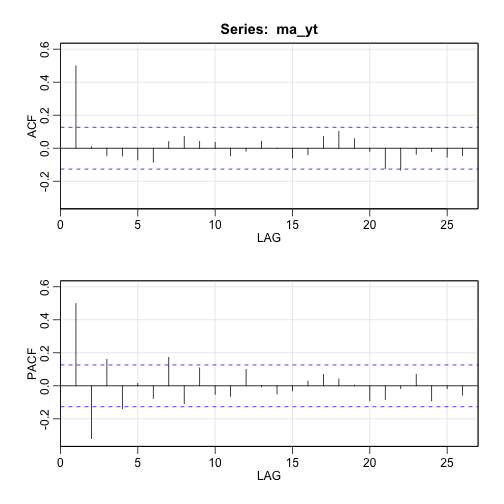
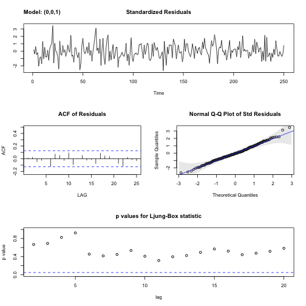

> ## 학습 목표 {.objectives}
>
> * 자기회귀이동평균(ARMA) 모형을 이해한다.
> * 자기회귀이동평균 모형을 식별하는 도구 자기상관함수(ACF), 편자기상관함수(PACF)를 살펴본다.
> * 시계열 모형 식별을 위한 박스-젠킨스 방법론을 적용한다. 

## 1. 박스-젠킨스 방법론 [^time-series-box-jenkins]

[^time-series-box-jenkins]: [위키백과사전: Box–Jenkins method](https://en.wikipedia.org/wiki/Box%E2%80%93Jenkins_method)

박스-젠킨스 방법론은 지난 과거 시계열 데이터를 가장 잘 접합시키는 방법론을 제안했다. 
박스-젠킨스 시계열 모형 적합 방법론은 총 3단계로 구성된다.

- 모형 식별(Model Identification): 시계열 데이터의 정상성을 확인하고 계절변동이 있는지도 확인한다. 특히 
편자기상관함수(PACF, Partial Autocorrelation Function), 자기상관함수(ACF, AutoCorrelation Function)를 사용해서
자기회귀이동평균 모형 $p, q$ 차수를 결정한다.
- 모수 추정(Parameter Estimation): 시계열 모형에 대한 추정은 회귀분석의 최소제곱방법과 유사하지만 가우스-뉴튼 아이디어에 기초해서
컴퓨터를 활요한 수치해석방법을 적용한다.
- 모형검정(Model Diagnostics): 자기회귀이동평균 모형을 적용시키고 남은 잔차의 정상성을 확인하는데 중점을 두는데,
특히 잔차가 서로 독립이고 시간에 따라 평균과 분산이 일정한지 검증한다. 
시계열 데이터의 자기상관을 검정하는 융-박스(Ljung-Box) 통계량, 평균과 분산이 일정한지, 자기상관함수와 편자기상관함수를 사용하여 
추가적으로 모형에 누락된 것이 없는지 검정한다.

추가적으로 시계열 데이터에 대한 최적 모형을 정보이론 (AIC, BIC)에 따라 적절한 차수를 선정한 자기회귀이동평균이 채택되면 
예측(forecast)함수를 통해 예측을 한다. 

## 2. 자기회귀이동평균(ARMA) 모형

자기회귀이동평균 모형을 짚고 넘어가기 전에 선형회귀모형을 먼저 살펴보자.

$Y_i = \beta X_i + \epsilon_i$ 

선형회귀모형은 수학적으로 표현하면 위와 같고 오차항 $\epsilon_i$는 $i.i.d$ 가정을 한다.
즉, 동일한 분산을 갖는 서로 독립적인 정규분포다. 

- 자기회귀(AR) 모형 : $Y_t = \phi Y_{t-1} + \epsilon_t$, 여기서 $\epsilon_t$는 백색잡음
- 이동평균(MA) 모형 : $\epsilon_t= W_t + \theta W_{t-1}$, 여기서 $W_t$는 백색잡음
- 자기회귀이동평균(ARMA) 모형 : $X_t = \phi X_{t-1} + W_t + \theta W_{t-1}$

즉, 정상성 조건이 충족된다는 가정하에 현재 관측점은 과거 $p$차까지 자기회귀를 하고 남은 잔차의 상관관계를 필터링하여 백색잡음을 만드는 모형이다.

### 2.1. 자기회귀이동평균(ARMA) 모형 식별

로그변환(log transformation)과 차분(difference)을 통해 정상성과 더불어 계절변동성을 제거한 후에 
편자기상관함수(PACF, Partial Autocorrelation Function), 자기상관함수(ACF, AutoCorrelation Function)를 도식화하고 이를 통해 
자기회귀이동평균 차수를 선정한다.

|                      |   자기회귀: AR($p$)       |     이동평균: MA($p$)           |  자기회귀이동평균: ARMA($p,q$) |
|----------------------|---------------------------|---------------------------------|--------------------------------|
| 자기상관함수(ACF)    | 지수적 감소, 축퇴하는 사인 형태(tail off) | $q+1$ 차항부터 절단모양                  | $q+1$ 차항부터 지수적 감소 혹은 축퇴하는 사인형태(tail off) |
| 편자기상관함수(PACF) | $p+1$ 차항부터 절단모양                   |지수적 감소, 축퇴하는 사인 형태(tail off) | $p+1$ 차항부터 지수적 감소 혹은 축퇴하는 사인형태(tail off) |

#### 2.1.1. 자기회귀 AR(1) 모형

자기회귀 평균 $\mu=7$을 갖고 상관계수 $\phi=0.7$을 갖는 모형은 다음과 같다.

$Y_t = 7 + 0.7(Y_{t-1} -7) + W_t$

상기 자기회귀모형을 적합시키면 `sarima` 함수를 통해 적합시킨 결과가 거의 유사함을 확인된다.
또한, `acf2` 함수를 통해 자기상관함수는 지수적 감소하고, 편자기상관함수는 2차항부터 절단모양이 관찰된다.

~~~{.r}
# library(astsa)

# AR(1) 모의시험 모형------------------------------------------------ 
ar_yt <- arima.sim(list(order = c(1, 0, 0), ar = 0.7), n = 250) + 7

# ACF, PACF
acf2(ar_yt)
~~~

~~~{.output}
        ACF  PACF
 [1,]  0.66  0.66
 [2,]  0.40 -0.06
 [3,]  0.27  0.07
 [4,]  0.22  0.04
 [5,]  0.13 -0.06
 [6,]  0.11  0.07
 [7,]  0.07 -0.04
 [8,]  0.03 -0.03
 [9,]  0.04  0.06
[10,]  0.01 -0.07
[11,] -0.05 -0.08
[12,] -0.08  0.00
[13,] -0.08 -0.03
[14,] -0.10 -0.04
[15,] -0.12 -0.03
[16,] -0.11  0.00
[17,] -0.13 -0.07
[18,] -0.14 -0.02
[19,] -0.17 -0.10
[20,] -0.14  0.05
[21,] -0.09  0.04
[22,] -0.06 -0.01
[23,] -0.04  0.00
[24,] -0.05 -0.04
[25,] -0.06 -0.02
[26,] -0.13 -0.14

~~~

~~~{.r}
ar_yt_fit <- sarima(ar_yt, p = 1, d = 0, q = 0)
~~~

~~~{.output}
initial  value 0.193852 
iter   2 value -0.096331
iter   3 value -0.096339
iter   4 value -0.096352
iter   5 value -0.096352
iter   6 value -0.096353
iter   6 value -0.096353
final  value -0.096353 
converged
initial  value -0.094840 
iter   2 value -0.094848
iter   3 value -0.094885
iter   4 value -0.094886
iter   5 value -0.094887
iter   6 value -0.094887
iter   6 value -0.094887
final  value -0.094887 
converged

~~~

~~~{.r}
ar_yt_fit$ttable
~~~

~~~{.output}
      Estimate     SE t.value p.value
ar1     0.6666 0.0474 14.0532       0
xmean   7.2065 0.1710 42.1338       0

~~~

#### 2.1.2. 이동평균 MA(1) 모형

$\theta=0.7$ 모수를 갖는 시계열을 `sarima()` 함수 이동평균 모형에 적합시키게 되면 모수의 유사함이 확인된다.

$Y_t = W_t + 0.7W_{t-1}$

또한, `acf2` 함수를 통해 자기상관함수는 2차항부터 절단모향이 관찰되고, 편자기상관함수는 지수적 감소, 축퇴하는 사인형태를 보인다.

~~~{.r}
# MA(1) 모의시험 모형------------------------------------------------ 
ma_yt <- arima.sim(list(order = c(0, 0, 1), ma = 0.7), n = 250)

# ACF, PACF
acf2(ma_yt)
~~~

~~~{.output}
        ACF  PACF
 [1,]  0.46  0.46
 [2,] -0.02 -0.31
 [3,] -0.08  0.11
 [4,] -0.01 -0.04
 [5,]  0.06  0.08
 [6,]  0.10  0.04
 [7,]  0.05 -0.01
 [8,] -0.02 -0.02
 [9,]  0.03  0.10
[10,]  0.10  0.03
[11,]  0.07  0.00
[12,] -0.04 -0.08
[13,] -0.07  0.02
[14,]  0.03  0.07
[15,]  0.02 -0.09
[16,] -0.11 -0.13
[17,] -0.12  0.02
[18,] -0.07 -0.04
[19,] -0.07 -0.06
[20,] -0.03  0.01
[21,]  0.05  0.06
[22,]  0.04  0.01
[23,] -0.02 -0.02
[24,] -0.12 -0.15
[25,] -0.09  0.07
[26,] -0.08 -0.09

~~~

~~~{.r}
ma_yt_fit <- sarima(ma_yt, p = 0, d = 0, q = 1)
~~~

~~~{.output}
initial  value 0.179759 
iter   2 value 0.020912
iter   3 value 0.010242
iter   4 value 0.005622
iter   5 value 0.004461
iter   6 value 0.004396
iter   7 value 0.004396
iter   8 value 0.004395
iter   9 value 0.004394
iter  10 value 0.004394
iter  11 value 0.004394
iter  12 value 0.004394
iter  13 value 0.004394
iter  13 value 0.004394
iter  13 value 0.004394
final  value 0.004394 
converged
initial  value 0.004911 
iter   2 value 0.004910
iter   3 value 0.004910
iter   4 value 0.004910
iter   4 value 0.004910
iter   4 value 0.004910
final  value 0.004910 
converged

~~~

~~~{.r}
ma_yt_fit$ttable
~~~

~~~{.output}
      Estimate     SE t.value p.value
ma1     0.6182 0.0475 13.0077  0.0000
xmean   0.0401 0.1026  0.3909  0.6962

~~~

#### 2.1.3. 자기회귀이동평균 ARMA(1,1) 모형

$\theta=0.7$,  $\phi=0.7$ 모수를 갖는 시계열을 `sarima()` 함수에 ARMA 모형을 적합시키게 되면 모수의 유사함이 확인된다.

$Y_t = 0.7Y_{t-1} + W_t + 0.7W_{t-1}$

또한, `acf2` 함수를 통해 자기상관함수와 편자기상관함수는 모두 지수적 감소, 축퇴하는 사인형태를 보인다.

~~~{.r}
# ARMA(1,1) 모의시험 모형------------------------------------------------ 
arma_yt <- arima.sim(list(order = c(1, 0, 1), ar=0.7, ma = 0.7), n = 250)

# ACF, PACF
acf2(arma_yt)
~~~

~~~{.output}
        ACF  PACF
 [1,]  0.85  0.85
 [2,]  0.62 -0.39
 [3,]  0.46  0.25
 [4,]  0.32 -0.23
 [5,]  0.21  0.13
 [6,]  0.15 -0.03
 [7,]  0.14  0.15
 [8,]  0.15 -0.03
 [9,]  0.17  0.06
[10,]  0.15 -0.11
[11,]  0.12  0.03
[12,]  0.09 -0.02
[13,]  0.06 -0.01
[14,]  0.02 -0.06
[15,] -0.03 -0.02
[16,] -0.05  0.00
[17,] -0.07 -0.08
[18,] -0.11 -0.06
[19,] -0.14 -0.01
[20,] -0.14  0.04
[21,] -0.12 -0.02
[22,] -0.10  0.05
[23,] -0.06  0.04
[24,] -0.05 -0.15
[25,] -0.08 -0.04
[26,] -0.10  0.07

~~~

~~~{.r}
arma_yt_fit <- sarima(arma_yt, p = 1, d = 0, q = 1)
~~~

~~~{.output}
initial  value 0.831014 
iter   2 value 0.042071
iter   3 value 0.034195
iter   4 value 0.011620
iter   5 value 0.010314
iter   6 value 0.009381
iter   7 value 0.009274
iter   8 value 0.009267
iter   9 value 0.009266
iter  10 value 0.009263
iter  11 value 0.009259
iter  12 value 0.009259
iter  13 value 0.009259
iter  13 value 0.009259
iter  13 value 0.009259
final  value 0.009259 
converged
initial  value 0.012943 
iter   2 value 0.012916
iter   3 value 0.012902
iter   4 value 0.012901
iter   5 value 0.012896
iter   6 value 0.012894
iter   7 value 0.012893
iter   8 value 0.012893
iter   9 value 0.012893
iter  10 value 0.012893
iter  10 value 0.012893
iter  10 value 0.012893
final  value 0.012893 
converged

~~~

~~~{.r}
arma_yt_fit$ttable
~~~

~~~{.output}
      Estimate     SE t.value p.value
ar1     0.6843 0.0482 14.1905  0.0000
ma1     0.7990 0.0456 17.5022  0.0000
xmean   0.1657 0.3595  0.4609  0.6453

~~~

### 2.2. 정보이론 기반 자기회귀이동평균(ARMA) 모형 선정

AIC와 BIC를 활용하여 최적차수를 갖는 자기회귀이동평균 모형을 선택한다.
AIC와 BIC는 모수가 추가됨에 따라 벌점을 부과하는데 AIC는 $k=2$, BIC는 $k=log(n)$이 선택된다.
물론, AIC와 BIC는 가장 작은 값을 선택하고 이에 해당되는 모형이 ARMA($p,q$) 최적 모형이 된다.

- $\mathrm{AIC} = 2(p+q) - 2\ln(\hat L)$
- $\mathrm{BIC} = {\ln(n)(p+q) - 2\ln({\hat L})}$

$i.i.d$ 가정을 만족하는 정규과정인 경우 오차제곱($\widehat{\sigma_e^2}$)으로 BIC를 재표현할 수 있다.

$\mathrm{BIC} = n \cdot \ln(\widehat{\sigma_e^2}) + (p+q) \cdot \ln(n)$

### 2.3. 잔차 분석

`sarima()` 함수를 통해 잔차분석을 효과적으로 수행된다.

- 표준화잔차(Standardized residuals)
- 잔차 자기상관함수(ACF)
- 정규분포 적합 QQ-플롯
- 융-박스(Ljung-Box) Q-통계량 p-값

