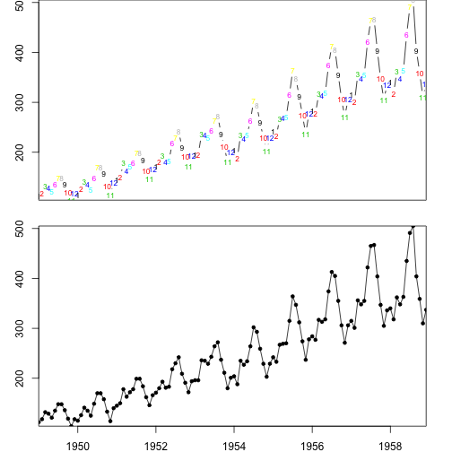
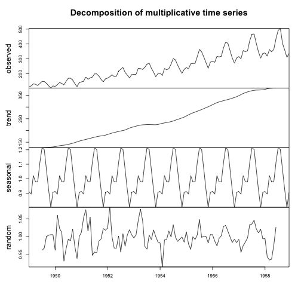
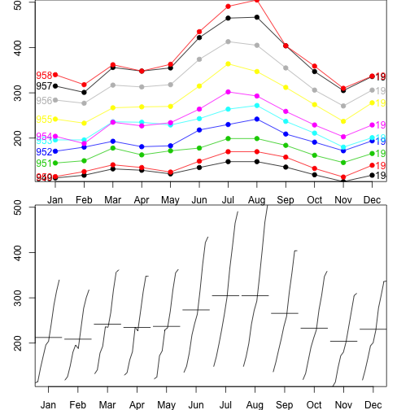
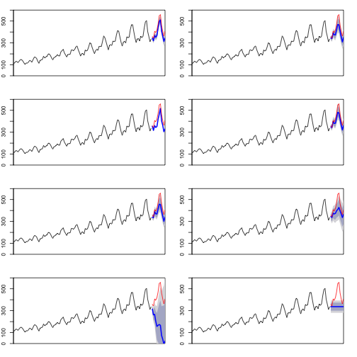
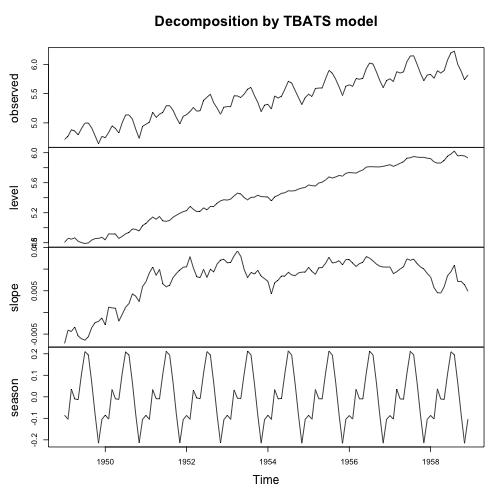
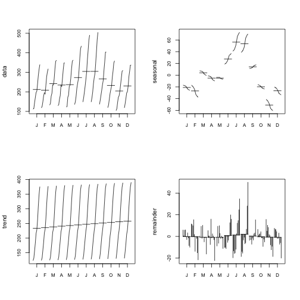
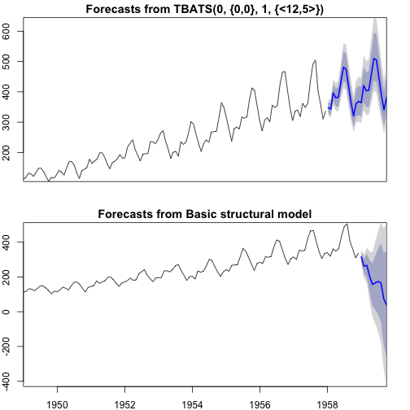

> ## 학습 목표 {.objectives}
>
> * 시계열 데이터의 백미 예측을 살펴본다.
> * 다양한 시계열 데이터 모형의 장단점을 비교한다.
> * 자동 시계열 예측의 필요성을 이해한다. 

## 1. 시계열 데이터 예측 자동화 [^time-series-procedure] [^time-series-fpp] [^time-series-youtube-hyndman] [^time-series-advanced-graphics]

[^time-series-procedure]: [Timeseries analysis procedure and methods using R](http://stats.stackexchange.com/questions/140163/timeseries-analysis-procedure-and-methods-using-r)
[^time-series-fpp]: [Forecasting: principles and practice](https://www.otexts.org/fpp)
[^time-series-youtube-hyndman]: [Forecasting time series using R by Prof Rob J Hyndman at Melbourne R Users](https://www.youtube.com/watch?v=1Lh1HlBUf8k)
[^time-series-advanced-graphics]: [Plotting Time Series with ggplot2 and ggfortify](http://rpubs.com/sinhrks/plot_ts)

시계열 데이터 예측모형을 자동화하는 이유는 다음과 같다.

- 시계열 데이터를 다루는 대부분의 사람들이 시계열 데이터에 다양한 시계열 모형을 적합시키는데 전문적인 훈련을 받지 못했다.
- 시계열 데이터에 대한 전문적인 지식읅 갖는 사람들도 수작업으로 예측모형을 만들어도 시계열 예측모형 자동화 알고리즘을 이기지 못한다.
    - 가낸 수공업 방식 시계열 예측모형개발방법론으로 가능한 모든 시계열 모형을 적합시켜 가장 적절한 모형을 추출해내는 자동화 방식을 이길 수 없다.
- 다수 산업계에서 주별로 월별로 수많은 예측모형을 개발해서 예측값을 제시해야 하기 때문에 시계열 알고리즘을 통한 자동 예측 시스템이 필수적이다.
- 다변량 시계열 예측모형도 단변량 시계열 예측모형을 기반으로 한다.

## 2. 시계열 데이터 예측 정확성 측도

시계열 모형의 우수성을 측정하는 다양한 측도가 존재한다. 
하지만, MAE, MSE, RMSE는 척도에 의존성이 있어 MAPE, MASE를 추천한다.

- $\mathrm{MAE} = \frac{1}{n}\sum_{t=1}^n \left| Y_t - f_i \right| =\frac{1}{n}\sum_{t=1}^n \left| e_i \right|$
- $\mathrm{MSE} =\frac{1}{n}\sum_{t=1}^n(\hat{Y_t} - f_t)^2$
- $\mathrm{RMSD}=\sqrt{\frac{\sum_{t=1}^n (\hat y_t - f_t)^2}{n}}$
- $\mathrm{MAPE} = \frac{100}{n}\sum_{t=1}^n  \left|\frac{Y_t-f_t}{Y_t}\right|$
- $\mathrm{MASE} = \frac{1}{T}\sum_{t=1}^T\left( \frac{\left| e_t \right|}{\frac{1}{T-1}\sum_{t=2}^T \left| Y_t-Y_{t-1}\right|} \right) = \frac{\sum_{t=1}^{T} \left| e_t \right|}{\frac{T}{T-1}\sum_{t=2}^T \left| Y_t-Y_{t-1}\right|}$

## 3. ARIMA vs 지수평활(ETS) 모형

자기회귀누적이동평균(ARIMA, **A**uto**R**egressive 
**I**ntegrated **M**oving **A**verage ) 모형과 
ETS(**E**rror,**T**rend,**S**easonal, **E**xponen**T**ial **S**moothing) 모형에 대해서 서로 적대적으로 생각하는 분들도 많다. 
박스-젠킨스가 제안한 ARIMA 모형이 매우 수학적인 반면에 ETS는 1950년대부터 실무적으로 개발되어 서로 동일한 
목적으로 하고 있지만 많은 교류가 없어 보여 잘못 알려진 것도 많다.

- ARIMA 모형이 더 일반적이고 지수평활(exponential smoothing)모형은 적용범위가 한정되어 있다는 잘못된 미신이 존재한다.
- 선형 지수평활 모형은 ARIMA 모형의 특수한 사례다.
- 비선형 지수평활 모형에 대응되는 ARIMA 모형은 없다.
- 많은 ARIMA 모형은 대응되는 지수평활모형이 없다.
- 지수평활 모형은 정상성을 갖지 않는 모든 시계열 데이터를 모형화할 수 있다.

## 4. 항공여객수 자동예측 

### 4.1. 환경설정

~~~{.r}
library(astsa)
library(fpp)
library(tidyverse)
~~~

### 4.2. 항공여객 데이터 

내장된 "AirPassengers" 데이터를 불러와서 모형개발에 사용될 데이터와 
최적모형 선택을 위한 데이터를 준비한다.

~~~{.r}
# 1. 항공여객 데이터셋 ---------------------------------------------------------
data("AirPassengers")

ap_ts <- window(AirPassengers, start=1949, end=1958.99)
ap_ts_test <- window(AirPassengers, start=1959)
~~~

### 4.3. 항공여객 데이터 탐색적 분석

항공여객 예측모형을 적합시키기 전에 데이터에 대한 이해와 모형개발전략을 위한 
탐색적 데이터분석을 수행한다.

~~~{.r}
# 1.1. 항공여객 데이터셋 시각화 ---------------------------------------------------------
par(mfrow=c(2,1))
par(mar=c(2, 3, 0, 2), xaxs='i', yaxs='i')

plot(ap_ts, ylab="항공여객 (천명)", type="c", pch =20, xaxt='n', xlab="")
text(ap_ts, col=1:12, labels=1:12, cex=.7)

plot(ap_ts, ylab="항공여객 (천명)", type="o", pch =20, xlab="")
~~~

~~~{.r}
# 2. 시계열 분해 -----------------------------------------------------------------

# 기본 시계열 분해
ap_ts_decompM <- decompose(ap_ts, type = "multiplicative")
plot(ap_ts_decompM, xlab="")
~~~

~~~{.r}
# `forecast` 팩키지 계절변동 시각화
seasonplot(ap_ts, ylab="항공여객 (천명)", xlab="", 
           main="",
           year.labels=TRUE, year.labels.left=TRUE, col=1:20, pch=19)

monthplot(ap_ts, ylab="항공여객 (천명)", xlab="", xaxt="n", main="")
axis(1, at=1:12, labels=month.abb, cex=0.8)
~~~

### 4.4. 항공여객 예측모형 

ARIMA 모형 등 가능한 모든 시계열 모형을 항공여객 모형데이터에 적합시키고,
검증데이터에 예측모형 각각의 성능을 비교한 후에 가장 최적 모형을 선택한다.
**MASE**가 가장 낮은 모형을 선택한다.

~~~{.r}
# 3. 모형선정 ------------------------------------------------------------------------
models <- list (
  mod_arima = auto.arima(ap_ts, ic='aicc', stepwise=FALSE),
  mod_exponential = ets(ap_ts, ic='aicc', restrict=FALSE),
  mod_neural = nnetar(ap_ts, p=12, size=25),
  mod_tbats = tbats(ap_ts, ic='aicc', seasonal.periods=12),
  mod_bats = bats(ap_ts, ic='aicc', seasonal.periods=12),
  mod_stl = stlm(ap_ts, s.window=12, ic='aicc', robust=TRUE, method='ets'),
  mod_sts = StructTS(ap_ts)
)

forecasts <- lapply(models, forecast, 12)
forecasts$naive <- naive(ap_ts, 12)

par(mfrow=c(4, 2))
par(mar=c(2, 2, 1.5, 2), xaxs='i', yaxs='i')

for(f in forecasts){
  plot(f, ylim=c(0,600), main="", xaxt="n")
  lines(ap_ts_test, col='red')
}
~~~

~~~{.r}
acc <- lapply(forecasts, function(f){
  accuracy(f, ap_ts_test)[2,,drop=FALSE]
})

acc <- Reduce(rbind, acc)
row.names(acc) <- names(forecasts)
acc <- acc[order(acc[,'MASE']),]
round(acc, 2)
~~~

~~~{.output}
                    ME   RMSE    MAE   MPE  MAPE MASE ACF1 Theil's U
mod_tbats        36.25  43.03  36.44  8.00  8.05 1.28 0.68      0.82
mod_arima        42.53  44.45  42.53  9.93  9.93 1.49 0.32      0.92
mod_exponential  44.79  51.80  44.79  9.96  9.96 1.57 0.70      1.00
mod_neural       51.02  54.81  51.02 11.83 11.83 1.79 0.23      1.15
mod_bats         52.18  59.35  52.18 11.66 11.66 1.83 0.73      1.14
mod_stl          53.38  67.26  53.38 11.40 11.40 1.87 0.68      1.25
naive            91.33 113.19  91.33 19.54 19.54 3.20 0.67      2.11
mod_sts         274.99 301.30 274.99 62.94 62.94 9.62 0.77      6.03

~~~

### 4.5. 항공여객 최적예측모형 적합

검증데이터에 예측오차가 가장 작은 **MASE**값을 갖는 모형 `tbats`를 최종 예측모형으로 선정한다.

~~~{.r}
# 4. 모형적합 ------------------------------------------------------------------------

ap_tbats_fit <- tbats(ap_ts, ic='aicc', seasonal.periods=12)
plot(ap_tbats_fit)
~~~

~~~{.r}
ap_stl_fit <- stl(ap_ts, s.window = 12)

par(mfrow = c(2,2))
monthplot(ap_ts, ylab = "data", cex.axis = 0.8)
monthplot(ap_stl_fit, choice = "seasonal", cex.axis = 0.8)
monthplot(ap_stl_fit, choice = "trend", cex.axis = 0.8)
monthplot(ap_stl_fit, choice = "remainder", type = "h", cex.axis = 0.8)
~~~

### 4.6. 항공여객 예측

최적 예측모형에 기반해서 항공수요 예측값을 뽑아내고 최저모형과 예측값을 시각적으로 비교한다.

~~~{.r}
# 5. 예측 ------------------------------------------------------------------------
# 최적 모형
op <- par(mfrow = c(2,1))
par(mar=c(2, 2, 1.5, 2), xaxs='i', yaxs='i')

ap_tbats_fit_fcast <- forecast(ap_tbats_fit)
plot(ap_tbats_fit_fcast, xaxt="n")

#최저 모형
mod_sts_fit <- StructTS(ap_ts)
ap_sts_fit_fcast <- forecast(mod_sts_fit)
plot(ap_sts_fit_fcast)
~~~

