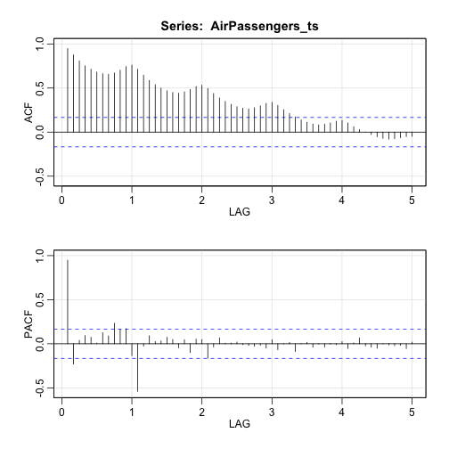
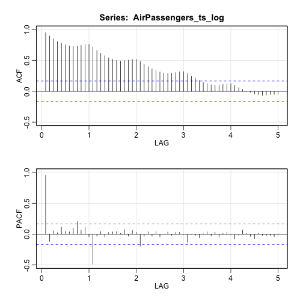
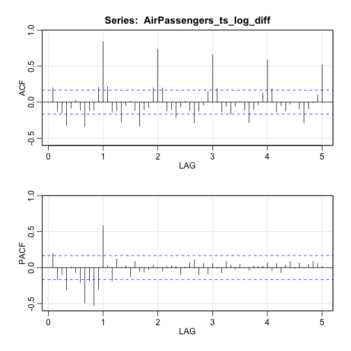
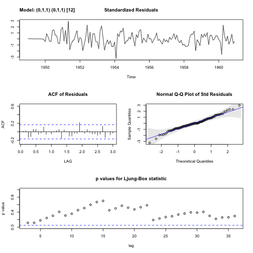
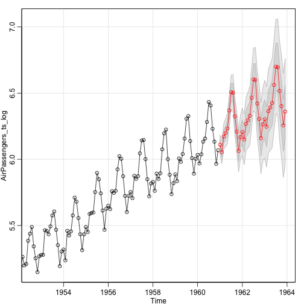

> ## 학습 목표 {.objectives}
>
> * 계절 자기회귀이동평균(ARIMA) 모형을 이해한다.
> * 항공승객 데이터를 예제로 모형을 식별, 적합, 예측까지 전과정을 실습한다. 

## 1. 비행기 승객 데이터(AirPassengers)

시계열 데이터 중 유명한 비행기 승객 데이터를 자기회귀이동평균(ARIMA) 모형을 
적합시키기 전에 먼저 정상성을 확보하기 위해 비행기 승객 데이터(AirPassengers)를 
시각화하면 원데이터는 정상성 가정을 만족하지 않는 것이 다수 확인된다.

로그 변환하고 차분을 해도 계절성에 대한 것이 여전히 남아 있어 1년 단위, 즉 12차분을 
수행한다. 그리고 나면 정상성이 확인된 것이 사각적으로 판단할 수 있다.

~~~{.r}
# 비행기 승객 데이터 ----------------------------------------------------
# SARIMA ---------------------------------------------------------
par(mfrow=c(4,1))
par(mar=c(2, 5, 0, 2), xaxs='i', yaxs='i')

# 원본 시계열 데이터
AirPassengers_ts <- ts(AirPassengers, start=1949, frequency = 12)

plot(AirPassengers_ts, type="c", xlab="", ylab=expression(y[t]), xaxt='n')
text(AirPassengers_ts, labels = 1:12, col = 1:12, cex=.7)

# 로그변환 시계열 데이터
AirPassengers_ts_log <- log(AirPassengers_ts)

plot(AirPassengers_ts_log, type="c", xlab="", ylab=expression(log(y[t])), xaxt='n')
text(AirPassengers_ts_log, labels = 1:12, col = 1:12, cex=.7)

# 1차분 시계열 데이터
AirPassengers_ts_log_diff <- diff(AirPassengers_ts_log)

plot(AirPassengers_ts_log_diff, type="c", xlab="", ylab=expression(diff(log(y[t]))), xaxt='n')
text(AirPassengers_ts_log_diff, labels = 1:12, col = 1:12, cex=.7)

# 계절차분(12) 시계열 데이터
AirPassengers_ts_log_diff_12 <- diff(AirPassengers_ts_log_diff, 12)

plot(AirPassengers_ts_log_diff_12, type="c", xlab="", ylab=expression(diff(diff(log(y[t]))),12))
text(AirPassengers_ts_log_diff_12, labels = 1:12, col = 1:12, cex=.7)
~~~

## 2. 항공여객 데이터 모형식별 

항공여객 데이터 모형식별을 위해 `astsa` 팩키지 `acf2()` 함수를 통해 원데이터, 로그변환 데이터,
1차분 데이터, 12차분 계절성 반영 데이터를 시각화한다.

~~~{.r}
# SARIMA ACF, PACF---------------------------------------------------------
acf2(AirPassengers_ts, max.lag=60)
~~~

~~~{.output}
        ACF  PACF
 [1,]  0.95  0.95
 [2,]  0.88 -0.23
 [3,]  0.81  0.04
 [4,]  0.75  0.09
 [5,]  0.71  0.07
 [6,]  0.68  0.01
 [7,]  0.66  0.13
 [8,]  0.66  0.09
 [9,]  0.67  0.23
[10,]  0.70  0.17
[11,]  0.74  0.17
[12,]  0.76 -0.14
[13,]  0.71 -0.54
[14,]  0.65 -0.03
[15,]  0.59  0.09
[16,]  0.54  0.02
[17,]  0.50  0.03
[18,]  0.47  0.07
[19,]  0.45  0.05
[20,]  0.44 -0.05
[21,]  0.46  0.05
[22,]  0.48 -0.10
[23,]  0.52  0.05
[24,]  0.53  0.05
[25,]  0.49 -0.16
[26,]  0.44 -0.04
[27,]  0.39  0.07
[28,]  0.35  0.01
[29,]  0.31  0.01
[30,]  0.29  0.02
[31,]  0.27 -0.01
[32,]  0.26 -0.02
[33,]  0.28 -0.03
[34,]  0.30 -0.01
[35,]  0.33 -0.05
[36,]  0.34  0.05
[37,]  0.30 -0.07
[38,]  0.25  0.00
[39,]  0.21  0.02
[40,]  0.17 -0.09
[41,]  0.14  0.00
[42,]  0.11  0.02
[43,]  0.09 -0.04
[44,]  0.08  0.00
[45,]  0.09 -0.04
[46,]  0.10 -0.01
[47,]  0.12 -0.01
[48,]  0.13  0.02
[49,]  0.10 -0.05
[50,]  0.06  0.01
[51,]  0.03  0.07
[52,]  0.00 -0.02
[53,] -0.03 -0.04
[54,] -0.05 -0.05
[55,] -0.07  0.00
[56,] -0.08 -0.01
[57,] -0.07 -0.02
[58,] -0.06 -0.02
[59,] -0.05 -0.05
[60,] -0.05  0.02

~~~

~~~{.r}
acf2(AirPassengers_ts_log, max.lag=60)
~~~

~~~{.output}
        ACF  PACF
 [1,]  0.95  0.95
 [2,]  0.90 -0.12
 [3,]  0.85  0.05
 [4,]  0.81  0.02
 [5,]  0.78  0.12
 [6,]  0.76  0.04
 [7,]  0.74  0.04
 [8,]  0.73  0.10
 [9,]  0.73  0.20
[10,]  0.74  0.06
[11,]  0.76  0.11
[12,]  0.76 -0.04
[13,]  0.72 -0.49
[14,]  0.66 -0.03
[15,]  0.62  0.04
[16,]  0.58 -0.04
[17,]  0.54  0.03
[18,]  0.52  0.04
[19,]  0.50  0.04
[20,]  0.49  0.01
[21,]  0.50  0.07
[22,]  0.51 -0.03
[23,]  0.52  0.06
[24,]  0.52  0.03
[25,]  0.48 -0.19
[26,]  0.44 -0.04
[27,]  0.40  0.04
[28,]  0.36 -0.04
[29,]  0.34  0.04
[30,]  0.31 -0.04
[31,]  0.30  0.00
[32,]  0.29  0.03
[33,]  0.30 -0.02
[34,]  0.30  0.03
[35,]  0.32  0.03
[36,]  0.32  0.00
[37,]  0.29 -0.13
[38,]  0.25  0.00
[39,]  0.21 -0.02
[40,]  0.18 -0.06
[41,]  0.15  0.01
[42,]  0.12  0.04
[43,]  0.11 -0.03
[44,]  0.10  0.03
[45,]  0.10 -0.05
[46,]  0.11  0.01
[47,]  0.12  0.03
[48,]  0.12 -0.01
[49,]  0.10 -0.08
[50,]  0.06 -0.02
[51,]  0.03  0.07
[52,]  0.00  0.01
[53,] -0.02 -0.04
[54,] -0.04 -0.07
[55,] -0.06  0.02
[56,] -0.07 -0.02
[57,] -0.06 -0.02
[58,] -0.05 -0.02
[59,] -0.05 -0.04
[60,] -0.05  0.01

~~~

~~~{.r}
acf2(AirPassengers_ts_log_diff, max.lag=60)
~~~

~~~{.output}
        ACF  PACF
 [1,]  0.20  0.20
 [2,] -0.12 -0.17
 [3,] -0.15 -0.10
 [4,] -0.32 -0.31
 [5,] -0.08  0.01
 [6,]  0.03 -0.07
 [7,] -0.11 -0.21
 [8,] -0.34 -0.49
 [9,] -0.12 -0.19
[10,] -0.11 -0.53
[11,]  0.21 -0.30
[12,]  0.84  0.59
[13,]  0.22  0.03
[14,] -0.14 -0.18
[15,] -0.12  0.12
[16,] -0.28  0.00
[17,] -0.05  0.03
[18,]  0.01 -0.12
[19,] -0.11  0.09
[20,] -0.34 -0.05
[21,] -0.11 -0.06
[22,] -0.08 -0.03
[23,]  0.20  0.03
[24,]  0.74 -0.01
[25,]  0.20 -0.05
[26,] -0.12  0.02
[27,] -0.10  0.03
[28,] -0.21  0.02
[29,] -0.07 -0.09
[30,]  0.02  0.01
[31,] -0.12  0.07
[32,] -0.29  0.11
[33,] -0.13 -0.09
[34,] -0.04  0.06
[35,]  0.15 -0.09
[36,]  0.66  0.06
[37,]  0.19 -0.01
[38,] -0.13 -0.08
[39,] -0.06  0.09
[40,] -0.16  0.04
[41,] -0.06 -0.03
[42,]  0.01  0.05
[43,] -0.11  0.00
[44,] -0.29 -0.03
[45,] -0.11  0.02
[46,] -0.03  0.02
[47,]  0.12  0.02
[48,]  0.59  0.06
[49,]  0.19 -0.04
[50,] -0.14  0.06
[51,] -0.05 -0.07
[52,] -0.12  0.03
[53,] -0.03  0.09
[54,]  0.00 -0.01
[55,] -0.09  0.07
[56,] -0.29 -0.01
[57,] -0.10  0.04
[58,] -0.01  0.08
[59,]  0.10  0.06
[60,]  0.52  0.02

~~~

~~~{.r}
acf2(AirPassengers_ts_log_diff_12, max.lag=60)
~~~

~~~{.output}
        ACF  PACF
 [1,] -0.34 -0.34
 [2,]  0.11 -0.01
 [3,] -0.20 -0.19
 [4,]  0.02 -0.13
 [5,]  0.06  0.03
 [6,]  0.03  0.03
 [7,] -0.06 -0.06
 [8,]  0.00 -0.02
 [9,]  0.18  0.23
[10,] -0.08  0.04
[11,]  0.06  0.05
[12,] -0.39 -0.34
[13,]  0.15 -0.11
[14,] -0.06 -0.08
[15,]  0.15 -0.02
[16,] -0.14 -0.14
[17,]  0.07  0.03
[18,]  0.02  0.11
[19,] -0.01 -0.01
[20,] -0.12 -0.17
[21,]  0.04  0.13
[22,] -0.09 -0.07
[23,]  0.22  0.14
[24,] -0.02 -0.07
[25,] -0.10 -0.10
[26,]  0.05 -0.01
[27,] -0.03  0.04
[28,]  0.05 -0.09
[29,] -0.02  0.05
[30,] -0.05  0.00
[31,] -0.05 -0.10
[32,]  0.20 -0.02
[33,] -0.12  0.01
[34,]  0.08 -0.02
[35,] -0.15  0.02
[36,] -0.01 -0.16
[37,]  0.05 -0.03
[38,]  0.03  0.01
[39,] -0.02  0.05
[40,] -0.03 -0.08
[41,] -0.07 -0.17
[42,]  0.10  0.07
[43,] -0.09 -0.10
[44,]  0.03 -0.06
[45,] -0.04 -0.03
[46,] -0.04 -0.12
[47,]  0.11 -0.01
[48,] -0.05 -0.05
[49,]  0.11  0.09
[50,] -0.02  0.13
[51,] -0.03  0.01
[52,]  0.07  0.11
[53,]  0.04  0.06
[54,] -0.09  0.05
[55,]  0.16  0.02
[56,] -0.11 -0.04
[57,]  0.05 -0.07
[58,]  0.10  0.14
[59,] -0.10 -0.01
[60,]  0.07  0.00

~~~

## 3. 항공여객 데이터 SARIMA 모형 적합

계절을 반영한 SARIMA 모형을 적합시킨다. 모형 적합결과 잔차는 백색잡음으로 적절한 모형이 식별된 것으로 파악된다.

~~~{.r}
# SARIMA 모형---------------------------------------------------------
airpass_sarima_fit <- sarima(AirPassengers_ts_log, p=0, d=1, q=1, 
                                                   P=0, D=1, Q=1, S=12)
~~~

~~~{.output}
initial  value -3.086228 
iter   2 value -3.267980
iter   3 value -3.279950
iter   4 value -3.285996
iter   5 value -3.289332
iter   6 value -3.289665
iter   7 value -3.289672
iter   8 value -3.289676
iter   8 value -3.289676
iter   8 value -3.289676
final  value -3.289676 
converged
initial  value -3.286464 
iter   2 value -3.286855
iter   3 value -3.286872
iter   4 value -3.286874
iter   4 value -3.286874
iter   4 value -3.286874
final  value -3.286874 
converged

~~~

~~~{.r}
airpass_sarima_fit$ttable
~~~

~~~{.output}
     Estimate     SE t.value p.value
ma1   -0.4018 0.0896 -4.4825       0
sma1  -0.5569 0.0731 -7.6190       0

~~~

## 4. SARIMA 모형기반 항공여객 예측

마지막으로 SARIMA 모형을 기반으로 항공수요를 3년치 예측한다. 
이때 `sarima.for()` 함수를 활용한다.

~~~{.r}
# SARIMA 모형기반 예측---------------------------------------------------------
sarima.for(AirPassengers_ts_log, p=0, d=1, q=1, 
                                 P=0, D=1, Q=1, S=12,
                                 n.ahead = 36)
~~~

~~~{.output}
$pred
          Jan      Feb      Mar      Apr      May      Jun      Jul
1961 6.110186 6.053775 6.171715 6.199300 6.232556 6.368779 6.507294
1962 6.206435 6.150025 6.267964 6.295550 6.328805 6.465028 6.603543
1963 6.302684 6.246274 6.364213 6.391799 6.425054 6.561277 6.699792
          Aug      Sep      Oct      Nov      Dec
1961 6.502906 6.324698 6.209008 6.063487 6.168025
1962 6.599156 6.420947 6.305257 6.159737 6.264274
1963 6.695405 6.517197 6.401507 6.255986 6.360523

$se
            Jan        Feb        Mar        Apr        May        Jun
1961 0.03671562 0.04278291 0.04809072 0.05286830 0.05724856 0.06131670
1962 0.09008475 0.09549708 0.10061869 0.10549195 0.11014981 0.11461854
1963 0.14650643 0.15224985 0.15778435 0.16313118 0.16830825 0.17333075
            Jul        Aug        Sep        Oct        Nov        Dec
1961 0.06513124 0.06873441 0.07215787 0.07542612 0.07855851 0.08157070
1962 0.11891946 0.12307018 0.12708540 0.13097758 0.13475740 0.13843405
1963 0.17821177 0.18296261 0.18759318 0.19211216 0.19652727 0.20084534

~~~

