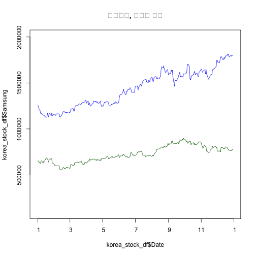

# 데이터 과학 -- 기초 통계

> ## 학습 목표 {.objectives}
>
> * 시계열 데이터 사전 분석 도구를 살펴본다.
> * 시계열 데이터 시각화 및 (자기)상관 도구를 실습한다.

## 금융 시계열 데이터 [^yahoo-finance-data]

금융 시계열 데이터, 특히 주식관련 데이터는 [야후 파이낸스](https://finance.yahoo.com/) 통해서 신뢰성 높은 데이터를 
빠른 시간내 획득할 수 있다.

[^yahoo-finance-data]: [Plotting Time Series in R using Yahoo Finance data](http://blog.revolutionanalytics.com/2015/08/plotting-time-series-in-r.html)

### 금융 시계열 데이터 분석환경

금융 시계열 데이터로 작업을 할 경우 가장 먼저 시계열 데이터를 조작해야 되는데,
이런 경우 `zoo` 를 확장한 `xts` 팩키지를 많이 사용한다. 
정적 시계열 데이터 시각화에는 `ggplot2` 팩키지, 동적 시계열 데이터 시각화에는 `dygraphs` 팩키지를 장착하여 활용한다.

~~~{.r}
# install.packages("xts", repos="http://cloud.r-project.org")
# install.packages("xtsExtra", repos="http://R-Forge.R-project.org")
# 환경설정 
library(ggplot2)
library(xts)
library(dygraphs)
library(extrafont)
# library(xtsExtra)
~~~

### 금융 데이터 가져오기

금융 데이터를 가져올 때 `http://real-chart.finance.yahoo.com/table.csv?s=005930.KS&a=01&b=01&c=2015&d=12&e=31&f=2015&g=d&ignore=.csv` 
url에서 삼성전자(005930.KS), 네이버 NHN(035420.KS)을 지정하고 기간정보를 적절히 설정하여 넘겨준다.

~~~{.r}
# 야후 금융데이터 -----------------------------------------------------------
# https://finance.yahoo.com/

# 삼성과 네이버 주식시세
samsung_url <- "http://real-chart.finance.yahoo.com/table.csv?s=005930.KS&a=01&b=01&c=2015&d=12&e=31&f=2015&g=d&ignore=.csv"
naver_url   <- "http://real-chart.finance.yahoo.com/table.csv?s=035420.KS&a=01&b=01&c=2015&d=12&e=31&f=2015&g=d&ignore=.csv"

yahoo.read <- function(url){
  dat <- read.table(url,header=TRUE,sep=",")
  df <- dat[,c(1,5)]
  df$Date <- as.Date(as.character(df$Date))
  return(df)
}

samsung <- yahoo.read(samsung_url)
naver  <- yahoo.read(naver_url)
~~~

### 금융 데이터 시각화: 단변량

정적 그래프를 통해 시각화하는 경우 `ggplot`, 인터랙티브 동적 그래프를 통해 시각화하는 경우 `dygraphs` 를 활용한다.

~~~{.r}
# 주식시세 시각화 -------------------------------------------------------------
# 정적 시각화

ggplot(samsung, aes(Date,Close)) + 
  geom_line(aes(color="samsung")) +
  geom_line(data=naver,aes(color="naver")) +
  labs(color="Legend") +
  scale_colour_manual("", breaks = c("samsung", "naver"),
                          values = c("blue", "brown")) +
  labs(
    title = "삼성전자, 네이버 종가",
    x= "날짜",
    y="주가") + 
  theme(plot.title = element_text(lineheight=.7, face="bold", family="NanumGothic"))
~~~

~~~{.r}
# 동적 시각화
samsung_xts <- xts(samsung$Close,order.by=samsung$Date,frequency=365)
naver_xts <- xts(naver$Close,order.by=naver$Date,frequency=365)

korea_stocks <- cbind(samsung_xts, naver_xts)
names(korea_stocks) <- c("Samsung", "Naver")

dygraph(korea_stocks, ylab="종가", 
        main="삼성전자, 네이버 종가") %>%
  dySeries("Samsung",label="삼성전자") %>%
  dySeries("Naver",label="네이버") %>%
  dyOptions(colors = c("blue","green")) %>%
  dyRangeSelector()
~~~

<!--html_preserve-->

<!--/html_preserve-->

### 시계열 데이터 산점도

네이버와 삼성전자 두 기업 주가 및 일별 수익률을 산점도로 찍어보면 상관관계를 확인할 수 있다.

~~~{.r}
# 상관계수 -------------------------------------------------------------------

korea_stock_df <- left_join(samsung, naver, by="Date")
names(korea_stock_df) <- c("Date", "Samsung", "Naver")

plot(korea_stock_df$Date, korea_stock_df$Samsung, type="l", col="blue", ylim = c(100000, 2000000), main="삼성전자, 네이버 종가")
lines(korea_stock_df$Date, korea_stock_df$Naver, col="darkgreen")
~~~

~~~{.r}
# 산점도
plot(korea_stock_df$Samsung, korea_stock_df$Naver)
abline(coef=coef(lm(korea_stock_df$Naver~korea_stock_df$Samsung)), col="darkgray")
~~~

~~~{.r}
# 수익률

korea_stocks_diff <- diff(log(korea_stocks), diff=1)

par(mfrow=c(1,2))

xts::plot.xts(korea_stocks_diff)
~~~

~~~{.output}
Warning in xts::plot.xts(korea_stocks_diff): only the univariate series
will be plotted

~~~

~~~{.r}
korea_stocks_diff_df <- data.frame(korea_stocks_diff)

plot(korea_stocks_diff_df$Samsung, korea_stocks_diff_df$Naver)
abline(a=0.00002607821, b=0.22059696365, col="darkgray")
~~~

### 시계열 데이터 상관계수

삼성전자와 네이버 두 회사 주가 및 주식수익률에 대한 상관계수도 계산할 수 있다.

~~~{.r}
cor(korea_stocks)
~~~

~~~{.output}
          Samsung     Naver
Samsung 1.0000000 0.8518946
Naver   0.8518946 1.0000000

~~~

~~~{.r}
cor(korea_stocks_diff[-1,])
~~~

~~~{.output}
         Samsung    Naver
Samsung 1.000000 0.174928
Naver   0.174928 1.000000

~~~
