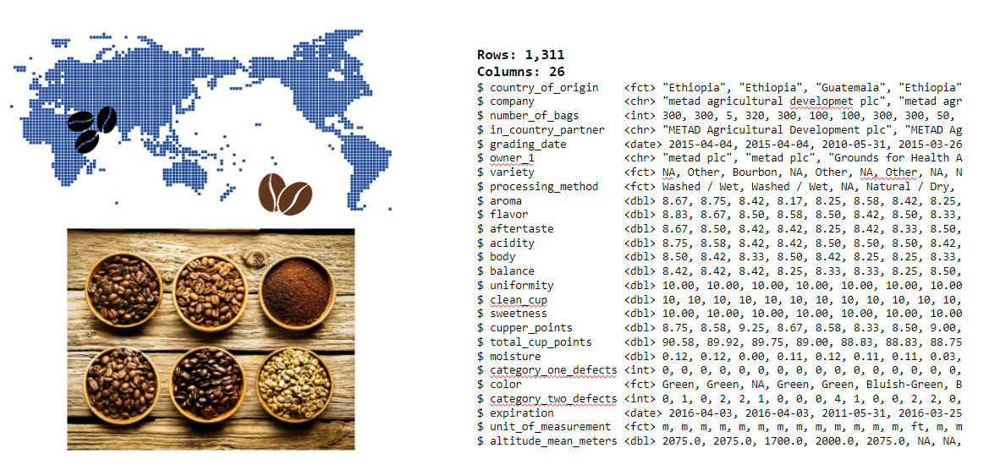

```{r setup, include=FALSE}
knitr::opts_chunk$set(echo = TRUE, message=FALSE, warning=FALSE,
                      comment="", digits = 3, tidy = FALSE, prompt = FALSE, fig.align = 'center')

library(tidyverse)
```


# 밀린 병원비 [^survey-elementary-sampling] {#밀린_병원비_추정}

[^survey-elementary-sampling]: [Richard L. Scheaffer, III  William Mendenhall, R. Lyman Ott, Kenneth G. Gerow - "Elementary Survey Sampling"](https://www.amazon.com/Elementary-Survey-Sampling-Richard-Scheaffer/dp/0840053614)

모집단이 1,000명($N=1,000$) 환자 중에서 임의표본추출로 200명($n=200$)을 뽑았다.
병원에 484계정($N=484$) 중에서 9계정($n=9$)을 임의표본추출 방식으로 뽑아서, 평균적으로 얼마의 병원비가 밀렸는지 추정하고자 한다.
이를 위해서 표본 9명을 뽑아서 밀린 평균 병원비를 조사해 보니 다음과 같다.

```{r hosp-survey}
library(tidyverse)
hosp_df <- tribble(
    ~account, ~amount,
"y1", 33.50,
"y2", 32.00,
"y3", 52.00,
"y4", 43.00,
"y5", 40.00,
"y6", 41.00,
"y7", 45.00,
"y8", 42.50,
"y9", 39.00)

hosp_df %>% 
    summarise(amount_est = mean(amount),
              amount_var = var(amount))

```

이를 바탕으로 밀린 평균병원비를 추정해 보자.
계정 9개로부터 나온 평균 병원비는 다음 공식으로 통해서 계산이 가능하다.

$$\bar{y} = \frac{\sum_{i=1}^{9}y_i}{9} = \frac{368}{9} = 40.89 $$
추정치의 오차를 계산하기 위해서 표본분산을 다음과 같이 먼저 계산한다.

$$s^2 = \frac{\sum_{i=1}^{n} (y_i - \bar{y})^2} {n-1} = 35.67 $$

그리고 나서, 추정오차의 한계를 다음과 같이 구한다.

- $N$: 1,000
- $n$: 200
- $s^2$: 445.21

$$2 \sqrt{\hat{V}(\bar{y})} = 2 \sqrt{(1- \frac{n}{N}) \frac{s^2}{n}} = 2 \sqrt{(1- \frac{200}{1000}) \frac{445.21}{200}} = 3.94$$

따라서 평균적으로 밀린 병원비 $\mu = 40.89$으로 산출되는데 $\mu$가 $\bar{y}$와의 얼마나 가까운가를 나타내는 추정오차는 3.94로 산출해낼 수 있다.

<style>
div.blue { background-color:#e6f0ff; border-radius: 5px; padding: 10px;}
</style>
<div class = "blue">

비복원 추출 때문에 발생되는 분산의 감소량을 **FPC(유한모집단수정, Finite population correction)**로 나타내는데,
복원추출인 경우 FPC는 없어지고, 모집단 $N$이 매우 커서 $n$이 작은 경우 $\frac{n}{N} \approx 0$, 따라서,
$1 - \frac{n}{N} \approx 1$이 된다.

</div>


# 커피 데이터 {#coffee-dataset}

[`qacData`](https://github.com/rkabacoff/qacData/) 팩키지에 커피 리뷰 데이터가 포함되어 있다.
`coffee` 데이터는 Coffee Quality Institute Database 에서 1312 아라비카 커피콩을 스크래핑하여 구축되었으며 수많은 리뷰어가 커피맛을 보고 평가를 내린 평점도 포함되어 있다. Tidy Tuesday에도 [커피맛 평가](https://github.com/rfordatascience/tidytuesday/blob/master/data/2020/2020-07-07/readme.md) 데이터가 동일하게 이용가능하다.

커피콩은 커피나무의 씨앗이며 음용 커피의 재료로 사용되는데 경제적으로 가장 중요한 커피나무의 두 종으로는 아라비카와 로부스타가 있으며 전 세계에서 생산되는 커피 중 75~80%가 아라비카이고, 20%가 로부스타라는 통계가 있다. [^wiki-coffee]

[^wiki-coffee]: [위키백과, "커피콩"](https://ko.wikipedia.org/wiki/커피콩)

```{r coffee-dataset}
library(tidyverse)
library(tidytuesdayR)

tuesdata <- tidytuesdayR::tt_load(2020, week = 28)

coffee <- tuesdata$coffee_ratings

coffee_df <- coffee %>% 
  select(total_cup_points, species, coo = country_of_origin, farm_name, aroma, body, balance, sweetness) %>% 
  filter(total_cup_points > 50)

glimpse(coffee_df)
```



# 표본추출 {#basic-concept}

## 단순 임의추출 {#simple-random-sampling}

단순 임의추출(Simple Random Sampling)은 모집단(Population) 혹은 표본 틀(Sampling Frame)에서 임의 방식으로 표본을 추출하는 것이다. `dplyr` 팩키지의 `slice_sample()` 함수를 사용하면 표본추출관련 대부분의 기능을 이를 통해서 구현할 수 있다.
먼저 앞서 전세계 커피 품종에 대한 평가를 담을 데이터를 모집단으로 가정하고 임의로 10개를 커피콩을 추출해보자.


```{r coffee-srs}
coffee_df %>% 
  slice_sample(n = 10)
```

## 계통추출법(Systematic sampling) {#systematic-sampling}

계통추출법(systematic sampling)은 첫 번째 요소는 무작위로 선정한 후, 
목록의 매번 k번째 요소를 표본으로 선정하는 표집방법이다. 
모집단의 크기를 원하는 표본의 크기로 나누어 k를 계산한다.
이를 R을 통해 구현해보자.

표본크기(`sample_size`) 10개를 추출한다. 이를 위해서 먼저 전체 표본 크기를 구한 후에 
모집단을 표본크기로 나누는데 정수를 구해 간격(interval) `k`로 정하고 이를 
행번호로 특정한 후에 `slice` 함수로 표본 추출한다.

```{r systematic sampling}
sample_size <- 10
population_size <- nrow(coffee_df)
interval_k <- population_size %/% sample_size

row_index <- seq_len(sample_size) * interval_k

coffee_df %>% 
  rowid_to_column() %>% 
  slice(row_index)
```

상기 결과를 바탕으로 계통표본추출법으로 표본을 추출하는 함수를 제작해서 원하는 만큼 표본을 추출한다.
하지만, 이런 경우 원데이터가 특정한 규칙을 내포한 경우 편의가 생길 수 있어 이를 보정하는 로직도 함께 넣어 둔다.
`slice_sample(prop = 1)` 명령어는 데이터프레임을 마구 뒤섞어 혹시 생길 수 있는 편의를 제거하는 역할을 한다.

```{r systematic sampling-function}

systematic_sampling <- function(sample_size = 10) {
  
  sample_size <- sample_size
  population_size <- nrow(coffee_df)
  interval_k <- population_size %/% sample_size
  
  row_index <- seq_len(sample_size) * interval_k
  
  systematic_sample <- coffee_df %>% 
    slice_sample(prop = 1) %>% 
    rowid_to_column() %>% 
    slice(row_index)  
  
  return(systematic_sample)
}

systematic_sampling(3)
```


## 층화추출법(Stratified Sampling) {#stratified-sampling}

층화추출법(Stratified sampling)은 모집단을 먼저 중복되지 않도록 층으로 나눈 다음 각 층에서 표본을 추출하는 방법으로, 필요에 따라 각 층을 다시 하위층으로 나누어 추출하는 다단계 층화 추출을 하기도 한다.
`dplyr` 팩키지를 사용할 경우 `slice_sample()` 함수를 하위 모집단 그룹, 즉 층(strata)으로 나눠 `group_by()`로 묶은 후에 임의 복원 혹은 비복원 임의추출방법을 수행한다.
예를 들어, 원산지 국가를 기준으로 각 국가별로 3개 커피콩 품종을 추출하는 코드는 다음과 같다.


```{r coffee-stratified-sampling}
coffee_df %>% 
  group_by(coo) %>% 
  slice_sample(n = 3, replace = FALSE) %>% 
  arrange(coo)
```

## 집락추출법(Cluster Sampling) {#cluster-sampling}

집락추출법(Cluster Sampling)은 모집단에서 집단을 일차적으로 표집한 다음, 선정된 각 집단에서 구성원을 표본으로 추출하는 2단계 표본추출방법으로 다단계 표집방법의 특수한 경우다. 집락 내부는 이질적(heterogeneous)이고 집락 간에는 동질적(homogeneous) 특성을 가지도록 하는 것이 특징으로 이런 특성이 만족되어야 보다 큰 대표성을 갖게 된다.

집락추출법을 통해 커피콩을 추출하는 방식은 먼저 전세계 국가에서 먼저 임의 국가로 표본크기를 3으로 정해 뽑은 후에 다시 이렇게 특정된 국가를 대상으로 2단계 커피콩 임의 추출작업을 수행한다.

```{r coffee-cluster-sampling}
## 1 단계 임의추출
country <- coffee_df %>% 
  count(coo) %>% 
  pull(coo)

country_sample <- sample(country, size = 3)

## 2 단계 임의추출
coffee_df %>% 
  filter(coo %in% country_sample) %>% 
  slice_sample(n=5) %>% 
  arrange(coo)
```


# 표본추출 비교 {#basic-concept-comparison}

결국 커피콩 데이터에서 추구하는 바는 `total_cup_points`를 가능하면 적은 비용과 노력으로 정확히 측정할 수 있도록 표본을 선정하는 것이다.

## 모집단 {#basic-concept-comparison-population}

먼저 모집단의 `total_cup_points` 평균을 구해서 이를 절대값으로 삼아 이야기를 풀어가도록 한다.

```{r coffee-population}
mean_population <- coffee_df %>% 
  summarise(mean_cup_points = mean(total_cup_points, na.rm = TRUE)) %>% 
  pull(mean_cup_points)

mean_population
```

## 임의추출법 {#basic-concept-comparison-srs}

`slice_sample()` 함수를 통해 전체 모집단에서 10%를 임의로 추출하여 동일한 방식으로 `total_cup_points` 평균을 구해보자.

```{r coffee-srs-comp}
mean_srs <- coffee_df %>% 
  slice_sample(prop = 0.1) %>% 
  summarise(mean_cup_points = mean(total_cup_points, na.rm = TRUE)) %>% 
  pull(mean_cup_points)

mean_srs
```


## 계통추출법 {#basic-concept-comparison-stratified}

국가를 층(strata)으로 삼아 각 국가별로 10% 커피콩을 뽑아 `total_cup_points` 평균을 구해보자.

```{r coffee-stratified}
mean_stratified <- coffee_df %>% 
  group_by(coo) %>% 
  slice_sample(prop = 0.1) %>% 
  ungroup() %>% 
  summarise(mean_cup_points = mean(total_cup_points, na.rm = TRUE)) %>% 
  pull(mean_cup_points)

mean_stratified
```

## 집락추출법 {#basic-concept-comparison-cluster}

다음은 전체 국가의 20%를 뽑고 각 국가별로 10%를 임의추출하는 2단계 표본추출법, 
즉 집락추출법을 사용해서 `total_cup_points` 평균을 구해보자.

```{r coffee-cluster}
## 1 단계 임의추출
country_sample <- sample(country, size = length(country) %/% 5)

## 2 단계 임의추출
mean_cluster <- coffee_df %>% 
  filter(coo %in% country_sample) %>% 
  slice_sample(prop = 0.1) %>% 
  summarise(mean_cup_points = mean(total_cup_points, na.rm = TRUE)) %>% 
  pull(mean_cup_points)

mean_cluster
```


# 오차 측정 {#calculate-errors}

모집단 `total_cup_points` 평균과 비교하여 다양한 표본추출방법에 따라 차이가 나는데 이를 통해 상대 오차를 측정할 필요가 있다.

```{r coffee-error}
estimation_df <- tibble(
  "population" = mean_population,
  "srs"        = mean_srs,
  "stratifed"  = mean_stratified,
  "cluster"    = mean_cluster
)

estimation_df 
```

모집단에서 추정값을 뺀 후 100을 곱해 상대오차(Relative Error)를 구해 추정값의 정확성을 상대적으로 비교할 수 있다.

$$\text{상대오차} = \frac{ | \text{모집단 측정값} - \text{표본추출 추정값} | }{\text{모집단 측정값}} \times 100$$

```{r coffee-error-measure}
estimation_df %>% 
  pivot_longer(col = everything(), names_to = "method", values_to = "estimation") %>% 
  mutate(relative_error = abs(mean_population - estimation) / mean_population * 100)
```


## 반복 표본추출 {#calculate-errors-many-times}

임의추출방법을 통해 표본을 한번만 추출하는 대신 원하는 만큼 충분히 반복하고자 하면 어떨까? 
먼저 앞서 단순 임의추출방법을 다시 확인해보자. 10%의 표본을 추출하여 `total_cup_points` 평균을 계산한다. 

```{r coffee-error-measure-one}
mean_srs <- coffee_df %>% 
  slice_sample(prop = 0.1) %>% 
  summarise(mean_cup_points = mean(total_cup_points, na.rm = TRUE)) %>% 
  pull(mean_cup_points)

mean_srs
```

`replicate()` 함수를 사용해서 앞서 정의한 단순 임의추출방법을 원하는 만큼 예를 들어 100회 수행하게 된다. 이를 통해서 10% 표본을 뽑아 `total_cup_points` 평균을 계산하는 작업을 100회 수행시킬 수 있다.

```{r coffee-error-measure-hundred}
srs_100 <- replicate(
  n = 100,
  expr = coffee_df %>% 
  slice_sample(prop = 0.1) %>% 
  summarise(mean_cup_points = mean(total_cup_points, na.rm = TRUE)) %>% 
  pull(mean_cup_points)
)

srs_100
```

코드가 다소 난잡하기 때문에 임의표본추출하는 로직을 따로 떼어 함수로 제작하고 이를 마찬가지 방식으로 `replicate()` 함수를 사용해서 동일한 작업을 수행한다.

```{r coffee-error-measure-function}

run_srs <- function(proportion = 0.1) {
  coffee_df %>% 
    slice_sample(prop = proportion) %>% 
    summarise(mean_cup_points = mean(total_cup_points, na.rm = TRUE)) %>% 
    pull(mean_cup_points)
}

srs_fun_100 <- replicate(
  n = 100,
  expr = run_srs(0.1),
  simplify = TRUE
)

srs_fun_100
```


## 표본수 증가 {#calculate-errors-sample-size}

표본크기가 증가할수록 모집단 대표 평균값에 가까이 추정하는 것을 확인할 수 있다.

```{r coffee-sample-size}
srs_samp_size <- function(samp_size) {
  srs_fun_100 <- replicate(
    n = 100,
    expr = run_srs(samp_size),
    simplify = TRUE
  ) 
  return(unlist(srs_fun_100))
}

samp_size_df <- tibble(
  samp_10  = srs_samp_size(0.1),
  samp_25  = srs_samp_size(1/4),
  samp_33  = srs_samp_size(1/3),
  samp_50  = srs_samp_size(1/2),
  samp_75  = srs_samp_size(3/4),
  samp_99 = srs_samp_size(0.99)
) %>% 
  pivot_longer(cols = everything(), names_to = "samp_size", values_to = "estimation")

samp_size_df %>% 
  ggplot(aes(x=estimation, color = samp_size)) +
    geom_density() +
    geom_vline(xintercept = mean_population, color = "darkgray") +
    theme_bw() +
    theme(legend.position = "top")
```

## 표준편차 {#calculate-confidence-interval-sd}

추정값에 대한 표준편차도 표본크기 변화에 따라 계산해보자.

```{r calculate-confidence}
samp_size_df %>% 
  group_by(samp_size) %>% 
  summarise(mean_cup_points = mean(estimation),
            sd_cup_points   = sd(estimation)) %>% 
  mutate(samp_prop = parse_number(samp_size),
         samp_prop = str_glue("{samp_prop} %")) %>% 
  select(samp_prop, contains("cup"))
```

# 신뢰구간 {#calculate-bootstrap}

부츠트랩(Bootstrap) 방법론은 모집단에서 나온 표본을 다시 모집단으로 가정하고 표본을 복원추출방법을 통해서 추정하는 방식이다. 부츠트랩 방법론을 통해 추정값은 물론 표준오차도 계산이 가능하다.
부츠트랩은 크게 두단계로 나누는데 먼저 재표집하는 단계와 통계량을 계산하는 단계로 나눠진다.

부츠트랩을 1,000번 실행해서 얻은 결과를 모집단 평균과 시각적으로 비교한다. 부츠트랩을 통해 계산된 평균은 다음과 같은 특징이 있다.

- 부츠트랩 표본을 통해 도출된 분포의 중심값 평균은 표본 평균과 대체로 동일하다.
- 그렇다고 해서 부츠트랩 표본이 모집단 평균은 아니다.
- 즉, 부츠트랩 방법론을 통해 모집단과 모집단에서 추출한 표본집단 사이 발생된 편이(bias)를 보정할 수는 없다.

```{r calucate-bootstrap}
set.seed(77777)

coffee_srs_df <- coffee_df %>% 
  slice_sample(prop = 0.1)

# 1. 부츠트랩 정의
define_bootstrap <- function() {
  coffee_srs_df %>%
    # 1 단계 재표본 단계
    slice_sample(prop = 1, replace = TRUE) %>%
    # 2. 단계 통계량 계산
    summarize(mean_cup_points = mean(total_cup_points, na.rm = TRUE)) %>%
    pull(mean_cup_points)
}

# 2. 부츠트랩 실행
mean_cup_points <- replicate(
  n = 1000,
  expr = define_bootstrap()
)

tibble(mean_cup_point = mean_cup_points) %>% 
  ggplot(aes(x= mean_cup_point)) +
    geom_histogram(binwidth = 0.02) +
    geom_vline(xintercept = mean_population, color = "blue") +
    geom_vline(xintercept = mean(mean_cup_points), color = "red", linetype = "dashed")  +
    theme_bw()

```

## 표준오차 {#calculate-standard-error}

표준편차와 표준오차를 다음 수식을 통해 직관적으로 이해할 수 있다. 
즉, 표준편차는 변량에 대한 산포를 측정하는 반면 표준오차는 추정량에 대한 산포를 측정하게 된다.

- 표준편차(Standard Deviation): $\sqrt{\operatorname E\left[(X - \mu)^2\right]}$
- 표준오차(Standard Error): $\sqrt{\operatorname E\left[(\overline{X} - \mu)^2\right]}$ 

이를 통해서 표준오차에 표본크기 제곱근을 곱하게 되면 모집단 표준편차를 구할 수 있게 된다. 

$$\sigma_{\overline{x}} = \frac{\sigma}{\sqrt{n}}$$

```{r population-sd-standard-error}
# 1. 모집단 total_cup_points 표준편차
sd(coffee_df$total_cup_points)

# 2. 표본 total_cup_points 표준편차
sd(coffee_srs_df$total_cup_points)

# 3. 표본분포(sampling distribution) total_cup_points 표준편차
sd(srs_fun_100) * sqrt(nrow(coffee_df) * 0.1)

# 4. 부츠트랩 total_cup_points 표준편차
standard_error <- sd(mean_cup_points)
  
sd_population <- standard_error * sqrt(nrow(coffee_df) * 0.1)

sd_population
```


## 부츠트랩 신뢰구간 {#calculate-standard-error-bootstrap}

정규분포를 가정해서 신뢰구간을 구할 수도 있으나 
단순히 분위수 함수인 `quantile()`을 사용해서 95% 신뢰구간 상하한을 간단히 구할 수 있다. 

```{r bootstrap-ci}
tibble(mean_cup_points = mean_cup_points) %>% 
  summarise(lower = quantile(mean_cup_points, 0.025),
            mean  = mean(mean_cup_points),
            upper = quantile(mean_cup_points, 0.975))


```


