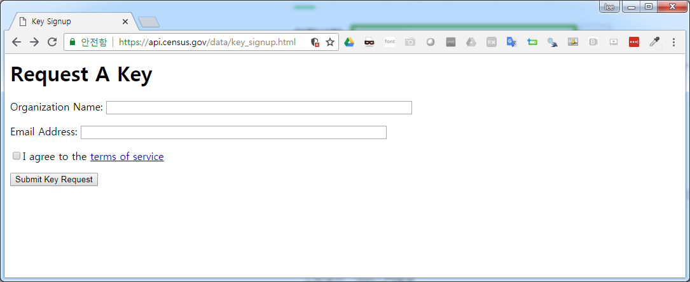

``` {r, include=FALSE}
source("tools/chunk-options.R")
knitr::opts_chunk$set(echo = TRUE, warning=FALSE, message=FALSE,
                    comment="", digits = 3, tidy = FALSE, prompt = TRUE, fig.align = 'center')

```

# `tidycesnus` [^silge-tidycensus] {#tidycensus}

[^silge-tidycensus]: [JULIA SILGE(Jun 24, 2017), USING TIDYCENSUS AND LEAFLET TO MAP CENSUS DATA](https://juliasilge.com/blog/using-tidycensus/)

`tidyverse`는 인구조사(센서스, census)에도 예외가 아니다. [tidycensus](https://walkerke.github.io/tidycensus/)는 버전 1.0 로드맵에서 밝혔듯이
미국 인구통계를 깔끔한(tidy) 형태로 정리해서 tidyverse 생태계와 지리정보 `sf` 팩키지와 유기적으로 연결하는 것을 목적으로 개발되었다.

`tidycensus`를 이용하기 위해서는 [Census API에 Request A Key](https://api.census.gov/data/key_signup.html) 웹페이지에서 키를 하나 받아야 한다.
전달받은 키를 잘 간직하도록 한다.



## 데이터 가져오기 {#tidycensus-import}

`get_acs()` 함수로 텍사스주(`TX`), 자치주(`county`)별로 인구수(`B01003_001`)를 지리정보(`geometry = TRUE`)와 함께 가져온다.

``` {r tidycensus-import}
# 0. 환경설정 -----
library(tidycensus)
library(tidyverse)
library(viridis)
library(sf)
library(leaflet)

# 1. 데이터 가져오기 -----
options(tigris_use_cache = TRUE)
census_api_key(tidycensus_key)

texas_pop <- get_acs(geography = "county", 
                     variables = "B01003_001", 
                     state = "TX",
                     geometry = TRUE) 
texas_pop
```

`texas_pop`는 지리정보가 포함된 `sf` 객체로 티블(tibble)를 반환한다.

`get_decennial()` 함수는 10년주기를 갖는 1990, 2000, 2010 US 인구통계 API에 접속할 수 있게 해주고,
`get_acs()` 함수는 5년주기 미국 지역사회 조사(American Community Survey, ACS) API에 접속할 수 있게 해 준다.


## 인구조사 변수 {#tidycensus-variable}

인구통계조사에서 가져올 수 있는 데이터를 `load_variables()` 함수로 탐색한다.
American Community Survey (ACS) 조사항목](https://www.census.gov/programs-surveys/acs/guidance/subjects.html)에 대해서는 추출가능한 데이터에 대한 
정보를 사전 찾아볼 수 있다.

``` {r tidycensus-variable}
## 추출가능 데이터
v15 <- load_variables(2016, "acs5", cache = TRUE)
```

# 시각화 {#tidycensus-variable-viz}

## 정적 시각화 {#tidycensus-variable-viz-static}

텍사스의 경우도 대도시에 인구가 밀집되어 있어 10분위수를 `ntile()` 함수로 생성시키고 나서 
이를 `viridis`의 도움으로 정적 시각화한다.

``` {r tidycensus-viz-static}
# 2. 시각화 -----
## 2.1. 정적 시각화
texas_pop %>% 
    mutate(estimate_decile = ntile(estimate, 10)) %>% 
    ggplot(aes(fill =  estimate_decile)) +
      geom_sf() +
      scale_fill_viridis() +
      theme_minimal() +
      labs(fill = "10분위수")
```

## 동적 시각화 {#tidycensus-variable-viz-dynamic}

`leaflet` 팩키지를 활용하여 인터랙티브 시각화도 가능하다.

``` {r tidycensus-viz-interactive}
## 2.2. 동적 시각화
pal <- colorQuantile(palette = "viridis", domain = texas_pop$estimate, n = 10)

texas_pop %>%
    st_transform(crs = "+init=epsg:4326") %>%
    leaflet(width = "100%") %>%
    addProviderTiles(provider = "CartoDB.Positron") %>%
    addPolygons(popup = ~ paste0("자치주명: ", str_extract(NAME, "^([^,]*)"), "\n",
                                 "인구수: ", estimate),
                stroke = FALSE,
                smoothFactor = 0,
                fillOpacity = 0.7,
                color = ~ pal(estimate)) %>%
    addLegend("bottomright", 
              pal = pal, 
              values = ~ estimate,
              title = "인구 백분위수",
              opacity = 1)

```

