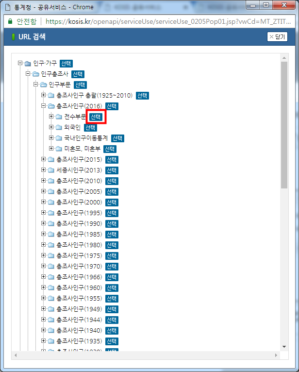

``` {r, include=FALSE}
source("tools/chunk-options.R")
knitr::opts_chunk$set(echo = TRUE, warning=FALSE, message=FALSE,
                    comment="", digits = 3, tidy = FALSE, prompt = TRUE, fig.align = 'center')

```

# 통계청 KOSIS [^kosis-openapi] {#통계청-KOSIS}

[^kosis-openapi]: [R Crawler 6 부록 통계청, 통계청 Open API 활용법](https://mrkevinna.github.io/R-Crawler-6-%EB%B6%80%EB%A1%9D-%ED%86%B5%EA%B3%84%EC%B2%AD/)

[KOSIS 국가통계포털](http://kosis.kr/index/index.do)을 통해서 통계청에서 생산하는 수많은 데이터를 정보로 가공하여 제공하기도 하지만,
OPEN API 형태로 데이터를 받아오는 것도 가능하다. [OpenAPI, http://kosis.kr/openapi](http://kosis.kr/openapi) 웹사이트를 통해서 가공된 표가 아닌
기계가 이해하기 쉬운 JSON 형태 데이터를 바로 받아 활용도 가능하다.

통계청 KOSIS OpenAPI 사용법에 대한 그림이 포함된 자세한 사항은 [R Crawler 6 부록 통계청, 통계청 Open API 활용법](https://mrkevinna.github.io/R-Crawler-6-%EB%B6%80%EB%A1%9D-%ED%86%B5%EA%B3%84%EC%B2%AD/)
웹사이트를 추천한다.

# KOSIS Open API {#kosis-vs-tidycensus}

`tidycensus` 팩키지는 미국 통계청에서 제공하는 다양한 Open API를 R에서 사용하기 편하게 작성한 것이다.
따라서 아직 KOSIS Open API와 직접 비교하는 것은 무리가 있지만, 생산성과 속도의 차이를 유사한 사례를 놓고 비교해보자.

## KOSIS 오픈 API 통계목록 {#kosis-open-api-list}

KOSIS 오픈 API를 통해 제공되는 데이터를 받아오려면 우선 통계목록을 확인하는 과정을 먼저 거쳐야 한다.
이를 위해서 [KOSIS 공유서비스](https://kosis.kr/openapi/index/index.jsp) 웹사이트에서 
상단 `서비스이용` &rarr; `통계목록`에서 목록구분, 목록조회, 결과유형을 지정한다. 
목록조회를 통해서 최신 인구데이터를 가져온다.



[KOSIS 공유서비스](https://kosis.kr/openapi/index/index.jsp)에 가입하면서 키를 하나 발급받아 놓고 
이를 활용하여 `'&apiKey=', kosis_key`와 같이 설정해 둔다. 
URL생성하게 되면 다음과 같은 긴 URL이 생성되는데 이를 url과 매개변수를 기준으로 쪼개 가독성 좋게 R 코드를 작성한다.

`http://kosis.kr/openapi/statisticsList.do?method=getList&apiKey=XXXXXXxxxxxxxxxxxxxxxxxxxxxxxxx&vwCd=MT_ZTITLE&parentListId=A11_2016_10&format=sdmx&jsonVD=Y&version=v2_1`

`httr` 팩키지 `GET()` 함수, `content()` 함수, `jsonlite` 팩키지 `fromJSON()`함수를 거쳐 데이터프레임으로 저장한다.

``` {r kosis-stat-list}
# 0. 환경설정 -----
library(tidyverse)
library(httr)
library(jsonlite)
library(glue)

# 1. 데이터 -----
## 1.1. 통계목록 -----
stat_list_url <- glue('http://kosis.kr/openapi/statisticsList.do',
                      '?method=', 'getList', 
                      '&apiKey=', kosis_key, 
                      '&vwCd=', 'MT_ZTITLE',
                      '&parentListId=', 'A11_2016',
                      '&format=', 'json', 
                      '&jsonVD=', 'Y')


stat_list_resp <- GET(url=stat_list_url)

stat_list_json <- content(stat_list_resp, as='text')

stat_list_df <- fromJSON(txt = stat_list_json %>% as.character()) %>% 
    tbl_df

DT::datatable(stat_list_df)
```

## 통계자료 추출 {#kosis-open-api-call}

**시군구/성/연령(5세)별 주민등록연앙인구** 통계표를 통해서 실제 데이터를 가져와 보자.

생성된 URL에서 매개변수를 추출하여 가독성 좋게 편집한다. 
강원도에 거주하며 성별은 여자로 "35 - 39세" 사이 인구수를 추출해 보자.

요청 `url`을 조합하는 방법에 차이가 있어 가장 쉽게는 KOSIS OpenAPI에서 url 링크를 복사해서 가져온느 방법이 있고,
`glue` 함수를 사용해서 각 매개변수를 조합하는 방법도 있고, json 파일로 다운로드 받아 데이터프레임으로 가공해서 사용하는 방법도 있다.


``` {r kosis-open-api-call-data}
## 1.2. 통계자료 -----
# 첫번째 방법
# pop_resp <- GET(url="http://kosis.kr/openapi/statisticsData.do?method=getList&apiKey=xxxxxxxxxxx&format=json&jsonVD=Y&userStatsId=xxxxxx/101/DT_1B040M5/2/1/20180724120917&prdSe=Y&newEstPrdCnt=1")
#
# pop_json <- content(pop_resp, as='text')
#
# 두번째 방법
# pop_url <- glue('http://kosis.kr/openapi/statisticsData.do',
#                       '?method=', 'getList', 
#                       '&apiKey=', kosis_key,
#                       '&format=', 'json', 
#                       '&jsonVD=', 'Y',
#                       '&userStatsId=', 'statkclee/101/DT_1B040M5/2/1/20180724120917',
#                       '&prdSe=', 'Y',
#                       '&newEstPrdCnt=', '1')
# 
# pop_resp <- GET(url=pop_url)
# 
# pop_json <- content(pop_resp, as='text')

# 세번째 방법
pop_json <- readLines("data/kosis.json")

pop_df <- fromJSON(txt = pop_json %>% as.character()) %>% 
    tbl_df %>% 
    select(시도코드=C1, 시도명=C1_NM, 성별=C2_NM, 연령=C3_NM, 인구수=DT) %>% 
    mutate(인구수 = as.integer(인구수))

##
pop_df %>% 
    filter(시도명=="강원도", 성별=="여자", 연령=="35 - 39세") %>% 
    pull(인구수)
```

# `tidycensus` 팩키지 {#tidycensus-code}

## 통계목록 {#tidycensus-code-varialbe}

`tidycensus` 팩키지에 다양한 통계인구통계조사가 제공되기 때문에 `load_variables()` 함수로 
통계표를 찾아낸다. 그리고 나서 `DT` 팩키지나 `stringr` 문자열 검색 기능을 사용하여 `variable` 통계표를 찾아낸다.

``` {r tidycensus-code-variable}
# 0. 환경설정 -----
library(tidycensus)

options(tigris_use_cache = TRUE)
census_api_key(tidycensus_key)

# 1. 통계목록 -----
acs5_list <- load_variables(2016, "acs5", cache = TRUE)

acs5_list %>% 
    sample_n(100) %>% 
    DT::datatable(rownames = FALSE, filter="top")
```

## 통계목록 {#tidycensus-code-varialbe}

백인 35세--40세 여성 인구수가 `B01001A_026E` 통계표라 
[Census Data API: Variables in /data/2016/acs/acs1/variables](https://api.census.gov/data/2016/acs/acs1/variables.html),
에서 변수에 대한 내용은 확인이 가능하다.
이제 캘리포니아에 거주하는 35세에서 40세 백인여성 인구수 데이터를 추출해보자.

``` {r tidycensus-code-variable-data}
# 2. 통계표 -----
# 백인 35세--40세 여성 인구수
us_pop_female_35_sf <- get_acs(geography = "state", 
                               variables = "B01001A_026E", 
                               year = 2016,
                               geometry = TRUE) 

sf::st_geometry(us_pop_female_35_sf) <- NULL
    
us_pop_female_35_sf %>% 
    filter(NAME == "California") %>% 
    select(estimate) %>% 
    pull
```

# KOSIS 오픈 API와 `tidycensus` 비교 {#comparison-kosis-tidycensus}

데이터과학, 통계, 빅데이터, 기계학습 기본 언어 R을 기준으로 봤을 때, 
미국에서는 `tidycensus`와 같은 팩키지가 개발되어 기존 통계청에서 Open API 형태로 제공되는 데이터를 코드 몇줄로 간단히 
받아올 수 있는 반면에 KOSIS 오픈 API의 경우 나름 여러단계를 거쳐 통계표 데이터를 찾고 `httr` 팩키지 `GET()` 함수로 데이터를
가져와야 되는 상황이다. 인구통계 센서스 데이터의 경우 데이터 인프라가 최소 3년은 뒤쳐진 것으로 보는 것도 무리가 없어 보인다.
